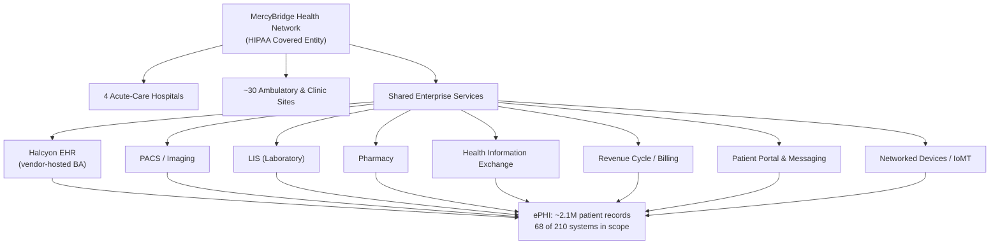

# 01.01 — Organization Profile & Covered-Entity Status

| Field | Value |
|---|---|
| Document ID | MBH-SEC-2026-101 |
| Version | 1.0 |
| Date | 2026-07-15 |
| Classification | Confidential — Electronic Protected Health Information (ePHI) // Illustrative Portfolio Sample |
| Owner | Dr. Helen Marsh, President &amp; CEO |
| Author | Advisory Team (Healthcare GRC / HIPAA) |
| Status | Approved |

## Purpose

This document establishes the authoritative organizational profile of MercyBridge Health Network ("MercyBridge," "the Network") and formally records its status as a **HIPAA covered entity** under 45 CFR §160.103. It anchors the entire HIPAA Security Program by defining *who* the organization is, *what* electronic protected health information (ePHI) it holds, *where* that ePHI lives, and *why* the HIPAA Security Rule (45 CFR Part 164, Subpart C) applies in full. Every downstream phase — asset inventory, risk analysis, safeguards, business-associate management, incident response, and independent assessment — inherits the scope defined here.

## 1. Organizational Snapshot

MercyBridge is a non-profit regional hospital system founded in 1962, headquartered in Rivermont, and serving a tri-county metropolitan region. It delivers acute, ambulatory, diagnostic, and post-acute care across an integrated delivery network.

| Attribute | Value |
|---|---|
| Legal form | Non-profit regional hospital system (501(c)(3)) |
| Founded | 1962 |
| Headquarters | Rivermont (tri-county metro region) |
| Hospitals | 4 acute-care hospitals |
| Ambulatory / clinic sites | ~30 outpatient and clinic locations |
| Licensed beds | ~1,200 |
| Workforce | ~6,500 employees, plus affiliated providers |
| Patient records (ePHI) | ~2.1 million |
| Annual net patient revenue | ~$1.8 billion |
| Primary EHR | Halcyon Health EHR — licensed, vendor-hosted (Business Associate; SOC 2 Type II available) |

## 2. Covered-Entity Determination

Under 45 CFR §160.103, a "covered entity" is a health plan, a health-care clearinghouse, or a **health-care provider who transmits any health information in electronic form** in connection with a HIPAA standard transaction (e.g., claims, eligibility, remittance). MercyBridge meets this definition unambiguously.

| Covered-entity test (§160.103) | MercyBridge status | Basis |
|---|---|---|
| Is it a health-care provider? | Yes | Operates 4 hospitals and ~30 ambulatory sites furnishing medical care |
| Does it transmit health information electronically? | Yes | Submits electronic claims, eligibility, and remittance via standard transactions |
| Are those transactions HIPAA standard transactions? | Yes | X12 837/835/270/271 through revenue-cycle and clearinghouse channels |
| Result | **Covered entity** | Full applicability of Privacy, Security, and Breach Notification Rules |

Because MercyBridge is a covered health-care provider transacting electronically, it is subject to the HIPAA Privacy Rule (Subpart E), the HIPAA Security Rule (Subpart C), and the Breach Notification Rule (Subpart D), and is directly accountable to the HHS Office for Civil Rights (OCR). MercyBridge is a **single covered entity** for this program (it has not elected hybrid or affiliated-covered-entity designation), which means the Security Rule applies across the whole enterprise ePHI footprint.

## 3. ePHI Footprint

ePHI is the protected asset the Security Rule governs — its confidentiality, integrity, and availability. Of 210 information systems enterprise-wide, **68 create, receive, maintain, or transmit ePHI** and therefore fall within Security Rule scope.

| System domain | In-scope for ePHI | Role |
|---|---|---|
| Halcyon EHR | Yes (crown jewel) | System of record for clinical ePHI |
| PACS / medical imaging | Yes (crown jewel) | Diagnostic images and reports |
| LIS (laboratory) | Yes | Lab orders and results |
| Pharmacy | Yes | Medication ePHI |
| HIE (health information exchange) | Yes | External ePHI exchange |
| Revenue-cycle / billing | Yes | Claims and financial ePHI |
| Patient portal | Yes | Patient-facing ePHI access |
| Secure clinical messaging | Yes | ePHI in transit |
| Networked medical devices / IoMT | Yes | Device-generated ePHI |
| Non-clinical IT (facilities, HR-only, etc.) | No (unless ePHI touched) | Excluded absent ePHI |

## 4. Business Lines & Care Settings

| Care setting | Description | ePHI relevance |
|---|---|---|
| Acute inpatient | Medical/surgical, ICU, emergency across 4 hospitals | High-volume clinical ePHI |
| Ambulatory / clinics | ~30 primary-care and specialty sites | Distributed ePHI endpoints |
| Diagnostics | Imaging (PACS), laboratory (LIS) | Structured diagnostic ePHI |
| Pharmacy | Inpatient and outpatient dispensing | Medication ePHI |
| Post-acute / community | Rehabilitation and community health outreach | ePHI in transitional care |
| Digital health | Patient portal, secure messaging, telehealth | Patient-facing ePHI channels |

## 5. Scope Boundary &amp; Entity-Designation Decisions

MercyBridge has made deliberate scoping determinations that shape Security Rule applicability.

| Decision | Determination | Consequence |
|---|---|---|
| Hybrid entity (§164.105(a)) | Not elected | Security Rule applies enterprise-wide, not to designated components only |
| Affiliated covered entity (§164.105(b)) | Not elected | MercyBridge stands as a single covered entity |
| Organized health care arrangement (OHCA) | Participates for HIE-connected care coordination | Shared-care disclosures governed jointly; ePHI safeguards remain MercyBridge's duty |
| Business associate vs. covered entity | Covered entity | Halcyon Health Systems and ~180 vendors are business associates |

Because no hybrid designation is elected, all 68 ePHI-handling systems and all ~6,500 workforce members fall within a single, undivided Security Rule scope — simplifying accountability but widening the control surface addressed in Phases 04–05.

## 6. Workforce &amp; Access Population

| Workforce segment | Approx. size | ePHI access profile |
|---|---|---|
| Clinical staff (physicians, nursing, allied health) | Majority of ~6,500 | Direct ePHI access via EHR and clinical systems |
| Administrative &amp; revenue cycle | Support functions | Billing/claims ePHI |
| IT &amp; security operations | Specialized teams | Privileged/administrative access |
| Affiliated &amp; credentialed providers | Additional population | Scoped ePHI access under access management |
| Business associate workforce | External (~180 BAs) | Governed by BAAs (Phase 06) |

## 7. Governance &amp; Leadership Context

MercyBridge is led by President &amp; CEO Dr. Helen Marsh and governed by a Board of Directors with an Audit &amp; Compliance Committee (chaired by Robert Feldman). Daniel Cho serves as Chief Information Security Officer and the designated HIPAA Security Official under §164.308(a)(2); Rebecca Stern is Chief Privacy Officer. Detailed governance structure and reporting lines are established in 01.05 and 01.07.

## Cross-References

| Reference | Relevance |
|---|---|
| 01.02 — Regulatory Landscape (HIPAA/HITECH/OCR) | Legal basis for covered-entity obligations |
| 01.03 — Applicable Rules &amp; Frameworks Register | Full obligation register |
| 01.05 — Security Official Designation &amp; Governance | Leadership accountability |
| Phase 02 — ePHI Asset Inventory &amp; Data-Flow Mapping | Detailed inventory of the 68 in-scope systems |
| Phase 03 — HIPAA Security Risk Analysis | Risk to the ePHI footprint defined here |

---
[⬅ Previous](01.00-README.md) · [🏠 Phase README](01.00-README.md) · [Next ➡](01.02-regulatory-landscape-hipaa-hitech-ocr.md)
