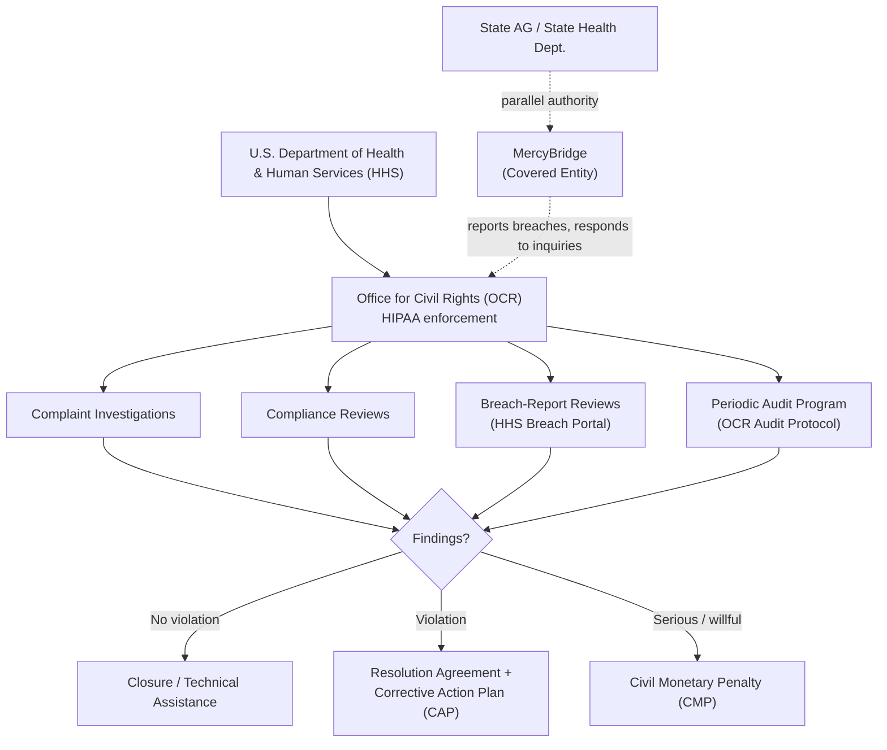

# 01.02 — Regulatory Landscape: HIPAA, HITECH &amp; OCR

| Field | Value |
|---|---|
| Document ID | MBH-SEC-2026-102 |
| Version | 1.0 |
| Date | 2026-07-15 |
| Classification | Confidential — Electronic Protected Health Information (ePHI) // Illustrative Portfolio Sample |
| Owner | Karen Boyd, Chief Compliance Officer |
| Author | Advisory Team (Healthcare GRC / HIPAA) |
| Status | Approved |

## Purpose

This document maps the regulatory environment that governs MercyBridge's handling of ePHI: the statutory and regulatory instruments (HIPAA, HITECH), the enforcement machinery of the HHS Office for Civil Rights (OCR), the penalty and corrective-action regime, and the state-level and adjacent regulators. It gives program stakeholders a shared understanding of *who* holds MercyBridge accountable, *for what*, and *with what consequences* — the "why" behind the safeguards delivered in later phases.

## 1. The HIPAA Rule Set

HIPAA (the Health Insurance Portability and Accountability Act of 1996) and its implementing regulations at 45 CFR Parts 160, 162, and 164 form the core. Three rules bear directly on this program.

| Rule | Citation | Scope | Primary owner |
|---|---|---|---|
| Privacy Rule | 45 CFR Part 164, Subpart E | Uses and disclosures of all PHI (paper and electronic); patient rights | Rebecca Stern (Privacy Officer) |
| Security Rule | 45 CFR Part 164, Subpart C (§164.302–318) | Confidentiality, integrity, availability of **ePHI** | Daniel Cho (Security Official) |
| Breach Notification Rule | 45 CFR §164.400–414 (Subpart D) | Notification duties after breach of unsecured PHI | Rebecca Stern / Karen Boyd |

## 2. HITECH — Strengthened Enforcement

The Health Information Technology for Economic and Clinical Health (HITECH) Act of 2009 materially strengthened HIPAA. For this program its key effects are:

- **Direct Business Associate liability** — BAs are directly accountable to OCR for Security Rule compliance and breach notification, not merely by contract.
- **Breach Notification mandate** — codified the duty to notify individuals, HHS, and (for large breaches) media.
- **Tiered civil monetary penalties** with increased maximums and a culpability-based structure.
- **Expanded audit authority** — enabling OCR's periodic audit program.

## 3. The Enforcer: HHS Office for Civil Rights (OCR)

OCR is the HHS component that administers and enforces the Privacy, Security, and Breach Notification Rules. It acts through complaint investigations, compliance reviews, breach-report reviews, and periodic audits.

## 4. Enforcement Mechanisms

OCR resolves matters along an escalation ladder from voluntary compliance to formal penalty.

| Mechanism | What it is | Trigger |
|---|---|---|
| Technical assistance | Informal guidance; closure without penalty | Minor / first-time, good-faith gaps |
| Corrective Action Plan (CAP) | Binding remediation plan with milestones and monitoring | Demonstrated non-compliance |
| Resolution Agreement | Settlement contract (often with monetary payment + CAP) | Negotiated resolution of investigation |
| Civil Monetary Penalty (CMP) | Formally imposed fine after finding of violation | Serious, willful, or uncorrected violations |
| Referral to DOJ | Criminal referral | Knowing wrongful disclosure of PHI |

## 5. Civil Monetary Penalty Tiers

HIPAA CMPs follow a four-tier, culpability-based structure (per violation, subject to annual inflation adjustment). Amounts below are illustrative of the statutory tier structure.

| Tier | Culpability | Per-violation range (illustrative) | Annual cap per identical provision (illustrative) |
|---|---|---|---|
| 1 | No knowledge (could not reasonably have known) | ~$100 – $50,000 | ~$25,000 – $2M |
| 2 | Reasonable cause (not willful neglect) | ~$1,000 – $50,000 | ~$100,000 – $2M |
| 3 | Willful neglect — corrected within 30 days | ~$10,000 – $50,000 | ~$250,000 – $2M |
| 4 | Willful neglect — not corrected | ~$50,000+ | up to ~$2M |

> Note: Tier ranges are illustrative of the statutory framework; OCR publishes inflation-adjusted figures periodically. MercyBridge's program is designed to keep the Network out of Tiers 3–4 by evidencing good-faith, documented compliance.

## 6. State &amp; Adjacent Regulators

| Regulator | Role | Relevance to MercyBridge |
|---|---|---|
| State Attorney General | May enforce HIPAA on behalf of state residents; enforces state breach laws | Parallel breach-notification exposure |
| State Health Department | Licensure, state health-privacy requirements | Facility and reporting obligations |
| CMS | Conditions of Participation (referenced only) | Indirect; not a Security Rule enforcer |
| FTC | Health Breach Notification Rule (non-HIPAA contexts) | Referenced; boundary case |

## 7. How OCR Audits &amp; Investigates

An OCR review typically requests: the current risk analysis (§164.308(a)(1)(ii)(A)), the risk management plan, policies and procedures, evidence of workforce training, BAAs, and breach-assessment documentation. MercyBridge maintains audit-ready evidence for each, mapped to the OCR Audit Protocol in Phase 08.

| OCR evidence request | MercyBridge source artifact | Phase |
|---|---|---|
| Current risk analysis | §164.308(a)(1) risk analysis report (56 risks) | 03 |
| Risk management plan | Remediation / risk-treatment plan | 03–05 |
| Policies &amp; procedures | 24-policy HIPAA suite | 04 |
| Workforce training records | Security awareness training log | 04 |
| Business associate agreements | BAA register (~180 BAs) | 06 |
| Breach-assessment documentation | 4-factor assessment records | 07 |
| Independent testing | Penetration test report; HITRUST i1 | 08 |

## 8. Most-Cited Enforcement Themes

OCR resolution history consistently centers on a small set of recurring failures. MercyBridge's program is deliberately engineered against each.

| Common OCR finding | MercyBridge countermeasure |
|---|---|
| No enterprise-wide risk analysis | Comprehensive §164.308(a)(1) analysis (Phase 03) |
| Failure to manage identified risk | Documented risk-treatment plan (Phases 04–05) |
| Missing / deficient BAAs | BAA remediation of 24 critical BAs (Phase 06) |
| No or weak access controls / MFA | Enterprise MFA, access management (Phase 05) |
| Unencrypted ePHI | Encryption at rest and in transit (Phase 05) |
| Delayed or absent breach notification | IR plan + 4-factor process, 60-day tracking (Phase 07) |

## Cross-References

| Reference | Relevance |
|---|---|
| 01.01 — Organization Profile &amp; Covered-Entity Status | Why OCR jurisdiction attaches |
| 01.03 — Applicable Rules &amp; Frameworks Register | Full obligation set |
| 01.04 — HIPAA Security Rule Overview | The Security Rule structure OCR audits against |
| Phase 07 — Incident Response &amp; Breach Notification | Breach Rule execution |
| Phase 08 — OCR Audit Readiness | Audit Protocol mapping |

---
[⬅ Previous](01.01-organization-profile-and-covered-entity-status.md) · [🏠 Phase README](01.00-README.md) · [Next ➡](01.03-applicable-rules-and-frameworks-register.md)
