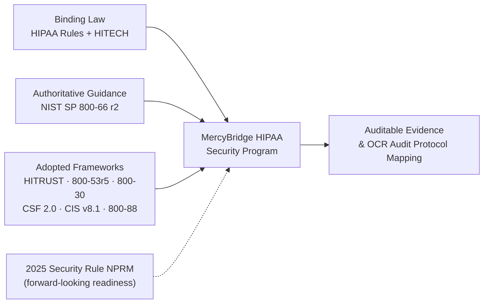

# 01.03 — Applicable Rules &amp; Frameworks Register

| Field | Value |
|---|---|
| Document ID | MBH-SEC-2026-103 |
| Version | 1.0 |
| Date | 2026-07-15 |
| Classification | Confidential — Electronic Protected Health Information (ePHI) // Illustrative Portfolio Sample |
| Owner | Daniel Cho, CISO &amp; HIPAA Security Official |
| Author | Advisory Team (Healthcare GRC / HIPAA) |
| Status | Approved |

## Purpose

This register is the single authoritative inventory of every legal, regulatory, and framework obligation to which the MercyBridge HIPAA Security Program is built. It records, for each obligation, the citation or source, what it requires, the accountable owner, and the program phase in which it is primarily addressed. The register is the compliance backbone: it makes the program's coverage auditable and provides the traceability OCR expects between obligations and delivered evidence.

## 1. How to Read This Register

- **Binding law/regulation** (HIPAA rules, HITECH) is mandatory and enforceable by OCR.
- **Authoritative guidance** (NIST SP 800-66 Rev. 2) is the methodology MercyBridge follows to demonstrate reasonable-and-appropriate compliance.
- **Frameworks** (HITRUST CSF, NIST CSF 2.0, CIS v8.1, NIST 800-53/800-30/800-88) are voluntary but adopted as control catalogs and crosswalks.
- **Forward-looking** (2025 HIPAA Security Rule NPRM) is not yet in force; MercyBridge builds to the in-force rule while layering proposed strengthened requirements as readiness.

## 2. Master Obligations Register

| Obligation | Citation / Source | What it requires | Owner | Phase addressed |
|---|---|---|---|---|
| HIPAA Security Rule | 45 CFR Part 164, Subpart C (§164.302–318) | Administrative, physical, technical safeguards for ePHI; organizational, policy &amp; documentation requirements | Daniel Cho (Security Official) | 01, 03, 04, 05 |
| — Administrative safeguards | 45 CFR §164.308 | Security management process, risk analysis, workforce security, training, contingency planning, evaluation | Daniel Cho | 04 |
| — Physical safeguards | 45 CFR §164.310 | Facility access controls, workstation security, device &amp; media controls | Daniel Cho / Facilities | 05 |
| — Technical safeguards | 45 CFR §164.312 | Access control, audit controls, integrity, authentication, transmission security | Daniel Cho / Marcus Reed | 05 |
| — Organizational requirements | 45 CFR §164.314 | Business associate contracts; requirements for group health plans | Lisa Coleman (Counsel) | 06 |
| — Policies, procedures &amp; documentation | 45 CFR §164.316 | Written policies; 6-year retention; review &amp; update | Daniel Cho | 04 |
| HIPAA Privacy Rule | 45 CFR Part 164, Subpart E | Permitted uses/disclosures of PHI; patient rights; minimum necessary | Rebecca Stern (Privacy Officer) | 01 (referenced) |
| HIPAA Breach Notification Rule | 45 CFR §164.400–414 (Subpart D) | 4-factor risk-of-compromise assessment; notify individuals/HHS/media; 60-day deadline; 500+ triggers media + prompt HHS | Rebecca Stern / Karen Boyd | 07 |
| HITECH Act | Pub. L. 111-5, Title XIII | Direct BA liability; strengthened enforcement; breach notification; tiered penalties | Karen Boyd | 01, 06, 07 |
| 2025 HIPAA Security Rule NPRM (proposed) | HHS/OCR NPRM (2025) | Mandatory MFA; encryption at rest &amp; in transit; network segmentation; asset inventory; annual pen test + vuln scanning; remove "addressable vs. required" | Daniel Cho | 01, 04, 05, 08 (readiness) |
| NIST SP 800-66 Rev. 2 | NIST SP 800-66r2 (Feb 2024) | Official guide to implementing the HIPAA Security Rule — methodology spine | Daniel Cho | 03, 04, 05 |
| HITRUST CSF | HITRUST CSF (i1 Validated Assessment) | Certifiable healthcare control framework; MercyBridge pursues i1 | Daniel Cho / Priya Anand | 08 |
| NIST SP 800-53 Rev. 5 | NIST SP 800-53r5 | Security &amp; privacy control catalog for control selection | Marcus Reed | 04, 05 |
| NIST SP 800-30 | NIST SP 800-30 Rev. 1 | Risk assessment methodology | Michelle Tran (Enterprise Risk) | 03 |
| NIST CSF 2.0 | NIST Cybersecurity Framework 2.0 | Govern/Identify/Protect/Detect/Respond/Recover crosswalk | Daniel Cho | 03, 09 |
| CIS Controls v8.1 | Center for Internet Security v8.1 | Prioritized technical safeguard benchmark | Marcus Reed | 05 |
| NIST SP 800-88 | NIST SP 800-88 Rev. 1 | Media sanitization / secure disposal of ePHI media | Daniel Cho / Facilities | 05 |
| OCR Audit Protocol | HHS OCR Audit Protocol | Audit-readiness evidence expectations | Priya Anand | 08 |

## 3. Obligation Classification Summary

| Class | Instruments | Enforceability |
|---|---|---|
| Binding law &amp; regulation | HIPAA Security/Privacy/Breach Rules; HITECH | Mandatory — OCR-enforceable |
| Authoritative guidance | NIST SP 800-66 Rev. 2 | Safe-harbor methodology; strongly relied upon |
| Adopted frameworks | HITRUST CSF, NIST 800-53r5, 800-30, CSF 2.0, CIS v8.1, 800-88 | Voluntary; adopted by MercyBridge |
| Forward-looking / proposed | 2025 Security Rule NPRM | Not yet in force; readiness posture |

## 4. Ownership Summary by Accountable Role

| Accountable owner | Obligations owned |
|---|---|
| Daniel Cho (Security Official) | Security Rule (admin/physical/technical), §164.316, NPRM readiness, NIST 800-66r2, CSF 2.0, HITRUST |
| Rebecca Stern (Privacy Officer) | Privacy Rule; Breach Notification Rule (with Compliance) |
| Karen Boyd (Compliance) | HITECH; enterprise compliance oversight |
| Lisa Coleman (Counsel) | Organizational requirements (§164.314) / BAAs |
| Michelle Tran (Enterprise Risk) | NIST SP 800-30 risk methodology |
| Marcus Reed (InfoSec Manager) | NIST 800-53r5, CIS v8.1 control execution |
| Priya Anand (Internal Audit) | OCR Audit Protocol; HITRUST assurance |

## 5. Register Governance &amp; Review

| Attribute | Value |
|---|---|
| Register owner | Daniel Cho, HIPAA Security Official |
| Review cadence | At least annually and on regulatory change (e.g., NPRM finalization) |
| Change trigger | New rule, enforcement guidance, framework version, or ePHI-environment change |
| Retention | 6 years minimum per §164.316(b)(2) |
| Related ADRs | ADR-0001 (framework adoption), ADR-0002 (NPRM readiness posture), ADR-0003 (HITRUST i1 target) |

When the 2025 Security Rule NPRM is finalized, the forward-looking row is reclassified as binding, its readiness controls become mandatory, and any residual gap is logged and remediated. This event-driven review keeps the register aligned with the enforceable baseline at all times.

## 6. Framework Crosswalk (Illustrative)

Adopted frameworks are not additive burden — they crosswalk to the same Security Rule obligations, giving MercyBridge one control set that satisfies multiple references.

| Security Rule anchor | NIST 800-66 r2 | NIST CSF 2.0 | HITRUST CSF | CIS v8.1 |
|---|---|---|---|---|
| Risk analysis §164.308(a)(1) | Task-based risk method | ID.RA / GV.RM | Risk Management domain | CIS 1–2 (asset/software) |
| Access control §164.312(a) | Access management | PR.AA | Access Control domain | CIS 5–6 |
| Audit controls §164.312(b) | Activity review | DE.CM | Audit Logging &amp; Monitoring | CIS 8 |
| Transmission security §164.312(e) | Encryption in transit | PR.DS | Endpoint/Transmission Protection | CIS 3 |
| Contingency §164.308(a)(7) | Backup &amp; recovery | RC.RP | Business Continuity &amp; DR | CIS 11 |

## 7. Traceability Principle

Every control and policy delivered in Phases 04–05 traces back to at least one register row, and every register row is discharged by at least one delivered artifact. This bidirectional traceability is validated during Phase 08 audit readiness. An illustrative trace: register row "Technical safeguards (§164.312)" → policy "Access Control &amp; Authentication" → control "enterprise MFA" → evidence "MFA coverage report" → Phase 08 OCR Audit Protocol item.

## Cross-References

| Reference | Relevance |
|---|---|
| 01.02 — Regulatory Landscape | Enforcement context for binding rows |
| 01.04 — HIPAA Security Rule Overview | Structure of the Security Rule rows |
| Phase 03 — Risk Analysis | Applies NIST 800-30 / 800-66r2 |
| Phase 08 — HITRUST &amp; Audit Readiness | Discharges HITRUST + OCR Protocol rows |

---
[⬅ Previous](01.02-regulatory-landscape-hipaa-hitech-ocr.md) · [🏠 Phase README](01.00-README.md) · [Next ➡](01.04-hipaa-security-rule-overview.md)
