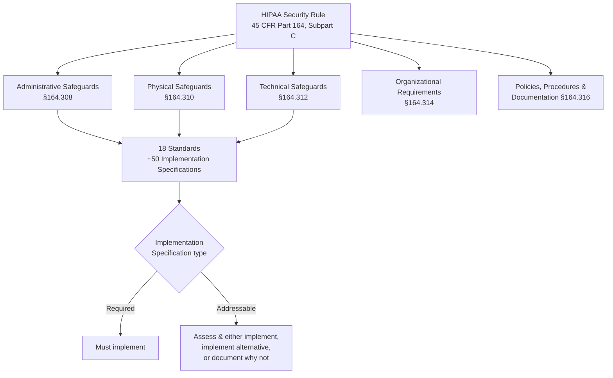

# 01.04 — HIPAA Security Rule Overview

| Field | Value |
|---|---|
| Document ID | MBH-SEC-2026-104 |
| Version | 1.0 |
| Date | 2026-07-15 |
| Classification | Confidential — Electronic Protected Health Information (ePHI) // Illustrative Portfolio Sample |
| Owner | Daniel Cho, CISO &amp; HIPAA Security Official |
| Author | Advisory Team (Healthcare GRC / HIPAA) |
| Status | Approved |

## Purpose

This document explains the structure and operating logic of the HIPAA Security Rule (45 CFR Part 164, Subpart C) so that program stakeholders share a precise mental model of what compliance requires. It defines the three safeguard families, the organizational and documentation requirements, the "standards vs. implementation specifications" architecture, the current "required vs. addressable" distinction (and the 2025 NPRM proposal to remove it), and the Rule's flexibility-of-approach principle. It then maps each safeguard family to the program phase that delivers it.

## 1. Anatomy of the Security Rule

The Security Rule protects the **confidentiality, integrity, and availability (CIA)** of ePHI. It is organized into safeguard families and cross-cutting requirements.

| Section | Family / Requirement | Focus |
|---|---|---|
| §164.308 | Administrative safeguards | Governance, risk management, workforce, contingency — the largest family |
| §164.310 | Physical safeguards | Facilities, workstations, devices &amp; media |
| §164.312 | Technical safeguards | Access, audit, integrity, authentication, transmission |
| §164.314 | Organizational requirements | Business associate contracts; group health plan requirements |
| §164.316 | Policies, procedures &amp; documentation | Written policies; 6-year retention; review/update |

Across the three safeguard families, MercyBridge maps the Rule to **18 standards and ~50 implementation specifications**, discharged through a suite of **24 HIPAA policies and procedures**.

## 2. Standards vs. Implementation Specifications

Each safeguard section contains **standards** (the mandatory objectives) and, beneath many standards, **implementation specifications** (the specific actions). Implementation specifications are classified **Required** or **Addressable**.

| Concept | Meaning | Compliance obligation |
|---|---|---|
| Standard | The mandatory security objective | Always required — must be met |
| Required implementation spec | A specified mandatory action | Must implement as written |
| Addressable implementation spec | A flexible action | Assess reasonableness; implement, adopt an equivalent alternative, or document a rationale for not implementing |

> "Addressable" does **not** mean optional. It requires a documented, risk-based decision. Failing to assess an addressable specification is itself a compliance gap.

## 3. The 2025 NPRM Proposal — Removing "Addressable vs. Required"

The 2025 HIPAA Security Rule NPRM proposes to **eliminate the addressable/required distinction and make all implementation specifications mandatory**, alongside explicit new requirements (mandatory MFA, encryption of ePHI at rest and in transit, network segmentation, asset inventory, and annual penetration testing / vulnerability scanning). MercyBridge builds to the **in-force** Rule today while treating these proposals as forward-looking readiness so that a future final rule requires minimal additional lift.

| Dimension | In-force Rule (today) | 2025 NPRM (proposed) | MercyBridge posture |
|---|---|---|---|
| Addressable specs | Flexible, risk-based | Removed — all mandatory | Implement addressables as if required |
| MFA | Addressable/implied | Mandatory | MFA deployed (signature control) |
| Encryption (rest &amp; transit) | Addressable | Mandatory | Encryption deployed |
| Network segmentation | Not explicit | Required | Segmentation in place / planned |
| Asset inventory | Implied | Required | Delivered in Phase 02 |
| Annual pen test / vuln scan | Not explicit | Required | Delivered in Phase 08 |

## 4. Flexibility of Approach (§164.306(b))

The Rule is technology-neutral and scalable. A covered entity may use any security measures that reasonably and appropriately meet the standards, taking into account its size, complexity, capabilities, technical infrastructure, cost of measures, and the probability and criticality of potential risks. For MercyBridge — a ~1,200-bed, ~6,500-employee, ~2.1M-record system — "reasonable and appropriate" is calibrated to an enterprise risk profile and evidenced through the Phase 03 risk analysis.

## 5. Safeguard Family → Phase Mapping

| Safeguard family | Section | Delivered in phase |
|---|---|---|
| Administrative safeguards | §164.308 | Phase 04 — Administrative Safeguards |
| Physical safeguards | §164.310 | Phase 05 — Physical &amp; Technical Safeguards |
| Technical safeguards | §164.312 | Phase 05 — Physical &amp; Technical Safeguards |
| Organizational requirements | §164.314 | Phase 06 — Business Associate &amp; Third-Party Risk |
| Policies, procedures &amp; documentation | §164.316 | Phase 04 (policy suite of 24) |
| Risk analysis &amp; management | §164.308(a)(1) | Phase 03 — HIPAA Security Risk Analysis |

## 6. The General Rules (§164.306)

Underpinning every safeguard are four general obligations that apply continuously, not as a one-time project.

| §164.306 obligation | Meaning for MercyBridge |
|---|---|
| Ensure CIA of all ePHI | Protect the ~2.1M records across 68 systems |
| Protect against reasonably anticipated threats | Threat-informed safeguards (ransomware, insider, IoMT) |
| Protect against impermissible uses/disclosures | Access controls, minimum necessary, encryption |
| Ensure workforce compliance | Training, sanctions, and accountability |

## 7. Illustrative Standard → Specification Breakdown

| Safeguard family | Example standard | Example implementation specifications |
|---|---|---|
| Administrative (§164.308) | Security Management Process | Risk analysis (R), risk management (R), sanction policy (R), information system activity review (R) |
| Physical (§164.310) | Device &amp; Media Controls | Disposal (R), media re-use (R), accountability (A), data backup &amp; storage (A) |
| Technical (§164.312) | Access Control | Unique user ID (R), emergency access (R), automatic logoff (A), encryption/decryption (A) |

*(R = Required, A = Addressable under the in-force Rule; all become mandatory under the 2025 NPRM.)*

## 8. Signature Controls

MercyBridge's signature safeguards — reflecting both the in-force Rule and NPRM readiness — are: multi-factor authentication, encryption of ePHI at rest and in transit, comprehensive audit logging, access management, and contingency/backup capability. These map to the 18 standards and ~50 implementation specifications tracked in Phases 04–05.

## Cross-References

| Reference | Relevance |
|---|---|
| 01.03 — Applicable Rules &amp; Frameworks Register | Citations for each section |
| 01.06 — Program Charter &amp; Objectives | Objectives that discharge these safeguards |
| Phase 03 — Risk Analysis | §164.308(a)(1) analysis |
| Phases 04–05 — Safeguards | Implementation of the families above |

---
[⬅ Previous](01.03-applicable-rules-and-frameworks-register.md) · [🏠 Phase README](01.00-README.md) · [Next ➡](01.05-security-official-designation-and-governance.md)
