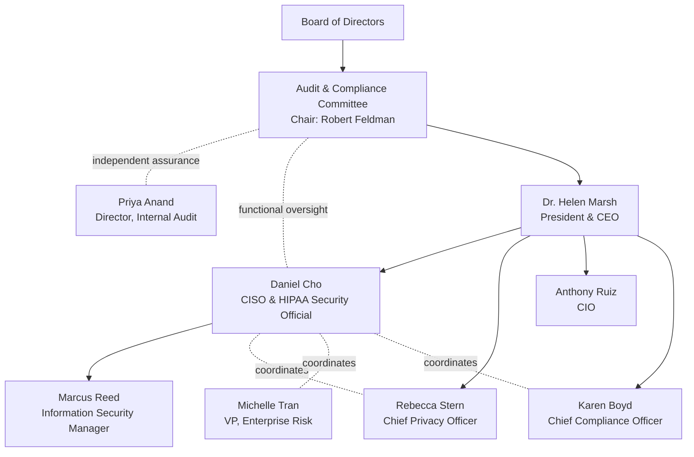

# 01.05 — Security Official Designation &amp; Governance

| Field | Value |
|---|---|
| Document ID | MBH-SEC-2026-105 |
| Version | 1.0 |
| Date | 2026-07-15 |
| Classification | Confidential — Electronic Protected Health Information (ePHI) // Illustrative Portfolio Sample |
| Owner | Daniel Cho, CISO &amp; HIPAA Security Official |
| Author | Advisory Team (Healthcare GRC / HIPAA) |
| Status | Approved |

## Purpose

The HIPAA Security Rule requires every covered entity to formally **designate a security official responsible for developing and implementing the required policies and procedures** (45 CFR §164.308(a)(2)). This document records MercyBridge's designation of Daniel Cho as Chief Information Security Officer and HIPAA Security Official, defines his authority and independence, establishes reporting lines to the CEO and the Board Audit &amp; Compliance Committee, clarifies the relationship to the Privacy Officer, and sets the governance-committee and annual-reporting structure.

## 1. The §164.308(a)(2) Requirement

The Assigned Security Responsibility standard is a **required** implementation specification: a single, identifiable individual must own the Security Rule program. MercyBridge discharges this by naming Daniel Cho.

| Element | MercyBridge designation |
|---|---|
| Standard | Assigned Security Responsibility, §164.308(a)(2) |
| Type | Required (no addressable option) |
| Designated official | Daniel Cho |
| Title | Chief Information Security Officer (CISO) &amp; HIPAA Security Official |
| Reports to | Dr. Helen Marsh (President &amp; CEO) |
| Board oversight | Audit &amp; Compliance Committee (Chair: Robert Feldman) |
| Effective | Program baseline 2026 |

## 2. Authority &amp; Independence

Daniel Cho holds enterprise-wide authority to develop, implement, and enforce ePHI security policies, procedures, and controls across all 4 hospitals and ~30 sites and all 68 in-scope systems.

| Authority domain | Scope of authority |
|---|---|
| Policy | Owns and approves the 24-policy HIPAA security suite (§164.316) |
| Risk | Directs the §164.308(a)(1) risk analysis and risk-management plan |
| Controls | Authorizes safeguards across administrative, physical, technical families |
| Incident | Chairs security incident response; escalates breaches to Privacy/Counsel |
| Budget | Recommends security investment to CEO and the Committee |
| Exceptions | Grants, denies, and documents risk-acceptance and control exceptions |

Independence is preserved by a direct line to the CEO and a functional reporting line to the Board Audit &amp; Compliance Committee, ensuring security concerns can escalate above operational IT (the CIO) when necessary. Priya Anand (Internal Audit) reports independently to the Committee, providing assurance over the program.

## 3. Reporting &amp; Governance Structure

## 4. Security Official ↔ Privacy Officer Relationship

Security and Privacy are distinct but interdependent roles. The Security Official protects ePHI (CIA); the Privacy Officer governs permissible uses/disclosures of all PHI and patient rights. They co-own breach response.

| Dimension | Security Official (Daniel Cho) | Privacy Officer (Rebecca Stern) |
|---|---|---|
| Regulatory basis | §164.308(a)(2) — Security Rule | §164.530(a) — Privacy Rule |
| Protected asset | ePHI (electronic) | All PHI (paper &amp; electronic) |
| Core focus | Safeguards / CIA | Use, disclosure, patient rights |
| Breach role | Investigate, contain, technical facts | 4-factor assessment, notifications |
| Shared work | Risk analysis, workforce training, BAAs, incident/breach response |

## 5. Governance Committees &amp; Cadence

| Committee / forum | Chair / lead | Cadence | Mandate |
|---|---|---|---|
| Board Audit &amp; Compliance Committee | Robert Feldman | Quarterly | Oversight of security &amp; compliance posture |
| Information Security Steering Committee | Daniel Cho | Monthly | Program direction, risk decisions, prioritization |
| Privacy &amp; Security Coordination | Cho / Stern | Monthly | Cross-cutting privacy-security matters |
| Enterprise Risk Committee | Michelle Tran | Quarterly | Risk register integration |
| Incident Response Team | Daniel Cho | On event | Incident and breach handling |

## 6. Delegation &amp; Continuity

While the Security Official role is a single point of accountability, execution is delegated to preserve operational depth and continuity.

| Function | Primary | Delegate / backup |
|---|---|---|
| Program direction | Daniel Cho (CISO) | Marcus Reed (InfoSec Manager) |
| Control operations | Marcus Reed | Security operations team |
| Risk methodology | Michelle Tran (Ent. Risk) | Enterprise Risk analysts |
| Breach determination | Rebecca Stern (Privacy) | Karen Boyd (Compliance) |
| Independent assurance | Priya Anand (Internal Audit) | External assessor (Beacon) |

Should the Security Official role become vacant, the CEO designates an interim official without delay to maintain unbroken §164.308(a)(2) coverage; the designation is documented and reported to the Committee.

## 7. Annual Reporting

Daniel Cho delivers an annual HIPAA Security Program report to the CEO and the Audit &amp; Compliance Committee covering: risk-analysis currency, safeguard implementation status, incident/breach activity, BAA posture, HITRUST assessment results, and forward roadmap. The 2026 report is scheduled for the December board cycle (Phase 09).

## Cross-References

| Reference | Relevance |
|---|---|
| 01.01 — Organization Profile | Leadership context |
| 01.06 — Program Charter &amp; Objectives | Charter authorizing this role |
| 01.07 — Roles, Responsibilities &amp; RACI | Full accountability matrix |
| Phase 09 — Executive Reporting | Annual board reporting |

---
[⬅ Previous](01.04-hipaa-security-rule-overview.md) · [🏠 Phase README](01.00-README.md) · [Next ➡](01.06-program-charter-and-objectives.md)
