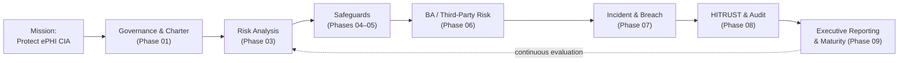

# 01.06 — Program Charter &amp; Objectives

| Field | Value |
|---|---|
| Document ID | MBH-SEC-2026-106 |
| Version | 1.0 |
| Date | 2026-07-15 |
| Classification | Confidential — Electronic Protected Health Information (ePHI) // Illustrative Portfolio Sample |
| Owner | Daniel Cho, CISO &amp; HIPAA Security Official |
| Author | Advisory Team (Healthcare GRC / HIPAA) |
| Status | Approved |

## Purpose

This is the founding charter of the MercyBridge HIPAA Security Program. It establishes the program's mission, scope, authority, objectives, guiding principles, and governance cadence, and aligns the program to the NIST SP 800-66 Rev. 2 methodology and the HITRUST CSF. The charter is the mandate under which all subsequent phases operate; it is approved by the CEO and endorsed by the Board Audit &amp; Compliance Committee.

## 1. Mission

To protect the confidentiality, integrity, and availability of the electronic protected health information entrusted to MercyBridge — approximately 2.1 million patient records across 68 in-scope systems — by implementing reasonable and appropriate safeguards that satisfy the HIPAA Security Rule, meet patient and regulatory expectations, and enable safe, high-quality care.

## 2. Scope

| In scope | Out of scope |
|---|---|
| All ePHI created, received, maintained, or transmitted by MercyBridge | Paper-only PHI processes (Privacy Rule; referenced) |
| 68 of 210 systems that touch ePHI | The 142 systems with no ePHI (unless connected to ePHI) |
| 4 hospitals + ~30 ambulatory/clinic sites | Non-MercyBridge affiliate systems governed by their own programs |
| ~6,500 workforce members and affiliated providers | Consumer-facing content lacking PHI |
| Business associates handling MercyBridge ePHI (~180) | Vendors with no ePHI access |

## 3. Authority

The program derives authority from the HIPAA Security Rule's Assigned Security Responsibility standard (§164.308(a)(2)) and from the CEO and Board. Daniel Cho, as CISO and HIPAA Security Official, is authorized to set policy, direct risk analysis, mandate safeguards, and enforce compliance across the enterprise ePHI footprint.

## 4. Objectives

| # | Objective | Success measure | Primary phase |
|---|---|---|---|
| O1 | Maintain a current, comprehensive ePHI risk analysis | §164.308(a)(1) analysis complete &amp; annually refreshed | 03 |
| O2 | Implement the three safeguard families | 18 standards / ~50 specs operational | 04–05 |
| O3 | Codify a HIPAA policy suite | 24 policies approved &amp; retained (§164.316) | 04 |
| O4 | Deploy signature technical controls | MFA, encryption at rest/transit, audit logging live | 05 |
| O5 | Govern business associates | ~180 BAs; 24 critical remediated | 06 |
| O6 | Operationalize incident &amp; breach response | IR plan + tabletop; 4-factor process proven | 07 |
| O7 | Achieve independent validation | HITRUST i1 achieved; pen test findings remediated | 08 |
| O8 | Report to leadership &amp; mature the program | Board report delivered; continuous evaluation | 09 |

## 5. Guiding Principles

| Principle | Description |
|---|---|
| Risk-based | Prioritize by likelihood and impact to ePHI (NIST SP 800-30) |
| Reasonable &amp; appropriate | Calibrate to MercyBridge's size, complexity, and resources (§164.306(b)) |
| Defense in depth | Layer administrative, physical, and technical safeguards |
| Evidence-driven | Every control produces auditable evidence for OCR readiness |
| Privacy-by-partnership | Coordinate tightly with the Privacy Officer |
| Forward-looking | Build to the in-force Rule while readying for the 2025 NPRM |
| Continuous improvement | Evaluate and mature under NIST CSF 2.0 and HITRUST |

## 6. Framework Alignment

| Framework | Role in the program |
|---|---|
| NIST SP 800-66 Rev. 2 | Methodology spine for implementing the Security Rule |
| HITRUST CSF (i1) | Certifiable control framework and external validation target |
| NIST SP 800-30 | Risk-assessment methodology |
| NIST CSF 2.0 | Crosswalk and maturity lens |
| NIST SP 800-53 Rev. 5 / CIS v8.1 | Control catalogs for safeguard selection |

## 7. Governance Cadence

| Forum | Frequency | Charter role |
|---|---|---|
| Board Audit &amp; Compliance Committee | Quarterly | Oversight &amp; approval of posture |
| Information Security Steering Committee | Monthly | Program execution &amp; decisions |
| Privacy &amp; Security Coordination | Monthly | Cross-cutting alignment |
| Annual program report | Annual (Dec) | Formal accountability to Board &amp; CEO |

## 8. Success Criteria &amp; Target Outcomes

The charter defines what "done and mature" looks like for the engagement (≈11 months, kickoff 2026-02-02).

| Dimension | Target end-state |
|---|---|
| Risk analysis | Complete &amp; current (56 risks identified, treated) |
| Safeguards | 18 standards / ~50 specs implemented |
| Policies | 24 approved and retained |
| Business associates | ~180 governed; 24 critical remediated |
| Incident readiness | IR plan + tabletop exercised; 0 reportable breaches sustained |
| Independent validation | HITRUST i1 achieved; pen-test findings remediated |
| Residual risk | Low-to-Moderate under continuous evaluation |

## 9. Assumptions &amp; Constraints (Summary)

The charter operates under the assumptions and constraints detailed in 01.08 — notably leadership sponsorship, availability of system and vendor evidence, and the "reasonable and appropriate" calibration of §164.306(b). Material deviation is escalated to the Steering Committee.

## 10. Charter Approval

This charter is owned by the HIPAA Security Official (Daniel Cho), endorsed by the President &amp; CEO (Dr. Helen Marsh), and ratified by the Board Audit &amp; Compliance Committee (Chair: Robert Feldman). It is reviewed at least annually and upon material change to the ePHI environment or regulatory landscape.

## Cross-References

| Reference | Relevance |
|---|---|
| 01.04 — HIPAA Security Rule Overview | Safeguards the objectives discharge |
| 01.05 — Security Official Designation | Authority basis for the charter |
| 01.07 — Roles, Responsibilities &amp; RACI | Execution accountability |
| Phase 09 — Program Maturity | Continuous evaluation of objectives |

---
[⬅ Previous](01.05-security-official-designation-and-governance.md) · [🏠 Phase README](01.00-README.md) · [Next ➡](01.07-roles-responsibilities-and-raci.md)
