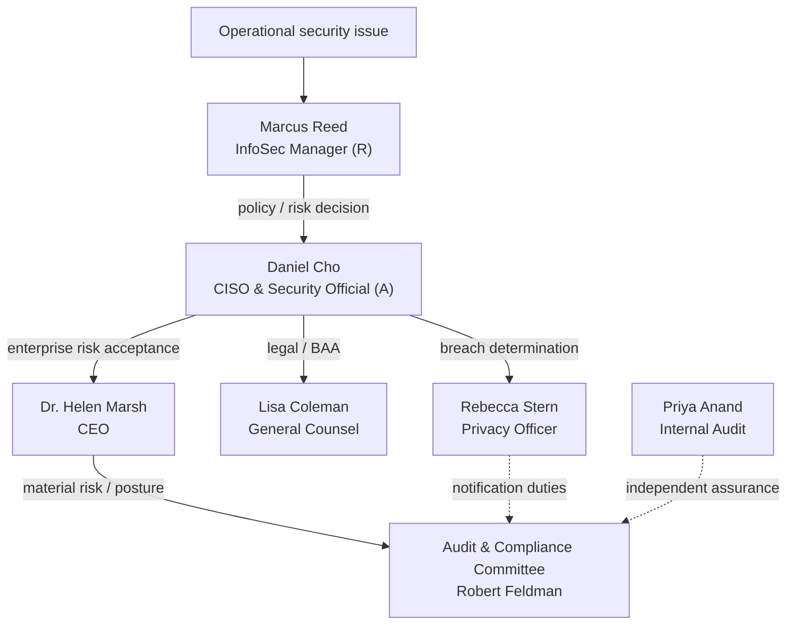

# 01.07 — Roles, Responsibilities &amp; RACI

| Field | Value |
|---|---|
| Document ID | MBH-SEC-2026-107 |
| Version | 1.0 |
| Date | 2026-07-15 |
| Classification | Confidential — Electronic Protected Health Information (ePHI) // Illustrative Portfolio Sample |
| Owner | Daniel Cho, CISO &amp; HIPAA Security Official |
| Author | Advisory Team (Healthcare GRC / HIPAA) |
| Status | Approved |

## Purpose

This document defines the roles and responsibilities of every key participant in the MercyBridge HIPAA Security Program and codifies accountability through a RACI matrix (Responsible, Accountable, Consulted, Informed) across the program's major activities: risk analysis, safeguards implementation, policy approval, business-associate agreement (BAA) management, incident/breach response, HITRUST assessment, and board reporting. It removes ambiguity about who owns what and provides the accountability evidence OCR expects.

## 1. Key Roles

| Role | Individual | Core responsibility |
|---|---|---|
| President &amp; CEO | Dr. Helen Marsh | Ultimate accountability; approves charter &amp; investment |
| CISO &amp; HIPAA Security Official | Daniel Cho | Owns the Security Program (§164.308(a)(2)) |
| Chief Privacy Officer | Rebecca Stern | Owns Privacy Rule &amp; breach notification |
| CIO | Anthony Ruiz | Delivers IT infrastructure enabling safeguards |
| Chief Compliance Officer | Karen Boyd | Enterprise compliance oversight |
| CMIO | Dr. Samuel Ortega | Clinical systems &amp; clinician engagement |
| VP, Enterprise Risk | Michelle Tran | Risk methodology &amp; register integration |
| Information Security Manager | Marcus Reed | Executes safeguards; reports to CISO |
| Director, Internal Audit | Priya Anand | Independent assurance; reports to Committee |
| General Counsel | Lisa Coleman | Owns BAAs &amp; legal risk |
| Board Audit &amp; Compliance Chair | Robert Feldman | Board-level oversight |
| HITRUST External Assessor | Beacon Assurance, LLC | i1 validated assessment |
| Penetration Testing | Ironwood Security Labs, LLC | Independent pen test / vuln assessment |
| EHR Vendor / Key BA | Halcyon Health Systems | Hosts EHR; BA obligations |

## 2. RACI Legend

| Letter | Meaning |
|---|---|
| R | Responsible — performs the work |
| A | Accountable — single owner of the outcome |
| C | Consulted — provides input (two-way) |
| I | Informed — kept up to date (one-way) |

## 3. Program RACI Matrix

| Activity | CEO (Marsh) | CISO (Cho) | Privacy (Stern) | CIO (Ruiz) | Compliance (Boyd) | Ent. Risk (Tran) | InfoSec Mgr (Reed) | Int. Audit (Anand) | Counsel (Coleman) | Board A&amp;C (Feldman) |
|---|---|---|---|---|---|---|---|---|---|---|
| Risk analysis (§164.308(a)(1)) | I | A | C | C | C | R | R | C | I | I |
| Safeguards implementation | I | A | I | R | I | C | R | C | I | I |
| Policy approval (24-policy suite) | C | A | C | C | C | I | R | I | C | I |
| BAA management | I | C | C | I | C | I | I | I | A/R | I |
| Incident / breach response | I | A | R | C | C | I | R | I | C | I |
| HITRUST i1 assessment | I | A | I | C | C | I | R | R | I | I |
| Board reporting | A | R | C | I | C | C | I | C | I | A |

> Note: where two letters appear (A/R), the role is both accountable and performs the work. Each row has exactly one accountable owner except board reporting, where the CEO is accountable to the Board and the Committee Chair is accountable for oversight receipt.

## 4. Escalation &amp; Decision Rights

## 5. Responsibility Boundaries

| Boundary | Owner | Interface |
|---|---|---|
| Security vs. Privacy | Cho / Stern | Co-own breach; Cho owns ePHI safeguards, Stern owns disclosures |
| Security vs. IT ops | Cho / Ruiz | Cho sets requirements; Ruiz delivers infrastructure |
| Assurance vs. execution | Anand / Cho | Anand independently audits; Cho runs the program |
| Legal vs. security (BAAs) | Coleman / Cho | Coleman owns contracts; Cho defines security terms |

## 6. External Party Responsibilities

| External party | Responsibility | Governed by |
|---|---|---|
| Beacon Assurance, LLC | Perform HITRUST i1 validated assessment; issue certification | Engagement + HITRUST program rules |
| Ironwood Security Labs, LLC | Independent penetration testing &amp; vulnerability assessment (annual) | Statement of work; NPRM readiness |
| Halcyon Health Systems | Host and secure the EHR; meet BA obligations; provide SOC 2 Type II | Business Associate Agreement (§164.314) |
| Advisory Team (Healthcare GRC / HIPAA) | Program delivery, methodology, artifact authoring | Advisory engagement |

## 7. Workforce Baseline Responsibilities

Every workforce member — regardless of role — carries baseline ePHI duties enforced through policy and training (Phase 04).

| Duty | Description |
|---|---|
| Safeguard ePHI | Access only the minimum necessary ePHI for the job |
| Authenticate | Use assigned credentials and MFA; never share accounts |
| Report | Report suspected incidents promptly to Security |
| Comply | Follow the 24-policy HIPAA suite and complete training |
| Protect devices | Secure workstations and mobile/portable media |

## 8. Review

This RACI is reviewed annually and upon organizational change. The CISO maintains it as the authoritative accountability record for the program, and it is corroborated during Phase 08 audit readiness as evidence of assigned responsibility.

## Cross-References

| Reference | Relevance |
|---|---|
| 01.05 — Security Official Designation | Authority underpinning the matrix |
| 01.06 — Program Charter &amp; Objectives | Activities mapped in the RACI |
| Phase 06 — Business Associate Risk | BAA management detail |
| Phase 08 — HITRUST &amp; Assessment | Assessment roles |
| Phase 09 — Executive Reporting | Board reporting execution |

---
[⬅ Previous](01.06-program-charter-and-objectives.md) · [🏠 Phase README](01.00-README.md) · [Next ➡](01.08-scope-assumptions-and-constraints.md)
