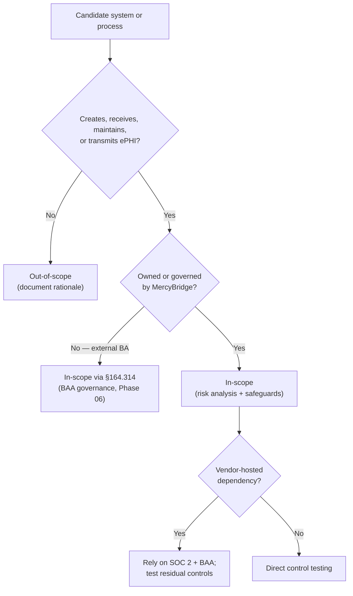

# 01.08 — Scope, Assumptions &amp; Constraints

| Field | Value |
|---|---|
| Document ID | MBH-SEC-2026-108 |
| Version | 1.0 |
| Date | 2026-07-15 |
| Classification | Confidential — Electronic Protected Health Information (ePHI) // Illustrative Portfolio Sample |
| Owner | Daniel Cho, CISO &amp; HIPAA Security Official |
| Author | Advisory Team (Healthcare GRC / HIPAA) |
| Status | Approved |

## Purpose

This document establishes the authoritative scope of the MercyBridge Health Network HIPAA Security Program assessment and implementation engagement. It draws the boundary between what is in-scope and out-of-scope, records the working assumptions the program relies upon, and documents the operational constraints that shape how the work is executed in a live 24x7 hospital environment. A precise, defensible scope statement is a prerequisite for a compliant §164.308(a)(1)(ii)(A) risk analysis: OCR expects the risk analysis to cover **all** ePHI the covered entity creates, receives, maintains, or transmits. This document is the scoping contract that the rest of the program is measured against.

## 1. Scope Statement

The engagement covers MercyBridge's enterprise HIPAA Security Rule posture across all care settings and every system that touches ePHI. MercyBridge operates as a HIPAA **covered entity** with approximately **2.1 million patient records** of ePHI. Of **210 enterprise information systems**, **68 systems** create, receive, maintain, or transmit ePHI and form the technical core of scope. All three Security Rule safeguard families — Administrative (§164.308), Physical (§164.310), and Technical (§164.312) — plus Organizational (§164.314) and Documentation (§164.316) requirements are in scope.

| Scope dimension | Coverage |
|---|---|
| ePHI systems | All 68 ePHI-bearing systems of 210 enterprise systems |
| Facilities | 4 hospitals + ~30 outpatient/clinic sites (~1,200 beds) |
| Safeguard families | Administrative, Physical, Technical (+ Organizational, Documentation) |
| Care settings | Inpatient, outpatient, emergency, imaging, laboratory, pharmacy, telehealth |
| Business associates | All ~180 business associates; 24 critical/high-risk prioritized |
| Frameworks | NIST SP 800-66 Rev. 2 spine; HITRUST i1 target; 2025 NPRM readiness |
| Workforce | ~6,500 employees plus affiliated providers |

## 2. In-Scope Detail

| In-scope element | Rationale |
|---|---|
| Halcyon EHR (vendor-hosted) | Primary clinical system of record; crown-jewel ePHI |
| PACS / medical imaging | Diagnostic imaging ePHI at rest and in transit |
| LIS (laboratory) | Lab result ePHI feeds and interfaces |
| Pharmacy system | Medication ePHI and e-prescribing |
| HIE (health information exchange) | External ePHI exchange with partners |
| Revenue-cycle / billing | ePHI within claims, remittance, and statements |
| Patient portal | Patient-facing ePHI access |
| Secure clinical messaging | Clinician-to-clinician ePHI communication |
| Networked medical devices / IoMT | Devices that store or transmit ePHI |
| All ~180 business associate relationships | Vendor ePHI handling governed by §164.314 |

## 3. Out-of-Scope

| Out-of-scope element | Reason |
|---|---|
| The 142 enterprise systems with no ePHI | No ePHI created, received, maintained, or transmitted |
| Facilities / operations (HVAC, building mgmt) | Not ePHI-bearing; owned by Facilities |
| HIPAA Privacy Rule program mechanics | Owned by Chief Privacy Officer (Stern); referenced only |
| CMS Conditions of Participation | Distinct regulatory workstream; referenced only |
| Financial-audit (SOX-style) controls | Governed by Finance; not a Security Rule matter |
| Payer / clearinghouse internal controls | Separate covered entities / their own obligations |
| Non-ePHI corporate data (marketing, HR non-health) | Outside Security Rule protected asset |

> Out-of-scope items may still be referenced where an interface or dependency crosses the boundary (e.g., a building-access system that gates a data-center door is in-scope as a physical safeguard even though it holds no ePHI).

## 4. Assumptions

| # | Assumption | Impact if invalid |
|---|---|---|
| A1 | Halcyon provides a current SOC 2 Type II; MercyBridge may reasonably rely on it for vendor-hosted controls | Additional direct testing of EHR controls required |
| A2 | Workforce and clinical leadership cooperate with interviews, evidence requests, and walkthroughs | Schedule slippage; incomplete evidence |
| A3 | The 68 ePHI-system inventory is materially complete at kickoff and refined in Phase 02 | Scope expansion; risk-analysis rework |
| A4 | ePHI is confined to identified systems and sanctioned data flows | Undiscovered ePHI stores raise residual risk |
| A5 | Existing BAAs are locatable and retrievable by Legal (Coleman) | Phase 06 remediation effort increases |
| A6 | Leadership funds remediation prioritized by the risk analysis | High risks may persist unmitigated |
| A7 | Frameworks (NIST 800-66 r2, HITRUST i1) remain stable over the engagement | Re-mapping of controls |

## 5. Constraints

| # | Constraint | Program response |
|---|---|---|
| C1 | 24x7 clinical operations — patient care cannot be interrupted | Change-controlled testing; read-only evidence where possible |
| C2 | Patient-safety sensitivity — no testing that risks clinical availability | Pen testing scoped &amp; scheduled with clinical sign-off |
| C3 | Medical-device / IoMT limitations — legacy OS, vendor-locked, unpatchable | Compensating controls; network segmentation (NPRM) |
| C4 | Vendor-hosted EHR — limited direct control over Halcyon infrastructure | Reliance on SOC 2 + BAA; §164.314 assurances |
| C5 | Distributed footprint — 4 hospitals + ~30 sites | Sampling strategy; site risk stratification |
| C6 | Clinician time is scarce | Batched, brief interviews; async evidence |
| C7 | Change-freeze windows around peak clinical periods | Roadmap sequenced around freezes |

## 6. Scope Decision Flow

## 7. Scope Change Control

Scope changes are logged, assessed for risk-analysis impact, and approved by the Security Official. Material changes (a new ePHI system, an acquisition, a new care setting) trigger a scope-delta review and, where warranted, an update to the §164.308(a)(1) risk analysis. The scope baseline set here is confirmed against the ePHI inventory produced in Phase 02.

## Cross-References

| Reference | Relevance |
|---|---|
| 01.06 — Program Charter &amp; Objectives | Authorizes the scope boundary |
| 01.07 — Roles, Responsibilities &amp; RACI | Accountability for scoped activities |
| Phase 02 — ePHI Asset Inventory &amp; Data Flows | Validates the 68-system scope |
| Phase 03 — HIPAA Security Risk Analysis | Consumes this scope statement |
| Phase 06 — Business Associate Risk | In-scope BA governance |

---
[⬅ Previous](01.07-roles-responsibilities-and-raci.md) · [🏠 Phase README](01.00-README.md) · [Next ➡](01.09-stakeholder-register.md)
