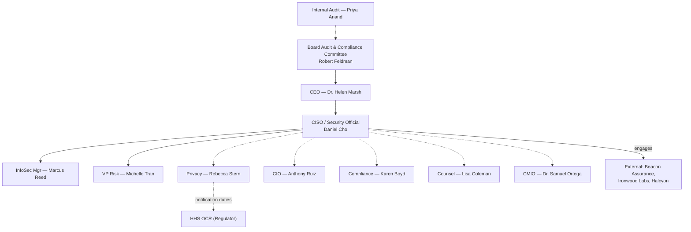

# 01.09 — Stakeholder Register

| Field | Value |
|---|---|
| Document ID | MBH-SEC-2026-109 |
| Version | 1.0 |
| Date | 2026-07-15 |
| Classification | Confidential — Electronic Protected Health Information (ePHI) // Illustrative Portfolio Sample |
| Owner | Michelle Tran, VP Enterprise Risk |
| Author | Advisory Team (Healthcare GRC / HIPAA) |
| Status | Approved |

## Purpose

This document is the authoritative stakeholder register for the MercyBridge HIPAA Security Program. It identifies every internal and external party with a stake in the program, records their role, interest, and influence, and prescribes a tailored engagement approach for each. Effective stakeholder management is essential to a §164.308(a)(1) program: risk analysis, safeguard implementation, and breach response all depend on the timely cooperation of clinical, technical, legal, and governance stakeholders — as well as third parties such as the HITRUST assessor, penetration-testing firm, EHR vendor, and, when notification duties arise, HHS OCR.

## 1. Stakeholder Register

| Stakeholder | Role / Body | Interest | Influence | Engagement approach |
|---|---|---|---|---|
| Dr. Helen Marsh | President &amp; CEO | Enterprise accountability, reputation | High | Executive briefings; charter &amp; investment approval |
| Daniel Cho | CISO &amp; HIPAA Security Official | Program ownership &amp; delivery | High | Program lead; daily/weekly direction |
| Rebecca Stern | Chief Privacy Officer | Breach notification, Privacy Rule interface | High | Co-own breach path; joint reviews |
| Anthony Ruiz | CIO | Infrastructure to enable safeguards | High | Technical partnership; resource alignment |
| Karen Boyd | Chief Compliance Officer | Enterprise compliance &amp; OCR posture | High | Compliance reporting; policy attestation |
| Dr. Samuel Ortega | CMIO | Clinical usability, clinician buy-in | Medium-High | Clinician liaison; change-impact review |
| Michelle Tran | VP, Enterprise Risk | Risk methodology &amp; register integration | Medium-High | Risk workshops; register owner |
| Marcus Reed | Information Security Manager | Hands-on execution of safeguards | Medium | Operational working sessions |
| Priya Anand | Director, Internal Audit | Independent assurance | Medium | Independent evidence access; audit liaison |
| Lisa Coleman | General Counsel | BAAs, legal risk, breach counsel | High | Legal review; BAA remediation |
| Robert Feldman | Board Audit &amp; Compliance Committee Chair | Board-level oversight | High | Quarterly committee reporting |
| Beacon Assurance, LLC | HITRUST Authorized External Assessor | i1 validated assessment | Medium (external) | Assessment coordination; evidence provision |
| Ironwood Security Labs, LLC | Penetration-testing firm | Independent technical testing | Medium (external) | Scoped SOW; rules of engagement |
| Halcyon Health Systems | EHR vendor / key Business Associate | Vendor-hosted EHR &amp; BA duties | Medium (external) | BAA governance; SOC 2 reliance |
| HHS Office for Civil Rights (OCR) | Federal regulator | HIPAA enforcement | High (external) | Audit-readiness; breach notification only as required |

## 2. Influence / Interest Classification

| Quadrant | Stakeholders | Strategy |
|---|---|---|
| High influence / High interest | Marsh, Cho, Stern, Boyd, Coleman, Feldman, OCR | Manage closely; direct engagement |
| High influence / Lower interest | Ruiz | Keep satisfied; align on delivery |
| Lower influence / High interest | Reed, Tran, Anand, Ortega | Keep informed; involve in execution |
| External / Contractual | Beacon, Ironwood, Halcyon | Govern by SOW / BAA; scheduled touchpoints |

## 3. Engagement Cadence

| Stakeholder group | Channel | Cadence |
|---|---|---|
| Board Audit &amp; Compliance Committee (Feldman) | Formal report | Quarterly (+ ad hoc on material risk) |
| Executive leadership (Marsh, Ruiz, Boyd) | Executive briefing | Monthly |
| Program core (Cho, Reed, Tran, Stern) | Working session | Weekly |
| Clinical leadership (Ortega) | Change-impact review | Per milestone |
| Internal Audit (Anand) | Assurance checkpoint | Per phase |
| External parties (Beacon, Ironwood, Halcyon) | Coordination call | Per engagement window |
| OCR | Notification / audit response | Only as legally required |

## 4. Stakeholder Influence Map

## 5. Stakeholder Expectations &amp; Success Criteria

| Stakeholder | What success looks like to them |
|---|---|
| Marsh (CEO) | Enterprise risk reduced; reputation protected; investment justified |
| Cho (Security Official) | Defensible §164.308(a)(1) program; HITRUST i1 achieved |
| Stern (Privacy) | Zero mishandled breaches; clean notification posture |
| Ruiz (CIO) | Safeguards delivered without disrupting clinical uptime |
| Boyd (Compliance) | OCR audit-readiness; no compliance gaps |
| Coleman (Counsel) | All BAAs current; legal exposure minimized |
| Feldman (Board) | Credible, evidenced oversight reporting |
| Ortega (CMIO) | Controls that do not impede clinical workflow |
| OCR (Regulator) | Demonstrable, current, documented compliance |

## 6. Stakeholder Risks &amp; Mitigations

| Risk | Affected stakeholder | Mitigation |
|---|---|---|
| Clinician resistance to control changes | Ortega, front-line staff | Early CMIO engagement; workflow-aware design |
| Evidence-request fatigue | System owners | Batched, scheduled, async requests |
| Vendor non-responsiveness (BAAs) | Coleman | Escalation clause; prioritize 24 critical BAs |
| Competing executive priorities | Marsh, Ruiz | Monthly executive alignment; roadmap visibility |
| External-assessor scheduling constraints | Beacon, Ironwood | Lock engagement windows early in roadmap |

## 7. Register Maintenance

The stakeholder register is owned by VP Enterprise Risk (Tran) in coordination with the Security Official (Cho) and is reviewed at each phase gate and upon any organizational change. New third parties (e.g., additional assessors or subcontractors) are added with their governing instrument (SOW or BAA) recorded. The register is corroborated during Phase 08 audit readiness as evidence that responsible parties were identified and engaged.

## Cross-References

| Reference | Relevance |
|---|---|
| 01.07 — Roles, Responsibilities &amp; RACI | Accountability detail per stakeholder |
| 01.08 — Scope, Assumptions &amp; Constraints | Cooperation assumptions |
| 01.12 — Communications &amp; Escalation Plan | Cadence &amp; escalation execution |
| Phase 06 — Business Associate Risk | Halcyon &amp; BA governance |
| Phase 08 — HITRUST &amp; Assessment | Beacon &amp; Ironwood engagement |

---
[⬅ Previous](01.08-scope-assumptions-and-constraints.md) · [🏠 Phase README](01.00-README.md) · [Next ➡](01.10-assessment-roadmap-and-milestones.md)
