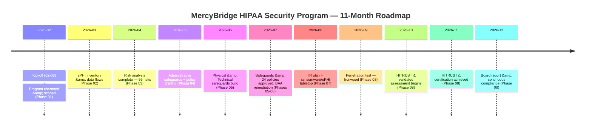
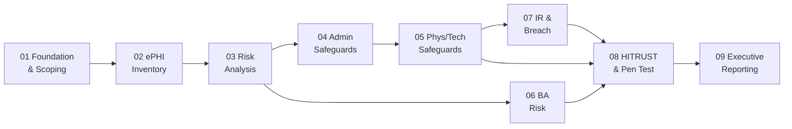

# 01.10 — Assessment Roadmap &amp; Milestones

| Field | Value |
|---|---|
| Document ID | MBH-SEC-2026-110 |
| Version | 1.0 |
| Date | 2026-07-15 |
| Classification | Confidential — Electronic Protected Health Information (ePHI) // Illustrative Portfolio Sample |
| Owner | Daniel Cho, CISO &amp; HIPAA Security Official |
| Author | Advisory Team (Healthcare GRC / HIPAA) |
| Status | Approved |

## Purpose

This document sets out the ~11-month roadmap for the MercyBridge HIPAA Security Program, mapping the nine program phases to concrete milestones and dates from kickoff on **2026-02-02** through the board report in **2026-12**. It gives every stakeholder a shared view of sequence, dependencies, and delivery dates, and it establishes the phase gates at which progress is reviewed. The roadmap is built on the NIST SP 800-66 Rev. 2 methodology spine and is sequenced so that the §164.308(a)(1) risk analysis precedes safeguard implementation, and that independent assessment (HITRUST i1) follows safeguard maturity.

## 1. Phase-to-Milestone Map

| Phase | Title | Key milestone | Target |
|---|---|---|---|
| 01 | Program Foundation &amp; HIPAA Scoping | Program chartered, scope baselined | 2026-02 |
| 02 | ePHI Asset Inventory &amp; Data Flows | 68 ePHI systems inventoried; flows mapped | 2026-03 |
| 03 | HIPAA Security Risk Analysis | 56 risks identified (11H/27M/18L); analysis complete | 2026-04 |
| 04 | Administrative Safeguards | Admin safeguards + 24-policy suite drafted | 2026-05 |
| 05 | Physical &amp; Technical Safeguards | Safeguards &amp; policies approved | 2026-05 → 2026-07 |
| 06 | Business Associate &amp; Third-Party Risk | BAA remediation complete (~180 BAs / 24 critical) | 2026-07 |
| 07 | Incident Response &amp; Breach Notification | IR plan + ransomware/ePHI tabletop | 2026-08 |
| 08 | HITRUST &amp; Independent Assessment | Pen test (2026-09); HITRUST i1 validated | 2026-09 → 2026-11 |
| 09 | Executive Reporting &amp; Program Maturity | Board report; continuous compliance | 2026-12 |

## 2. Milestone Register

| Milestone | Date | Owner | Gate criteria |
|---|---|---|---|
| Kickoff | 2026-02-02 | Cho | Charter approved; scope set |
| ePHI inventory complete | 2026-03 | Reed | 68 systems + data flows validated |
| Risk analysis complete | 2026-04 | Tran | 56 risks scored; posture Moderate |
| Safeguards &amp; 24 policies approved | 2026-05 → 2026-07 | Cho | 18 standards / ~50 specs addressed |
| BAA remediation complete | 2026-07 | Coleman | 24 critical BAAs executed/remediated |
| IR plan + tabletop | 2026-08 | Stern / Cho | Plan approved; exercise conducted |
| Penetration test | 2026-09 | Ironwood | 16 findings triaged (3H/7M/6L) |
| HITRUST i1 validated | 2026-10 → 2026-11 | Beacon | Certification achieved |
| Board report | 2026-12 | Cho / Marsh | Committee accepts program status |

## 3. Roadmap Timeline

## 4. Critical-Path Dependencies

## 5. Phase Gates &amp; Governance

| Gate | Exit criterion | Approver |
|---|---|---|
| Foundation gate | Scope + charter baselined | Cho |
| Inventory gate | ePHI systems &amp; flows validated | Cho / Reed |
| Risk gate | Risk analysis accepted | Tran / Cho |
| Safeguards gate | Policies approved; specs addressed | Cho / Marsh |
| Assessment gate | HITRUST i1 achieved | Beacon / Cho |
| Reporting gate | Committee accepts status | Feldman / Marsh |

## 6. Effort &amp; Resourcing by Phase

| Phase | Primary effort driver | Lead resources | Relative effort |
|---|---|---|---|
| 01 Foundation | Chartering, scoping, governance | Cho, Advisory Team | Low-Medium |
| 02 Inventory | System &amp; data-flow discovery | Reed, system owners | Medium |
| 03 Risk Analysis | Threat/vuln pairing, scoring 56 risks | Tran, Cho | High |
| 04 Admin Safeguards | Policy authoring (24-policy suite) | Cho, Boyd | High |
| 05 Phys/Tech Safeguards | MFA, encryption, segmentation build | Ruiz, Reed | High |
| 06 BA Risk | ~180 BA review; 24 critical BAAs | Coleman, Tran | Medium-High |
| 07 IR &amp; Breach | Plan + tabletop exercise | Stern, Cho | Medium |
| 08 HITRUST / Pen Test | Evidence, assessment, remediation | Beacon, Ironwood, Reed | High |
| 09 Reporting | Board pack, maturity model | Cho, Marsh | Low-Medium |

## 7. Key Schedule Risks

| Risk to schedule | Likelihood | Mitigation |
|---|---|---|
| Risk analysis (Phase 03) slips — blocks all safeguards | Medium | Critical-path monitoring; escalate immediately |
| Clinical change-freeze windows delay safeguard rollout | Medium | Sequence around freezes; two-week buffer |
| BAA retrieval lag from ~180 vendors | Medium | Start Legal retrieval in Phase 01 |
| Pen-test findings require heavy remediation before HITRUST | Medium | Pen test scheduled 2026-09, ahead of Oct assessment |
| Evidence-collection burden on clinical staff | Low-Medium | Async evidence; batched interviews |

## 8. Assumptions &amp; Buffer

The roadmap assumes workforce cooperation, timely evidence, and funded remediation (see 01.08). A rolling two-week buffer is held per phase to absorb clinical change-freeze windows. Slippage in the risk analysis (Phase 03) is treated as critical-path and escalated immediately, because all safeguard work depends on it. Progress against this roadmap is reported per the cadence in 01.12 and reviewed at each phase gate.

## Cross-References

| Reference | Relevance |
|---|---|
| 01.06 — Program Charter &amp; Objectives | Objectives the roadmap delivers |
| 01.08 — Scope, Assumptions &amp; Constraints | Scope &amp; constraint drivers |
| 01.11 — Compliance Obligations Calendar | Recurring obligations post-milestone |
| 01.12 — Communications &amp; Escalation Plan | Progress reporting cadence |
| Phase 09 — Executive Reporting | Final milestone (board report) |

---
[⬅ Previous](01.09-stakeholder-register.md) · [🏠 Phase README](01.00-README.md) · [Next ➡](01.11-compliance-obligations-calendar.md)
