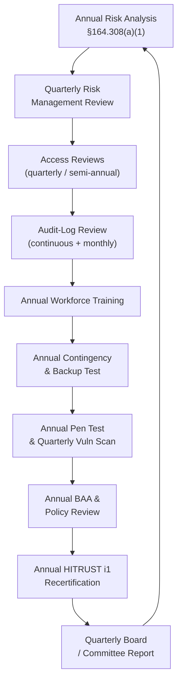

# 01.11 — Compliance Obligations Calendar

| Field | Value |
|---|---|
| Document ID | MBH-SEC-2026-111 |
| Version | 1.0 |
| Date | 2026-07-15 |
| Classification | Confidential — Electronic Protected Health Information (ePHI) // Illustrative Portfolio Sample |
| Owner | Marcus Reed, Information Security Manager |
| Author | Advisory Team (Healthcare GRC / HIPAA) |
| Status | Approved |

## Purpose

This document is the recurring compliance obligations calendar for the MercyBridge HIPAA Security Program. The HIPAA Security Rule is not a one-time project — §164.306(e) requires ongoing review and modification of security measures, and §164.308(a)(8) requires periodic technical and non-technical evaluation. This calendar codifies the cadence for every recurring obligation so that the program remains continuously compliant and audit-ready. It also incorporates forward-looking obligations anticipated by the 2025 HIPAA Security Rule NPRM (e.g., annual penetration testing and vulnerability scanning), which MercyBridge adopts as readiness measures ahead of any final rule.

## 1. Recurring Obligations

| Obligation | Regulatory basis | Cadence | Owner |
|---|---|---|---|
| Risk analysis review &amp; update | §164.308(a)(1)(ii)(A) | Annual + on material change | Tran / Cho |
| Risk management review | §164.308(a)(1)(ii)(B) | Quarterly | Cho |
| Workforce security awareness training | §164.308(a)(5) | Annual + at onboarding | Reed |
| Contingency-plan / backup testing | §164.308(a)(7)(ii)(D) | Annual (restore + DR test) | Ruiz / Reed |
| Policy &amp; procedure review (24-policy suite) | §164.316(b)(2)(iii) | Annual | Cho |
| Business Associate Agreement review | §164.308(b) / §164.314 | Annual + at renewal | Coleman |
| Access / user-privilege review | §164.308(a)(4) | Quarterly (privileged), semi-annual (all) | Reed |
| Audit-log review | §164.308(a)(1)(ii)(D) / §164.312(b) | Continuous monitoring + monthly review | Reed |
| Penetration test &amp; vulnerability scan | NPRM readiness / §164.308(a)(8) | Annual (pen test); quarterly (vuln scan) | Ironwood / Reed |
| HITRUST i1 recertification | HITRUST program rules | Annual (i1 is a 1-year certification) | Beacon / Cho |
| Sanction-policy enforcement review | §164.308(a)(1)(ii)(C) | Annual | Boyd / Cho |
| Incident-response plan review + tabletop | §164.308(a)(6) | Annual | Stern / Cho |
| Board / Committee security report | Governance | Quarterly | Cho / Marsh |

## 2. Annual Cadence by Quarter

| Quarter | Primary obligations |
|---|---|
| Q1 | Annual risk-analysis review; policy review; sanction-policy review |
| Q2 | Contingency-plan / backup restore test; access review (semi-annual) |
| Q3 | Penetration test; IR tabletop exercise; workforce training refresh |
| Q4 | HITRUST i1 recertification; BAA annual review; board year-end report |

## 3. Continuous &amp; Event-Driven Obligations

| Trigger | Obligation | Deadline |
|---|---|---|
| Security incident detected | 4-factor risk-of-compromise assessment | Promptly on discovery |
| Reportable breach confirmed | Notify individuals / HHS / (media if 500+) | Within 60 days (§164.404–408) |
| New ePHI system onboarded | Scope-delta review + risk analysis update | Before go-live |
| New / renewed BA relationship | Execute or update BAA | Before ePHI disclosure |
| Workforce member departs | De-provision access | Same day / per policy |
| Material org change (M&amp;A, new site) | Risk analysis &amp; scope refresh | Within 30 days |

## 4. Obligations Cycle

## 5. Monthly Operating Rhythm

| Month | Recurring focus |
|---|---|
| January | Kick annual risk-analysis review; policy-review planning |
| February | Sanction-policy review; risk-management Q1 checkpoint |
| March | Access review (privileged); vuln scan Q1 |
| April | Contingency-plan restore test planning |
| May | Backup / DR test execution; access review (semi-annual) |
| June | Risk-management Q2 checkpoint; vuln scan Q2 |
| July | Workforce training refresh; policy annual review |
| August | IR tabletop exercise; vuln scan Q3 |
| September | Annual penetration test |
| October | HITRUST i1 recertification; risk-management Q3 checkpoint |
| November | BAA annual review; vuln scan Q4 |
| December | Board year-end report; next-year calendar refresh |

## 6. Accountability &amp; Overdue Handling

| Control | Primary | Backup | Overdue escalation |
|---|---|---|---|
| Risk analysis | Tran | Cho | CISO → CEO if &gt;30 days late |
| Training completion | Reed | Boyd | Manager → HR sanction path |
| Backup / DR test | Ruiz | Reed | CISO notified; retest scheduled |
| BAA review | Coleman | Tran | Counsel escalates to CISO |
| Pen test / scan | Reed | Ironwood | CISO tracks to closure |
| HITRUST recert | Cho | Beacon | Committee informed of any lapse |

## 7. Evidence &amp; Retention

Each obligation produces evidence retained for a minimum of **six years** per §164.316(b)(2)(i). The Information Security Manager maintains the obligations tracker, records completion dates and evidence links, and flags overdue items to the Security Official. This calendar is a primary input to Phase 08 OCR audit-readiness and to the continuous-compliance program in Phase 09.

## Cross-References

| Reference | Relevance |
|---|---|
| 01.10 — Assessment Roadmap &amp; Milestones | Project milestones vs. recurring cadence |
| 01.12 — Communications &amp; Escalation Plan | Reporting &amp; breach deadlines |
| Phase 06 — Business Associate Risk | BAA review obligations |
| Phase 07 — Incident Response &amp; Breach | Event-driven obligations |
| Phase 08 — HITRUST &amp; Assessment | Pen test &amp; recertification |

---
[⬅ Previous](01.10-assessment-roadmap-and-milestones.md) · [🏠 Phase README](01.00-README.md) · [Next ➡](01.12-communications-and-escalation-plan.md)
