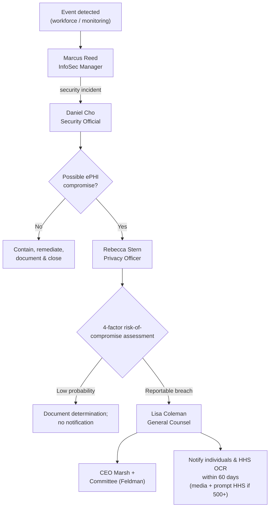

# 01.12 — Communications &amp; Escalation Plan

| Field | Value |
|---|---|
| Document ID | MBH-SEC-2026-112 |
| Version | 1.0 |
| Date | 2026-07-15 |
| Classification | Confidential — Electronic Protected Health Information (ePHI) // Illustrative Portfolio Sample |
| Owner | Daniel Cho, CISO &amp; HIPAA Security Official |
| Author | Advisory Team (Healthcare GRC / HIPAA) |
| Status | Approved |

## Purpose

This document defines how information moves through the MercyBridge HIPAA Security Program: the reporting cadences that keep governance, executive, and operational audiences informed; the escalation ladder for security issues; the breach-notification escalation path that ensures the Breach Notification Rule's 60-day deadline is met; and the approach to workforce communications. Clear communication and escalation are HIPAA safeguards in their own right — §164.308(a)(6) requires incident procedures, and §164.404–408 impose strict notification duties. This plan removes ambiguity about who reports what, to whom, and by when.

## 1. Reporting Cadences

| Audience | Report | Cadence | Owner |
|---|---|---|---|
| Board Audit &amp; Compliance Committee (Feldman) | Security program status &amp; risk posture | Quarterly | Cho / Marsh |
| Executive leadership (Marsh, Ruiz, Boyd, Stern) | Executive dashboard &amp; milestone status | Monthly | Cho |
| Program core team (Reed, Tran, Stern) | Working status &amp; blockers | Weekly | Reed |
| Clinical leadership (Ortega) | Change-impact &amp; safeguard rollout | Per milestone | Cho / Ortega |
| Internal Audit (Anand) | Assurance findings | Per phase | Anand |
| Workforce (all ~6,500) | Awareness &amp; policy updates | Ongoing + annual training | Reed |

## 2. Escalation Tiers

| Tier | Trigger | Escalates to | Timeframe |
|---|---|---|---|
| Tier 0 | Routine event / low-severity alert | InfoSec Manager (Reed) | Standard queue |
| Tier 1 | Security incident (contained) | CISO (Cho) | Same business day |
| Tier 2 | Significant incident / possible ePHI exposure | CISO + Privacy Officer (Stern) | Within hours |
| Tier 3 | Suspected reportable breach | CISO + Privacy + General Counsel (Coleman) | Immediate |
| Tier 4 | Confirmed breach / material risk | CEO (Marsh) + Board Committee (Feldman) | Immediate + next reporting cycle |

## 3. Incident &amp; Breach Escalation Flow

## 4. Breach-Notification Escalation Path

| Step | Owner | Action | Deadline |
|---|---|---|---|
| 1 | Reed → Cho | Detect, contain, classify incident | On discovery |
| 2 | Cho → Stern | Refer possible ePHI compromise to Privacy | Within hours |
| 3 | Stern | Perform 4-factor risk-of-compromise assessment | Promptly |
| 4 | Stern → Coleman | Confirm reportability; engage counsel | Immediate |
| 5 | Coleman → Marsh / Feldman | Brief executive &amp; board | Immediate |
| 6 | Stern / Coleman | Notify individuals &amp; HHS OCR (media if 500+) | Within 60 days (§164.404–408) |

## 5. Workforce Communications

| Communication | Purpose | Channel | Frequency |
|---|---|---|---|
| Security awareness training | Baseline ePHI duties | LMS module | Annual + onboarding |
| Policy update bulletins | Announce 24-policy changes | Intranet / email | On change |
| Incident-reporting reminders | Reinforce "report promptly" | Posters / digital signage | Ongoing |
| Phishing simulation feedback | Reduce social-engineering risk | Email | Quarterly |
| Program milestone updates | Sustain engagement | Newsletter | Per milestone |

## 6. Escalation Contacts &amp; Response SLAs

| Role | Contact function | Target response SLA |
|---|---|---|
| InfoSec Manager (Reed) | First responder / triage | Within 1 hour (business); 4 hours (off-hours) |
| Security Official (Cho) | Incident commander | Within 2 hours of Tier 1+ |
| Privacy Officer (Stern) | Breach assessment lead | Same day for possible ePHI compromise |
| General Counsel (Coleman) | Legal / notification counsel | Immediate for suspected reportable breach |
| CEO (Marsh) | Executive sponsor | Immediate for confirmed material breach |
| Committee Chair (Feldman) | Board oversight | Next reporting cycle; immediate if material |

## 7. Communication Artifacts

| Artifact | Audience | Produced by |
|---|---|---|
| Quarterly board security report | Committee | Cho |
| Monthly executive dashboard | Executives | Cho / Reed |
| Weekly program status note | Core team | Reed |
| Incident notification memo | Exec + Legal | Stern / Coleman |
| OCR / individual breach notice | Regulator / patients | Stern / Coleman |
| Workforce awareness bulletin | All staff | Reed |

## 8. Communication Governance

All external communications regarding a security incident or breach are coordinated exclusively through General Counsel (Coleman) and the Chief Privacy Officer (Stern); no workforce member communicates with media or regulators independently. Internal escalations follow the tiers above and are logged in the incident tracker. This plan is exercised during the Phase 07 tabletop and validated in Phase 08 audit readiness.

## Cross-References

| Reference | Relevance |
|---|---|
| 01.07 — Roles, Responsibilities &amp; RACI | Decision rights behind escalation |
| 01.09 — Stakeholder Register | Audiences &amp; cadence |
| 01.11 — Compliance Obligations Calendar | Reporting &amp; notification deadlines |
| Phase 07 — Incident Response &amp; Breach | Full IR &amp; breach procedures |
| Phase 09 — Executive Reporting | Board reporting execution |

---
[⬅ Previous](01.11-compliance-obligations-calendar.md) · [🏠 Phase README](01.00-README.md) · [Next ➡](01.13-phase-summary-and-transition.md)
