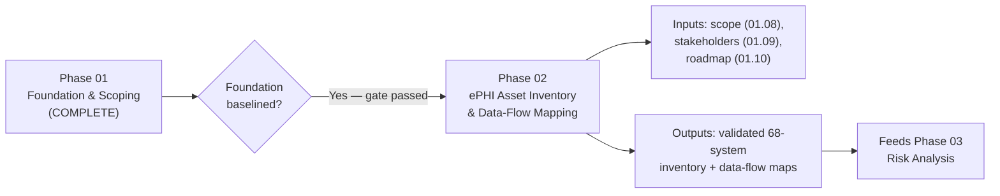

# 01.13 — Phase Summary &amp; Transition

| Field | Value |
|---|---|
| Document ID | MBH-SEC-2026-113 |
| Version | 1.0 |
| Date | 2026-07-15 |
| Classification | Confidential — Electronic Protected Health Information (ePHI) // Illustrative Portfolio Sample |
| Owner | Daniel Cho, CISO &amp; HIPAA Security Official |
| Author | Advisory Team (Healthcare GRC / HIPAA) |
| Status | Approved |

## Purpose

This document closes Phase 01 — Program Foundation &amp; HIPAA Scoping — of the MercyBridge HIPAA Security Program. It recaps what was accomplished, confirms that the program foundation is baselined and defensible, and formally hands off to Phase 02 — ePHI Asset Inventory &amp; Data-Flow Mapping. The purpose of a phase-summary gate is to establish an auditable checkpoint: the Security Official confirms the foundation is complete and fit to carry the §164.308(a)(1) risk analysis that follows.

## 1. Phase 01 Recap

| Accomplishment | Evidence artifact |
|---|---|
| Program chartered with objectives | 01.06 — Program Charter &amp; Objectives |
| HIPAA Security Official designated (§164.308(a)(2)) | 01.05 — Security Official Designation; Daniel Cho |
| Covered-entity status &amp; profile established | 01.01 — Organization Profile |
| Regulatory landscape &amp; framework register set | 01.02 / 01.03 — HITECH, OCR, NIST 800-66 r2, HITRUST i1 |
| Roles &amp; accountability codified | 01.07 — Roles, Responsibilities &amp; RACI |
| Scope, assumptions &amp; constraints baselined | 01.08 — 68 ePHI systems in scope |
| Stakeholders identified &amp; engaged | 01.09 — Stakeholder Register |
| Roadmap &amp; milestones approved | 01.10 — 11-month roadmap (2026-02 → 2026-12) |
| Recurring obligations calendar established | 01.11 — Compliance Obligations Calendar |
| Communications &amp; escalation plan set | 01.12 — incl. 60-day breach path |

## 2. Foundation Baseline Confirmation

| Baseline element | Status | Owner |
|---|---|---|
| Program authority &amp; governance | Baselined | Cho |
| Scope boundary (68 of 210 systems) | Baselined | Cho / Reed |
| Framework methodology (NIST 800-66 r2) | Baselined | Advisory Team |
| Stakeholder engagement model | Baselined | Tran |
| Roadmap &amp; milestone plan | Approved | Cho / Marsh |
| Recurring obligations &amp; cadence | Baselined | Reed |
| Communications &amp; escalation | Baselined | Cho / Stern |

> Gate decision: Phase 01 exit criteria are met. The Security Official confirms the foundation is complete, internally consistent with the canonical facts, and ready to support the ePHI inventory and risk analysis.

## 3. Open Items Carried Forward

| Item | Carried to | Note |
|---|---|---|
| Validate 68-system ePHI inventory | Phase 02 | Confirm/refine scope count &amp; data flows |
| Locate &amp; catalog existing BAAs | Phase 06 | Legal (Coleman) retrieval underway |
| Confirm IoMT / medical-device population | Phase 02 | Feeds segmentation planning |
| Reconcile SOC 2 reliance on Halcyon | Phase 06 | Residual-control testing scope |

## 4. Transition to Phase 02

## 5. Phase 02 Entry Criteria

| Entry criterion | Satisfied by |
|---|---|
| Scope boundary defined | 01.08 — Scope, Assumptions &amp; Constraints |
| Stakeholders &amp; owners identified | 01.09 — Stakeholder Register |
| Roadmap &amp; dates approved | 01.10 — Assessment Roadmap |
| Data-classification anchor (ePHI) established | 01.01 / 01.04 — CE status &amp; Security Rule overview |
| Access to system owners secured | 01.09 engagement model |

## 6. Risk Posture at Foundation

| Dimension | Position at end of Phase 01 |
|---|---|
| Program authority | Established — Security Official designated (§164.308(a)(2)) |
| Scope clarity | High — 68 of 210 systems bounded |
| Known unknowns | Data-flow detail, IoMT population, BAA completeness |
| Framework alignment | NIST 800-66 r2 spine; HITRUST i1 target set |
| Anticipated posture | Moderate pending Phase 03 risk analysis (56 risks projected) |

## 7. Lessons &amp; Readiness Notes

| Observation | Action taken |
|---|---|
| Early Legal engagement needed for ~180 BAAs | BAA retrieval started in Phase 01 |
| Clinical uptime is the binding constraint | Change-controlled testing model adopted (01.08) |
| Vendor-hosted EHR limits direct control | SOC 2 reliance + §164.314 assurances planned |
| Stakeholder breadth requires cadence discipline | Communications plan baselined (01.12) |

## 8. Sign-Off

Phase 01 is approved and baselined by the HIPAA Security Official. The program advances to Phase 02, where the 68 ePHI-bearing systems and their data flows will be inventoried and mapped, producing the asset foundation on which the §164.308(a)(1) risk analysis (Phase 03) is built.

## Cross-References

| Reference | Relevance |
|---|---|
| 01.06 — Program Charter &amp; Objectives | Program mandate closed out here |
| 01.08 — Scope, Assumptions &amp; Constraints | Scope handed to Phase 02 |
| 01.10 — Assessment Roadmap &amp; Milestones | Milestone context for transition |
| Phase 02 — ePHI Asset Inventory | Receiving phase |
| Phase 03 — Risk Analysis | Downstream consumer of inventory |

---
[⬅ Previous](01.12-communications-and-escalation-plan.md) · [🏠 Phase README](01.00-README.md) · [Next ➡](../02-ephi-asset-inventory-data-flows/02.00-README.md)
