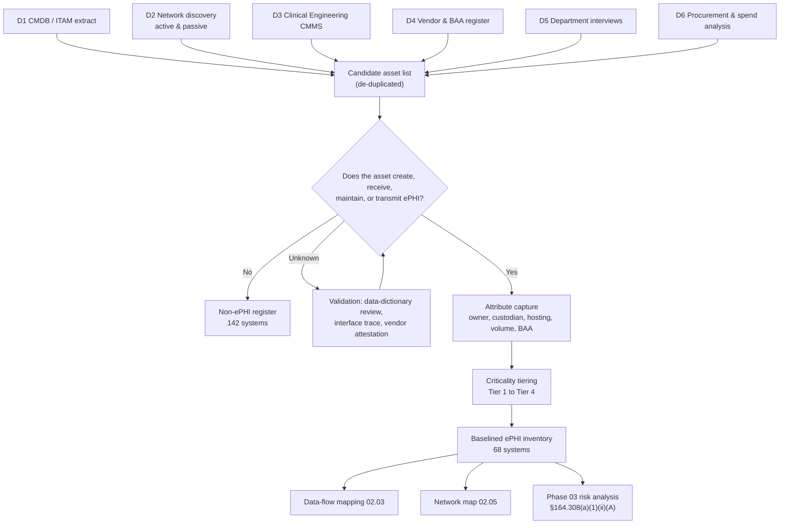

# 02.01 — Inventory Methodology

| Field | Value |
|---|---|
| Document ID | MBH-INV-MTH-2026-201 |
| Version | 1.0 |
| Date | 2026-07-15 |
| Classification | Confidential — Electronic Protected Health Information (ePHI) // Illustrative Portfolio Sample |
| Owner | Marcus Reed, Information Security Manager |
| Author | Advisory Team (Healthcare GRC / HIPAA) |
| Status | Approved |

## Purpose

This document defines the methodology MercyBridge Health Network uses to identify, catalogue, classify, and maintain the inventory of every information system, application, medium, and device that creates, receives, maintains, or transmits electronic protected health information (ePHI). It is the controlling procedure for Phase 02 and the evidentiary foundation for the §164.308(a)(1)(ii)(A) risk analysis performed in Phase 03.

The methodology exists because a HIPAA risk analysis is only as complete as the asset picture underneath it. HHS Office for Civil Rights (OCR) has consistently identified an incomplete or organization-wide-in-name-only risk analysis as the single most common Security Rule failure in enforcement actions. **NIST SP 800-66 Rev. 2** makes the sequencing explicit: before a covered entity can assess threats, vulnerabilities, likelihood, or impact, it must first determine *where ePHI lives, how it moves, and who touches it*. That determination is the work product of this phase.

## 1. Regulatory and Framework Basis

| Authority | Requirement | How this methodology responds |
|---|---|---|
| 45 CFR §164.308(a)(1)(ii)(A) | Conduct an accurate and thorough assessment of risks to **all** ePHI held by the entity | Inventory establishes the "all ePHI" population — 68 systems of 210 |
| 45 CFR §164.308(a)(1)(ii)(B) | Implement security measures sufficient to reduce risk | Criticality and PHI-volume attributes drive safeguard prioritisation |
| 45 CFR §164.310(d)(1) | Device and media controls — receipt, removal, movement, disposal | Media and endpoint classes are inventoried as first-class assets |
| 45 CFR §164.314(a) | Business associate contracts | BAA status is a mandatory inventory attribute |
| 45 CFR §164.316(b)(1) | Documentation retained 6 years | Inventory baselines are versioned and retained |
| NIST SP 800-66 Rev. 2 (Feb 2024) | Step 1 — identify the scope of ePHI; inventory systems and data flows | Methodology spine; section structure mirrors 800-66 r2 |
| NIST SP 800-30 Rev. 1 | System characterisation precedes risk determination | Inventory attributes feed the Phase 03 risk register |
| HITRUST CSF (i1) | Asset management domain control requirements | Inventory satisfies i1 asset-management evidence |
| CIS Controls v8.1 — Controls 1 &amp; 2 | Enterprise asset and software inventory | Discovery tooling mapped to CIS 1.1–1.5, 2.1–2.3 |

### 1.1 The 2025 NPRM: inventory becomes mandatory

Under the **in-force** Security Rule, an asset inventory is an implicit prerequisite rather than a named requirement. The **2025 HIPAA Security Rule NPRM** would change that. As proposed, regulated entities would be required to:

- maintain a **written technology asset inventory** covering all technology assets that may affect the confidentiality, integrity, or availability of ePHI;
- maintain a **network map** illustrating the movement of ePHI into, out of, and within the entity's electronic information systems;
- **review and update both at least annually**, and upon any change that materially affects ePHI security (new system, merger, relocation, new threat, security incident).

The NPRM also proposes removing the "addressable versus required" distinction, so an inventory that today is a defensible best practice would become an enforceable specification. MercyBridge therefore builds Phase 02 to the proposed standard now: the inventory in 02.02 and the network map in 02.05 are produced, versioned, and placed under annual review as if the rule were already final. This is documented as forward-looking readiness, not as a claim of compliance with a proposed rule.

## 2. Scope of the Inventory

| Dimension | In scope | Notes |
|---|---|---|
| Applications and systems | All **210** enterprise information systems | Each is evaluated for ePHI; **68** are ePHI-bearing |
| Hosting models | On-premises, vendor-hosted, SaaS, hybrid, device/edge | Vendor-hosted assets inventoried even where MercyBridge lacks infrastructure control |
| Facilities | 4 hospitals, ~30 outpatient/clinic sites | Site attribution recorded per system instance |
| Medical devices / IoMT | All networked clinical devices | Sourced from Clinical Engineering; see 02.04 |
| Endpoints and media | Workstations, laptops, tablets, WOWs, removable media, imaging media | Managed as asset classes, not per-serial, except ePHI-bearing exceptions |
| Interfaces and integrations | HL7 v2, FHIR, X12, DICOM, SFTP, API | Interfaces are inventoried as flows in 02.03 |
| Data repositories | Databases, file shares, archives, backups | Includes VNA and offsite/immutable backup copies |
| Out of scope | Building management, non-ePHI corporate systems (142) | Recorded in the CMDB but excluded from the ePHI inventory |

## 3. Discovery Methods

No single source is authoritative. MercyBridge uses six independent discovery streams and reconciles them; a system appears in the ePHI inventory if **any** stream identifies it and the determination survives validation.

| # | Method | Source / owner | Strength | Known blind spot |
|---|---|---|---|---|
| D1 | CMDB / IT asset management extract | IT Operations (Ruiz) | Authoritative for sanctioned, supported systems | Stale records; shadow IT absent |
| D2 | Active and passive network discovery | Security Operations (Reed) | Finds unmanaged and forgotten hosts | Active scanning restricted on clinical VLANs |
| D3 | Clinical Engineering / CMMS device register | Biomedical Engineering (Ortega sponsor) | Only reliable source for IoMT | Device data-storage behaviour often undocumented |
| D4 | Vendor and BAA register | Legal (Coleman) | Surfaces vendor-hosted ePHI with no local footprint | Contracts may predate current usage |
| D5 | Department and data-owner interviews | Advisory Team + department heads | Finds spreadsheets, local databases, departmental SaaS | Self-report bias; recall limits |
| D6 | Financial and procurement analysis | Finance / Procurement | Detects unbudgeted SaaS and expense-card purchases | Lags adoption by one cycle |

### 3.1 Reconciliation rule

Discovery output is merged into a single candidate list, de-duplicated on vendor + function + hosting, and each candidate is dispositioned by the Information Security Manager. Discrepancies between streams are logged; a system present in D2 but absent from D1 is treated as a CMDB defect and raised as an action item, not silently added.

## 4. Attributes Tracked

Every ePHI system record carries the following attributes. Attributes marked **M** are mandatory; a record cannot be baselined without them.

| Attribute | M | Definition | Downstream use |
|---|---|---|---|
| Asset ID | M | `MBH-SYS-nnn` unique identifier | Cross-phase traceability |
| System name | M | Common and vendor product name | Communication, evidence requests |
| Business function | M | Clinical or administrative purpose | Impact analysis |
| Business owner | M | Accountable executive or department head | Approvals, risk acceptance |
| Technical custodian | M | Team operating the system day to day | Control implementation |
| Hosting model | M | On-premises / vendor-hosted / SaaS / hybrid / device | Shared-responsibility determination |
| ePHI indicator | M | Yes / No / Derived-de-identified | Scope inclusion |
| ePHI data types | M | Demographics, clinical notes, imaging, lab, medication, financial, genetic, behavioural | Sensitivity weighting |
| Record volume | M | Approximate count of distinct patient records | Breach-impact estimation |
| Criticality tier | M | Tier 1 Critical to Tier 4 Low | Contingency and RTO/RPO planning |
| Business associate involved | M | Yes / No | §164.314 applicability |
| BAA status | M | Executed-current / Executed-remediating / Not required / Gap | Phase 06 input |
| Encryption at rest / in transit | M | Implemented / Partial / Not implemented | NPRM readiness, §164.312(a)(2)(iv), (e)(2)(ii) |
| Authentication model | M | SSO / MFA / local credentials | §164.312(d), NPRM MFA mandate |
| Audit logging | M | Native / forwarded to SIEM / none | §164.312(b) |
| Network zone / VLAN | M | Segment assignment | 02.05 segmentation |
| Interfaces | M | Inbound and outbound integrations | 02.03 flow mapping |
| Backup and retention | | Method, frequency, retention period | §164.308(a)(7) |
| Disposal method | | NIST SP 800-88 sanitisation category | §164.310(d)(2)(i) |
| Last validated | M | Date of most recent owner attestation | Currency evidence |

## 5. Criticality Tiering

Criticality is assigned on clinical impact first, then on data volume and regulatory exposure. Clinical-safety impact can never be outranked by financial impact.

| Tier | Label | Definition | Target RTO | Target RPO | Count |
|---|---|---|---|---|---|
| Tier 1 | Critical | Loss directly impairs patient care or safety within minutes to hours | ≤ 4 hours | ≤ 15 minutes | 12 |
| Tier 2 | High | Loss materially degrades clinical or revenue operations within one shift | ≤ 24 hours | ≤ 1 hour | 21 |
| Tier 3 | Moderate | Loss is disruptive but workaround-able for several days | ≤ 72 hours | ≤ 24 hours | 24 |
| Tier 4 | Low | Loss is administratively inconvenient only | ≤ 5 business days | ≤ 24 hours | 11 |
| — | — | **Total ePHI systems** | — | — | **68** |

## 6. Roles and Responsibilities

| Role | Person | Inventory responsibility |
|---|---|---|
| HIPAA Security Official / CISO | Daniel Cho | Approves the baseline; accountable to the Board for its accuracy |
| Information Security Manager | Marcus Reed | Owns this methodology; runs discovery, reconciliation, and baselining |
| Chief Information Officer | Anthony Ruiz | Owns the CMDB and the network map; provides D1 and D2 feeds |
| Chief Medical Information Officer | Dr. Samuel Ortega | Sponsors clinical and IoMT discovery; validates clinical criticality |
| Chief Privacy Officer | Rebecca Stern | Confirms ePHI determinations and designated record set boundaries |
| General Counsel | Lisa Coleman | Supplies the BA/BAA register; confirms BAA status per system |
| VP, Enterprise Risk | Michelle Tran | Consumes the inventory into the enterprise risk register |
| Business owners | Department heads | Attest annually to accuracy of their systems' records |
| Technical custodians | IT / Clinical Engineering teams | Maintain technical attributes; report changes within 5 business days |
| Director of Internal Audit | Priya Anand | Independently samples and tests inventory completeness |

## 7. Refresh Cadence and Change Triggers

| Activity | Frequency | Owner | Evidence produced |
|---|---|---|---|
| Full inventory re-baseline | Annual | Information Security Manager | Versioned inventory, approval record |
| Business-owner attestation | Annual (staggered by quarter) | Business owners | Signed attestation per system |
| Automated discovery reconciliation | Monthly | Security Operations | Discrepancy report and action items |
| Clinical Engineering device sync | Quarterly | Biomedical Engineering | Device register delta |
| BAA status refresh | Quarterly | Legal | BAA register cross-walk |
| Network map refresh | Annual and on material change | CIO | Updated 02.05 diagram set |
| Ad-hoc update | Within 10 business days of trigger | Asset owner | Change record in inventory changelog |

**Material change triggers** requiring an out-of-cycle update: new system go-live or decommission; new business associate handling ePHI; merger, acquisition, or new site; change of hosting model (e.g., on-premises to cloud); a security incident implicating an asset; a new interface carrying ePHI; a significant new threat affecting an asset class.

## 8. Quality Assurance and Known Limitations

| Control | Description |
|---|---|
| Four-eyes disposition | Every ePHI Yes/No determination is reviewed by a second analyst before baselining |
| Interface trace test | For 15 sampled systems, an actual HL7/FHIR/X12 message trace confirms the declared data types |
| Volume corroboration | Record counts corroborated against EHR master patient index and system reports |
| Internal audit sample | Internal Audit re-performs discovery on a 10% sample of departments |
| Negative assurance | The 142 non-ePHI systems carry a documented rationale for exclusion (see 01.08) |

Acknowledged limitations: active scanning is restricted on clinical and medical-device VLANs to protect patient safety, so passive monitoring substitutes there; vendor-hosted systems are characterised from contracts, SOC 2 reports, and vendor attestations rather than direct inspection; and self-reported departmental data is subject to recall bias. Each limitation is carried forward as an assumption into the Phase 03 risk analysis rather than being resolved silently.

## Cross-References

| Reference | Relevance |
|---|---|
| 01.08 — Scope, Assumptions &amp; Constraints | Defines the 68-of-210 scope boundary this methodology operationalises |
| 01.07 — Roles, Responsibilities &amp; RACI | Parent accountability model for the roles above |
| 02.02 — ePHI System Inventory | The catalogue produced by this methodology |
| 02.03 — ePHI Data-Flow Mapping | Consumes the interface attributes captured here |
| 02.04 — Medical Devices &amp; IoMT | Applies discovery method D3 in depth |
| 02.05 — Network Architecture &amp; Segmentation | Produces the NPRM-anticipated network map |
| 02.07 — Data Classification &amp; Handling | Uses the ePHI data-type attribute |
| Phase 03 — HIPAA Security Risk Analysis | Primary consumer of the baselined inventory |
| Phase 06 — Business Associate &amp; Third-Party Risk | Consumes the BAA status attribute |

---
[⬅ Previous](02.00-README.md) · [🏠 Phase README](02.00-README.md) · [Next ➡](02.02-ephi-system-inventory.md)
