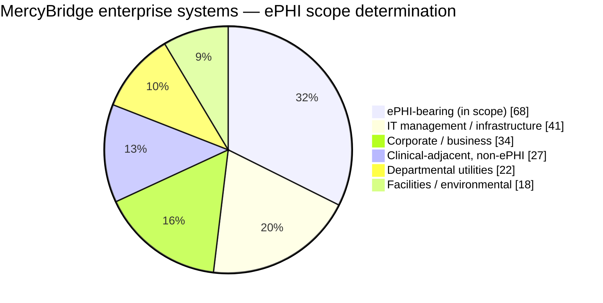

# 02.02 — ePHI System Inventory

| Field | Value |
|---|---|
| Document ID | MBH-INV-SYS-2026-202 |
| Version | 1.0 |
| Date | 2026-07-15 |
| Classification | Confidential — Electronic Protected Health Information (ePHI) // Illustrative Portfolio Sample |
| Owner | Marcus Reed, Information Security Manager |
| Author | Advisory Team (Healthcare GRC / HIPAA) |
| Status | Approved |

## Purpose

This document is the baselined catalogue of every MercyBridge Health Network information system that creates, receives, maintains, or transmits electronic protected health information (ePHI). It records **68 ePHI-bearing systems** out of **210 enterprise information systems**, together with hosting model, ePHI data types, criticality tier, approximate record volume, and business associate agreement (BAA) status.

The catalogue is the population over which the §164.308(a)(1)(ii)(A) risk analysis is performed in Phase 03. It is also the artefact that would satisfy the **2025 HIPAA Security Rule NPRM's** proposed requirement for a written technology asset inventory, reviewed and updated at least annually and on material change. Produced under the methodology in 02.01, baselined 2026-03 and re-validated 2026-07.

## 1. Enterprise Composition

| Population | Count | Share | Treatment |
|---|---|---|---|
| ePHI-bearing systems (in Security Rule scope) | 68 | 32.4% | Full risk analysis, safeguards, and BA governance |
| Corporate / business systems (finance, HR, procurement) | 34 | 16.2% | Excluded — documented rationale, re-tested annually |
| IT management and infrastructure tooling (non-ePHI) | 41 | 19.5% | Excluded — supporting-control relevance only |
| Clinical-adjacent, de-identified or non-ePHI | 27 | 12.9% | Excluded — de-identification validated per §164.514 |
| Facilities, environmental and building systems | 18 | 8.6% | Excluded — physical-safeguard adjacency noted |
| Departmental utilities and minor applications | 22 | 10.5% | Excluded — annual re-screen |
| **Total enterprise information systems** | **210** | **100%** | — |

## 2. ePHI Systems by Functional Category

| Category | Systems | Crown jewel? |
|---|---|---|
| A. Core clinical / EHR platform | 9 | Yes — Halcyon EHR |
| B. Diagnostic and ancillary clinical | 13 | Yes — PACS, LIS, pharmacy |
| C. Patient access and engagement | 7 | Yes — patient portal |
| D. Revenue cycle and health information management | 9 | Yes — revenue cycle / billing |
| E. Interoperability and health information exchange | 6 | Yes — HIE |
| F. Medical device / IoMT platforms | 7 | Yes — IoMT |
| G. Enterprise infrastructure and communications | 12 | Yes — secure clinical messaging |
| H. Departmental, specialty and analytics | 5 | No |
| **Total** | **68** | — |

## 3. The Inventory

Volumes are approximate distinct patient records unless annotated. "Tier" is the criticality tier defined in 02.01 §5.

### 3.1 Category A — Core Clinical / EHR Platform (9)

| Asset ID | System | Hosting | ePHI data types | Tier | Records | BAA |
|---|---|---|---|---|---|---|
| MBH-SYS-001 | Halcyon Health EHR — enterprise core | Vendor-hosted | Demographics, clinical notes, orders, results, problem list | 1 | 2,100,000 | Current |
| MBH-SYS-002 | Halcyon CPOE &amp; clinical decision support | Vendor-hosted | Orders, allergies, medication, clinical notes | 1 | 2,100,000 | Current |
| MBH-SYS-003 | Halcyon eMAR — medication administration | Vendor-hosted | Medication administration, demographics | 1 | 1,340,000 | Current |
| MBH-SYS-004 | Halcyon ADT / patient registration | Vendor-hosted | Demographics, insurance, encounter | 1 | 2,100,000 | Current |
| MBH-SYS-005 | Halcyon ambulatory clinic module (~30 sites) | Vendor-hosted | Clinical notes, orders, results | 2 | 980,000 | Current |
| MBH-SYS-006 | Emergency department tracking board | On-premises | Demographics, chief complaint, disposition | 2 | 412,000 visits/yr | N/A |
| MBH-SYS-007 | Perioperative / surgical information system | On-premises | Operative notes, implants, demographics | 2 | 148,000 | Current |
| MBH-SYS-008 | Anesthesia information management system | On-premises | Intra-operative vitals, medication, notes | 3 | 96,000 | Current |
| MBH-SYS-009 | Critical care / ICU clinical documentation | On-premises | Vitals, ventilator data, clinical notes | 2 | 74,000 | N/A |

### 3.2 Category B — Diagnostic and Ancillary Clinical (13)

| Asset ID | System | Hosting | ePHI data types | Tier | Records | BAA |
|---|---|---|---|---|---|---|
| MBH-SYS-010 | PACS — picture archiving &amp; communication | On-premises | DICOM imaging, demographics, reports | 1 | 1,860,000 studies | Current |
| MBH-SYS-011 | Vendor-neutral archive / enterprise imaging | Hybrid | DICOM and non-DICOM imaging | 2 | 2,410,000 studies | Current |
| MBH-SYS-012 | RIS — radiology information system | On-premises | Orders, scheduling, reports | 2 | 1,120,000 | Current |
| MBH-SYS-013 | Radiology dictation &amp; speech recognition | Vendor-hosted | Dictated reports, demographics | 3 | 1,120,000 | Current |
| MBH-SYS-014 | Teleradiology / after-hours read portal | Vendor-hosted | Imaging, reports, demographics | 3 | 62,000 | Current |
| MBH-SYS-015 | LIS — laboratory information system | On-premises | Orders, specimens, results | 1 | 1,780,000 | Current |
| MBH-SYS-016 | Blood bank / transfusion management | On-premises | Blood type, crossmatch, transfusion history | 1 | 88,000 | N/A |
| MBH-SYS-017 | Anatomic pathology &amp; digital slide system | On-premises | Pathology reports, whole-slide images | 3 | 143,000 | Current |
| MBH-SYS-018 | Microbiology &amp; antimicrobial stewardship | On-premises | Culture results, susceptibility, notes | 3 | 210,000 | N/A |
| MBH-SYS-019 | Pharmacy information system | On-premises | Medication orders, dispensing, allergies | 1 | 1,240,000 | Current |
| MBH-SYS-020 | Automated dispensing cabinet management | Hybrid | Medication dispensing, patient identifiers | 3 | 1,240,000 | Current |
| MBH-SYS-021 | Cardiology information system (ECG/echo/cath) | On-premises | Waveforms, images, procedure reports | 2 | 264,000 | Current |
| MBH-SYS-022 | Endoscopy / GI reporting system | On-premises | Procedure images, reports | 4 | 41,000 | N/A |

### 3.3 Category C — Patient Access and Engagement (7)

| Asset ID | System | Hosting | ePHI data types | Tier | Records | BAA |
|---|---|---|---|---|---|---|
| MBH-SYS-023 | MyBridge patient portal | Vendor-hosted | Results, notes, messages, statements | 2 | 1,142,000 enrolled | Current |
| MBH-SYS-024 | Online scheduling &amp; digital check-in | SaaS | Demographics, appointment, reason for visit | 4 | 640,000 | Current |
| MBH-SYS-025 | Telehealth / virtual visit platform | SaaS | Video encounter, notes, demographics | 2 | 168,000 | Current |
| MBH-SYS-026 | Appointment reminder &amp; patient outreach | SaaS | Demographics, appointment, contact data | 4 | 1,340,000 | Current |
| MBH-SYS-027 | Pre-registration &amp; insurance verification | SaaS | Demographics, insurance, eligibility | 4 | 720,000 | Current |
| MBH-SYS-028 | Patient financial estimation / price transparency | SaaS | Demographics, procedure, benefit data | 4 | 380,000 | Current |
| MBH-SYS-029 | Patient experience survey platform | SaaS | Demographics, encounter, free-text comments | 4 | 295,000 | **Remediating** |

### 3.4 Category D — Revenue Cycle and Health Information Management (9)

| Asset ID | System | Hosting | ePHI data types | Tier | Records | BAA |
|---|---|---|---|---|---|---|
| MBH-SYS-030 | Revenue cycle / patient accounting | Vendor-hosted | Demographics, diagnosis/procedure codes, financial | 2 | 2,100,000 | Current |
| MBH-SYS-031 | Claims clearinghouse gateway (X12 837/835) | SaaS | Claims, remittance, diagnosis codes | 3 | 4,600,000 claims/yr | Current |
| MBH-SYS-032 | Computer-assisted coding &amp; CDI | SaaS | Clinical documentation, codes | 3 | 1,010,000 | Current |
| MBH-SYS-033 | Medical transcription service | Vendor-hosted | Dictated clinical documentation | 3 | 470,000 | **Remediating** |
| MBH-SYS-034 | Enterprise document imaging / HIM chart repository | On-premises | Scanned records, consents, legacy charts | 3 | 2,100,000 | N/A |
| MBH-SYS-035 | Release of information (ROI) platform | SaaS | Full designated record set extracts | 4 | 96,000 | Current |
| MBH-SYS-036 | Denials management &amp; appeals | SaaS | Claims, clinical justification, codes | 4 | 218,000 | Current |
| MBH-SYS-037 | Early-out / self-pay collections (BA-operated) | Vendor-hosted | Demographics, balances, service dates | 3 | 340,000 | Current |
| MBH-SYS-038 | Charge description master &amp; charge capture | On-premises | Encounter, procedure, charge detail | 3 | 2,100,000 | N/A |

### 3.5 Category E — Interoperability and Health Information Exchange (6)

| Asset ID | System | Hosting | ePHI data types | Tier | Records | BAA |
|---|---|---|---|---|---|---|
| MBH-SYS-039 | Enterprise interface engine (HL7 v2 / FHIR) | On-premises | All ePHI types in transit | 1 | All flows | N/A |
| MBH-SYS-040 | Regional HIE connector | Hybrid | Continuity-of-care documents, results | 2 | 1,660,000 | Current |
| MBH-SYS-041 | FHIR API gateway (patient access API) | Hybrid | USCDI data classes | 3 | 1,142,000 | Current |
| MBH-SYS-042 | e-Prescribing network connector | SaaS | Prescriptions, medication history, PDMP | 2 | 1,240,000 | Current |
| MBH-SYS-043 | State immunization &amp; public health registry interface | Hybrid | Immunizations, reportable conditions | 4 | 780,000 | N/A |
| MBH-SYS-044 | Enterprise master patient index (EMPI) | On-premises | Identity attributes, MRN cross-reference | 2 | 2,100,000 | Current |

### 3.6 Category F — Medical Device / IoMT Platforms (7)

| Asset ID | System | Hosting | ePHI data types | Tier | Records | BAA |
|---|---|---|---|---|---|---|
| MBH-SYS-045 | IoMT security &amp; device visibility gateway | On-premises | Device-associated patient identifiers | 3 | 6,120 devices | Current |
| MBH-SYS-046 | Physiologic monitoring central stations | Device / edge | Waveforms, vitals, demographics | 1 | 190,000 | Current |
| MBH-SYS-047 | Infusion pump drug-library management server | Device / edge | Infusion events, patient identifiers | 2 | 96,000 infusions/yr | Current |
| MBH-SYS-048 | Ventilator &amp; respiratory data concentrator | Device / edge | Ventilator settings, vitals | 3 | 22,000 | Current |
| MBH-SYS-049 | Telemetry gateway &amp; wireless medical telemetry | Device / edge | Cardiac waveforms, patient identifiers | 2 | 118,000 | Current |
| MBH-SYS-050 | Point-of-care testing device middleware | Device / edge | POC results, patient identifiers | 3 | 410,000 | Current |
| MBH-SYS-051 | Clinical engineering CMMS / device register | SaaS | Device service notes containing identifiers | 4 | 6,120 devices | Current |

### 3.7 Category G — Enterprise Infrastructure and Communications (12)

| Asset ID | System | Hosting | ePHI data types | Tier | Records | BAA |
|---|---|---|---|---|---|---|
| MBH-SYS-052 | Secure clinical messaging | SaaS | Clinical messages, images, identifiers | 2 | 640,000 | Current |
| MBH-SYS-053 | Enterprise email and calendaring | SaaS | Incidental ePHI in mail and attachments | 2 | Indeterminate | Current |
| MBH-SYS-054 | Enterprise file shares / departmental storage | On-premises | Unstructured ePHI, spreadsheets, exports | 3 | Indeterminate | N/A |
| MBH-SYS-055 | Enterprise backup &amp; immutable vault | Hybrid | Full copies of all ePHI systems | 1 | 2,100,000 | Current |
| MBH-SYS-056 | Offsite / cloud disaster-recovery replication | Hybrid | Replicated ePHI datasets | 2 | 2,100,000 | Current |
| MBH-SYS-057 | SIEM / security log repository | On-premises | Identifiers embedded in application logs | 3 | Log-derived | N/A |
| MBH-SYS-058 | Enterprise digital fax gateway | SaaS | Referrals, orders, results, discharge summaries | 3 | 1,900,000 pages/yr | **Remediating** |
| MBH-SYS-059 | Clinical virtual desktop infrastructure | On-premises | Session-resident ePHI from all clinical apps | 2 | Session-scoped | N/A |
| MBH-SYS-060 | Enterprise print, wristband and label services | On-premises | Demographics, MRN, barcodes | 3 | 2,100,000 | N/A |
| MBH-SYS-061 | Managed file transfer (SFTP) platform | On-premises | Batch ePHI extracts to payers and BAs | 3 | Varies by flow | N/A |
| MBH-SYS-062 | Identity governance, SSO and MFA directory | Hybrid | Workforce and patient identity attributes | 1 | 6,500 + patient IDs | Current |
| MBH-SYS-063 | Endpoint detection and response console | SaaS | File paths and metadata exposing identifiers | 3 | Endpoint-derived | Current |

### 3.8 Category H — Departmental, Specialty and Analytics (5)

| Asset ID | System | Hosting | ePHI data types | Tier | Records | BAA |
|---|---|---|---|---|---|---|
| MBH-SYS-064 | Behavioural health / substance use records | On-premises | Behavioural health notes (42 CFR Part 2 overlay) | 2 | 68,000 | N/A |
| MBH-SYS-065 | Oncology / infusion treatment planning | Vendor-hosted | Regimens, staging, genetic markers | 2 | 34,000 | Current |
| MBH-SYS-066 | Home health &amp; hospice point-of-care | SaaS | Visit notes, medication, demographics | 3 | 27,000 | Current |
| MBH-SYS-067 | Rehabilitation &amp; therapy documentation | SaaS | Therapy notes, functional assessments | 4 | 52,000 | Current |
| MBH-SYS-068 | Clinical quality registry &amp; analytics warehouse | On-premises | Aggregated clinical, identified extracts | 3 | 2,100,000 | N/A |

## 4. Inventory Analytics

| Hosting model | Systems | Share | Primary control posture |
|---|---|---|---|
| Vendor-hosted / SaaS | 30 | 44.1% | BAA + SOC 2 reliance + configuration hardening |
| On-premises | 25 | 36.8% | Direct MercyBridge control across all safeguard families |
| Hybrid (on-premises plus cloud component) | 8 | 11.8% | Split responsibility; boundary explicitly documented |
| Medical device / edge | 5 | 7.4% | Segmentation and compensating controls (see 02.04) |
| **Total** | **68** | **100%** | — |

| Criticality tier | Systems | Illustrative members |
|---|---|---|
| Tier 1 — Critical | 12 | Halcyon EHR core, CPOE, eMAR, ADT, PACS, LIS, blood bank, pharmacy, interface engine, physiologic monitoring, backup vault, identity directory |
| Tier 2 — High | 21 | Ambulatory module, ED tracking, perioperative, VNA, RIS, cardiology, patient portal, telehealth, revenue cycle, HIE connector, e-prescribing, EMPI, secure messaging, email, VDI, oncology |
| Tier 3 — Moderate | 24 | Dictation, teleradiology, pathology, microbiology, ADC management, clearinghouse, coding, transcription, HIM repository, IoMT gateway, file shares, SIEM, fax, print, MFT, EDR |
| Tier 4 — Low | 11 | Endoscopy reporting, scheduling, reminders, pre-registration, estimation, surveys, ROI, denials, immunization interface, CMMS, therapy documentation |
| **Total** | **68** | — |

| Control attribute | Implemented | Partial | Not implemented | NPRM relevance |
|---|---|---|---|---|
| Encryption at rest | 51 | 12 | 5 | NPRM would make encryption at rest mandatory |
| Encryption in transit | 60 | 6 | 2 | NPRM would make encryption in transit mandatory |
| Multi-factor authentication | 44 | 17 (SSO, no MFA) | 7 (local credentials) | NPRM would mandate MFA |
| Audit logging to SIEM | 49 | 15 (native only) | 4 | §164.312(b) audit controls |

| BAA status | Systems | Disposition |
|---|---|---|
| Business associate involved — BAA executed and current | 44 | No action; monitored in Phase 06 |
| Business associate involved — BAA under remediation | 3 | MBH-SYS-029, -033, -058; remediation closing 2026-07 |
| No business associate involved (internally operated) | 21 | Direct control; §164.314 not applicable |
| **Total** | **68** | — |

## 5. Notable Findings from Baselining

| # | Finding | Systems affected | Carried to |
|---|---|---|---|
| F-01 | Five device/edge platforms cannot encrypt data at rest due to vendor OS constraints | MBH-SYS-046 to -050 | Phase 03 risk analysis; compensating segmentation |
| F-02 | Unstructured ePHI on departmental file shares has no reliable volume estimate | MBH-SYS-054 | Phase 03; data-discovery scanning proposed |
| F-03 | Seven systems still permit local credentials without MFA | Mixed, mostly Tier 3–4 | Phase 04 access management |
| F-04 | Three BAAs required remediation before Phase 06 close | MBH-SYS-029, -033, -058 | Phase 06 BA remediation |
| F-05 | Behavioural health records carry a 42 CFR Part 2 overlay stricter than HIPAA | MBH-SYS-064 | 02.07 data classification |
| F-06 | Incidental ePHI in email and SIEM logs is real but unquantified | MBH-SYS-053, -057 | Phase 03; DLP evaluated in Phase 05 |

## Cross-References

| Reference | Relevance |
|---|---|
| 02.01 — Inventory Methodology | Defines how this catalogue was produced and is maintained |
| 02.03 — ePHI Data-Flow Mapping | Maps the interfaces connecting these systems |
| 02.04 — Medical Devices &amp; IoMT | Expands Category F and the 6,120-device fleet |
| 02.05 — Network Architecture &amp; Segmentation | Places each system in a network zone |
| 02.06 — Cloud &amp; Hosted Services | Expands the 38 systems with a cloud or hosted component |
| 02.07 — Data Classification &amp; Handling | Applies handling rules to the ePHI data types listed here |
| 01.08 — Scope, Assumptions &amp; Constraints | Source of the 68-of-210 scope boundary |
| Phase 03 — HIPAA Security Risk Analysis | Consumes this inventory as the risk-analysis population |
| Phase 06 — Business Associate &amp; Third-Party Risk | Consumes the BAA status column |

---
[⬅ Previous](02.01-inventory-methodology.md) · [🏠 Phase README](02.00-README.md) · [Next ➡](02.03-ephi-data-flow-mapping.md)
