# 02.03 — ePHI Data-Flow Mapping

| Field | Value |
|---|---|
| Document ID | MBH-INV-FLW-2026-203 |
| Version | 1.0 |
| Date | 2026-07-15 |
| Classification | Confidential — Electronic Protected Health Information (ePHI) // Illustrative Portfolio Sample |
| Owner | Anthony Ruiz, Chief Information Officer |
| Author | Advisory Team (Healthcare GRC / HIPAA) |
| Status | Approved |

## Purpose

This document maps how electronic protected health information moves into, through, and out of MercyBridge Health Network. It traces ePHI from creation at the point of care, through the Halcyon EHR system of record, into ancillary clinical systems, onward to revenue cycle and external exchange partners, back to patients through the portal, and finally into archive and sanitised disposal.

Data-flow mapping is the second half of **NIST SP 800-66 Rev. 2** Step 1. An asset inventory alone tells the risk analyst *where ePHI rests*; the flow map tells them *where ePHI is exposed in motion* — at interfaces, transport boundaries, and organisational handoffs, which is where most breach scenarios actually originate. The **2025 HIPAA Security Rule NPRM** would additionally require a written **network map** illustrating the movement of ePHI into, out of, and within the entity's systems, reviewed at least annually. This document, together with the zone map in 02.05, is MercyBridge's response to that proposed requirement.

## 1. Flow Taxonomy

| Flow class | Definition | Count | Primary risk |
|---|---|---|---|
| **I — Internal** | ePHI moves between MercyBridge-operated systems inside the trust boundary | 19 | Interface misconfiguration; over-broad data in messages |
| **E — External outbound** | ePHI leaves MercyBridge to a business associate, payer, or partner | 14 | Transport exposure; recipient handling; BAA gaps |
| **N — External inbound** | ePHI enters MercyBridge from an outside source | 6 | Identity matching errors; malicious payloads |
| **P — Patient-directed** | ePHI moves to or from the patient or their designee | 5 | Authentication strength; misdirected disclosure |
| **A — Archive / disposal** | ePHI moves to long-term retention or is sanitised | 4 | Retention overrun; incomplete sanitisation |
| **Total mapped flows** | — | **48** | — |

## 2. Enterprise ePHI Data-Flow Diagram

```mermaid
flowchart TD
    subgraph POC["1 · Point of care — 4 hospitals, ~30 outpatient sites"]
        REG["Registration &amp; ADT<br/>MBH-SYS-004"]
        DOC["Clinician documentation<br/>CPOE, notes, eMAR"]
        DEV["Networked medical devices<br/>monitors, pumps, ventilators"]
    end

    subgraph CORE["2 · System of record"]
        EHR["Halcyon EHR — vendor-hosted<br/>MBH-SYS-001"]
        EMPI["Enterprise master patient index<br/>MBH-SYS-044"]
        IE["Interface engine — HL7 v2 / FHIR<br/>MBH-SYS-039"]
    end

    subgraph ANC["3 · Ancillary clinical systems"]
        LIS["LIS — laboratory<br/>MBH-SYS-015"]
        PACS["PACS &amp; VNA imaging<br/>MBH-SYS-010 / 011"]
        RX["Pharmacy &amp; dispensing<br/>MBH-SYS-019 / 020"]
        CARD["Cardiology, pathology,<br/>perioperative, anesthesia"]
    end

    subgraph RCM["4 · Revenue cycle"]
        BILL["Revenue cycle / patient accounting<br/>MBH-SYS-030"]
        CODE["Coding &amp; CDI<br/>MBH-SYS-032"]
        CLR["Claims clearinghouse<br/>MBH-SYS-031"]
    end

    subgraph EXT["5 · External exchange"]
        HIE["Regional HIE connector<br/>MBH-SYS-040"]
        ERX["e-Prescribing network<br/>MBH-SYS-042"]
        PAYER["Payers &amp; managed-care plans"]
        REG2["Public health &amp; registries<br/>MBH-SYS-043"]
        BA["Business associates<br/>transcription, ROI, collections"]
    end

    subgraph PT["6 · Patient-facing"]
        PORTAL["MyBridge patient portal<br/>MBH-SYS-023"]
        FHIR["FHIR patient-access API<br/>MBH-SYS-041"]
        TELE["Telehealth platform<br/>MBH-SYS-025"]
    end

    subgraph RET["7 · Retention &amp; disposal"]
        BKP["Backup &amp; immutable vault<br/>MBH-SYS-055"]
        DR["Cloud DR replication<br/>MBH-SYS-056"]
        HIM["HIM chart repository<br/>MBH-SYS-034"]
        DISP["Sanitisation &amp; disposal<br/>NIST SP 800-88"]
    end

    REG -->|"DF-01 HL7 ADT"| IE
    DOC -->|"DF-02 native"| EHR
    DEV -->|"DF-03 HL7 ORU / proprietary"| IE
    IE -->|"DF-04"| EHR
    IE <-->|"DF-05 identity resolution"| EMPI
    EHR -->|"DF-06 HL7 ORM orders"| LIS
    EHR -->|"DF-07 HL7 ORM orders"| PACS
    EHR -->|"DF-08 medication orders"| RX
    EHR -->|"DF-09 orders"| CARD
    LIS -->|"DF-10 HL7 ORU results"| IE
    PACS -->|"DF-11 DICOM / HL7 reports"| IE
    RX -->|"DF-12 administration data"| IE
    CARD -->|"DF-13 reports"| IE
    EHR -->|"DF-14 charges &amp; encounters"| BILL
    EHR -->|"DF-15 documentation"| CODE
    CODE -->|"DF-16 coded claims"| BILL
    BILL -->|"DF-17 X12 837 claims"| CLR
    CLR -->|"DF-18 X12 837 over TLS"| PAYER
    PAYER -->|"DF-19 X12 835 remittance"| CLR
    CLR -->|"DF-20"| BILL
    EHR <-->|"DF-21 CCD / C-CDA query-response"| HIE
    EHR -->|"DF-22 NCPDP SCRIPT"| ERX
    EHR -->|"DF-23 HL7 VXU / ELR"| REG2
    EHR -->|"DF-24 SFTP / API extracts"| BA
    BA -->|"DF-25 completed work product"| EHR
    EHR -->|"DF-26 released results &amp; notes"| PORTAL
    EHR -->|"DF-27 USCDI over OAuth 2.0"| FHIR
    TELE -->|"DF-28 encounter documentation"| EHR
    PORTAL -->|"DF-29 patient messages &amp; forms"| EHR
    EHR -->|"DF-30 nightly backup"| BKP
    ANC -->|"DF-31 nightly backup"| BKP
    BKP -->|"DF-32 encrypted replication"| DR
    EHR -->|"DF-33 legal record archive"| HIM
    HIM -->|"DF-34 retention expiry"| DISP
    BKP -->|"DF-35 media sanitisation"| DISP

    classDef crown fill:#fde8e8,stroke:#b91c1c,stroke-width:2px
    classDef external fill:#eef2ff,stroke:#4338ca,stroke-width:1px
    class EHR,PACS,LIS,RX,HIE,BILL,PORTAL crown
    class PAYER,BA,REG2,ERX external
```

## 3. Internal Flows (Class I)

The tables in sections 3 to 5 record the principal flows in each class; the complete 48-flow register, including low-volume departmental interfaces, is maintained in `trackers/ephi-data-flow-register.xlsx` and is reviewed on the same annual cycle as the inventory.

| Flow | Source | Destination | Content | Transport | Frequency | Encryption |
|---|---|---|---|---|---|---|
| DF-01 | Registration / ADT | Interface engine | Demographics, insurance, encounter | HL7 v2 over MLLP/TLS | Real time | TLS 1.2+ |
| DF-02 | Clinician workstation / VDI | Halcyon EHR | Notes, orders, medication administration | HTTPS | Real time | TLS 1.3 |
| DF-03 | Medical devices | Interface engine | Vitals, waveforms, infusion and ventilator data | HL7 ORU / vendor protocol | Continuous | Partial — see 02.04 |
| DF-04 | Interface engine | Halcyon EHR | Merged clinical and demographic messages | HL7 v2 / FHIR over TLS | Real time | TLS 1.2+ |
| DF-05 | Interface engine | EMPI | Identity attributes for patient matching | HL7 v2 over MLLP/TLS | Real time | TLS 1.2+ |
| DF-06 | Halcyon EHR | LIS | Laboratory orders | HL7 ORM | Real time | TLS 1.2+ |
| DF-07 | Halcyon EHR | RIS / PACS | Imaging orders and worklists | HL7 ORM / DICOM MWL | Real time | TLS 1.2+ |
| DF-08 | Halcyon EHR | Pharmacy / dispensing cabinets | Medication orders | HL7 RDE | Real time | TLS 1.2+ |
| DF-10 | LIS | Interface engine → EHR | Results, microbiology, pathology | HL7 ORU | Real time | TLS 1.2+ |
| DF-11 | PACS / VNA | Interface engine → EHR | Study availability, radiology reports | DICOM / HL7 ORU | Real time | TLS 1.2+ |
| DF-14 | Halcyon EHR | Revenue cycle | Charges, encounters, diagnosis codes | HL7 DFT / API | Hourly batch | TLS 1.2+ |
| DF-15 | Halcyon EHR | Coding &amp; CDI | Clinical documentation for coding | API | Real time | TLS 1.2+ |
| DF-30 | Halcyon EHR | Backup vault | Full database and document copies | Vendor backup channel | Nightly | AES-256 at rest |
| DF-31 | Ancillary systems | Backup vault | System and database images | Backup agent over TLS | Nightly | AES-256 at rest |
| DF-33 | Halcyon EHR | HIM chart repository | Legal medical record archive | Batch export over SFTP | Daily | AES-256 at rest |

## 4. External Flows (Classes E and N)

| Flow | Counterparty | Direction | Content | Transport | BA / BAA | Control notes |
|---|---|---|---|---|---|---|
| DF-17/18 | Claims clearinghouse → payers | Outbound | X12 837 institutional and professional claims | AS2 / SFTP over TLS | BA — current | Volume 4.6M claims/yr; minimum necessary applied |
| DF-19/20 | Payers → clearinghouse → MercyBridge | Inbound | X12 835 remittance advice, 277 status | AS2 / SFTP over TLS | BA — current | Payer is a separate covered entity |
| DF-21 | Regional HIE | Bidirectional | C-CDA continuity-of-care documents, results | IHE XCA / XCPD over mutual TLS | BA — current | Patient consent flags enforced at query time |
| DF-22 | e-Prescribing network | Outbound | NCPDP SCRIPT prescriptions, medication history | Certified network over TLS | BA — current | PDMP query logged separately |
| DF-23 | State immunization and public-health registries | Outbound | HL7 VXU immunizations, ELR reportable results | SOAP / TLS over state gateway | Public health — no BAA required | Permitted disclosure under §164.512(b) |
| DF-24a | Medical transcription service | Outbound | Dictated audio and draft documentation | SFTP over TLS | BA — remediating | MBH-SYS-033; BAA closure 2026-07 |
| DF-24b | Release-of-information platform | Outbound | Designated record set extracts | HTTPS portal | BA — current | Accounting of disclosures maintained by Privacy |
| DF-24c | Early-out / self-pay collections | Outbound | Demographics, balances, service dates | SFTP over TLS | BA — current | Minimum-necessary field filter applied |
| DF-24d | Teleradiology after-hours reads | Outbound | DICOM studies and prior reports | DICOM TLS / VPN | BA — current | Studies purged from vendor cache at 30 days |
| DF-24e | Quality registries and accreditation bodies | Outbound | Abstracted clinical measures | HTTPS upload | BA — current | Limited data set where feasible |
| DF-24f | Enterprise digital fax gateway | Bidirectional | Referrals, orders, results, discharge summaries | HTTPS to gateway; PSTN egress | BA — remediating | MBH-SYS-058; misdirected-fax risk tracked |
| DF-N1 | Referring physician offices | Inbound | Referrals, prior records | Direct secure messaging / fax | Varies | Identity matching via EMPI |
| DF-N2 | Reference laboratory partners | Inbound | Send-out laboratory results | HL7 over VPN | BA — current | Results reconciled to orders in LIS |
| DF-N3 | Halcyon vendor support | Inbound / remote | Support access to production ePHI | Brokered remote access, session-recorded | BA — current | Just-in-time access; §164.308(a)(4) |

## 5. Patient-Directed and Archive Flows (Classes P and A)

| Flow | Description | Authentication | Retention / disposal control |
|---|---|---|---|
| DF-26 | Released results, notes and statements published to MyBridge portal | Portal credentials + MFA; identity-proofed enrolment | Retained for the life of the record |
| DF-27 | USCDI data returned through the FHIR patient-access API to third-party apps | OAuth 2.0 authorisation with granular scopes | App registration reviewed; disclosure logged |
| DF-28 | Telehealth encounter recordings and documentation into the EHR | Clinician SSO + MFA; patient one-time link | Recordings not retained unless clinically required |
| DF-29 | Patient-initiated secure messages, questionnaires and uploaded documents | Portal credentials + MFA | Filed to the designated record set |
| DF-P5 | Individual right-of-access export under §164.524 | Identity verification by HIM | Delivered by encrypted media or portal within 30 days |
| DF-32 | Encrypted replication of backups to the cloud DR region | Service credentials, no interactive access | 35-day rolling retention; immutable copies |
| DF-34 | Retention-expiry purge from the HIM chart repository | Dual approval by HIM and Privacy | Purge certificate retained 6 years |
| DF-35 | Decommissioned media sanitisation | Chain-of-custody logged | NIST SP 800-88 Purge or Destroy; certificate of destruction |

## 6. Flow-Level Risk Observations

| # | Observation | Flows | Disposition |
|---|---|---|---|
| FL-01 | Device-to-interface traffic (DF-03) uses vendor protocols that do not all support TLS | DF-03 | Compensating VLAN isolation; carried to Phase 03 |
| FL-02 | Fax egress leaves the encrypted boundary at the PSTN handoff | DF-24f | Recipient verification procedure; migration to Direct messaging proposed |
| FL-03 | Portal and FHIR API expose ePHI to the public internet | DF-26, DF-27 | MFA, rate limiting, WAF, app-registration review |
| FL-04 | Vendor remote support touches production ePHI | DF-N3 | Just-in-time access, session recording, quarterly review |
| FL-05 | HIE query-response depends on correct consent-flag propagation | DF-21 | Consent tested during interface validation |
| FL-06 | Batch extracts to BAs are broader than minimum necessary in two cases | DF-24c, DF-24e | Field-level filters implemented 2026-06 |
| FL-07 | Behavioural health data (42 CFR Part 2) must be suppressed from general exchange | DF-21, DF-24b | Segmentation flag enforced in interface engine |

## Cross-References

| Reference | Relevance |
|---|---|
| 02.01 — Inventory Methodology | Defines the interface attribute that seeds this map |
| 02.02 — ePHI System Inventory | Source of every system referenced by asset ID |
| 02.04 — Medical Devices &amp; IoMT | Detail behind flow DF-03 |
| 02.05 — Network Architecture &amp; Segmentation | Zone placement of each flow endpoint |
| 02.06 — Cloud &amp; Hosted Services | Shared-responsibility view of external flows |
| 02.07 — Data Classification &amp; Handling | Handling rules applied per flow |
| Phase 03 — HIPAA Security Risk Analysis | Threats and vulnerabilities assessed per flow |
| Phase 05 — Physical &amp; Technical Safeguards | Transmission security (§164.312(e)) controls |
| Phase 06 — Business Associate &amp; Third-Party Risk | Governs every Class E counterparty |

---
[⬅ Previous](02.02-ephi-system-inventory.md) · [🏠 Phase README](02.00-README.md) · [Next ➡](02.04-medical-devices-and-iomt.md)
