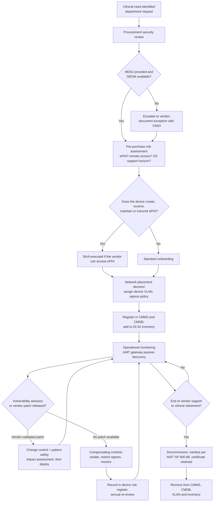

# 02.04 — Medical Devices &amp; Internet of Medical Things (IoMT)

| Field | Value |
|---|---|
| Document ID | MBH-INV-MED-2026-204 |
| Version | 1.0 |
| Date | 2026-07-15 |
| Classification | Confidential — Electronic Protected Health Information (ePHI) // Illustrative Portfolio Sample |
| Owner | Dr. Samuel Ortega, Chief Medical Information Officer |
| Author | Advisory Team (Healthcare GRC / HIPAA) |
| Status | Approved |

## Purpose

This document inventories and characterises MercyBridge Health Network's networked medical device and Internet of Medical Things (IoMT) estate — **6,120 networked clinical devices** across 4 hospitals and approximately 30 outpatient sites — and explains why this asset class is the hardest part of a HIPAA Security Rule programme to control.

Medical devices are simultaneously ePHI systems and patient-care instruments. They fall squarely within the §164.308(a)(1)(ii)(A) risk analysis and §164.310(d)(1) device and media controls, yet they cannot be patched, scanned, hardened, or rebooted on the covered entity's timetable: they are FDA-cleared configurations under vendor control, and taking one out of service can have a clinical consequence. The programme therefore treats devices as a distinct class governed by compensating controls — principally **network segmentation**, which the **2025 HIPAA Security Rule NPRM** would elevate from good practice to an express requirement, alongside mandatory asset inventory. The seven IoMT platform systems (MBH-SYS-045 through -051) in the 02.02 inventory are the managed front-ends to the fleet described here.

## 1. Governance and Ownership

| Function | Owner | Responsibility |
|---|---|---|
| Clinical Engineering / Biomedical | Biomedical Engineering (CMIO sponsor, Dr. Ortega) | Device register, preventive maintenance, vendor liaison, recalls, decommissioning |
| Information Security | Marcus Reed, Information Security Manager | Risk assessment, segmentation design, vulnerability intelligence, incident response |
| IT Infrastructure | Anthony Ruiz, CIO | VLANs, wireless, firewall policy, NAC enforcement |
| Procurement and Legal | Lisa Coleman, General Counsel | Security terms in purchase agreements; BAAs where vendors touch ePHI |
| Medical Device Security Committee | Chaired by CMIO; CISO, Clinical Engineering, IT, Nursing, Supply Chain | Joint decision forum; monthly; owns the device risk register |
| Clinical operations | Nursing and department leadership | Patient-safety impact assessment for any proposed device change |

Neither Clinical Engineering nor Information Security can act unilaterally. Every mitigation that changes a device's configuration, network placement, or availability requires joint approval and a documented patient-safety impact assessment. This is recorded as a deliberate constraint (C3 in 01.08), not a control weakness.

## 2. Device Fleet Inventory

| Device class | Units | ePHI-bearing | Legacy / unsupported OS | Typical ePHI held | Network placement |
|---|---|---|---|---|---|
| Infusion pumps (large-volume, syringe, PCA) | 2,450 | 610 | 520 | Patient ID, infusion orders, drug library events | Device VLAN — pumps |
| Physiologic monitors and central stations | 1,180 | 1,180 | 214 | Demographics, waveforms, vitals, alarms | Device VLAN — monitoring |
| Telemetry transmitters and receivers | 640 | 120 | 118 | Cardiac waveforms, patient association | WMTS / device VLAN |
| Point-of-care testing analysers | 420 | 420 | 96 | Patient ID, test results | Device VLAN — diagnostics |
| Surgical, anesthesia and OR devices | 380 | 190 | 74 | Intra-operative data, patient ID | Device VLAN — periop |
| Imaging modalities (CT, MR, XR, NM, mammography) | 310 | 310 | 138 | DICOM studies, demographics | Device VLAN — imaging |
| Ventilators and respiratory devices | 265 | 95 | 42 | Ventilator settings, patient ID | Device VLAN — respiratory |
| Ultrasound and portable imaging | 190 | 190 | 55 | DICOM studies, demographics | Device VLAN — imaging |
| Dialysis machines | 85 | 40 | 12 | Treatment parameters, patient ID | Device VLAN — renal |
| Other networked clinical equipment | 200 | 15 | 31 | Limited identifiers | Device VLAN — general |
| **Total** | **6,120** | **3,170 (51.8%)** | **1,300 (21.2%)** | — | 96 device VLANs |

| Fleet attribute | Value | Comment |
|---|---|---|
| Networked devices in the estate | 6,120 | Discovery method D3 plus passive network monitoring |
| Devices creating, receiving, maintaining or transmitting ePHI | 3,170 | In §164.308(a)(1) risk-analysis scope |
| Devices on unsupported or vendor-frozen operating systems | 1,300 | Cannot be patched to current baseline |
| Devices with an MDS2 form on file | 4,284 (70.0%) | Target 95% by end of 2026 |
| Devices under an active vendor service agreement | 5,510 (90.0%) | Remainder self-maintained or end-of-service |
| Devices visible to the IoMT gateway (MBH-SYS-045) | 5,930 (96.9%) | Gap is chiefly intermittently connected portables |
| Devices with vendor remote-support connectivity | 742 | Brokered access only; session recorded |
| Device manufacturers represented | 84 | 11 manufacturers account for 78% of the fleet |

## 3. Why This Asset Class Is Different

| Constraint | Consequence for HIPAA safeguards | MercyBridge response |
|---|---|---|
| FDA-cleared configuration | Unilateral OS patching may void clearance or vendor support | Patch only through vendor-validated releases; document deferrals |
| Legacy and embedded operating systems | 1,300 devices cannot meet the enterprise hardening baseline | Compensating controls; risk accepted and re-reviewed annually |
| No endpoint agent support | EDR, DLP, and configuration management cannot be installed | Passive network detection via IoMT gateway |
| Active scanning risk | Vulnerability scans have crashed clinical devices industry-wide | Passive discovery only on device VLANs; active scanning prohibited |
| Long service life (10–20 years) | Devices outlive vendor security support by many years | End-of-support register; capital replacement planning |
| Default and shared credentials | §164.312(a)(2)(i) unique identification is often not achievable | Physical access control plus network isolation as compensation |
| Weak or absent encryption | 5 of 5 device/edge platforms cannot encrypt ePHI at rest | Segmentation, restricted egress; documented in Phase 03 |
| Patient-safety primacy | Availability outranks confidentiality in a clinical emergency | Break-glass procedures; no control may block clinical use |
| Vendor-controlled remote access | Third-party connectivity into clinical networks | Brokered, just-in-time, session-recorded access only |

## 4. Regulatory and Standards Context

| Source | Content | Relevance to MercyBridge |
|---|---|---|
| HIPAA §164.308(a)(1)(ii)(A) | Risk analysis over all ePHI | The 3,170 ePHI-bearing devices are in scope |
| HIPAA §164.310(d)(1) | Device and media controls: receipt, removal, movement, disposal | Governs device lifecycle and sanitisation |
| HIPAA §164.312(a)(1), (b), (e) | Access control, audit controls, transmission security | Frequently met by compensating controls on devices |
| 2025 Security Rule NPRM | Mandatory asset inventory, network map, segmentation, encryption, MFA | Device fleet is the hardest population to bring into compliance |
| FD&amp;C Act §524B ("cyber devices") | Premarket submissions must include a cybersecurity plan, SBOM, and patch commitments | Applied as a procurement requirement for all new purchases |
| FDA postmarket cybersecurity guidance | Manufacturers must monitor, assess and remediate device vulnerabilities | Basis for vendor escalation and advisory tracking |
| MDS2 (HIMSS/NEMA HN 1) | Standard manufacturer disclosure of device security capability | Required at purchase; 4,284 on file, target 95% |
| CISA / HHS HC3 advisories | Device-specific vulnerability advisories | Monitored weekly; triaged into the device risk register |
| NIST SP 800-66 Rev. 2 | Names medical devices explicitly as an ePHI asset class | Methodology basis for this document |
| IEC 80001-1 | Risk management for IT networks incorporating medical devices | Framework for the joint governance model in §1 |
| NIST SP 800-88 | Media sanitisation | Applied at device decommissioning |

## 5. Device Lifecycle Controls

## 6. Compensating Controls for Unpatchable Devices

| Control | Description | Coverage |
|---|---|---|
| Dedicated device VLANs | 96 VLANs isolate clinical devices from corporate, guest and clinical-workstation traffic | 5,930 of 6,120 devices |
| Default-deny egress | Device VLANs may reach only named interface-engine, PACS and vendor endpoints | All device VLANs |
| East-west micro-segmentation | Device-to-device communication blocked except where clinically required | Monitoring, imaging and pump VLANs |
| Passive IoMT discovery and behavioural monitoring | Continuous protocol-aware profiling; alerts on anomalous flows | 96.9% of the fleet |
| Network access control | 802.1X or MAC authentication bypass with device profiling | Wired clinical ports and WMTS |
| Brokered vendor remote access | Just-in-time, approved, recorded sessions; no standing VPN | 742 devices with remote support |
| Physical access controls | Locked equipment rooms, wiring closets, and secured device carts | All facilities |
| Sanitisation at disposal | NIST SP 800-88 Purge or Destroy with certificate of destruction | All retirements |
| End-of-support register | Devices past vendor security support flagged for capital replacement | 1,300 devices |

## 7. Device Risk Themes Carried to Phase 03

| # | Theme | Devices affected | Likelihood | Impact | Carried as |
|---|---|---|---|---|---|
| MD-01 | Unpatchable operating systems permit known exploited vulnerabilities | 1,300 | Moderate | High | High risk |
| MD-02 | ePHI at rest on devices cannot be encrypted | 3,170 (subset) | Moderate | High | High risk |
| MD-03 | Shared or default credentials defeat unique user identification | ~1,850 | Moderate | Moderate | Moderate risk |
| MD-04 | Incomplete MDS2 coverage limits assessment quality | 1,836 without MDS2 | High | Moderate | Moderate risk |
| MD-05 | Vendor remote access is a third-party ingress path | 742 | Low | High | Moderate risk |
| MD-06 | Ransomware lateral movement into device VLANs would halt clinical care | Fleet-wide | Low | Critical | High risk |
| MD-07 | Portable devices intermittently escape gateway visibility | 190 | Moderate | Low | Low risk |

## Cross-References

| Reference | Relevance |
|---|---|
| 02.01 — Inventory Methodology | Discovery method D3 (Clinical Engineering CMMS) |
| 02.02 — ePHI System Inventory | IoMT platform systems MBH-SYS-045 to -051 |
| 02.03 — ePHI Data-Flow Mapping | Flow DF-03, device data into the interface engine |
| 02.05 — Network Architecture &amp; Segmentation | The 96 device VLANs and egress policy |
| 02.07 — Data Classification &amp; Handling | Handling of device-resident ePHI |
| 01.08 — Scope, Assumptions &amp; Constraints | Constraint C3, medical-device limitations |
| Phase 03 — HIPAA Security Risk Analysis | Consumes the MD-01 to MD-07 risk themes |
| Phase 05 — Physical &amp; Technical Safeguards | §164.310(d) device and media controls |
| Phase 07 — Incident Response | Clinical-device ransomware scenario in the tabletop |

---
[⬅ Previous](02.03-ephi-data-flow-mapping.md) · [🏠 Phase README](02.00-README.md) · [Next ➡](02.05-network-architecture-and-segmentation.md)
