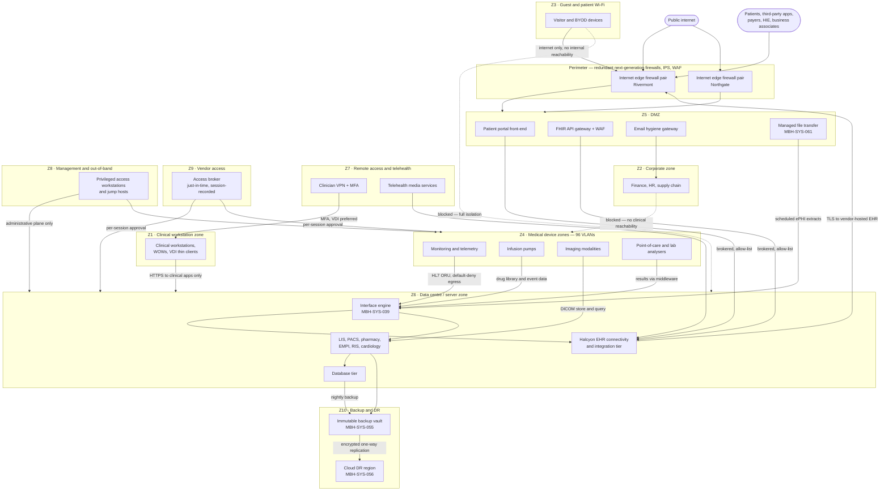

# 02.05 — Network Architecture &amp; Segmentation

| Field | Value |
|---|---|
| Document ID | MBH-INV-NET-2026-205 |
| Version | 1.0 |
| Date | 2026-07-15 |
| Classification | Confidential — Electronic Protected Health Information (ePHI) // Illustrative Portfolio Sample |
| Owner | Anthony Ruiz, Chief Information Officer |
| Author | Advisory Team (Healthcare GRC / HIPAA) |
| Status | Approved |

## Purpose

This document is MercyBridge Health Network's **network map** for HIPAA purposes: it describes the network zones in which ePHI is created, stored, and transmitted across 4 hospitals and approximately 30 outpatient sites, the trust boundaries between those zones, and the segmentation strategy that limits how far an intruder or a piece of ransomware can travel once inside.

Two drivers make this document mandatory rather than optional. First, the §164.308(a)(1)(ii)(A) risk analysis cannot reason about threat propagation without knowing the topology. Second, the **2025 HIPAA Security Rule NPRM** would expressly require regulated entities to (a) maintain a network map showing the movement of ePHI into, out of, and within their systems, updated at least annually and on material change, and (b) **implement network segmentation** as a required — not addressable — specification. MercyBridge is building to that standard now. Together with 02.03, this document constitutes the network map artefact.

## 1. Physical Footprint

| Site type | Count | Illustrative sites | Network role |
|---|---|---|---|
| Acute-care hospitals | 4 | Rivermont General (520 beds), Northgate Medical Center (280), Lakeshore Community (210), Westfield Regional (190) | Full zone stack; distribution and access layers |
| Primary data centre | 1 | Rivermont General campus | Tier 1 systems, core firewalls, interface engine |
| Secondary data centre | 1 | Northgate Medical Center campus | Warm standby, backup vault, secondary egress |
| Cloud DR region | 1 | Vendor cloud region (see 02.06) | Encrypted replication target |
| Primary care clinics | 12 | Distributed across the tri-county region | SD-WAN spoke; clinical and corporate VLANs only |
| Specialty clinics | 8 | Cardiology, oncology, orthopaedics, women's health | SD-WAN spoke; limited device VLANs |
| Imaging and ambulatory surgery centres | 5 | Imaging modalities and periop devices on site | SD-WAN spoke; imaging device VLANs |
| Urgent care centres | 3 | Extended-hours access points | SD-WAN spoke; minimal device VLANs |
| Behavioural health and home-health hubs | 2 | 42 CFR Part 2 data present | SD-WAN spoke; restricted zone |
| **Total care sites** | **34** | 4 hospitals + ~30 outpatient sites | — |

## 2. Zone Model

| Zone | Name | Contents | ePHI | Trust | Egress policy |
|---|---|---|---|---|---|
| Z1 | Clinical workstation zone | Clinical PCs, workstations-on-wheels, VDI thin clients, clinical printers | Yes — session and print | Medium | Named clinical destinations only |
| Z2 | Corporate zone | Finance, HR, supply chain, administrative endpoints | Incidental only | Medium | General internet via proxy |
| Z3 | Guest and patient Wi-Fi | Patient, family and visitor devices; non-clinical BYOD | No | Untrusted | Internet only; fully isolated from all internal zones |
| Z4 | Medical device zones | 96 device VLANs across 10 device classes (see 02.04) | Yes | Restricted | Default-deny; named interface, PACS and vendor endpoints |
| Z5 | DMZ / internet-facing | Patient portal front-end, FHIR API gateway, reverse proxies, WAF, email hygiene | Yes — in transit | Low | Brokered to application tier only |
| Z6 | Data centre / server zone | EHR interfaces, LIS, PACS, pharmacy, EMPI, databases | Yes — at rest | High | Explicit allow-list between tiers |
| Z7 | Remote access and telehealth | Clinician VPN, telehealth media, remote coding and transcription users | Yes | Medium | MFA-gated; VDI-preferred; split tunnelling prohibited |
| Z8 | Management and out-of-band | Jump hosts, network and hypervisor management, backup fabric | Administrative | Highest | No internet; privileged access workstations only |
| Z9 | Vendor and third-party access | Brokered vendor sessions, Halcyon support, device manufacturer access | Yes — supervised | Restricted | Just-in-time, per-session, recorded |
| Z10 | Backup and disaster recovery | Immutable vault, replication fabric, cloud DR link | Yes — full copies | Highest | One-way replication; no interactive access |

## 3. Enterprise Network Map

## 4. Segmentation Strategy

MercyBridge applies a four-layer segmentation model. Each layer independently narrows blast radius; together they mean that compromise of a single endpoint does not yield reachability to ePHI at rest.

| Layer | Mechanism | Enforcement point | Status |
|---|---|---|---|
| L1 — Macro-segmentation | Zone-to-zone policy between Z1–Z10 | Redundant next-generation firewall pairs at each hospital and data centre | Implemented |
| L2 — Site segmentation | Per-site SD-WAN policy; outpatient sites cannot reach one another laterally | SD-WAN fabric with centralised policy | Implemented across 34 sites |
| L3 — VLAN segmentation | 96 medical-device VLANs plus clinical, corporate and management VLANs | Access-layer switches with ACLs; 802.1X / MAB | Implemented; NAC profiling at 96.9% |
| L4 — Micro-segmentation | East-west policy inside the data centre and between device classes | Host-based and hypervisor-level policy | Partial — Tier 1 systems complete, Tier 2–3 in progress |

### 4.1 Design rules

1. **Default deny between zones.** Any zone-to-zone flow requires a documented business justification, a named owner, and an annual recertification.
2. **Guest and patient Wi-Fi is fully isolated.** Z3 has no route to any internal zone; DHCP, DNS and internet egress are provided from a dedicated edge with client isolation enabled.
3. **Medical devices never initiate general internet traffic.** Z4 egress is an explicit allow-list of interface-engine, PACS and named vendor endpoints.
4. **No direct workstation-to-database path.** Z1 reaches application tiers only; the database tier is reachable solely from application servers in Z6.
5. **Administration happens from Z8.** Privileged access to Z4, Z6, and Z10 is only permitted from privileged access workstations with MFA.
6. **Vendors are brokered.** No standing vendor VPN exists; Z9 sessions are approved per occurrence, time-boxed, and recorded.
7. **Backups are one-way.** Z10 accepts replication but exposes no interactive service to production zones, protecting recoverability from ransomware.
8. **42 CFR Part 2 data is additionally constrained.** Behavioural health systems sit behind a further access-controlled segment with separate authorisation.

## 5. Segmentation Maturity and Gaps

| # | Gap | Zones | Risk | Remediation | Target |
|---|---|---|---|---|---|
| NW-01 | Micro-segmentation (L4) incomplete for Tier 2 and Tier 3 systems | Z6 | Lateral movement within the data centre | Extend host-based policy; 41 of 68 systems complete | Q4 2026 |
| NW-02 | Three outpatient sites remain on legacy flat VLAN design | Z1, Z4 | Device and workstation traffic share a broadcast domain | Access-layer refresh with device VLAN split | Q3 2026 |
| NW-03 | 190 portable devices intermittently unprofiled by NAC | Z4 | Devices may land on an incorrect VLAN | MAB fallback profile plus quarterly reconciliation | Q4 2026 |
| NW-04 | Legacy vendor protocols on 118 telemetry devices cannot use TLS | Z4 | ePHI in transit unencrypted within the segment | Segment isolation plus vendor upgrade roadmap | 2027 capital cycle |
| NW-05 | Split-tunnel exception for two legacy remote coding tools | Z7 | Bypasses inspection | Migrate users to VDI | Q3 2026 |
| NW-06 | Firewall rule base includes 74 rules with no recorded owner | Z1–Z10 | Rule sprawl erodes default-deny | Rule recertification campaign | Q4 2026 |

## 6. Supporting Network Controls

| Control | Implementation | Rule reference |
|---|---|---|
| Encryption in transit | TLS 1.2 minimum, TLS 1.3 preferred; IPsec for site-to-site | §164.312(e)(1); NPRM mandatory encryption |
| Wireless security | WPA3-Enterprise with 802.1X on clinical SSIDs; WPA2/WPA3 open-with-isolation on guest | §164.312(e)(1) |
| Network access control | 802.1X for managed endpoints; MAB with profiling for devices | §164.312(a)(1) |
| Intrusion detection and prevention | Inline IPS at perimeter; passive protocol-aware sensors on Z4 | §164.308(a)(1)(ii)(D) |
| DNS security and egress filtering | Recursive DNS with threat intelligence; proxy for Z1 and Z2 | §164.308(a)(5)(ii)(B) |
| Logging | Firewall, VPN, NAC and IoMT gateway logs to SIEM (MBH-SYS-057) | §164.312(b) |
| Annual penetration testing | Ironwood Security Labs tests perimeter, segmentation and internal lateral movement | NPRM annual testing proposal; Phase 08 |
| Configuration review | Annual firewall rule recertification and architecture review | §164.308(a)(8) evaluation |

## Cross-References

| Reference | Relevance |
|---|---|
| 02.01 — Inventory Methodology | Network zone is a mandatory inventory attribute |
| 02.02 — ePHI System Inventory | Zone placement for each of the 68 systems |
| 02.03 — ePHI Data-Flow Mapping | The flows that cross these zone boundaries |
| 02.04 — Medical Devices &amp; IoMT | The 96 device VLANs and their egress policy |
| 02.06 — Cloud &amp; Hosted Services | Egress to vendor-hosted and cloud services |
| 01.08 — Scope, Assumptions &amp; Constraints | Distributed-footprint constraint C5 |
| Phase 03 — HIPAA Security Risk Analysis | Threat propagation modelling uses this topology |
| Phase 05 — Physical &amp; Technical Safeguards | Transmission security and access control implementation |
| Phase 08 — Independent Assessment | Penetration test validates segmentation effectiveness |

---
[⬅ Previous](02.04-medical-devices-and-iomt.md) · [🏠 Phase README](02.00-README.md) · [Next ➡](02.06-cloud-and-hosted-services.md)
