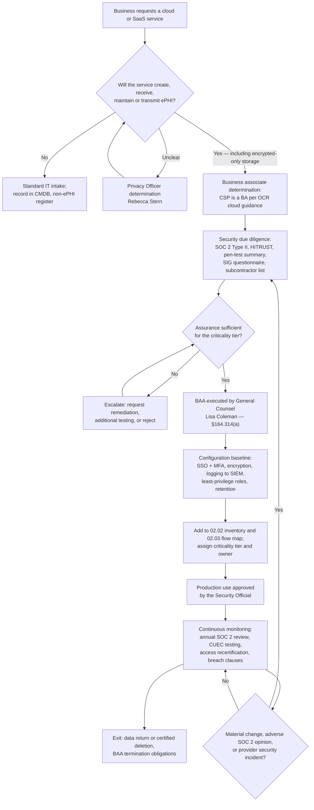

# 02.06 — Cloud &amp; Hosted Services

| Field | Value |
|---|---|
| Document ID | MBH-INV-CLD-2026-206 |
| Version | 1.0 |
| Date | 2026-07-15 |
| Classification | Confidential — Electronic Protected Health Information (ePHI) // Illustrative Portfolio Sample |
| Owner | Anthony Ruiz, Chief Information Officer |
| Author | Advisory Team (Healthcare GRC / HIPAA) |
| Status | Approved |

## Purpose

This document inventories and characterises the cloud and vendor-hosted services that create, receive, maintain, or transmit MercyBridge Health Network ePHI. **38 of the 68 ePHI systems** have a cloud or externally hosted component: 30 are fully vendor-hosted or SaaS, and 8 are hybrid deployments with an on-premises footprint and a cloud tier. Most significantly, the **primary EHR — Halcyon Health EHR — is vendor-hosted**, which means MercyBridge's single most critical ePHI repository sits outside its own data centres.

Outsourcing the infrastructure does not outsource the obligation. A covered entity remains directly liable under §164.308(a)(1)(ii)(A) for a risk analysis covering ePHI held on its behalf, and under §164.314(a) for obtaining satisfactory assurances through a business associate agreement. This document therefore records what MercyBridge controls, what the provider controls, what evidence supports reliance on the provider, and where that reliance is incomplete.

## 1. The OCR Position on Cloud Service Providers

HHS OCR's guidance on HIPAA and cloud computing establishes several points that shape this document:

- A cloud service provider (CSP) that creates, receives, maintains, or transmits ePHI on behalf of a covered entity **is a business associate**, and a BAA is required.
- This holds **even where the CSP only stores encrypted ePHI and does not hold the decryption key** — so-called "no-view services." Lack of access to plaintext reduces risk; it does not remove business associate status.
- The **conduit exception is narrow**. It covers entities that merely transmit ePHI and whose storage of it is transient and incidental (the classic analogy is the postal service or an internet backbone carrier). A CSP that persistently stores ePHI is not a conduit.
- A CSP that maintains ePHI must itself comply with the Security Rule and is **directly liable under HITECH** for its own failures.
- The covered entity must still perform its own risk analysis covering the ePHI in the CSP's environment; it cannot simply inherit the CSP's assessment.
- If a CSP experiences a breach of unsecured ePHI, breach notification obligations flow back to the covered entity under §164.410 and §164.404.

MercyBridge applies a single operating rule from this: **if a service touches ePHI in any form, encrypted or not, a BAA is executed before production use.** No exception has been granted.

## 2. Cloud and Hosted Service Register

| Service model | Systems | Definition | Examples from 02.02 |
|---|---|---|---|
| SaaS — multi-tenant | 26 | Provider operates application, platform and infrastructure | Patient portal, telehealth, secure messaging, email, clearinghouse, coding, ROI, fax |
| Vendor-managed dedicated hosting | 4 | Provider operates a dedicated instance for MercyBridge | Halcyon EHR core, revenue cycle, transcription, oncology planning |
| PaaS | 3 | MercyBridge builds on provider-managed platform services | FHIR API gateway, HIE connector, immunization interface |
| IaaS | 5 | MercyBridge manages guest operating systems and applications | Cloud DR region, cloud backup tier, VNA cloud archive, identity directory cloud tier, imaging burst capacity |
| **Total with a cloud or hosted component** | **38** | 30 fully hosted plus 8 hybrid | — |

| Crown-jewel hosted service | Asset ID | Model | ePHI held | Tier | Assurance |
|---|---|---|---|---|---|
| Halcyon Health EHR (core, CPOE, eMAR, ADT, ambulatory) | MBH-SYS-001 to -005 | Dedicated hosting | 2,100,000 patient records — full clinical record | 1 / 2 | SOC 2 Type II, HITRUST certified |
| Vendor-neutral archive / enterprise imaging | MBH-SYS-011 | IaaS hybrid | 2,410,000 studies | 2 | SOC 2 Type II |
| MyBridge patient portal | MBH-SYS-023 | SaaS | 1,142,000 enrolled patients | 2 | SOC 2 Type II, penetration test summary |
| Revenue cycle / patient accounting | MBH-SYS-030 | Dedicated hosting | 2,100,000 | 2 | SOC 2 Type II |
| Claims clearinghouse gateway | MBH-SYS-031 | SaaS | 4,600,000 claims/yr | 3 | SOC 2 Type II, HITRUST certified |
| Regional HIE connector | MBH-SYS-040 | PaaS hybrid | 1,660,000 | 2 | SOC 2 Type II, state HIE participation agreement |
| Secure clinical messaging | MBH-SYS-052 | SaaS | 640,000 | 2 | SOC 2 Type II, HITRUST certified |
| Enterprise email and calendaring | MBH-SYS-053 | SaaS | Incidental, indeterminate volume | 2 | SOC 2 Type II, ISO 27001 |
| Enterprise backup and immutable vault | MBH-SYS-055 | IaaS hybrid | 2,100,000 (full copies) | 1 | SOC 2 Type II |
| Cloud disaster-recovery replication | MBH-SYS-056 | IaaS hybrid | 2,100,000 (replicated) | 2 | SOC 2 Type II |
| Identity governance, SSO and MFA directory | MBH-SYS-062 | IaaS hybrid | Workforce and patient identity attributes | 1 | SOC 2 Type II, ISO 27001 |
| Enterprise digital fax gateway | MBH-SYS-058 | SaaS | 1,900,000 pages/yr | 3 | SOC 2 Type II; **BAA remediating** |

## 3. Shared-Responsibility Model

| Control domain | SaaS | PaaS | IaaS | Dedicated hosting |
|---|---|---|---|---|
| Physical and environmental security | Provider | Provider | Provider | Provider |
| Host, hypervisor and network infrastructure | Provider | Provider | Provider | Provider |
| Guest operating system patching | Provider | Provider | **MercyBridge** | Provider |
| Application patching and version currency | Provider | Shared | **MercyBridge** | Shared |
| Application security configuration | **MercyBridge** | **MercyBridge** | **MercyBridge** | **MercyBridge** |
| Identity, authentication and MFA enforcement | **MercyBridge** | **MercyBridge** | **MercyBridge** | **MercyBridge** |
| Role design, least privilege and access reviews | **MercyBridge** | **MercyBridge** | **MercyBridge** | **MercyBridge** |
| Encryption at rest (enablement and key policy) | Shared | Shared | **MercyBridge** | Shared |
| Encryption in transit (TLS enforcement) | Provider | Shared | **MercyBridge** | Shared |
| Audit log generation | Provider | Shared | **MercyBridge** | Provider |
| Audit log review and SIEM ingestion | **MercyBridge** | **MercyBridge** | **MercyBridge** | **MercyBridge** |
| Data classification, minimum necessary, retention | **MercyBridge** | **MercyBridge** | **MercyBridge** | **MercyBridge** |
| Backup, recovery testing and RTO/RPO validation | Shared | Shared | **MercyBridge** | Shared |
| Incident detection within the service | Provider | Shared | **MercyBridge** | Provider |
| Breach determination and notification to individuals | **MercyBridge** | **MercyBridge** | **MercyBridge** | **MercyBridge** |
| Subcontractor (BA-of-BA) governance | Provider, with flow-down obligation | Provider | Provider | Provider |

The recurring pattern is that **configuration, identity, and data governance remain MercyBridge's responsibility in every model**. Most publicly reported healthcare cloud incidents arise from customer-side misconfiguration or credential compromise rather than provider infrastructure failure, so Phase 04 and Phase 05 controls are weighted accordingly.

## 4. Cloud Assurance and Onboarding

## 5. Assurance Posture Across the 38 Hosted Services

| Assurance artefact | Services | Notes |
|---|---|---|
| SOC 2 Type II report, current within 12 months | 33 | Reviewed by Information Security; CUECs extracted |
| SOC 2 Type I only | 2 | Type II requested; interim compensating review performed |
| No SOC 2 — alternative assurance (HITRUST or full questionnaire plus evidence) | 3 | All Tier 3 or Tier 4 |
| HITRUST CSF certification | 11 | Reduces MercyBridge's own testing burden |
| ISO/IEC 27001 certification | 8 | Accepted as supplementary, not substitutive |
| Independent penetration test summary provided | 24 | Requested annually for Tier 1 and Tier 2 services |
| Subcontractor / BA-of-BA list disclosed | 29 | Gap tracked; flow-down clauses in all BAAs |
| Documented data-residency commitment (US only) | 36 | 2 services permit offshore support access under BAA controls |
| Customer-managed encryption keys available and in use | 9 | Elsewhere provider-managed keys with contractual controls |
| BAA executed and current | 35 | 3 remediating: MBH-SYS-029, -033, -058 |

### 5.1 Complementary user entity controls (CUECs)

Every SOC 2 report is read for its complementary user entity controls — the things the report *assumes MercyBridge does*. Reliance on a SOC 2 opinion is invalid if those assumptions are untrue. Across the 33 current reports, 147 CUECs were extracted and mapped to MercyBridge controls; 139 were confirmed implemented, 6 were partially implemented and remediated during Phase 04, and 2 were formally accepted as risks by the Security Official.

## 6. Cloud-Specific Risk Themes

| # | Risk theme | Services affected | Control response | Carried to |
|---|---|---|---|---|
| CL-01 | Vendor-hosted EHR concentration — a single provider holds the entire clinical record | MBH-SYS-001 to -005 | BAA, SOC 2 + HITRUST reliance, downtime procedures, contract exit rights | Phase 03 High risk |
| CL-02 | Customer-side misconfiguration exposing ePHI | All 38 | Hardened baselines, configuration monitoring, quarterly review | Phase 05 |
| CL-03 | Credential compromise of a privileged cloud administrator | All 38 | MFA on all administrative access, PAW-only administration, session logging | Phase 04 |
| CL-04 | Incomplete subcontractor visibility (BA-of-BA chain) | 9 services | Flow-down clauses; annual subcontractor attestation | Phase 06 |
| CL-05 | Provider breach triggering MercyBridge notification duties | All 38 | Contractual notification within 5 calendar days; IR plan integration | Phase 07 |
| CL-06 | Log availability and retention shorter than MercyBridge's 6-year documentation requirement | 12 services | Export to SIEM; contractual retention minimums | Phase 05 |
| CL-07 | Data return and certified deletion at contract exit | All 38 | Exit clause in BAA; deletion certificate required | Phase 06 |
| CL-08 | Offshore support access to ePHI | 2 services | Explicit BAA consent, access logging, minimum necessary limits | Phase 06 |
| CL-09 | Availability dependency — cloud outage halts clinical workflow | Tier 1 and Tier 2 hosted services | Downtime procedures, read-only cache, contingency plan testing | Phase 04 §164.308(a)(7) |

## 7. NPRM Readiness for Hosted Services

| NPRM proposed requirement | Position across the 38 hosted services |
|---|---|
| Mandatory asset inventory | Complete — all 38 recorded in 02.02 with hosting model and owner |
| Mandatory network map | Complete — egress paths and boundaries shown in 02.05 |
| Mandatory encryption at rest and in transit | 35 encrypted at rest, 3 partial; all 38 enforce TLS 1.2+ in transit |
| Mandatory MFA | 34 enforce MFA for all administrative and remote access; 4 remediating |
| Annual vulnerability scanning and penetration testing | Provider-performed for SaaS; MercyBridge-performed for IaaS tiers via Ironwood Security Labs |
| Removal of addressable/required distinction | All cloud controls treated as required; no addressable deferrals recorded |
| Written verification of BA technical safeguards | Anticipated by the annual SOC 2 and attestation cycle in §4 |

## Cross-References

| Reference | Relevance |
|---|---|
| 02.01 — Inventory Methodology | Discovery method D4 (vendor and BAA register) |
| 02.02 — ePHI System Inventory | Source of hosting model and BAA status for all 38 services |
| 02.03 — ePHI Data-Flow Mapping | External flows to hosted services and business associates |
| 02.05 — Network Architecture &amp; Segmentation | Egress paths and DMZ boundaries for hosted services |
| 02.07 — Data Classification &amp; Handling | Handling requirements applied to cloud-resident ePHI |
| 01.08 — Scope, Assumptions &amp; Constraints | Assumption A1 and constraint C4 on vendor-hosted reliance |
| Phase 03 — HIPAA Security Risk Analysis | Consumes risk themes CL-01 to CL-09 |
| Phase 06 — Business Associate &amp; Third-Party Risk | Governs all 38 CSP relationships and the BA-of-BA chain |
| Phase 07 — Incident Response &amp; Breach Notification | Provider breach notification pathway |

---
[⬅ Previous](02.05-network-architecture-and-segmentation.md) · [🏠 Phase README](02.00-README.md) · [Next ➡](02.07-data-classification-and-handling.md)
