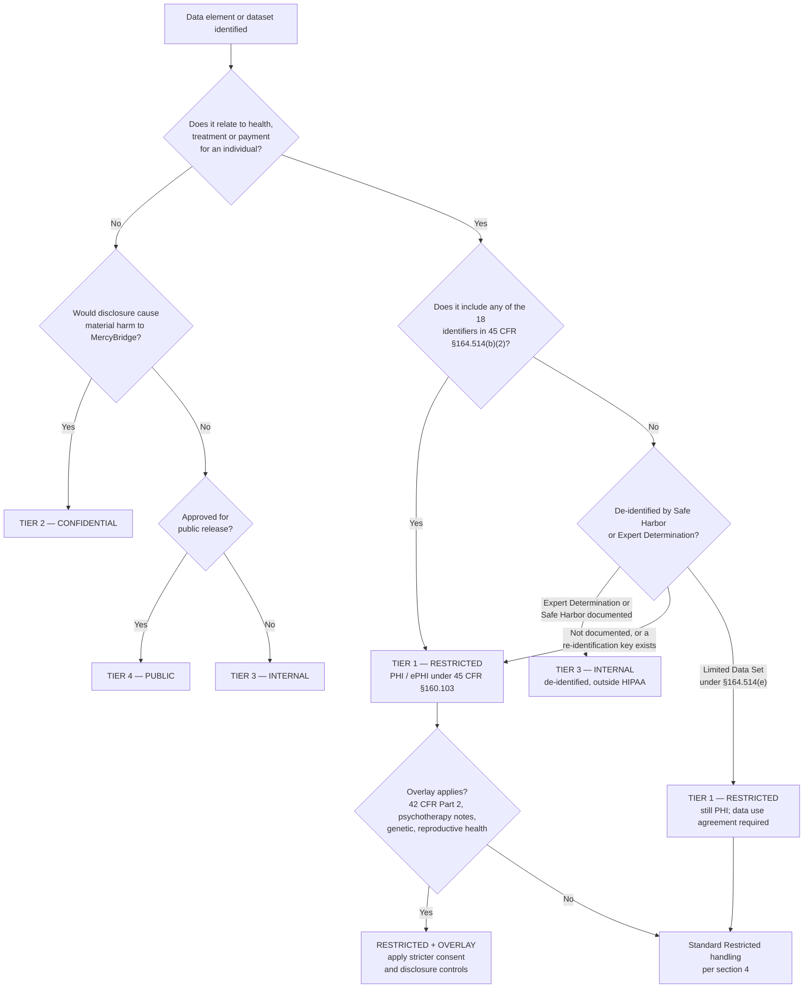

# 02.07 — Data Classification &amp; Handling

| Field | Value |
|---|---|
| Document ID | MBH-INV-CLS-2026-207 |
| Version | 1.0 |
| Date | 2026-07-15 |
| Classification | Confidential — Electronic Protected Health Information (ePHI) // Illustrative Portfolio Sample |
| Owner | Rebecca Stern, Chief Privacy Officer |
| Author | Advisory Team (Healthcare GRC / HIPAA) |
| Status | Approved |

## Purpose

This document establishes MercyBridge Health Network's enterprise data classification scheme and the handling rules that attach to each classification tier. Its function in the programme is simple: the 68 ePHI systems catalogued in 02.02 hold many different kinds of data, and a control set applied uniformly to all of it would be simultaneously too expensive for low-sensitivity data and too weak for the crown jewels. Classification is what makes proportionate safeguards possible.

The scheme is deliberately anchored to law rather than to internal preference. The top tier, **Restricted**, is defined by the statutory definition of protected health information at **45 CFR §160.103** — so anything meeting that definition inherits the full HIPAA Security Rule control set automatically, without a judgement call by a system owner. The lower three tiers are business-defined. Handling rules are written to the **in-force** Security Rule, with the **2025 HIPAA Security Rule NPRM** noted wherever a proposed change would remove discretion MercyBridge currently exercises — most significantly the proposed removal of the "addressable" designation, which would make encryption of ePHI at rest and in transit mandatory rather than addressable.

## 1. Why Classification Precedes Controls

| Problem without classification | Consequence | How the scheme resolves it |
|---|---|---|
| Every dataset treated as maximally sensitive | Unaffordable controls; clinicians work around them | Four tiers with proportionate handling rules |
| Every dataset treated as ordinary business data | ePHI exposed; §164.306(a) failure | Restricted tier is law-defined and non-negotiable |
| Owners decide sensitivity case by case | Inconsistent, indefensible to OCR | Classification is derived from data content, not opinion |
| No basis for choosing encryption, DLP or retention | Controls applied by system, not by data | Handling rules attach to the data wherever it travels |
| De-identified data over-protected, re-identifiable data under-protected | Analytics blocked; re-identification risk missed | Explicit Internal tier plus the §164.514 boundary in 02.08 |

## 2. The Four-Tier Scheme

| Tier | Name | Definition | Regulatory anchor | Approx. share of enterprise data |
|---|---|---|---|---|
| 1 | **Restricted — PHI / ePHI** | Individually identifiable health information created, received, maintained or transmitted by MercyBridge in electronic form, plus any data whose disclosure would cause severe harm to a patient or the Network | 45 CFR §160.103 (PHI / ePHI); §164.306(a) | ~62% |
| 2 | **Confidential** | Non-PHI information whose unauthorised disclosure would cause material harm to MercyBridge, its workforce, or its partners | Contractual, employment and state law | ~21% |
| 3 | **Internal** | Information intended for the workforce but not for public release; disclosure would cause minor or no harm | Internal policy | ~14% |
| 4 | **Public** | Information approved for release to anyone, with no confidentiality expectation | Internal policy; marketing approval | ~3% |

### 2.1 Tier Examples

| Tier | Representative data | Representative systems (02.02 asset IDs) |
|---|---|---|
| Restricted | Clinical notes, diagnoses, lab results, DICOM studies, medication administration records, claims with diagnosis codes, patient portal messages, MRN-linked device waveforms | MBH-SYS-001 to -068 (all 68 ePHI systems) |
| Confidential | Employee HR and payroll records, physician compensation, contracts and BAAs, security assessment reports, penetration test findings, vulnerability data, network diagrams, insurance and legal files | Corporate systems; 02.05 network documentation; this repository |
| Internal | Departmental procedures, staff rosters and schedules, internal newsletters, non-sensitive project plans, training materials, aggregate operational statistics | Intranet, file shares (MBH-SYS-054), collaboration tools |
| Public | Published quality scores, price transparency machine-readable files, marketing content, the Notice of Privacy Practices, job postings, community health needs assessment | Public website; MBH-SYS-028 published outputs |

## 3. Anchoring the Restricted Tier to §160.103

**Protected health information** is individually identifiable health information that (a) relates to an individual's past, present or future physical or mental health, the provision of health care, or payment for it; (b) identifies the individual or provides a reasonable basis to believe it can be used to identify them; and (c) is transmitted or maintained in any form. **ePHI** is the electronic subset — and the Security Rule at 45 CFR Part 164 Subpart C protects only ePHI.

Practical consequence for MercyBridge: **a data element is Restricted if it associates health, treatment or payment information with any of the 18 §164.514(b)(2) identifiers.** No further analysis is required, and system owners have no discretion to classify it lower.

| Group | Identifiers under §164.514(b)(2) |
|---|---|
| Direct identity | Name; Social Security number; medical record number; health plan beneficiary number; account number; certificate or licence number |
| Location | All geographic subdivisions smaller than a state, including street address, city, county, precinct and ZIP code (with the limited three-digit ZIP exception) |
| Dates | All elements of dates (except year) directly related to an individual; all ages over 89 |
| Contact | Telephone number; fax number; email address; URL; IP address |
| Device and vehicle | Device identifiers and serial numbers; vehicle identifiers and serial numbers including licence plates |
| Biometric and image | Biometric identifiers including finger and voice prints; full-face photographs and comparable images |
| Catch-all | Any other unique identifying number, characteristic or code |

### 3.1 Restricted Sub-Categories with Stricter-Than-HIPAA Overlays

| Sub-category | Overlay authority | Additional handling requirement | MercyBridge system |
|---|---|---|---|
| Substance use disorder treatment records | 42 CFR Part 2 | Segmented consent; redisclosure prohibition notice; no disclosure on the ordinary HIPAA treatment permission | MBH-SYS-064 |
| Psychotherapy notes | 45 CFR §164.508(a)(2) | Separate authorisation for nearly all uses; excluded from the designated record set | MBH-SYS-064, Halcyon restricted note type |
| Genetic information | GINA; §164.502(a)(5)(i) | Prohibited for underwriting; access restricted to the ordering care team | MBH-SYS-065 |
| Reproductive health care information | §164.502(a)(5)(iii) attestation requirement | Attestation required before disclosure for certain purposes; flagged in ROI workflow | Halcyon EHR; MBH-SYS-035 |
| Minors' and adolescent confidential services | State minor consent law | Proxy portal access suppressed at the state-defined age threshold | MBH-SYS-023 |
| VIP, employee-patient and celebrity records | §164.308(a)(1)(ii)(D) information system activity review | Break-glass access; proactive daily audit-log review | Halcyon EHR |

## 4. Handling Rules by Tier

| Control domain | Restricted (ePHI / PHI) | Confidential | Internal | Public |
|---|---|---|---|---|
| Encryption at rest | Required — AES-256 full-volume plus database/field encryption where supported. Where technically infeasible (5 device/edge platforms, 02.02 F-01), documented compensating segmentation and CISO acceptance | Required on portable media and endpoints | Recommended | Not required |
| Encryption in transit | Required — TLS 1.2 minimum, TLS 1.3 preferred; MLLP tunnelled over TLS for HL7; SFTP or AS2 for batch; no unencrypted protocols across zone boundaries | Required — TLS 1.2 minimum | Required outside the network | Not required |
| Authentication and access | Unique user ID (§164.312(a)(2)(i)) plus MFA; role-based least privilege; minimum-necessary standard applies to every access | Unique ID plus MFA for remote access | Unique ID | None |
| Authorisation to disclose externally | Permitted only for treatment, payment or operations, or under a valid authorisation; disclosure logged for §164.528 accounting | Contract or NDA required | Manager approval | None |
| Email | Internal enterprise mail only; external mail must be sent through the encryption gateway (forced TLS plus secure-portal fallback); patient-directed unencrypted email allowed only on documented patient request | Encryption gateway for external mail | Standard mail | Unrestricted |
| Other transmission | Secure clinical messaging (MBH-SYS-052), managed file transfer (MBH-SYS-061), digital fax gateway (MBH-SYS-058) — consumer file-sharing, personal email and unmanaged messaging apps are prohibited | Approved corporate channels | Corporate channels | Any |
| Printing | Print only to secure-release or attended clinical printers in restricted areas; collect immediately; never leave unattended; shred in locked consoles after use | Secure-release printing | Standard | Standard |
| Mobile devices | MDM-enrolled devices only; device encryption, passcode, remote wipe; containerised clinical apps; no local ePHI storage outside the container; personal-device photography of patients prohibited except through the approved clinical imaging app | MDM enrolment required | Passcode required | None |
| Removable media | Default prohibited; exception requires CISO approval, hardware-encrypted media, and entry in the media register (§164.310(d)(2)(iii) accountability) | Encrypted media only | Permitted | Permitted |
| Cloud and third-party hosting | Only into the 38 assured hosted services (02.06) with an executed BAA; new services require the cloud onboarding gate; shadow-IT upload blocked by CASB policy | Approved corporate SaaS | Approved corporate SaaS | Any |
| Remote work | Zone Z7 access via MFA plus VDI preferred; no local download; split tunnelling prohibited; private workspace and screen privacy required | VPN plus MFA | VPN | None |
| Copy, extract and download | Bulk export requires data steward approval and is logged; analytics extracts must use a limited data set or de-identified data unless identifiers are justified | Owner approval | Not restricted | Not restricted |
| Logging and monitoring | Full audit trail to SIEM (MBH-SYS-057); proactive review of high-risk access patterns; DLP inspection on egress | Security logging | Standard logging | None |
| Retention and disposal | Per 02.09 schedule; sanitisation to NIST SP 800-88 Purge or Destroy; certificate of destruction retained | Per 02.09 | Per 02.09 | No requirement |
| Incident on loss or exposure | Report within 1 hour; §164.402 four-factor risk-of-compromise assessment mandatory | Report within 24 hours | Report | None |

## 5. Classification Decision Flow

## 6. Labelling, Marking and Discovery

| Mechanism | Applied to | Implementation |
|---|---|---|
| Sensitivity labels | Documents, spreadsheets, email | Enterprise labelling in MBH-SYS-053; label drives encryption and DLP policy |
| System-level classification | All 210 enterprise systems | Classification attribute recorded in the CMDB and in the 02.02 inventory |
| Database and column tagging | Structured ePHI stores | Column-level tags for the 18 identifiers, driving masking in non-production |
| Report and extract headers | Analytics and reporting output | Automatic "Restricted — ePHI" banner on all identified extracts |
| Physical marking | Printed output, removable media, backup tapes | Printed classification footer; media labelled and entered in the media register |
| Automated discovery | Unstructured stores (MBH-SYS-054), email, endpoints | Pattern-based scanning for MRN, SSN and date-of-birth combinations; addresses finding F-02 |

## 7. Enforcement, Exceptions and Assurance

| Element | Position |
|---|---|
| Enforcement | Technical enforcement is preferred over policy statement — DLP, CASB, MDM, secure-release printing and USB blocking implement the table in §4 rather than relying on workforce recall |
| Exception process | Requests routed to the data steward, then the Information Security Manager; Restricted-tier exceptions require CISO approval, a compensating control, an expiry date, and entry in the risk register |
| Standing exceptions | 5 device/edge platforms cannot encrypt at rest (F-01); 3 systems have BAAs under remediation (F-04); each carries a documented compensating control |
| Workforce training | Classification and handling covered in HIPAA onboarding and annual refresher; role-specific modules for HIM, coding and research |
| Assurance | Quarterly DLP and label-coverage metrics to the Security Steering Committee; annual re-validation of every system's classification alongside the inventory refresh |
| Sanctions | Wilful mishandling of Restricted data is addressed under the §164.308(a)(1)(ii)(C) sanction policy |

## 8. 2025 NPRM Impact on These Rules

| Proposed change | Current MercyBridge position | Effect if finalised |
|---|---|---|
| Removal of "addressable" vs "required" | Encryption already treated as required in this scheme | Codifies existing practice; removes the documented-alternative route entirely |
| Mandatory encryption of ePHI at rest and in transit | 51 of 68 systems encrypted at rest; 60 of 68 in transit | The 5 device/edge platforms and 12 partial systems become explicit deficiencies, not accepted risks |
| Mandatory MFA | 44 of 68 systems | 24 systems require remediation; tracked in Phase 04 |
| Mandatory written asset inventory and network map | 02.02 and 02.05 satisfy this | Classification attribute becomes part of the required inventory content |
| Mandatory network segmentation | 10-zone model with 96 device VLANs | Supports Restricted-tier isolation; see 02.05 |

## Cross-References

| Reference | Relevance |
|---|---|
| 02.02 — ePHI System Inventory | The 68 systems to which Restricted-tier handling applies |
| 02.03 — ePHI Data-Flow Mapping | Transmission rules in §4 govern flows DF-01 to DF-35 |
| 02.04 — Medical Devices &amp; IoMT | Device-resident ePHI and the encryption-infeasibility exception |
| 02.05 — Network Architecture &amp; Segmentation | Zone model enforcing Restricted-tier isolation |
| 02.06 — Cloud &amp; Hosted Services | Permitted destinations for Restricted data |
| 02.08 — Designated Record Set &amp; PHI Scope | The PHI / limited data set / de-identified boundary in detail |
| 02.09 — Data Retention &amp; Disposal | Disposal rules referenced by tier |
| 02.10 — Asset Ownership &amp; Accountability | Data stewards who approve exceptions and extracts |
| Phase 03 — HIPAA Security Risk Analysis | Classification drives impact ratings |
| Phase 05 — Physical &amp; Technical Safeguards | Implements encryption, DLP, media and device controls |

---
[⬅ Previous](02.06-cloud-and-hosted-services.md) · [🏠 Phase README](02.00-README.md) · [Next ➡](02.08-designated-record-set-and-phi-scope.md)
