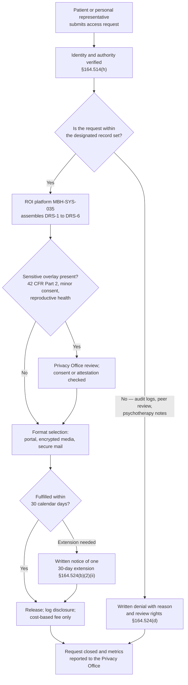

# 02.08 — Designated Record Set &amp; PHI Scope

| Field | Value |
|---|---|
| Document ID | MBH-INV-DRS-2026-208 |
| Version | 1.0 |
| Date | 2026-07-15 |
| Classification | Confidential — Electronic Protected Health Information (ePHI) // Illustrative Portfolio Sample |
| Owner | Rebecca Stern, Chief Privacy Officer |
| Author | Advisory Team (Healthcare GRC / HIPAA) |
| Status | Approved |

## Purpose

This document defines MercyBridge Health Network's **designated record set (DRS)** and draws the boundary between protected health information, limited data sets, and de-identified data.

It exists because a security-driven asset inventory answers a different question from the one the Privacy Rule asks. 02.02 answers *"where does ePHI live, so we can protect it?"* — the answer is 68 systems. This document answers *"what must MercyBridge produce, and allow a patient to inspect and amend, when that patient exercises their rights?"* — a materially narrower set. Conflating the two produces one of two failures: an over-broad DRS that forces the Network to disclose internal quality-improvement and security records it is not obliged to disclose, or an under-broad DRS that denies patients records they are legally entitled to. Right-of-access failures are among the most frequently enforced HIPAA violations, and OCR's Right of Access Initiative has generated a long series of settlements against covered entities of MercyBridge's size.

The DRS is a **Privacy Rule** construct at **45 CFR §164.501**, owned by the Chief Privacy Officer. It is documented here, inside the Security Rule programme, because the security controls, retention schedule and ownership assignments in Phase 02 must be able to identify DRS content wherever it sits across the 4 hospitals and approximately 30 outpatient sites.

## 1. The §164.501 Definition

A **designated record set** is a group of records maintained by or for a covered entity that is:

1. the medical records and billing records about individuals maintained by or for a covered health care provider;
2. the enrolment, payment, claims adjudication, and case or medical management record systems maintained by or for a health plan; or
3. **used, in whole or in part, by or for the covered entity to make decisions about individuals.**

"Record" means any item, collection or grouping of information that includes PHI and is maintained, collected, used or disseminated by or for the covered entity.

The third limb is the operative test at MercyBridge. It is functional, not system-based: the question is not *which application stores it* but *is this information used to make decisions about the individual?* A radiology image used to diagnose a patient is DRS content. The same image copied into a departmental teaching folder is not, because it is no longer used to make decisions about that individual.

## 2. Designated Record Set Versus "Every System With ePHI"

| Dimension | ePHI inventory scope (02.02) | Designated record set (this document) |
|---|---|---|
| Governing rule | Security Rule, 45 CFR Part 164 Subpart C | Privacy Rule, 45 CFR Part 164 Subpart E |
| Question answered | Where must we apply safeguards? | What must we show, copy and amend on request? |
| Owner | Daniel Cho, CISO / HIPAA Security Official | Rebecca Stern, Chief Privacy Officer |
| Test applied | Does the system create, receive, maintain or transmit ePHI? | Is the record used to make decisions about the individual? |
| Population at MercyBridge | 68 systems | 6 record components sourced from 21 systems |
| Includes backups and replicas? | Yes — they hold ePHI and must be protected | No — a backup is a copy of the DRS, not a separate DRS |
| Includes audit logs and SIEM data? | Yes — MBH-SYS-057 is in scope | No — not used to make decisions about the individual |
| Includes psychotherapy notes? | Yes — they are ePHI requiring safeguards | No — expressly excluded from the right of access, §164.524(a)(1)(i) |
| Consequence of getting it wrong | Unprotected ePHI; §164.306(a) failure | Denied or over-broad patient access; §164.524 enforcement |

The relationship is one of overlap, not containment in either direction: nearly all DRS content is ePHI, but most ePHI systems are not DRS sources.

## 3. MercyBridge's Designated Record Set

| # | DRS component | Content | Source systems (02.02) | Records custodian |
|---|---|---|---|---|
| DRS-1 | **Legal medical record** | Encounter documentation, history and physical, progress and consultation notes, operative and anesthesia records, discharge summaries, orders, medication administration, problem list, allergies, vital signs, care plans, advance directives, consents | MBH-SYS-001 to -009, -034, -064 to -067 | Director of Health Information Management |
| DRS-2 | **Diagnostic imaging record** | DICOM studies and the radiologist's interpretive report; cardiology and endoscopy imaging and reports | MBH-SYS-010, -011, -012, -021, -022 | Director of Imaging Services |
| DRS-3 | **Laboratory and pathology record** | Final verified results, microbiology and susceptibility reports, anatomic pathology reports, blood bank type and crossmatch history | MBH-SYS-015, -016, -017, -018 | Laboratory Director |
| DRS-4 | **Medication record** | Dispensing history, medication reconciliation, e-prescribing history | MBH-SYS-019, -020, -042 | Director of Pharmacy |
| DRS-5 | **Billing and payment record** | Itemised statements, claims and remittance data, coded diagnoses and procedures, financial assistance determinations, payment history | MBH-SYS-030, -031, -038 | Revenue Cycle Director |
| DRS-6 | **Patient-generated and portal record** | Portal secure messages that form part of the clinical record, patient-reported outcomes and questionnaires incorporated into care, uploaded documents relied upon clinically | MBH-SYS-023, -025 | Director of Health Information Management |

The **release of information platform (MBH-SYS-035)** is the operational front-end that assembles DRS-1 through DRS-6 into a single fulfilment package. The **enterprise document imaging repository (MBH-SYS-034)** holds scanned legacy and external records that have been incorporated into the record and are therefore DRS content.

## 4. ePHI Systems Excluded From the Designated Record Set

| Excluded content | Systems | Basis for exclusion |
|---|---|---|
| Psychotherapy notes kept separately from the medical record | MBH-SYS-064 (restricted note type) | §164.524(a)(1)(i) — expressly excluded from the right of access |
| Information compiled in reasonable anticipation of litigation | Legal hold repositories | §164.524(a)(1)(ii) |
| Quality assurance, peer review and incident-reporting data | Quality registry (MBH-SYS-068) peer-review extracts | Not used to make decisions about the individual; state peer-review privilege |
| Audit logs, SIEM records, EDR telemetry | MBH-SYS-057, -063 | Security operations data; not decision-making records about the individual |
| Backups, DR replicas and the immutable vault | MBH-SYS-055, -056 | Duplicate copies of DRS content, not separate records |
| Interface engine message queues and transient stores | MBH-SYS-039 | Transport artefacts; the authoritative record is the destination system |
| Enterprise master patient index cross-reference tables | MBH-SYS-044 | Identity resolution metadata |
| Appointment reminder and outreach logs | MBH-SYS-026 | Operational contact records |
| Physiologic device waveform buffers not filed to the chart | MBH-SYS-046, -048, -049 | Only the filed vitals and interpretations enter DRS-1 |
| Clinical engineering service records | MBH-SYS-051 | Device maintenance, not patient decision-making |
| De-identified analytics datasets | MBH-SYS-068 de-identified layer | Not PHI at all — see §6 |

## 5. Why the DRS Matters — Individual Rights

| Right | Citation | MercyBridge operating standard |
|---|---|---|
| Right of access — inspect and obtain a copy | §164.524 | Fulfil within **30 calendar days**, one **30-day extension** with written notice; internal service target 15 days; electronic copy in the form and format requested where readily producible |
| Right to direct a copy to a third party | §164.524(c)(3)(ii) | Written, signed patient direction identifying the recipient; fulfilled through MBH-SYS-035 |
| Fees | §164.524(c)(4) | Reasonable, cost-based only — labour for copying, supplies, postage; no per-page state fee schedule applied to electronic copies, no search or retrieval fee |
| Right to amend | §164.526 | Respond within **60 days**, one **30-day extension**; accepted amendments propagated to all DRS source systems and to identified downstream recipients; denials issued in writing with the right to submit a statement of disagreement |
| Right to an accounting of disclosures | §164.528 | 6-year lookback; disclosures for treatment, payment and operations excluded; sourced from disclosure logs, not from the DRS itself |
| Right to request restrictions | §164.522(a) | Mandatory restriction honoured where the patient pays in full out of pocket; flagged in Halcyon and suppressed from the claim |
| Right to confidential communications | §164.522(b) | Alternative address or contact channel recorded in ADT and honoured by outreach systems |
| Interoperability / information blocking | 45 CFR Part 171 | Electronic access via the patient portal (MBH-SYS-023) and the FHIR patient access API (MBH-SYS-041); no unreasonable delay in release of results |

### 5.1 Access Request Fulfilment

## 6. The PHI / Limited Data Set / De-Identified Boundary

| Category | Definition | Citation | Still PHI? | Permitted use | Required controls |
|---|---|---|---|---|---|
| **Protected health information** | Identifiable health information in any form | §160.103 | Yes | Treatment, payment, operations; otherwise authorisation | Full Security Rule; Restricted tier handling (02.07) |
| **Limited data set** | PHI with 16 categories of direct identifiers removed, but which **may retain dates, city, state and ZIP code** | §164.514(e) | **Yes — still PHI** | Research, public health, health care operations only | **Data use agreement required**; Restricted tier handling; no re-identification attempt |
| **De-identified — Safe Harbor** | All 18 identifiers removed, and no actual knowledge that the remainder could identify an individual | §164.514(b)(2) | No | Any purpose | Internal tier handling; re-identification key, if retained, is itself PHI |
| **De-identified — Expert Determination** | A qualified statistician determines the re-identification risk is very small and documents the methods and results | §164.514(b)(1) | No | Any purpose | Written expert determination retained; re-review on material change |
| **Aggregate / summary statistics** | Counts and rates with suppression of small cells | Derived | No | Public reporting | Public or Internal tier; small-cell suppression at n&lt;11 |

### 6.1 De-Identification Practice at MercyBridge

| Element | Position |
|---|---|
| Default method | Safe Harbor, applied by the analytics team to extracts from MBH-SYS-068 |
| Expert Determination | Used for 3 research datasets where dates of service are analytically essential; determinations by an external statistician, retained by the Privacy Office, re-reviewed every 3 years |
| Limited data sets | 7 active data use agreements, all countersigned by General Counsel; recipients are contractually barred from re-identification and from contacting individuals |
| Re-identification keys | Where a key is retained to permit re-linkage, the key is itself PHI, held only by the Privacy Office, and never released with the dataset |
| Free-text risk | Narrative notes frequently reintroduce identifiers; de-identification of free text requires natural-language scrubbing plus manual sampling before release |
| Common failure mode | Treating a limited data set as de-identified. It is not. It remains PHI and remains in Security Rule scope |
| Assurance | Annual sampling of released datasets by Internal Audit (Anand) against the applicable method |

## 7. Operational Implications for the Security Programme

| Implication | Action |
|---|---|
| DRS content must be locatable across 21 source systems | Each DRS component has a named records custodian in §3 and an entry in the 02.10 ownership register |
| Amendments must propagate | Accepted §164.526 amendments are applied in the source system of record and pushed downstream through the interface engine; recipients of prior disclosures are notified |
| Availability is a legal duty, not only a clinical one | §164.312(c) integrity and §164.308(a)(7) contingency controls protect the ability to *produce* the DRS; a ransomware event that renders the DRS unavailable also creates an access-rights failure |
| Retention drives producibility | The DRS must remain producible for the retention period in 02.09, including from legacy and decommissioned systems |
| Business associates hold DRS content | The ROI platform, transcription vendor and Halcyon all hold DRS content; BAAs must require support of §164.524 and §164.526 requests |
| De-identified data leaves Security Rule scope | 27 clinical-adjacent systems were excluded from the 68 on this basis (02.02 §1); the de-identification method for each is validated annually |

## Cross-References

| Reference | Relevance |
|---|---|
| 02.02 — ePHI System Inventory | The 68-system security scope contrasted with the DRS here |
| 02.03 — ePHI Data-Flow Mapping | Patient-directed flows and amendment propagation paths |
| 02.06 — Cloud &amp; Hosted Services | Hosted systems holding DRS content, including the ROI platform |
| 02.07 — Data Classification &amp; Handling | Restricted tier definition; limited data sets remain Restricted |
| 02.09 — Data Retention &amp; Disposal | How long DRS content must remain producible |
| 02.10 — Asset Ownership &amp; Accountability | Records custodians and data stewards for each DRS component |
| 01.07 — Roles, Responsibilities &amp; RACI | Privacy Officer ownership of Privacy Rule obligations |
| Phase 03 — HIPAA Security Risk Analysis | Availability risk to DRS producibility |
| Phase 06 — Business Associate &amp; Third-Party Risk | BAA terms requiring support of individual rights |
| Phase 07 — Incident Response &amp; Breach Notification | DRS content is the highest-impact breach population |

---
[⬅ Previous](02.07-data-classification-and-handling.md) · [🏠 Phase README](02.00-README.md) · [Next ➡](02.09-data-retention-and-disposal.md)
