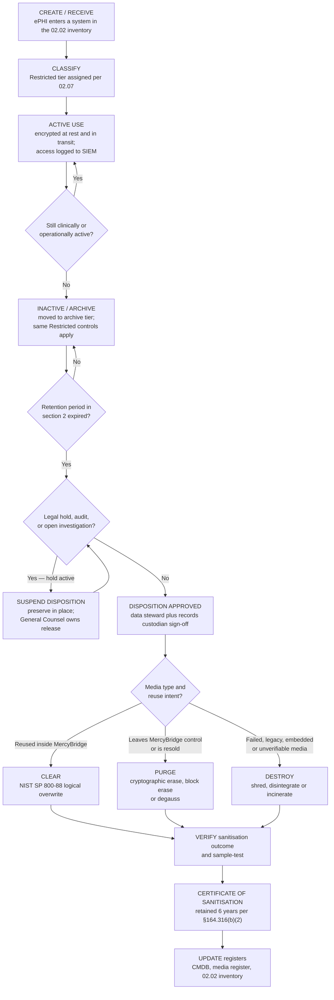

# 02.09 — Data Retention &amp; Disposal

| Field | Value |
|---|---|
| Document ID | MBH-INV-RET-2026-209 |
| Version | 1.0 |
| Date | 2026-07-15 |
| Classification | Confidential — Electronic Protected Health Information (ePHI) // Illustrative Portfolio Sample |
| Owner | Marcus Reed, Information Security Manager |
| Author | Advisory Team (Healthcare GRC / HIPAA) |
| Status | Approved |

## Purpose

This document sets MercyBridge Health Network's retention schedule for ePHI and programme records, and the sanitisation and disposal standards applied when data or media reach end of life. It covers the full lifecycle across the 68 ePHI systems, the 6,120-device medical equipment fleet, and the 38 hosted services.

Two points drive the design. First, **retention is not one obligation but several overlapping ones**, and the most common error in healthcare compliance is to conflate them: HIPAA imposes a **6-year retention requirement on Security Rule documentation** at §164.316(b)(2), and imposes **no retention period whatsoever on medical records** — medical record retention is a matter of **state law** and, for participating providers, **CMS conditions of participation**. Second, **disposal is a HIPAA safeguard in its own right**: §164.310(d)(2)(i) requires policies for the final disposition of ePHI and the hardware or media on which it is stored, and OCR has repeatedly enforced against improper disposal of media and paper. Sanitisation at MercyBridge follows **NIST SP 800-88 Rev. 1**.

## 1. The Two Retention Regimes — Do Not Conflate Them

| Dimension | HIPAA §164.316(b)(2) documentation retention | Medical record retention |
|---|---|---|
| What it covers | Security Rule **policies, procedures, and the written records of actions, activities and assessments** the Rule requires — risk analyses, sanctions, training records, incident documentation, BAAs, workforce authorisations | The clinical record about the patient |
| Retention period | **6 years from the date of creation or the date it was last in effect, whichever is later** | Not set by HIPAA — set by state law and CMS conditions of participation |
| Source of the rule | Federal — HIPAA Security Rule | State health department regulation; CMS 42 CFR §482.24(b)(1) (5 years for hospitals) and §482.24 medical record requirements |
| Who owns it | Daniel Cho, CISO / HIPAA Security Official | Director of Health Information Management, under the Chief Privacy Officer |
| Practical MercyBridge position | Every artefact in this repository is retained 6 years past supersession | Adult records 10 years past last encounter; minors to age of majority plus 10 years — the longer of state law, CMS, and payer contract applies |
| Common failure | Deleting risk analyses or training logs at 3 years because they seem operational | Applying HIPAA's 6-year figure to charts, then destroying records still required by state law |

MercyBridge applies the **longest applicable period** wherever obligations overlap, and never destroys a record earlier than the longest of: state law, CMS, payer or grant contract, statute of limitations, and an active legal hold.

## 2. Retention Schedule

| # | Record type | Retention period | Primary driver | Systems (02.02) | Disposition |
|---|---|---|---|---|---|
| R-01 | Adult medical record (legal medical record) | 10 years after the last patient encounter | State law; CMS 42 CFR §482.24 | MBH-SYS-001 to -009, -034 | Purge and destroy per §5 |
| R-02 | Minor medical record | Until age of majority plus 10 years | State law | Same as R-01 | Purge and destroy |
| R-03 | Diagnostic images (DICOM) and interpretive reports | Images 7 years; mammography 10 years; reports follow R-01 | State law; MQSA for mammography | MBH-SYS-010, -011, -012 | Purge from PACS and VNA together |
| R-04 | Laboratory and pathology results | Reports per R-01; pathology slides and blocks 10 years | CLIA 42 CFR §493.1105; CAP | MBH-SYS-015, -017, -018 | Purge; physical specimens destroyed |
| R-05 | Blood bank and transfusion records | 10 years | 21 CFR §606.160(d) | MBH-SYS-016 | Purge |
| R-06 | Medication and dispensing records | 7 years | State pharmacy board; DEA 2 years minimum for controlled substances | MBH-SYS-019, -020, -042 | Purge |
| R-07 | Billing, claims and remittance records | 7 years after final resolution | False Claims Act limitation period; payer contracts | MBH-SYS-030, -031, -036, -038 | Purge |
| R-08 | Cost reports and CMS submissions | 7 years | CMS reimbursement rules | Finance systems | Purge |
| R-09 | **Security Rule documentation** — policies, procedures, risk analyses, risk management plans, sanctions, training records, evaluations, BAAs, incident and breach files | **6 years from creation or last effective date, whichever is later** | **HIPAA §164.316(b)(2)** | This repository; GRC platform | Retain then destroy; index preserved |
| R-10 | Privacy Rule documentation — NPP versions, authorisations, restriction requests, accounting of disclosures | 6 years | 45 CFR §164.530(j) | Privacy Office repository; MBH-SYS-035 | Purge |
| R-11 | Breach risk assessments and notification records | 6 years | §164.414(b); §164.530(j) | IR case management | Purge |
| R-12 | Security audit logs and SIEM data | 13 months hot and searchable; 6 years in cold archive for security-relevant events | §164.312(b); §164.316(b)(2) applied to activity-review evidence | MBH-SYS-057 | Automated tiering then expiry |
| R-13 | Application-level ePHI access logs | 6 years | §164.308(a)(1)(ii)(D) information system activity review | Halcyon EHR native logs; SIEM | Purge with the system |
| R-14 | Backups and DR replicas | Operational retention 35 days; monthly full 13 months; annual 7 years for restore assurance | Contingency plan §164.308(a)(7) | MBH-SYS-055, -056 | Cryptographic erase on expiry |
| R-15 | Business associate agreements and due-diligence files | 6 years after the agreement terminates | §164.316(b)(2); §164.314 | Contract repository | Destroy |
| R-16 | Workforce access authorisations, terminations and clearance records | 6 years after separation | §164.308(a)(3), (a)(4) | Identity governance MBH-SYS-062 | Destroy |
| R-17 | Medical device service, configuration and decommissioning records | Device life plus 6 years | §164.310(d)(1); FDA expectations | MBH-SYS-051 | Destroy with certificate |
| R-18 | Research datasets, limited data sets and expert determinations | Per IRB protocol and data use agreement, minimum 6 years | Common Rule; §164.514(e) | MBH-SYS-068 | Return or certified destruction |
| R-19 | Behavioural health / substance use records | Per R-01, with 42 CFR Part 2 disposal controls | 42 CFR Part 2 | MBH-SYS-064 | Purge; Part 2 chain-of-custody |
| R-20 | Litigation and legal hold material | Until the hold is released by General Counsel | Legal preservation duty | Hold repository | Return to normal schedule on release |

## 3. Data Lifecycle

## 4. Legal Holds

| Element | Position |
|---|---|
| Trigger | Reasonable anticipation of litigation, an OCR or state investigation, a subpoena, or an internal investigation |
| Issuer | Lisa Coleman, General Counsel — the only person who may issue or release a hold |
| Effect | Suspends all disposition for the identified custodians, systems and date ranges; overrides every schedule in §2 |
| Implementation | Litigation-hold flags in Halcyon and the HIM repository; retention-lock on the relevant backup sets; suspension of automated purge jobs; written custodian notices with acknowledgement |
| Scope discipline | Holds are scoped by custodian and date range, not applied enterprise-wide, so that ordinary disposition continues elsewhere |
| Release | Written release by General Counsel; records return to the normal schedule and are dispositioned at the next cycle |
| Assurance | Quarterly reconciliation of active holds against suspended purge jobs; reported to the Compliance Committee |
| Current state | 4 active holds at 2026-07-15, all scoped and acknowledged |

## 5. Media Sanitisation — NIST SP 800-88 Rev. 1

| Category | Definition | When MercyBridge uses it |
|---|---|---|
| **Clear** | Logical techniques that overwrite user-addressable storage, resisting keyboard-level recovery | Device is reused inside MercyBridge and remains under the same or higher trust level |
| **Purge** | Techniques that render recovery infeasible using state-of-the-art laboratory methods — cryptographic erase, ATA/NVMe sanitise, block erase, degaussing | Media leaves MercyBridge control, is returned to a lessor, or is resold |
| **Destroy** | Physical destruction — shred, disintegrate, pulverise, incinerate | Media has failed, cannot be verified, is embedded, or holds Restricted data at highest sensitivity |

| Media type | Method | Verification | Performed by |
|---|---|---|---|
| Self-encrypting drives (SED) and encrypted SSDs | Purge — cryptographic erase of the media encryption key, followed by sanitise command | Command completion plus sample read-back | IT Operations |
| Non-encrypted SSD / NVMe | Purge — vendor sanitise; Destroy if the command is unsupported or fails | Verified log; destruction certificate | IT Operations / vendor |
| Magnetic hard disk drives | Purge — overwrite plus ATA secure erase; degauss if unreadable | Sample verification of 20% of the batch | IT Operations |
| Backup tape and removable magnetic media | Purge by degaussing, then Destroy | Batch certificate | Vendor under BAA |
| USB and portable media (exception-approved only) | Destroy — shred | Certificate; entry closed in the media register | Information Security |
| Workstations, laptops, thin clients | Purge the drive; Destroy if the drive has failed | Asset record updated in CMDB | IT Operations |
| Mobile devices and tablets | Remote wipe plus factory reset; Destroy if enrolment is broken | MDM confirmation record | IT Operations |
| Multifunction printers, copiers and fax devices | Purge or remove and Destroy the internal drive **before** the lease returns | Drive serial recorded on the certificate | IT Operations / Facilities |
| Medical devices with onboard storage | Vendor-approved sanitisation procedure; Destroy the storage module where no procedure exists | Joint Clinical Engineering and Security sign-off | Clinical Engineering |
| Imaging modalities (CT, MR, XR, ultrasound) | Vendor service procedure to erase local DICOM cache and worklist, then verify no residual studies | Verified empty study list; certificate | Clinical Engineering plus vendor |
| Cloud and hosted storage | Cryptographic erase by the provider plus contractual certified deletion | Written deletion certificate from the BA | Vendor management |
| Paper and printed output | Cross-cut shredding in locked consoles; bonded destruction vendor | Monthly destruction certificates | Facilities under BAA |

Sanitisation performed by third parties is performed **under an executed BAA**, since the vendor handles ePHI. Certificates of sanitisation are retained for 6 years as Security Rule documentation.

## 6. Device and System Decommissioning

| Step | Requirement | Evidence |
|---|---|---|
| 1. Retirement request | Raised by the business owner or Clinical Engineering; recorded in the change system | Change record |
| 2. Data disposition decision | Determine whether data must be migrated, archived for retention, or destroyed; DRS content (02.08) must remain producible | Disposition approval by the data steward |
| 3. Legal hold check | Confirm no active hold applies | Signed hold clearance from General Counsel's office |
| 4. Migration or archive | Export to the successor system or to the retention archive; verify record counts | Reconciliation report |
| 5. Access revocation | Remove all accounts, service accounts, interfaces and firewall rules | Identity governance record (MBH-SYS-062) |
| 6. Sanitisation | Apply the method from §5 to every storage component, including embedded drives, caches and removable media | Certificate of sanitisation |
| 7. Physical disposal | Secure transport, chain of custody, bonded vendor under BAA | Chain-of-custody manifest |
| 8. Register updates | Remove from CMDB, CMMS, VLAN assignments, monitoring, and the 02.02 inventory | Updated inventory record |
| 9. Closure attestation | Business owner and Information Security Manager attest completion | Signed decommissioning record retained 6 years |

**IoMT-specific caution.** Networked medical devices routinely retain ePHI in places the operator does not expect — infusion pump event logs, monitor trend buffers, ultrasound and portable imaging local study caches, point-of-care analyser result stores, and service-engineer diagnostic dumps. Of the 6,120-device fleet, **3,170 devices hold ePHI**, and **1,300 run vendor-frozen operating systems** that offer no user-accessible erase function. For those devices, the storage module is removed and destroyed rather than sanitised in place, and the vendor's own removal of media during service is governed by the device BAA and a chain-of-custody form.

## 7. Roles and Assurance

| Role | Retention and disposal responsibility |
|---|---|
| Marcus Reed, Information Security Manager | Owns this schedule; approves sanitisation methods; maintains certificates |
| Rebecca Stern, Chief Privacy Officer | Owns medical-record and Privacy Rule retention; approves DRS disposition |
| Lisa Coleman, General Counsel | Issues and releases legal holds; approves destruction of contract records |
| Anthony Ruiz, CIO | Executes sanitisation for enterprise IT assets; owns the media register |
| Clinical Engineering | Executes device sanitisation and decommissioning with vendor procedures |
| Director of HIM | Records custodian for DRS-1 and DRS-6; runs the annual disposition cycle |
| Priya Anand, Director of Internal Audit | Annual sample testing of destruction certificates against the disposal register |
| Daniel Cho, CISO | Accountable for §164.310(d) device and media controls overall |

| Assurance activity | Frequency | Evidence |
|---|---|---|
| Disposition cycle — records past retention identified and approved | Annual | Disposition approval log |
| Media register reconciliation | Quarterly | Register versus certificates |
| Legal hold versus purge-job reconciliation | Quarterly | Hold report |
| Sample testing of sanitised media | Per batch, 20% sample | Verification records |
| Certified deletion confirmations from hosted services | On contract exit | Vendor deletion certificate |
| Internal Audit review | Annual | Audit workpapers |

## Cross-References

| Reference | Relevance |
|---|---|
| 02.02 — ePHI System Inventory | Systems to which each retention rule applies |
| 02.04 — Medical Devices &amp; IoMT | Fleet figures and vendor constraints on device sanitisation |
| 02.06 — Cloud &amp; Hosted Services | Contractual certified deletion at exit (theme CL-07) |
| 02.07 — Data Classification &amp; Handling | Disposal rules by classification tier |
| 02.08 — Designated Record Set &amp; PHI Scope | DRS content must remain producible for the retention period |
| 02.10 — Asset Ownership &amp; Accountability | Owners and stewards who approve disposition |
| 01.11 — Compliance Obligations Calendar | Annual disposition cycle and reconciliation cadence |
| Phase 03 — HIPAA Security Risk Analysis | Over-retention as an exposure-surface risk |
| Phase 05 — Physical &amp; Technical Safeguards | §164.310(d)(1) device and media controls implementation |
| Phase 06 — Business Associate &amp; Third-Party Risk | BAAs with destruction vendors and data-return clauses |

---
[⬅ Previous](02.08-designated-record-set-and-phi-scope.md) · [🏠 Phase README](02.00-README.md) · [Next ➡](02.10-asset-ownership-and-accountability.md)
