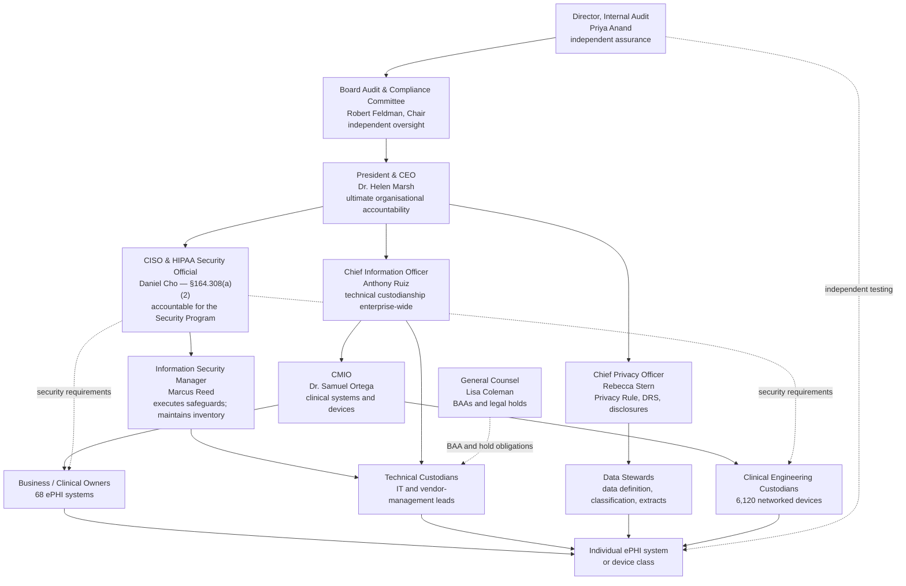

# 02.10 — Asset Ownership &amp; Accountability

| Field | Value |
|---|---|
| Document ID | MBH-INV-OWN-2026-210 |
| Version | 1.0 |
| Date | 2026-07-15 |
| Classification | Confidential — Electronic Protected Health Information (ePHI) // Illustrative Portfolio Sample |
| Owner | Anthony Ruiz, Chief Information Officer |
| Author | Advisory Team (Healthcare GRC / HIPAA) |
| Status | Approved |

## Purpose

An inventory without owners is a list. This document assigns named accountability for each of the **68 ePHI systems** in the 02.02 inventory, defines the role model that makes those assignments meaningful, and traces the accountability chain from an individual system through the HIPAA Security Official to the Board Audit &amp; Compliance Committee.

Ownership is the mechanism that converts the Phase 02 inventory into an operating control. Every downstream activity in the programme depends on it: the §164.308(a)(1)(ii)(A) risk analysis needs someone to validate each system's risk statements; §164.308(a)(4) information access management needs someone to approve access; §164.308(a)(7) contingency planning needs someone to set recovery objectives; §164.308(a)(8) evaluation needs someone to attest that the record is still accurate. HIPAA itself names only one mandatory role — the **Security Official** under §164.308(a)(2) — and that single point of accountability is unworkable across 4 hospitals, approximately 30 outpatient sites, 68 ePHI systems, 6,120 medical devices and approximately 180 business associates unless responsibility is delegated in a structured, documented way. This document is that delegation.

## 1. The Three-Role Model

MercyBridge separates ownership into three roles, plus a fourth specialised role for medical devices. The separation matters: the person who decides *who should have access* is rarely the person who can *configure the access*, and neither is necessarily the person who understands *what the data means*.

| Role | Who holds it | Decides | Does not decide |
|---|---|---|---|
| **Business / Clinical Owner** | The senior operational leader whose function depends on the system | Business purpose, who needs access and why, criticality tier, recovery time and recovery point objectives, acceptance of residual risk within delegated limits | How controls are technically implemented |
| **Technical Custodian** | The IT or vendor-management lead responsible for running the system | Configuration, patching, hardening, backup execution, logging, capacity, technical incident response | Whether a user should have access; business risk acceptance |
| **Data Steward** | The subject-matter leader accountable for the quality and appropriate use of the data | Data definitions, classification, extract and bulk-export approvals, de-identification method, DRS content decisions, retention application | System configuration; infrastructure |
| **Clinical Engineering Custodian** *(medical devices only)* | Biomedical Engineering manager for the device class | Device configuration within FDA-cleared limits, preventive maintenance, vendor liaison, patch validation, decommissioning and sanitisation | Network placement (jointly with IT); clinical use decisions |

### 1.1 Responsibility Matrix by Activity

| Activity | Business / Clinical Owner | Technical Custodian | Data Steward | Clinical Engineering | Security (Reed / Cho) |
|---|---|---|---|---|---|
| Maintain the inventory record for the system | A | R | C | R (devices) | C |
| Assign and review the classification tier | C | I | A/R | I | C |
| Approve user access and periodic recertification | A/R | R | C | I | C |
| Approve bulk extracts and de-identified releases | C | I | A/R | I | C |
| Validate risk statements in the Phase 03 analysis | A | R | C | C | R |
| Accept residual risk within delegated limits | A | I | C | C | C |
| Define RTO / RPO and validate restore tests | A | R | I | C | C |
| Apply patches and security configuration | I | A/R | I | R (devices) | C |
| Own the BAA relationship for a hosted system | C | R | I | C | C (Coleman A) |
| Approve disposition and decommissioning | A | R | R | R (devices) | C |
| Attest annually that the record remains accurate | A/R | R | R | R | A (programme) |

*A = Accountable, R = Responsible, C = Consulted, I = Informed. Consistent with the Phase 01 RACI legend in 01.07 §2.*

## 2. Ownership Assignments — Key Systems

Assignments below cover the Tier 1 and Tier 2 systems and the representative Tier 3–4 systems that carry material risk. All 68 systems have a complete three-role assignment recorded in the inventory tracker; the table is an extract.

| Asset ID | System | Tier | Business / Clinical Owner | Technical Custodian | Data Steward |
|---|---|---|---|---|---|
| MBH-SYS-001 | Halcyon Health EHR — enterprise core | 1 | Dr. Samuel Ortega, CMIO | Director, Clinical Applications | Director, Health Information Management |
| MBH-SYS-002 | Halcyon CPOE &amp; clinical decision support | 1 | Dr. Samuel Ortega, CMIO | Director, Clinical Applications | Chief Medical Officer designate |
| MBH-SYS-003 | Halcyon eMAR | 1 | Chief Nursing Officer | Director, Clinical Applications | Director of Pharmacy |
| MBH-SYS-004 | Halcyon ADT / patient registration | 1 | VP, Patient Access | Director, Clinical Applications | Director, HIM |
| MBH-SYS-005 | Halcyon ambulatory module (~30 sites) | 2 | VP, Ambulatory Operations | Director, Clinical Applications | Director, HIM |
| MBH-SYS-010 | PACS — picture archiving &amp; communication | 1 | Director of Imaging Services | Manager, Imaging IT | Director of Imaging Services |
| MBH-SYS-011 | Vendor-neutral archive / enterprise imaging | 2 | Director of Imaging Services | Manager, Imaging IT | Director of Imaging Services |
| MBH-SYS-015 | LIS — laboratory information system | 1 | Laboratory Director | Manager, Ancillary Systems | Laboratory Director |
| MBH-SYS-016 | Blood bank / transfusion management | 1 | Laboratory Director | Manager, Ancillary Systems | Blood Bank Medical Director |
| MBH-SYS-019 | Pharmacy information system | 1 | Director of Pharmacy | Manager, Ancillary Systems | Director of Pharmacy |
| MBH-SYS-021 | Cardiology information system | 2 | Director, Cardiovascular Services | Manager, Clinical Systems | Director, Cardiovascular Services |
| MBH-SYS-023 | MyBridge patient portal | 2 | VP, Patient Experience | Manager, Digital Health | Rebecca Stern, Chief Privacy Officer |
| MBH-SYS-025 | Telehealth / virtual visit platform | 2 | VP, Ambulatory Operations | Manager, Digital Health | Director, HIM |
| MBH-SYS-029 | Patient experience survey platform | 4 | VP, Patient Experience | Manager, Vendor Systems | VP, Patient Experience |
| MBH-SYS-030 | Revenue cycle / patient accounting | 2 | VP, Revenue Cycle | Manager, Revenue Systems | Revenue Cycle Director |
| MBH-SYS-033 | Medical transcription service | 3 | Director, HIM | Manager, Vendor Systems | Director, HIM |
| MBH-SYS-034 | Enterprise document imaging / HIM repository | 3 | Director, HIM | Manager, Enterprise Content | Director, HIM |
| MBH-SYS-035 | Release of information platform | 4 | Rebecca Stern, Chief Privacy Officer | Manager, Vendor Systems | Director, HIM |
| MBH-SYS-039 | Enterprise interface engine (HL7 / FHIR) | 1 | Anthony Ruiz, CIO | Manager, Integration Services | Director, Data Governance |
| MBH-SYS-040 | Regional HIE connector | 2 | Dr. Samuel Ortega, CMIO | Manager, Integration Services | Rebecca Stern, Chief Privacy Officer |
| MBH-SYS-044 | Enterprise master patient index | 2 | Director, HIM | Manager, Integration Services | Director, Data Governance |
| MBH-SYS-045 | IoMT security &amp; device visibility gateway | 3 | Marcus Reed, Information Security Manager | Manager, Network Security | Clinical Engineering Manager |
| MBH-SYS-046 | Physiologic monitoring central stations | 1 | Chief Nursing Officer | Clinical Engineering Manager | Clinical Engineering Manager |
| MBH-SYS-052 | Secure clinical messaging | 2 | Dr. Samuel Ortega, CMIO | Manager, Collaboration Services | Rebecca Stern, Chief Privacy Officer |
| MBH-SYS-053 | Enterprise email and calendaring | 2 | Anthony Ruiz, CIO | Manager, Collaboration Services | Rebecca Stern, Chief Privacy Officer |
| MBH-SYS-054 | Enterprise file shares / departmental storage | 3 | Anthony Ruiz, CIO | Manager, Storage Services | Director, Data Governance |
| MBH-SYS-055 | Enterprise backup &amp; immutable vault | 1 | Anthony Ruiz, CIO | Manager, Infrastructure | Director, Data Governance |
| MBH-SYS-057 | SIEM / security log repository | 3 | Marcus Reed, Information Security Manager | Manager, Security Operations | Marcus Reed |
| MBH-SYS-058 | Enterprise digital fax gateway | 3 | Director, HIM | Manager, Collaboration Services | Director, HIM |
| MBH-SYS-062 | Identity governance, SSO and MFA directory | 1 | Marcus Reed, Information Security Manager | Manager, Identity Services | Manager, Identity Services |
| MBH-SYS-064 | Behavioural health / substance use records | 2 | Director, Behavioural Health | Manager, Clinical Systems | Rebecca Stern, Chief Privacy Officer |
| MBH-SYS-065 | Oncology / infusion treatment planning | 2 | Director, Oncology Services | Manager, Clinical Systems | Director, Oncology Services |
| MBH-SYS-068 | Clinical quality registry &amp; analytics warehouse | 3 | VP, Quality &amp; Safety | Manager, Data Platform | Director, Data Governance |

## 3. Medical Device Ownership

Devices are the one asset class where the three-role model needs a fourth participant, because no IT custodian may alter an FDA-cleared configuration.

| Device class (02.04) | Units | Business / Clinical Owner | Clinical Engineering Custodian | Technical Custodian (network) | Data Steward |
|---|---|---|---|---|---|
| Infusion pumps | 2,450 | Chief Nursing Officer | Biomedical Manager, Therapeutic Devices | Manager, Network Security | Director of Pharmacy |
| Physiologic monitors and central stations | 1,180 | Chief Nursing Officer | Biomedical Manager, Monitoring | Manager, Network Security | Clinical Engineering Manager |
| Telemetry transmitters and receivers | 640 | Director, Cardiovascular Services | Biomedical Manager, Monitoring | Manager, Network Security | Clinical Engineering Manager |
| Point-of-care testing analysers | 420 | Laboratory Director | Biomedical Manager, Diagnostics | Manager, Network Security | Laboratory Director |
| Surgical, anesthesia and OR devices | 380 | Director, Perioperative Services | Biomedical Manager, Surgical | Manager, Network Security | Director, Perioperative Services |
| Imaging modalities | 310 | Director of Imaging Services | Biomedical Manager, Imaging | Manager, Imaging IT | Director of Imaging Services |
| Ventilators and respiratory devices | 265 | Director, Respiratory Therapy | Biomedical Manager, Respiratory | Manager, Network Security | Director, Respiratory Therapy |
| Ultrasound and portable imaging | 190 | Director of Imaging Services | Biomedical Manager, Imaging | Manager, Imaging IT | Director of Imaging Services |
| Dialysis machines | 85 | Director, Renal Services | Biomedical Manager, Therapeutic Devices | Manager, Network Security | Director, Renal Services |
| Other networked clinical equipment | 200 | Department leadership | Biomedical Manager, General | Manager, Network Security | Clinical Engineering Manager |

Device changes require joint sign-off by the Clinical Engineering Custodian, Information Security, and the clinical owner, with a documented patient-safety impact assessment — the constraint recorded as C3 in 01.08 and governed by the Medical Device Security Committee (02.04 §1).

## 4. The Accountability Chain

Three properties make the chain defensible to a regulator. **Single-point accountability**: exactly one Business Owner is accountable per system, never a committee. **Separation of duties**: the person granting access is not the person configuring it, and Internal Audit reports to the Board rather than to the CISO. **Unbroken escalation**: every system reaches the Board through the Security Official.

## 5. Owner Obligations and Cadence

| Obligation | Cadence | Evidence | HIPAA anchor |
|---|---|---|---|
| Attest that the inventory record is accurate and complete | Annual, plus on material change | Signed attestation in the inventory tracker | 2025 NPRM asset inventory; §164.308(a)(8) |
| Recertify user access | Semi-annual; quarterly for Tier 1 | Recertification report with owner sign-off | §164.308(a)(4) |
| Validate and accept risk statements | With each risk analysis refresh | Phase 03 risk register entries | §164.308(a)(1)(ii)(A) and (B) |
| Confirm RTO / RPO and review restore-test results | Annual | Contingency test report | §164.308(a)(7) |
| Approve bulk extracts and de-identified releases | Per request | Data steward approval record | §164.502(b) minimum necessary; §164.514 |
| Review vendor assurance for hosted systems | Annual | SOC 2 review memo | §164.308(b)(1); §164.314(a) |
| Approve disposition and decommissioning | Per event | Decommissioning record (02.09 §6) | §164.310(d)(1) |
| Report suspected incidents affecting the system | Immediate | Incident ticket | §164.308(a)(6) |

## 6. Coverage, Gaps and Remediation

| Metric | Position at 2026-07-15 | Target |
|---|---|---|
| ePHI systems with a named Business / Clinical Owner | 68 of 68 (100%) | 100% |
| ePHI systems with a named Technical Custodian | 68 of 68 (100%) | 100% |
| ePHI systems with a named Data Steward | 63 of 68 (92.6%) | 100% by 2026-09 |
| Device classes with a Clinical Engineering Custodian | 10 of 10 (100%) | 100% |
| Owner attestations completed for the 2026 cycle | 68 of 68 (100%) | 100% annually |
| Systems where the owner is a vacant or interim post | 4 | 0 |
| Business associates mapped to an internal relationship owner | 172 of ~180 (95.6%) | 100% by Phase 06 close |

| # | Gap | Impact | Remediation | Owner |
|---|---|---|---|---|
| OW-01 | 5 systems lack a formally named Data Steward — chiefly infrastructure systems where ePHI is incidental (file shares, email, SIEM, fax, print) | Extract and classification decisions default to IT | Data Governance to appoint stewards by 2026-09 | Ruiz |
| OW-02 | 4 owner posts are interim following reorganisation | Attestation quality risk | Permanent appointment or documented delegation | Ruiz / Ortega |
| OW-03 | Approximately 8 business associates have no named internal relationship owner | Weak vendor oversight | Assignment completed in Phase 06 BA remediation | Coleman / Cho |
| OW-04 | Unstructured ePHI on file shares has no natural business owner | Finding F-02 remains unresolved | Data discovery then owner assignment by share | Ruiz |
| OW-05 | Device ownership is by class, not by individual asset | Individual-device accountability relies on the CMMS | Accepted; CMMS record is the asset-level control | Ortega |

## Cross-References

| Reference | Relevance |
|---|---|
| 01.05 — Security Official Designation &amp; Governance | The §164.308(a)(2) appointment at the head of this chain |
| 01.07 — Roles, Responsibilities &amp; RACI | The programme RACI this document extends to the asset level |
| 02.02 — ePHI System Inventory | The 68 systems assigned here |
| 02.04 — Medical Devices &amp; IoMT | Device governance and the Medical Device Security Committee |
| 02.06 — Cloud &amp; Hosted Services | Vendor-management custodianship for the 38 hosted services |
| 02.07 — Data Classification &amp; Handling | Data stewards own classification and exception approval |
| 02.08 — Designated Record Set &amp; PHI Scope | Records custodians for each DRS component |
| 02.09 — Data Retention &amp; Disposal | Owners approve disposition and decommissioning |
| Phase 03 — HIPAA Security Risk Analysis | Owners validate and accept risk statements |
| Phase 09 — Executive Reporting &amp; Program Maturity | Attestation completion is a Board-reported metric |

---
[⬅ Previous](02.09-data-retention-and-disposal.md) · [🏠 Phase README](02.00-README.md) · [Next ➡](02.11-phase-summary-and-transition.md)
