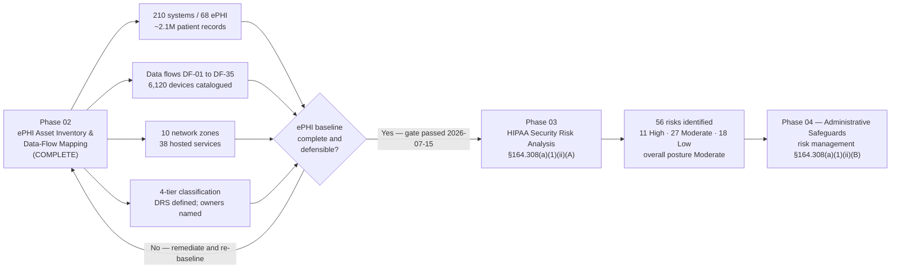

# 02.11 — Phase Summary &amp; Transition

| Field | Value |
|---|---|
| Document ID | MBH-INV-SUM-2026-211 |
| Version | 1.0 |
| Date | 2026-07-15 |
| Classification | Confidential — Electronic Protected Health Information (ePHI) // Illustrative Portfolio Sample |
| Owner | Daniel Cho, CISO &amp; HIPAA Security Official |
| Author | Advisory Team (Healthcare GRC / HIPAA) |
| Status | Approved |

## Purpose

This document closes **Phase 02 — ePHI Asset Inventory &amp; Data-Flow Mapping** of the MercyBridge Health Network HIPAA Security Program. It recaps what the phase produced, confirms that the ePHI baseline is complete and defensible, records the open items carried forward, and formally hands off to **Phase 03 — HIPAA Security Risk Analysis (§164.308(a)(1))**.

The gate this document represents is not administrative. **45 CFR §164.308(a)(1)(ii)(A)** requires a covered entity to conduct an accurate and thorough assessment of the potential risks and vulnerabilities to the confidentiality, integrity, and availability of **all** ePHI it holds. That word — *all* — is what makes Phase 02 a prerequisite rather than a nicety. An organisation that has not first established where its ePHI lives, how it moves, who owns it, and how it is classified cannot produce an assessment that is either accurate or thorough, and OCR's enforcement record is full of covered entities whose risk analyses were found deficient for exactly that reason: they assessed the EHR and called it done. Phase 02 exists so that the Phase 03 analysis has a defensible population.

## 1. Phase 02 Deliverables

| Document | Deliverable | Key output |
|---|---|---|
| 02.00 — Phase README | Phase scope, objectives and exit criteria | Baselined |
| 02.01 — Inventory Methodology | Six discovery methods, criticality tiering, maintenance cadence | Repeatable, auditable method |
| 02.02 — ePHI System Inventory | Catalogue of all enterprise systems | **210 systems; 68 handle ePHI** |
| 02.03 — ePHI Data-Flow Mapping | Internal, external, patient-directed and archive flows | Flows DF-01 to DF-35 mapped; risk observations FL-01 onward |
| 02.04 — Medical Devices &amp; IoMT | Networked clinical device estate | **6,120 devices; 3,170 ePHI-bearing; 1,300 unsupported OS**; risk themes MD-01 to MD-07 |
| 02.05 — Network Architecture &amp; Segmentation | Zone model and segmentation posture | **10 zones; 96 device VLANs**; NPRM network-map requirement satisfied |
| 02.06 — Cloud &amp; Hosted Services | Externally hosted ePHI footprint | **38 of 68 systems hosted**; shared-responsibility model; themes CL-01 to CL-09 |
| 02.07 — Data Classification &amp; Handling | Four-tier scheme anchored to §160.103 | Restricted tier plus per-tier handling rules |
| 02.08 — Designated Record Set &amp; PHI Scope | Privacy Rule DRS and the de-identification boundary | **6 DRS components from 21 systems**; PHI / LDS / de-identified boundary |
| 02.09 — Data Retention &amp; Disposal | Retention schedule and NIST SP 800-88 sanitisation | **20 retention rules**; §164.316(b)(2) 6-year documentation rule isolated from medical-record retention |
| 02.10 — Asset Ownership &amp; Accountability | Three-role ownership model plus Clinical Engineering | **100% owner and custodian coverage; 92.6% steward coverage** |
| 02.11 — Phase Summary &amp; Transition | This document | Gate decision and handoff to Phase 03 |

## 2. Quantified Baseline

| Baseline measure | Value | Source |
|---|---|---|
| Enterprise information systems | 210 | 02.02 |
| Systems that create, receive, maintain or transmit ePHI | 68 (32.4%) | 02.02 |
| Approximate distinct patient records of ePHI | ~2,100,000 | 02.02; FACTS |
| Hospitals and outpatient / clinic sites | 4 hospitals + ~30 sites | 02.05; FACTS |
| Tier 1 critical ePHI systems | 12 | 02.02 |
| Systems with a cloud or vendor-hosted component | 38 | 02.06 |
| Primary EHR hosting model | Halcyon Health EHR — vendor-hosted business associate | FACTS; 02.06 |
| Networked medical devices | 6,120 | 02.04 |
| Medical devices holding ePHI | 3,170 | 02.04 |
| Devices on unsupported or vendor-frozen operating systems | 1,300 | 02.04 |
| Network zones / device VLANs | 10 / 96 | 02.05 |
| Business associates in the estate | ~180 (24 critical or high-risk) | FACTS; Phase 06 |
| Systems with encryption at rest implemented | 51 of 68 | 02.02 |
| Systems with encryption in transit implemented | 60 of 68 | 02.02 |
| Systems with MFA implemented | 44 of 68 | 02.02 |
| Systems logging to the SIEM | 49 of 68 | 02.02 |
| Designated record set components | 6, sourced from 21 systems | 02.08 |
| ePHI systems with a named business owner and custodian | 68 of 68 | 02.10 |

## 3. Baseline Confirmation and Gate Decision

| Exit criterion | Status | Confirmed by |
|---|---|---|
| Every ePHI-bearing system identified, catalogued and tiered | Met — 68 of 210, with documented exclusion rationale for the remaining 142 | Reed |
| ePHI data flows mapped end to end, including external and patient-directed flows | Met — DF-01 to DF-35 | Ruiz |
| Medical device and IoMT estate catalogued and characterised | Met — 6,120 devices; joint governance model in place | Ortega |
| Network architecture and segmentation documented | Met — 10-zone model; network map satisfies the NPRM proposal | Ruiz |
| Cloud and hosted services inventoried with assurance posture | Met — 38 services; shared-responsibility boundaries documented | Ruiz |
| Data classification scheme approved and anchored to §160.103 | Met — four tiers with handling rules | Stern |
| Designated record set defined and distinguished from ePHI scope | Met — 6 components; individual-rights workflow defined | Stern |
| Retention schedule and disposal standard established | Met — 20 rules; NIST SP 800-88 methods; 4 active legal holds | Reed |
| Named ownership assigned for every ePHI system | Met — 100% owners and custodians; 5 steward gaps under remediation | Ruiz |
| Inventory maintenance cadence established | Met — annual re-validation plus material-change triggers | Reed |
| Baseline internally consistent with Phase 01 scope | Met — 68-of-210 boundary reconciles to 01.08 | Cho |

> **Gate decision.** The HIPAA Security Official confirms that the ePHI asset inventory, data-flow map, device catalogue, network map, classification scheme, designated record set and ownership register are complete, internally consistent, and of sufficient quality to serve as the population for the §164.308(a)(1)(ii)(A) risk analysis. Phase 02 exit criteria are met. **Phase 03 is authorised to proceed.**
>
> Baselined 2026-03; re-validated and approved 2026-07-15. Signed: Daniel Cho, CISO &amp; HIPAA Security Official.

## 4. Why This Inventory Is the Required Input to the Risk Analysis

| Authority | What it says | How Phase 02 satisfies it |
|---|---|---|
| 45 CFR §164.308(a)(1)(ii)(A) | Conduct an accurate and thorough assessment of potential risks and vulnerabilities to the confidentiality, integrity and availability of **all** ePHI held by the covered entity | The 68-system inventory, 6,120-device fleet and mapped flows define what "all" means at MercyBridge |
| 45 CFR §164.306(a) | Protect all ePHI the entity creates, receives, maintains or transmits | The inventory uses the statutory verbs as its inclusion test |
| NIST SP 800-66 Rev. 2 | Step 1 of the risk assessment process is to identify the scope, then collect data on where ePHI is created, received, maintained and transmitted | Phases 02.01–02.06 are that data collection, performed under a documented method |
| NIST SP 800-30 Rev. 1 | Risk is assessed against identified assets, threat sources, vulnerabilities and impact | Criticality tiers and classification supply the impact dimension |
| OCR guidance and enforcement | Risk analyses limited to the EHR, or lacking an enterprise-wide asset view, have been repeatedly found deficient | Scope covers all 68 systems, devices, cloud services and unstructured stores, not only Halcyon |
| 2025 Security Rule NPRM | Would require a written technology asset inventory and a network map, reviewed at least annually and on material change | 02.02 and 02.05 already meet the proposed form; the maintenance cadence in 02.01 meets the proposed frequency |
| HITRUST i1 | Requires asset management and data-flow evidence | Phase 02 artefacts are the evidence set presented to Beacon Assurance |

Without Phase 02 the Phase 03 analysis would have no defensible denominator. With it, every risk statement in Phase 03 can be traced to a named system, a named owner, a classification tier and a mapped flow.

## 5. Open Items Carried Forward

| # | Item | Origin | Carried to | Owner |
|---|---|---|---|---|
| C-01 | Five device/edge platforms cannot encrypt ePHI at rest | 02.02 F-01; 02.04 MD-02 | Phase 03 risk analysis; compensating segmentation | Reed / Ortega |
| C-02 | Unstructured ePHI on departmental file shares is unquantified | 02.02 F-02 | Phase 03; data-discovery scanning | Ruiz |
| C-03 | Seven systems permit local credentials without MFA; 24 systems short of full MFA | 02.02 F-03 | Phase 04 access management | Reed |
| C-04 | Three BAAs under remediation (MBH-SYS-029, -033, -058) | 02.02 F-04 | Phase 06 BA remediation | Coleman |
| C-05 | 42 CFR Part 2 overlay on behavioural health records | 02.02 F-05; 02.07 §3.1 | Phase 04 policy suite | Stern |
| C-06 | Incidental ePHI in email and SIEM logs is real but unquantified | 02.02 F-06 | Phase 03; DLP in Phase 05 | Ruiz |
| C-07 | 1,300 devices on unsupported operating systems | 02.04 MD-01 | Phase 03 High risk; capital replacement plan | Ortega |
| C-08 | MDS2 coverage at 70% against a 95% target | 02.04 MD-04 | Phase 06 procurement terms | Ortega / Coleman |
| C-09 | Device-to-interface flows using non-TLS vendor protocols | 02.03 FL-01 | Phase 03; segmentation compensating control | Ruiz |
| C-10 | Cloud misconfiguration and provider-breach exposure across 38 services | 02.06 CL-02, CL-05 | Phases 05 and 07 | Ruiz / Cho |
| C-11 | Five ePHI systems lack a named Data Steward | 02.10 OW-01 | Data Governance, close by 2026-09 | Ruiz |
| C-12 | Approximately 8 business associates lack a named internal relationship owner | 02.10 OW-03 | Phase 06 | Coleman |

## 6. Transition to Phase 03

## 7. What Phase 03 Will Do With This Baseline

| Phase 02 output | Phase 03 use |
|---|---|
| 68 ePHI systems with criticality tiers | The risk-analysis population and the impact scale |
| Data flows DF-01 to DF-35 | Threat modelling of ePHI in transit and at interface boundaries |
| Device themes MD-01 to MD-07 | Pre-formed risk statements for the device estate |
| Cloud themes CL-01 to CL-09 | Third-party and shared-responsibility risk statements |
| Flow observation FL-01 and the zone model | Likelihood adjustment where segmentation compensates |
| Four-tier classification | Impact ratings driven by data sensitivity, not system size |
| Designated record set definition | Availability and integrity impact where individual rights depend on producibility |
| Retention schedule | Over-retention treated as avoidable exposure surface |
| Named owners and stewards | Owner validation and formal risk acceptance under §164.308(a)(1)(ii)(B) |

Phase 03 applies the NIST SP 800-30 methodology to this population and produces **56 risks to ePHI — 11 High, 27 Moderate and 18 Low — with an overall risk posture of Moderate**, which becomes the input to the risk management plan and the safeguard work in Phases 04 and 05.

## 8. Approvals

| Role | Name | Approval |
|---|---|---|
| CISO &amp; HIPAA Security Official | Daniel Cho | Approved — phase gate passed |
| Chief Information Officer | Anthony Ruiz | Approved — inventory, flows, network and cloud |
| Chief Privacy Officer | Rebecca Stern | Approved — classification and designated record set |
| Chief Medical Information Officer | Dr. Samuel Ortega | Approved — medical device and IoMT estate |
| Information Security Manager | Marcus Reed | Approved — methodology, retention and disposal |
| VP, Enterprise Risk | Michelle Tran | Noted — baseline accepted into the enterprise risk register |
| Director, Internal Audit | Priya Anand | Noted — artefacts available for independent testing |

## Cross-References

| Reference | Relevance |
|---|---|
| 02.01 — Inventory Methodology | The method behind the baseline being confirmed here |
| 02.02 — ePHI System Inventory | The 68-of-210 population handed to Phase 03 |
| 02.03 — ePHI Data-Flow Mapping | Flows carried into threat modelling |
| 02.04 — Medical Devices &amp; IoMT | Device risk themes MD-01 to MD-07 |
| 02.05 — Network Architecture &amp; Segmentation | Zone model informing likelihood ratings |
| 02.06 — Cloud &amp; Hosted Services | Cloud risk themes CL-01 to CL-09 |
| 02.07 — Data Classification &amp; Handling | Impact scale for the risk analysis |
| 02.08 — Designated Record Set &amp; PHI Scope | Producibility and individual-rights impact |
| 02.09 — Data Retention &amp; Disposal | Over-retention exposure surface |
| 02.10 — Asset Ownership &amp; Accountability | Owners who validate and accept risk |
| 01.13 — Phase 01 Summary &amp; Transition | The gate that authorised this phase |
| Phase 03 — HIPAA Security Risk Analysis | The receiving phase |

---
[⬅ Previous](02.10-asset-ownership-and-accountability.md) · [🏠 Phase README](02.00-README.md) · [Next ➡](../03-hipaa-security-risk-analysis/03.00-README.md)
