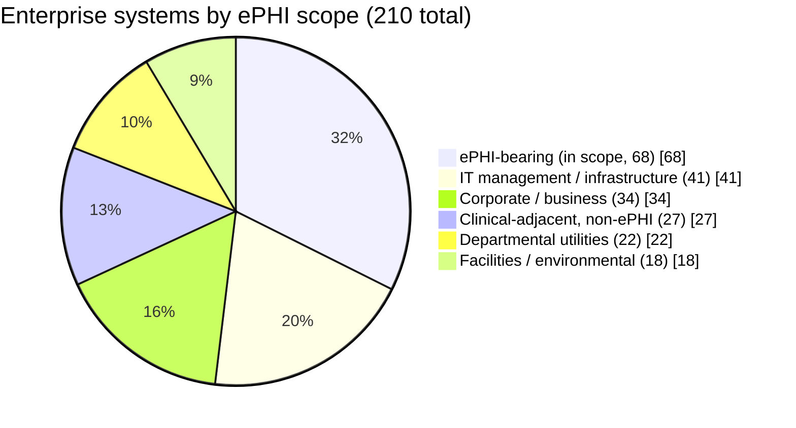

# Diagram — ePHI Scope Determination

| Field | Value |
|---|---|
| Version | 1.0 |
| Date | 2026-07-15 |
| Classification | Confidential — Electronic Protected Health Information (ePHI) // Illustrative Portfolio Sample |
| Organization | MercyBridge Health Network (HIPAA covered entity) |
| Regulator | HHS Office for Civil Rights (OCR) |
| Phase | 02 — ePHI Asset Inventory & Data Flows |
| Author | Advisory Team (Healthcare GRC / HIPAA) |
| Status | Approved |

## Cross-References
`02.02-ephi-system-inventory.md`.
