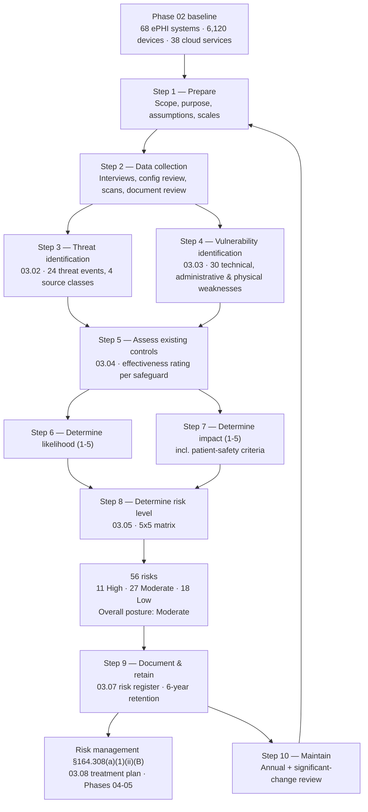

# 03.01 — Risk Analysis Methodology

| Field | Value |
|---|---|
| Document ID | MBH-RA-MTH-2026-301 |
| Version | 1.0 |
| Date | 2026-07-15 |
| Classification | Confidential — Electronic Protected Health Information (ePHI) // Illustrative Portfolio Sample |
| Owner | Daniel Cho, Chief Information Security Officer &amp; HIPAA Security Official |
| Author | Advisory Team (Healthcare GRC / HIPAA) |
| Status | Approved |

## Purpose

This document defines the methodology MercyBridge Health Network used to conduct the risk analysis required by **45 CFR §164.308(a)(1)(ii)(A)** — the foundational, non-negotiable obligation of the HIPAA Security Rule. It states the regulatory text, explains why this single implementation specification is the most frequently cited failure in HHS Office for Civil Rights (OCR) enforcement, sets out the nine elements OCR expects a compliant risk analysis to contain, and describes how MercyBridge satisfied each of them using **NIST SP 800-66 Rev. 2** and **NIST SP 800-30 Rev. 1** as the methodology spine.

Everything else in this phase — the threat catalogue (03.02), the vulnerability catalogue (03.03), the controls assessment (03.04), the risk determination (03.05), the ransomware threat profile (03.06) and the risk register (03.07) — is an execution of the method described here. Phases 04 and 05 exist only because this analysis says what has to be fixed.

## 1. The Regulatory Requirement

§164.308(a)(1) establishes the **Security Management Process** standard. Its first implementation specification is **Risk Analysis**, and it is *required*, not addressable:

> **§164.308(a)(1)(ii)(A) — Risk analysis (Required).** "Conduct an accurate and thorough assessment of the potential risks and vulnerabilities to the confidentiality, integrity, and availability of electronic protected health information held by the covered entity or business associate."

Four words in that sentence carry the compliance weight:

| Word | What OCR reads into it | How MercyBridge satisfies it |
|---|---|---|
| **Accurate** | The analysis must reflect the estate as it actually is, not an idealised or partial view | Built on the Phase 02 baseline: 210 systems discovered, **68 in ePHI scope**, 6,120 medical devices, 38 hosted services, ~180 business associates |
| **Thorough** | Enterprise-wide — every location, every system, every medium, including devices and paper-to-electronic boundaries | 4 hospitals, ~30 outpatient sites, all 68 ePHI systems, the full IoMT fleet and all cloud/BA channels |
| **Potential risks and vulnerabilities** | Forward-looking; not limited to incidents already suffered | 24 threat events (03.02) × 30 vulnerabilities (03.03) reduced to 56 discrete risk statements |
| **Confidentiality, integrity, and availability** | All three, not confidentiality alone | Impact scoring includes care disruption and data-integrity criteria, not only privacy harm |

Two related requirements are deliberately **not** conflated with it:

- **§164.308(a)(1)(ii)(B) — Risk Management (Required):** "Implement security measures sufficient to reduce risks and vulnerabilities to a reasonable and appropriate level." This is the *response* step. It is a distinct requirement with a distinct evidence trail, delivered in **03.08 (risk treatment)** and Phases 04–05. An organisation can perform an excellent risk analysis and still fail (a)(1)(ii)(B) by doing nothing about the results — and vice versa.
- **§164.308(a)(8) — Evaluation:** periodic technical and non-technical evaluation of the whole security posture, delivered in Phase 08.

## 2. Why This Is the Most-Cited Failure in OCR Enforcement

The risk analysis is the **single most frequently cited deficiency in OCR HIPAA Security Rule enforcement actions and corrective action plans**. It appears in resolution agreements far more often than encryption, access control or audit-log findings, and OCR's Risk Analysis Initiative has made it an explicit enforcement priority.

The reason is structural: a defensible risk analysis is a *precondition* for every other risk-based judgement the Security Rule permits. If an entity cannot show one, it cannot justify why any safeguard was implemented, deferred, or judged "reasonable and appropriate" under §164.306(b). The analysis is therefore both the first thing OCR requests and the fastest way to fail an investigation.

| Recurring OCR criticism | What it looks like in practice | MercyBridge counter-measure |
|---|---|---|
| No risk analysis at all | Entity produces a vendor security questionnaire or a checklist instead | A documented, nine-element analysis with a dated register of 56 risks |
| Not enterprise-wide | Only the EHR assessed; devices, clinics, cloud and BAs excluded | Scope explicitly covers all 68 ePHI systems, 6,120 devices, 38 cloud services, ~180 BAs |
| Gap assessment substituted for risk analysis | Control-by-control compliance checklist with no threat, likelihood or impact reasoning | Controls assessment (03.04) is an *input* to risk, not a substitute for it |
| No asset inventory underneath it | Cannot show where ePHI resides | Phase 02 inventory and data-flow maps are the stated evidentiary base |
| Never updated | A single analysis performed years earlier | Annual cadence plus defined significant-change triggers (§10) |
| Analysis performed but not acted on | No corrective action, no register, no owners | Every risk has an owner, treatment decision and target date in 03.07 / 03.08 |
| Not documented to a retainable standard | Findings live in a consultant's slide deck | Retained under §164.316(b)(2)(i) for six years from creation or last effective date |

## 3. The Nine Elements OCR Expects

OCR's *Guidance on Risk Analysis Requirements under the HIPAA Security Rule* sets out nine elements. MercyBridge structured the entire phase around them so that each element maps to a named deliverable.

| # | Element | What it requires | MercyBridge deliverable |
|---|---|---|---|
| 1 | **Scope of the analysis** | All ePHI created, received, maintained or transmitted, in all forms and locations | 03.01 §5; Phase 02 inventory (68 of 210 systems) |
| 2 | **Data collection** | Document where ePHI is stored, received, maintained and transmitted | 02.02 inventory, 02.03 data flows, 02.04 device register, 02.06 cloud register |
| 3 | **Identify and document potential threats and vulnerabilities** | Reasonably anticipated threats; technical and non-technical vulnerabilities | 03.02 (24 threat events), 03.03 (30 vulnerabilities) |
| 4 | **Assess current security measures** | Evaluate safeguards **already in place** and whether they are configured and used correctly | 03.04 controls assessment |
| 5 | **Determine the likelihood of threat occurrence** | Probability a threat triggers a vulnerability, given current controls | 03.05 §2 — 5-point likelihood scale |
| 6 | **Determine the potential impact of threat occurrence** | Magnitude of harm to confidentiality, integrity and availability of ePHI | 03.05 §3 — 5-point impact scale with healthcare-specific criteria |
| 7 | **Determine the level of risk** | Combine likelihood and impact; assign a rating | 03.05 §4–5 — 5×5 matrix; **56 risks → 11 High, 27 Moderate, 18 Low** |
| 8 | **Finalize documentation** | Written record, retained and producible | 03.07 risk register; §164.316(b) six-year retention |
| 9 | **Periodic review and updates** | Continuous, on a defined cadence and on significant change | 03.01 §10; 03.09 continuous review |

## 4. Methodology Spine — NIST SP 800-66 Rev. 2 and NIST SP 800-30

The Security Rule does not prescribe a methodology. MercyBridge adopted **NIST SP 800-66 Rev. 2 (February 2024)**, *Implementing the HIPAA Security Rule: A Cybersecurity Resource Guide*, because it is the federal government's own guide to the Rule and because OCR points to it. **NIST SP 800-30 Rev. 1** supplies the underlying risk-assessment mechanics — threat sources, threat events, predisposing conditions, likelihood, impact and risk determination. Decision recorded in **ADR-0002**.

| NIST SP 800-66 r2 risk-assessment activity | NIST SP 800-30 equivalent | This phase |
|---|---|---|
| Prepare for the assessment; define purpose and scope | Step 1 — Prepare | 03.01 §5 |
| Identify realistic threats | Step 2a — Identify threat sources and events | 03.02 |
| Identify potential vulnerabilities and predisposing conditions | Step 2b — Identify vulnerabilities | 03.03 |
| Assess current security measures | Step 2b (control analysis) | 03.04 |
| Determine the likelihood a threat will exploit a vulnerability | Step 2c — Determine likelihood | 03.05 §2 |
| Determine the impact of the threat exploiting the vulnerability | Step 2d — Determine impact | 03.05 §3 |
| Determine the level of risk | Step 2e — Determine risk | 03.05 §4–5 |
| Document the results | Step 3 — Communicate results | 03.07 |
| Maintain the assessment | Step 4 — Maintain | 03.09 |

Supporting references: **NIST SP 800-53 Rev. 5** (control vocabulary for 03.04), **NIST CSF 2.0** (executive crosswalk in Phase 09), **HITRUST CSF** (Phase 08 i1 assessment), **CIS Controls v8.1** (technical baselines).

## 5. Scope of the Analysis

| Scope dimension | In scope | Notes |
|---|---|---|
| Information systems | **68 ePHI systems** of 210 enterprise systems | 12 Tier 1 Critical, 21 Tier 2 High, 24 Tier 3 Moderate, 11 Tier 4 Low |
| Records | **~2.1 million patient records** of ePHI | Enterprise master patient population |
| Medical devices / IoMT | **6,120 networked devices**, of which **3,170 are ePHI-bearing** and **1,300 run unsupported or vendor-frozen operating systems** | Assessed as a class plus by device family |
| Cloud and hosted services | **38 services** touching ePHI | Cloud service providers treated as business associates |
| Business associates | **~180**, of which **24 critical/high-risk** | Third-party channel risk assessed here; managed in Phase 06 |
| Locations | 4 hospitals, ~30 outpatient/clinic sites, 2 data centres, remote/telework | ~6,500 workforce members |
| Media | Servers, endpoints, mobile, removable media, backup media, devices, fax/print boundaries | Paper is Privacy Rule scope; the paper-to-electronic boundary is in scope |
| Explicitly excluded | Systems confirmed to hold no ePHI (142 of 210); paper-only records; de-identified data meeting §164.514 | Exclusions documented and re-tested annually — an unexamined exclusion is an OCR finding waiting to happen |

## 6. The Assessment Workflow

## 7. Scales Used

The full definitions live in 03.05. In summary:

| Scale | Values | Basis |
|---|---|---|
| Likelihood | 1 Rare · 2 Unlikely · 3 Possible · 4 Likely · 5 Almost Certain | Adjusted for controls actually in place and operating (03.04) |
| Impact | 1 Insignificant · 2 Minor · 3 Moderate · 4 Major · 5 Severe | Six healthcare criteria: patient safety, care disruption, privacy harm, regulatory/OCR, financial, reputational |
| Risk level | Low 1–6 · Moderate 8–12 · High 15–25 | Product of likelihood × impact, with a patient-safety escalation rule |

Risk is assessed **residually** — that is, after the controls documented in 03.04 are taken into account. Inherent risk is noted narratively where it explains a control's value but is not scored, because §164.308(a)(1)(ii)(A) asks about risks to ePHI as the entity actually holds it.

## 8. Data Collection and Evidence

| Source | Method | Coverage |
|---|---|---|
| Phase 02 asset inventory and data-flow maps | Document review | 68 systems, 21 flows |
| Clinical Engineering CMMS and IoMT gateway telemetry | Extract and reconcile | 6,120 devices |
| Interviews and control walkthroughs | 41 structured sessions | IT, Security, Clinical Engineering, HIM, Privacy, Legal, Nursing, Revenue Cycle, 6 clinic sites |
| Configuration and entitlement review | Sampling | 24 systems including all 12 Tier 1 |
| Vulnerability scan data | Authenticated and unauthenticated | Server estate, endpoints, passive device profiling |
| Policy and procedure review | Document review | Legacy policy set, pre-dating the 24-policy suite in Phase 04 |
| Business associate assurance artefacts | Document review | SOC 2 Type II, HITRUST certificates, BAAs |
| Incident and helpdesk history | Data analysis | 24-month lookback; informs likelihood |
| Threat intelligence | HHS HC3, H-ISAC, CISA KEV catalogue, sector reporting | Informs healthcare-specific likelihood weighting |

## 9. Roles and Responsibilities

| Role | Name | Responsibility in the risk analysis |
|---|---|---|
| HIPAA Security Official / CISO | Daniel Cho | Accountable owner; approves scope, scales, ratings and the final register |
| VP, Enterprise Risk | Michelle Tran | Owns the scales and the risk-determination method; integrates ePHI risk into the enterprise register |
| Information Security Manager | Marcus Reed | Runs data collection; drafts threat and vulnerability catalogues |
| Chief Information Officer | Anthony Ruiz | Validates technical findings and infrastructure control statements |
| Chief Medical Information Officer | Dr. Samuel Ortega | Validates patient-safety impact ratings and device findings |
| Chief Privacy Officer | Rebecca Stern | Validates privacy-harm impact criteria and breach-exposure reasoning |
| General Counsel | Lisa Coleman | Business associate and regulatory-exposure input |
| Chief Compliance Officer | Karen Boyd | Confirms the analysis meets the nine OCR elements |
| Director, Internal Audit | Priya Anand | Independent review of method and evidence (Phase 08) |
| Advisory Team (Healthcare GRC / HIPAA) | — | Facilitation, drafting, quality assurance |

## 10. Cadence, Triggers and the Distinction from Risk Management

The Security Rule does not state a frequency, but §164.308(a)(1)(ii)(A) is read together with §164.306(e) (security measures must be reviewed and modified as needed) and §164.308(a)(8). MercyBridge therefore commits to:

| Trigger | Action | Owner |
|---|---|---|
| **Annual** — full re-analysis, calendar Q1 | All nine elements re-performed; register rebaselined | Daniel Cho |
| **Quarterly** — register review | Ratings, treatment progress and new risks reviewed at the Security Steering Committee | Michelle Tran |
| New or materially changed ePHI system | Targeted analysis before go-live; register updated | System owner + Marcus Reed |
| Acquisition, new clinic site or new service line | Scope extension and targeted analysis | Daniel Cho |
| Significant infrastructure change (segmentation, identity, hosting) | Re-score affected risks | Anthony Ruiz |
| New business associate handling ePHI, or a BA breach | Third-party risk re-assessment | Lisa Coleman + Phase 06 |
| Security incident or breach | Post-incident re-analysis of the exploited path | Daniel Cho |
| Material threat-landscape shift (e.g. new ransomware TTP against hospitals) | Re-weight likelihood; see 03.06 | Marcus Reed |
| Regulatory change (e.g. finalisation of the 2025 Security Rule NPRM) | Method and scope refresh | Karen Boyd |

**The distinction that OCR tests.** §164.308(a)(1)(ii)(A) asks *"what are the risks?"*; §164.308(a)(1)(ii)(B) asks *"what did you do about them?"*. They are separately citable. MercyBridge keeps separate evidence trails: this phase evidences the analysis, and 03.08 plus Phases 04–05 evidence the management response, each with its own approvals, owners and dates. Where a risk is accepted rather than mitigated, the acceptance is documented, time-bounded and signed by an executive with authority to accept it — an undocumented acceptance is indistinguishable, on audit, from an unaddressed risk.

## 11. Quality Assurance, Assumptions and Limitations

| # | Assumption or limitation | Treatment |
|---|---|---|
| A1 | The Phase 02 inventory is complete and current as of 2026-03 | Re-validated at analysis start; owners attested |
| A2 | Control statements reflect design *and* observed operation where sampled | Controls not sampled are marked "design only" in 03.04 |
| A3 | Business associate control environments are assessed from assurance artefacts, not direct testing | Residual assurance gap recorded as risk R-30 |
| A4 | Medical device internals cannot be scanned without vendor authorisation | Passive profiling and MDS2 review used; recorded as constraint C3 (01.08) |
| A5 | Unstructured ePHI on file shares has no reliable volume estimate | Recorded as risk R-41; data-discovery scanning proposed |
| A6 | Likelihood uses a 24-month internal history plus sector intelligence | Documented per risk in 03.07 |
| L1 | This is a risk analysis, not a penetration test | Independent technical validation performed in Phase 08 by Ironwood Security Labs |
| L2 | Scoring is judgement-based and calibrated, not actuarial | Two-pass calibration; cross-category moderation session held 2026-04-09 |

## 12. Outputs of the Phase

| Output | Location |
|---|---|
| Threat catalogue — 24 threat events across 4 source classes | 03.02 |
| Vulnerability catalogue — 30 technical, administrative and physical weaknesses | 03.03 |
| Existing controls assessment with effectiveness ratings | 03.04 |
| Scales, matrix, thresholds and the risk determination | 03.05 |
| Ransomware and healthcare threat profile | 03.06 |
| **Risk register — 56 risks: 11 High, 27 Moderate, 18 Low; overall posture Moderate** | 03.07 |
| Risk treatment / risk management plan under §164.308(a)(1)(ii)(B) | 03.08 |
| Continuous review procedure | 03.09 |

## Cross-References

| Reference | Relevance |
|---|---|
| 03.02 — Threat Identification | Element 3; the threat half of the analysis |
| 03.03 — Vulnerability Identification | Element 3; the vulnerability half |
| 03.04 — Existing Controls Assessment | Element 4; "security measures already in place" |
| 03.05 — Likelihood, Impact &amp; Risk Determination | Elements 5, 6 and 7; the scales defined here |
| 03.06 — Ransomware &amp; Healthcare Threat Profile | Sector-defining threat driving likelihood weighting |
| 03.07 — Risk Register | Element 8; the documented output |
| 02.02 — ePHI System Inventory | The 68-system population that scopes this analysis |
| 02.04 — Medical Devices &amp; IoMT | The 6,120-device fleet and its constraints |
| 01.04 — HIPAA Security Rule Overview | The standards and implementation specifications |
| ADR-0002 — Methodology (800-66 / HITRUST / NPRM) | Records the choice of methodology spine |
| Phase 04 — Administrative Safeguards | Where §164.308(a)(1)(ii)(B) risk management is executed |
| Phase 08 — HITRUST &amp; Independent Assessment | Independent validation of this analysis |

---
[⬅ Previous](03.00-README.md) · [🏠 Phase README](03.00-README.md) · [Next ➡](03.02-threat-identification.md)
