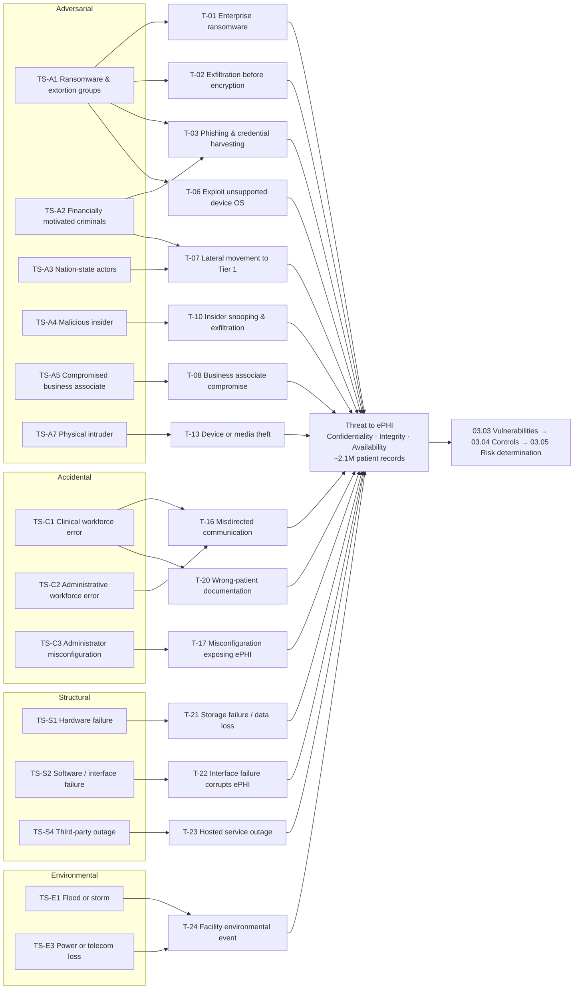

# 03.02 — Threat Identification

| Field | Value |
|---|---|
| Document ID | MBH-RA-THR-2026-302 |
| Version | 1.0 |
| Date | 2026-07-15 |
| Classification | Confidential — Electronic Protected Health Information (ePHI) // Illustrative Portfolio Sample |
| Owner | Daniel Cho, Chief Information Security Officer &amp; HIPAA Security Official |
| Author | Advisory Team (Healthcare GRC / HIPAA) |
| Status | Approved |

## Purpose

This document delivers **element 3 (first half)** of the nine elements OCR expects in a §164.308(a)(1)(ii)(A) risk analysis: the identification and documentation of **reasonably anticipated threats** to the confidentiality, integrity and availability of MercyBridge Health Network's electronic protected health information.

The Security Rule's general requirements at **§164.306(a)(2)** oblige a covered entity to "protect against any reasonably anticipated threats or hazards to the security or integrity of such information," and **§164.306(a)(3)** to protect against reasonably anticipated impermissible uses or disclosures. A threat catalogue is how an entity demonstrates it knows what it is protecting against. OCR routinely finds risk analyses that jump straight from an asset list to a control checklist with no articulated threat model — that shortcut is exactly what makes an analysis neither "accurate" nor "thorough."

Following **NIST SP 800-30 Rev. 1**, threats are decomposed into **threat sources** (who or what) and **threat events** (what they do). This document defines **19 threat sources across 4 source classes** and **24 threat events**, weighted for the healthcare operating environment, and carries them forward to 03.03 (vulnerabilities), 03.05 (risk determination) and 03.06 (the ransomware profile).

## 1. Threat Source Taxonomy

NIST SP 800-30 classifies threat sources as **adversarial**, **accidental**, **structural** and **environmental**. All four are in scope: HIPAA protects availability and integrity, not confidentiality alone, so a failed storage array or a flooded data centre is as much a threat to ePHI as a ransomware crew.

| Class | ID | Threat source | Characterisation | Relevance to MercyBridge |
|---|---|---|---|---|
| Adversarial | TS-A1 | Ransomware / multi-point extortion groups | Organised, well-resourced, affiliate model; deliberately target hospitals for time pressure | **Highest-weighted source.** See 03.06 |
| Adversarial | TS-A2 | Financially motivated cybercriminals and data brokers | Steal and monetise medical identities; medical records carry a durable resale value | High |
| Adversarial | TS-A3 | Nation-state / state-sponsored actors | Espionage, research theft, pre-positioning in critical infrastructure | Moderate — the Network runs a modest research portfolio |
| Adversarial | TS-A4 | Malicious insider (workforce, contractor, affiliated provider) | Authorised access misused; snooping on VIP/neighbour/family records; theft for fraud | High — ~6,500 workforce plus affiliated providers |
| Adversarial | TS-A5 | Compromised business associate or supply-chain actor | Reaches ePHI through a trusted channel already permitted by a BAA | High — ~180 BAs, 38 hosted services |
| Adversarial | TS-A6 | Hacktivist | Defacement, DDoS, doxxing tied to a cause | Low-moderate |
| Adversarial | TS-A7 | Physical intruder / opportunistic thief | Open clinical environments; unattended equipment | Moderate |
| Accidental | TS-C1 | Clinical workforce member | Error under time pressure at the point of care | High — the most frequent real-world cause |
| Accidental | TS-C2 | Administrative / revenue-cycle workforce member | Misdirected correspondence, statements, records releases | High |
| Accidental | TS-C3 | Privileged administrator | Misconfiguration with wide blast radius | Moderate |
| Accidental | TS-C4 | Business associate workforce | Error inside a vendor's environment holding MercyBridge ePHI | Moderate |
| Structural | TS-S1 | Hardware / storage failure | Array, controller, device or endpoint failure | Moderate |
| Structural | TS-S2 | Software, interface or firmware failure | Interface-engine defect, bad patch, corrupted HL7/DICOM stream | Moderate |
| Structural | TS-S3 | Environmental control system failure | HVAC, UPS, generator, fire suppression | Low-moderate |
| Structural | TS-S4 | Third-party service outage | Vendor-hosted EHR, cloud provider, carrier | Moderate — high concentration |
| Environmental | TS-E1 | Natural hazard — flood, severe storm | Riverfront campus exposure at two sites | Moderate |
| Environmental | TS-E2 | Fire | Facility and data-centre exposure | Low |
| Environmental | TS-E3 | Utility failure — power, telecommunications | Regional grid and carrier dependency | Moderate |
| Environmental | TS-E4 | Public-health surge / mass-casualty event | Degrades control discipline; drives emergency access | Moderate |

## 2. Why Healthcare Weights Threats Differently

A hospital's threat model is not a bank's. Three structural features change the weighting, and every likelihood rating in 03.05 reflects them.

| Feature of the healthcare environment | Consequence for the threat model |
|---|---|
| **Care cannot stop.** Downtime has a clinical, not merely commercial, cost | Availability threats are elevated; extortion economics favour the attacker because the victim's tolerance for delay is measured in hours |
| **Open, high-traffic physical environments.** Wards, EDs and clinics are semi-public by design | Physical and opportunistic threats (TS-A7) remain live despite badge control |
| **Clinical urgency competes with security friction.** Clinicians move between shared workstations dozens of times per shift | Shared logins, unattended sessions and break-glass usage raise accidental and insider threat likelihood |
| **The medical device fleet cannot be patched on the entity's timetable.** FDA-cleared configurations, vendor control, patient-safety review | Exploitation of known vulnerabilities (T-06) has a persistent, non-decaying likelihood |
| **ePHI has enduring resale value.** A medical record cannot be reissued like a card number | Exfiltration threats do not decay with time; stolen data stays monetisable |
| **Deep third-party dependency.** Vendor-hosted EHR, ~180 BAs, 38 cloud services | Adversaries increasingly attack the covered entity *through* the business associate |
| **Regulatory asymmetry.** OCR, state AG, CMS conditions of participation, media notice at 500+ individuals | A single event generates parallel legal exposures, raising impact rather than likelihood |

## 3. Threat Event Catalogue

Likelihood band below is the *pre-scoring* judgement carried into 03.05; final scores are set there against controls actually in place (03.04).

### 3.1 Adversarial Threat Events

| ID | Threat event | Source(s) | Primary ePHI property at risk | Likelihood band | Principal targets | Risks raised |
|---|---|---|---|---|---|---|
| T-01 | Ransomware deployed across the enterprise, encrypting clinical systems | TS-A1 | Availability, Integrity | Likely | Tier 1 clinical systems, file shares, backups | R-23, R-10, R-47 |
| T-02 | ePHI exfiltrated prior to encryption for double extortion | TS-A1, TS-A2 | Confidentiality | Likely | EHR, HIM repository, file shares, imaging | R-24, R-41 |
| T-03 | Phishing / credential harvesting against the workforce | TS-A1, TS-A2 | Confidentiality | Almost certain | ~6,500 mailboxes; SSO identities | R-34, R-01 |
| T-04 | Business email compromise; mailbox with incidental ePHI accessed | TS-A2 | Confidentiality | Likely | Revenue cycle, HIM, executive mailboxes | R-34, R-41 |
| T-05 | Exploitation of an internet-facing service (VPN, portal, MFT, remote access) | TS-A1, TS-A2 | Confidentiality, Availability | Possible | Patient portal, VPN, managed file transfer | R-17, R-42 |
| T-06 | Exploitation of a known vulnerability on an unsupported medical device OS | TS-A1, TS-A3 | Availability, Confidentiality | Likely | 1,300 unsupported-OS devices | R-09, R-10 |
| T-07 | Lateral movement and privilege escalation into Tier 1 systems | TS-A1, TS-A2, TS-A3 | All three | Likely | Data-centre zone Z6; identity directory | R-17, R-03, R-23 |
| T-08 | Business associate compromised and used as a route to MercyBridge ePHI | TS-A5 | Confidentiality, Availability | Possible | Halcyon EHR, clearinghouse, transcription, imaging archive | R-28, R-29, R-30 |
| T-09 | Vendor remote-support channel abused | TS-A5, TS-A2 | Confidentiality, Availability | Possible | 742 devices with vendor connectivity | R-06, R-13 |
| T-10 | Insider snooping — browsing records without a treatment, payment or operations purpose | TS-A4 | Confidentiality | Likely | EHR, imaging, ED tracking | R-36, R-02 |
| T-11 | Insider exfiltration of ePHI for sale or downstream identity fraud | TS-A4 | Confidentiality | Possible | EHR reporting, registration, revenue cycle | R-36, R-03 |
| T-12 | Nation-state intrusion for espionage or pre-positioning | TS-A3 | Confidentiality, Availability | Unlikely | Research systems, network infrastructure | R-17, R-25 |
| T-13 | Theft of a laptop, mobile device, portable imaging unit or removable media | TS-A7 | Confidentiality | Possible | Endpoints, portable ultrasound, backup media | R-40, R-11 |
| T-14 | Unauthorised physical entry to a clinical area, IDF or data centre | TS-A7 | Confidentiality, Availability | Possible | Nursing stations, wiring closets, data centres | R-51, R-52 |
| T-15 | Hacktivist defacement or DDoS against patient-facing services | TS-A6 | Availability | Unlikely | Patient portal, public web, telehealth | R-50 |

### 3.2 Accidental, Structural and Environmental Threat Events

| ID | Threat event | Source(s) | Primary ePHI property at risk | Likelihood band | Principal targets | Risks raised |
|---|---|---|---|---|---|---|
| T-16 | Misdirected communication — fax, email, portal message, statement or mailing | TS-C1, TS-C2 | Confidentiality | Almost certain | Fax gateway, email, revenue cycle, HIM release-of-information | R-35 |
| T-17 | Misconfiguration exposing ePHI (cloud storage, share permission, interface route) | TS-C3, TS-C4 | Confidentiality | Possible | 38 hosted services, departmental file shares | R-41, R-19 |
| T-18 | Improper disposal of media, a device or a decommissioned system | TS-C2, TS-C4 | Confidentiality | Possible | Retired endpoints, devices, backup media, printers | R-44, R-11 |
| T-19 | Loss of a mobile device, laptop or portable medium in transit | TS-C1 | Confidentiality | Possible | Clinician laptops, tablets, portable devices | R-40 |
| T-20 | Wrong-patient documentation or erroneous data entry | TS-C1 | Integrity | Likely | EHR, eMAR, LIS, EMPI | R-43, R-05 |
| T-21 | Hardware or storage failure causing loss of, or inaccessibility to, ePHI | TS-S1 | Availability, Integrity | Possible | On-premises arrays, device local storage, backup media | R-47, R-48 |
| T-22 | Software, interface or firmware failure corrupting or halting an ePHI flow | TS-S2 | Integrity, Availability | Possible | Interface engine, HL7/DICOM feeds, EMPI | R-43, R-47 |
| T-23 | Cloud, hosted-EHR or telecommunications outage | TS-S4, TS-E3 | Availability | Possible | Vendor-hosted EHR and 38 cloud services | R-28, R-50 |
| T-24 | Environmental event — flood, fire, extended power loss or HVAC failure | TS-E1, TS-E2, TS-E3, TS-S3 | Availability | Unlikely | Data centres, riverfront campuses, clinic sites | R-53, R-50 |

## 4. Threat Source to Threat Event Model

## 5. Threat Exposure by ePHI Asset Class

| Asset class (Phase 02) | Population | Dominant threat events | Why |
|---|---|---|---|
| Tier 1 clinical systems (EHR, CPOE, eMAR, ADT, PACS, LIS, pharmacy, blood bank) | 12 systems | T-01, T-02, T-07, T-23 | Highest concentration of records; downtime is immediately clinical |
| Tier 2 systems (portal, telehealth, revenue cycle, HIE, messaging, email) | 21 systems | T-03, T-04, T-05, T-16 | Internet-facing and workforce-facing exposure |
| Tier 3–4 systems | 35 systems | T-10, T-17, T-18 | Weaker control coverage; less monitoring |
| Medical devices / IoMT | 6,120 devices (3,170 ePHI-bearing) | T-06, T-09, T-01, T-21 | 1,300 unsupported OS; unpatchable; segmentation is the primary control |
| Cloud and hosted services | 38 services | T-08, T-17, T-23 | Shared responsibility; customer-side misconfiguration |
| Business associates | ~180 (24 critical/high) | T-08, T-09, T-18 | Permitted channel; limited direct visibility |
| Endpoints and mobile | ~9,400 endpoints | T-03, T-13, T-19 | Mobility and shared clinical use |
| Physical facilities | 4 hospitals, ~30 clinics, 2 data centres | T-14, T-13, T-24 | Open clinical environments; regional hazard exposure |

## 6. Threat Intelligence Inputs

Threat identification is not a one-time act of imagination; it is fed continuously. The sources below informed the weighting above and are the standing inputs to the annual refresh required by element 9.

| Source | Type | Use in this analysis |
|---|---|---|
| HHS Health Sector Cybersecurity Coordination Center (HC3) | Sector alerts, threat briefs | Ransomware group targeting patterns against hospitals |
| Health-ISAC | Peer sharing, indicators | Early warning; peer incident patterns |
| CISA Known Exploited Vulnerabilities catalogue | Exploitation evidence | Prioritisation of T-05 and T-06 likelihood |
| FDA medical device safety communications and vendor MDS2 | Device advisories | Device threat weighting (T-06, T-09) |
| Halcyon Health Systems vendor advisories | Product security notices | Hosted-EHR threat surface (T-08, T-23) |
| OCR breach portal and enforcement actions | Regulatory record | Impact calibration and enforcement expectations |
| MercyBridge internal incident and helpdesk history (24 months) | Empirical | Likelihood anchoring for T-03, T-16, T-20 |
| Ironwood Security Labs findings (Phase 08) | Technical validation | Post-analysis confirmation of exploitability assumptions |

## 7. Threats Considered and Scoped Out

| Threat | Rationale for exclusion | Review trigger |
|---|---|---|
| Terrorism / armed intrusion | Managed under the enterprise emergency-management and workplace-violence programmes, not the ePHI security programme | Change in facility threat assessment |
| Earthquake | Negligible seismic exposure in the Rivermont region | Regional hazard reassessment |
| Insider physical sabotage of clinical equipment | Covered by clinical-engineering and safety programmes; no ePHI-specific pathway identified | Incident or intelligence indicating otherwise |
| Cryptographic breakthrough against current TLS/AES | No credible near-term pathway; monitored as a horizon item | Post-quantum guidance from NIST |

Documenting scoped-out threats matters: OCR expects to see that an exclusion was a *decision*, not an omission.

## Cross-References

| Reference | Relevance |
|---|---|
| 03.01 — Risk Analysis Methodology | Element 3; NIST SP 800-30 threat model this follows |
| 03.03 — Vulnerability Identification | The conditions these threat events would exploit |
| 03.04 — Existing Controls Assessment | Controls that reduce the likelihood bands stated here |
| 03.05 — Likelihood, Impact &amp; Risk Determination | Where T-01 to T-24 become scored risks R-01 to R-56 |
| 03.06 — Ransomware &amp; Healthcare Threat Profile | Deep treatment of TS-A1, T-01 and T-02 |
| 02.03 — ePHI Data-Flow Mapping | Flows that define adversary reachability |
| 02.04 — Medical Devices &amp; IoMT | Fleet exposed to T-06 and T-09 |
| 02.06 — Cloud &amp; Hosted Services | Third-party surface for T-08, T-17, T-23 |
| Phase 06 — Business Associate &amp; Third-Party Risk | Management of TS-A5 |
| Phase 07 — Incident Response &amp; Breach Notification | Scenarios drawn from T-01, T-02, T-16 |

---
[⬅ Previous](03.01-risk-analysis-methodology.md) · [🏠 Phase README](03.00-README.md) · [Next ➡](03.03-vulnerability-identification.md)
