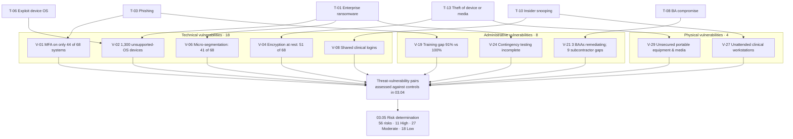

# 03.03 — Vulnerability Identification

| Field | Value |
|---|---|
| Document ID | MBH-RA-VUL-2026-303 |
| Version | 1.0 |
| Date | 2026-07-15 |
| Classification | Confidential — Electronic Protected Health Information (ePHI) // Illustrative Portfolio Sample |
| Owner | Daniel Cho, Chief Information Security Officer &amp; HIPAA Security Official |
| Author | Advisory Team (Healthcare GRC / HIPAA) |
| Status | Approved |

## Purpose

This document delivers **element 3 (second half)** of the OCR nine-element risk analysis: identification and documentation of the **vulnerabilities and predisposing conditions** in MercyBridge Health Network's environment that the threat events catalogued in 03.02 could exploit.

A vulnerability, in NIST SP 800-30 terms, is "a weakness in an information system, system security procedures, internal controls, or implementation that could be exploited by a threat source." The HIPAA Security Rule is explicit that weaknesses are **not only technical**: §164.308 governs administrative safeguards and §164.310 physical safeguards, so an untrained workforce or an unlocked wiring closet is a vulnerability in exactly the same sense as an unpatched server. This catalogue therefore covers all three safeguard families.

**30 vulnerabilities** are identified — **18 technical, 8 administrative, 4 physical**. Each is traced to its evidentiary source, to the threat events that could exploit it, and to the risks it raises in 03.05. Nothing here is hypothetical: every entry is grounded in the Phase 02 baseline, configuration review, scan data, interviews or walkthroughs.

## 1. How Vulnerabilities Were Identified

| Method | Description | Coverage | Vulnerabilities sourced |
|---|---|---|---|
| M1 — Phase 02 baseline analysis | Control-attribute and finding data from the ePHI inventory, device register, network map and cloud register | 68 systems, 6,120 devices, 38 services | V-01 to V-07, V-10, V-21 |
| M2 — Configuration and entitlement review | Sampled review of identity, access, encryption and logging configuration | 24 systems including all 12 Tier 1 | V-08, V-09, V-11, V-17 |
| M3 — Authenticated and unauthenticated vulnerability scanning | Server estate and endpoints; passive profiling for devices | ~9,400 endpoints, server estate | V-13, V-14, V-18 |
| M4 — Structured interviews and walkthroughs | 41 sessions across IT, Security, Clinical Engineering, HIM, Privacy, Legal, Nursing, Revenue Cycle | Enterprise + 6 clinic sites | V-19, V-22, V-23, V-24, V-26 |
| M5 — Document and policy review | Legacy policy set, procedures, BAAs, contingency plans, training records | Enterprise | V-20, V-25 |
| M6 — Physical walkthroughs | Observation at 4 hospitals, 6 outpatient sites, 2 data centres | Representative | V-27 to V-30 |
| M7 — Incident and helpdesk history | 24-month lookback for recurring failure modes | Enterprise | V-12, V-15, V-16 |

## 2. Technical Vulnerabilities (§164.312 domain)

| ID | Vulnerability | Evidence / scale | Exploited by | Raises |
|---|---|---|---|---|
| V-01 | Multi-factor authentication is not enforced across the ePHI estate — **MFA on 44 of 68 systems**; 17 rely on SSO without a second factor and 7 still permit local credentials | Phase 02 control attributes; finding F-03 | T-03, T-04, T-07 | R-01 |
| V-02 | **1,300 medical devices run unsupported or vendor-frozen operating systems** and cannot be patched to a current baseline | Device register; 21.2% of the 6,120-device fleet | T-06, T-01 | R-09, R-10 |
| V-03 | Five device/edge platforms (MBH-SYS-046 to -050) **cannot encrypt ePHI at rest** because of vendor OS constraints | Phase 02 finding F-01 | T-13, T-18 | R-11 |
| V-04 | Encryption at rest is incomplete across ePHI systems — **51 of 68 implemented, 12 partial, 5 not implemented** | Phase 02 control attributes | T-02, T-13, T-18 | R-40 |
| V-05 | Encryption in transit is incomplete — 60 of 68 implemented, 6 partial, 2 none; **118 telemetry devices use legacy vendor protocols that cannot negotiate TLS** | Phase 02; network finding NW-04 | T-05, T-07 | R-42, R-14 |
| V-06 | Micro-segmentation of the data-centre zone is incomplete — **host-based policy complete for only 41 of 68 systems** | Network finding NW-01 | T-01, T-06, T-07 | R-17 |
| V-07 | **Three outpatient sites remain on a legacy flat VLAN design** in which clinical workstations and devices share a broadcast domain | Network finding NW-02 | T-06, T-07 | R-18 |
| V-08 | **Shared and generic clinical workstation logins** and departmental service accounts defeat unique user identification and destroy audit attribution | Walkthroughs; ~1,850 devices with shared or default credentials | T-10, T-11, T-03 | R-02, R-13 |
| V-09 | **Excessive and standing privileged access** — 214 accounts hold elevated EHR entitlements beyond current role need; privileged access is not time-bound | Entitlement review | T-07, T-11 | R-03 |
| V-10 | Audit logging is incomplete — **SIEM ingestion for 49 of 68 systems**; 15 log natively only and 4 not at all | Phase 02 control attributes | T-10, T-11, T-07 | R-55 |
| V-11 | **Information system activity review under §164.308(a)(1)(ii)(D) is not evidenced consistently** for 19 systems; proactive record-access monitoring is limited to VIP flags | Configuration review; interviews | T-10, T-11 | R-55, R-36 |
| V-12 | Endpoint disk encryption gaps persist on shared clinical workstations and portable imaging carts; removable media are not centrally controlled | Endpoint reporting; incident history | T-13, T-19 | R-40 |
| V-13 | **EDR coverage gaps** on legacy servers and device-adjacent workstations; several device-connected endpoints are vendor-excluded from agent installation | Scan and agent reconciliation | T-01, T-06 | R-25 |
| V-14 | Vulnerability remediation exceeds internal SLA on part of the server estate; there is **no formal, contractually backed patch cadence with several device vendors** | Scan trend data; contract review | T-05, T-06 | R-25, R-09 |
| V-15 | Firewall rule hygiene has degraded — **74 rules with no recorded owner**; a split-tunnel exception exists for two legacy remote coding tools | Network findings NW-05, NW-06 | T-05, T-07 | R-19, R-20 |
| V-16 | Unstructured ePHI has accumulated on departmental file shares (MBH-SYS-054) with **no reliable volume estimate**; non-production environments contain production ePHI | Phase 02 finding F-02; interviews | T-02, T-17 | R-41, R-45, R-46 |
| V-17 | Automatic logoff intervals are inconsistent across clinical applications, and some clinical contexts are configured with no timeout at all | Configuration review | T-10, T-14 | R-07, R-51 |
| V-18 | **190 portable devices are intermittently unprofiled by NAC** and can land on an incorrect VLAN; vendor remote-support connectivity reaches 742 devices | Network finding NW-03; device register | T-06, T-09 | R-15, R-06 |

## 3. Administrative Vulnerabilities (§164.308 domain)

| ID | Vulnerability | Evidence / scale | Exploited by | Raises |
|---|---|---|---|---|
| V-19 | **Security awareness training gaps** — 91% annual completion against a 100% target; role-based content for clinical staff, and phishing simulation cadence, are both thin | Training records; interviews | T-03, T-04, T-16 | R-37, R-34 |
| V-20 | **Policy and procedure suite predates the current estate.** The legacy set does not address IoMT, cloud or remote work; the 24-policy HIPAA suite is still progressing through approval, and §164.316(b)(2) six-year retention is not uniformly evidenced | Policy review | T-16, T-17, T-20 | R-54 |
| V-21 | **Business associate assurance is incomplete** — 3 BAAs are under remediation (MBH-SYS-029, -033, -058), subcontractor (BA-of-BA) visibility is absent for 9 hosted services, and 2 services involve offshore support access | Phase 02 findings F-04, CL-04, CL-08 | T-08, T-09, T-18 | R-29, R-30, R-32 |
| V-22 | **Access recertification is not performed on a defined cycle** for 27 systems; minimum-necessary role design has drifted since implementation | Interviews; entitlement review | T-10, T-11 | R-03 |
| V-23 | **Termination and transfer access revocation latency exceeds 24 hours** for systems outside the Halcyon SSO domain; joiner/mover/leaver is partly manual | Sampled HR-to-IT reconciliation | T-11, T-10 | R-04 |
| V-24 | **Contingency planning is under-tested** — clinical downtime procedures have not been exercised at all ~30 outpatient sites; Tier 1 restoration time has not been validated at full scale; backup immutability is incomplete for 9 Tier 2–3 systems | Plan review; test records | T-01, T-21, T-23 | R-47, R-48, R-49 |
| V-25 | **Sanction policy application is not consistently documented** under §164.308(a)(1)(ii)(C); privacy and security sanctions are tracked in separate, unreconciled places | Document review | T-10, T-11 | R-56 |
| V-26 | **Break-glass / emergency access is used without consistent retrospective review**, and the criteria for legitimate emergency use are not defined per application | Interviews; log sampling | T-10, T-20 | R-05 |

## 4. Physical Vulnerabilities (§164.310 domain)

| ID | Vulnerability | Evidence / scale | Exploited by | Raises |
|---|---|---|---|---|
| V-27 | **Unattended, logged-in workstations in clinical areas** — nursing stations, workstations-on-wheels and ED bays are frequently left with an active session in view of, or reachable by, patients and visitors | Walkthroughs at 4 hospitals and 6 clinics | T-10, T-14 | R-51 |
| V-28 | **Tailgating and badge-sharing** at clinical entrances, staff corridors and one data-centre mantrap; visitor management is inconsistent at outpatient sites | Walkthroughs; badge-log sampling | T-14 | R-52 |
| V-29 | **Portable and high-value equipment is not consistently secured** — portable ultrasound and imaging units, laptops and backup media in transit lack a uniform physical control standard, and device/media disposal is not always certificated | Walkthroughs; asset reconciliation | T-13, T-18, T-19 | R-40, R-44 |
| V-30 | **IDF and wiring-closet access control has drifted at outpatient sites**, and environmental monitoring (temperature, water detection, UPS status) is not uniform across all facilities | Walkthroughs at 6 sites | T-14, T-24 | R-52, R-53 |

## 5. Vulnerability Concentration by Safeguard Family

| Safeguard family | Vulnerabilities | Highest-severity entries | Structural cause |
|---|---|---|---|
| Technical (§164.312) | 18 | V-01, V-02, V-04, V-06, V-08 | Legacy clinical estate, unpatchable FDA-cleared devices, identity debt |
| Administrative (§164.308) | 8 | V-20, V-21, V-24 | Programme formalisation still in progress; policy suite mid-approval |
| Physical (§164.310) | 4 | V-27 | Open clinical environments where care workflow competes with control friction |

Three of the four physical vulnerabilities and five of the eight administrative ones are **remediable through process and policy alone**, and are addressed in Phases 04–05. By contrast, V-02, V-03 and V-05 are constrained by vendor and FDA realities and can only be managed with compensating controls — principally segmentation — which is why network segmentation carries disproportionate weight in the MercyBridge control set and why the **2025 Security Rule NPRM's proposed segmentation mandate** is treated as forward-looking readiness rather than a novelty.

## 6. Threat–Vulnerability Pairing Model

## 7. Vulnerabilities Already Under Remediation

Several vulnerabilities were in active remediation while the analysis ran. They are scored as they stood at the assessment date, **not** as they will stand at completion — scoring a planned control as though it were operating is one of the fastest ways to make a risk analysis inaccurate.

| ID | Remediation in flight | Target | Owner | Effect once complete |
|---|---|---|---|---|
| V-21 | Remediation of BAAs for MBH-SYS-029, -033, -058 | 2026-07 | Lisa Coleman | R-29 likelihood 3 → 2 |
| V-06 | Extension of host-based micro-segmentation policy | Q4 2026 | Anthony Ruiz | R-17 likelihood 4 → 3 |
| V-07 | Access-layer refresh with device VLAN split at 3 sites | Q3 2026 | Anthony Ruiz | R-18 likelihood 3 → 2 |
| V-15 | Firewall rule recertification campaign; VDI migration for split-tunnel users | Q3–Q4 2026 | Marcus Reed | R-19, R-20 reduced |
| V-20 | Approval of the 24-policy HIPAA suite | 2026-05 → 2026-07 | Daniel Cho | R-54 likelihood 3 → 2 |
| V-18 | NAC MAB fallback profile plus quarterly reconciliation | Q4 2026 | Anthony Ruiz | R-15 reduced |

## 8. Predisposing Conditions

NIST SP 800-30 distinguishes vulnerabilities from **predisposing conditions** — properties of the environment that increase susceptibility without being defects in themselves. These are not scored as vulnerabilities but they shape likelihood throughout 03.05.

| Condition | Description | Effect |
|---|---|---|
| PC-1 | Concentration of the entire clinical record with a single vendor-hosted EHR provider | Amplifies impact of T-08 and T-23 |
| PC-2 | ~6,500 workforce members plus affiliated providers across 34 locations | Broad human attack surface for T-03, T-10, T-16 |
| PC-3 | FDA-cleared device configurations under vendor change control | Makes V-02, V-03, V-05 structurally persistent |
| PC-4 | 24×7 clinical operations with no maintenance window tolerance | Constrains patching and testing; raises T-01 impact |
| PC-5 | ~180 business associates and 38 hosted services | Extends the trust boundary well beyond direct control |
| PC-6 | Open, semi-public clinical physical environments | Sustains T-13 and T-14 likelihood |

## Cross-References

| Reference | Relevance |
|---|---|
| 03.01 — Risk Analysis Methodology | Element 3; NIST SP 800-30 definitions applied here |
| 03.02 — Threat Identification | Threat events T-01 to T-24 paired with these vulnerabilities |
| 03.04 — Existing Controls Assessment | Controls that mitigate, or fail to mitigate, each vulnerability |
| 03.05 — Likelihood, Impact &amp; Risk Determination | Scoring of the resulting 56 risks |
| 03.06 — Ransomware &amp; Healthcare Threat Profile | V-02, V-06, V-13 and V-24 as ransomware enablers |
| 02.02 — ePHI System Inventory | Findings F-01 to F-06 and the control-attribute counts |
| 02.04 — Medical Devices &amp; IoMT | The 1,300 unsupported-OS devices |
| 02.05 — Network Architecture &amp; Segmentation | Network findings NW-01 to NW-06 |
| 02.06 — Cloud &amp; Hosted Services | Cloud themes CL-01 to CL-09 |
| Phase 04 — Administrative Safeguards | Remediation of V-19 to V-26 |
| Phase 05 — Physical &amp; Technical Safeguards | Remediation of V-01 to V-18 and V-27 to V-30 |
| Phase 08 — Independent Assessment | Ironwood Security Labs validation of exploitability |

---
[⬅ Previous](03.02-threat-identification.md) · [🏠 Phase README](03.00-README.md) · [Next ➡](03.04-existing-controls-assessment.md)
