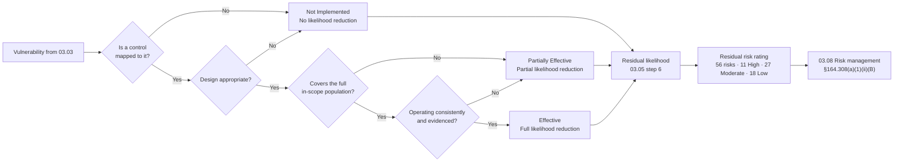

# 03.04 — Existing Controls Assessment

| Field | Value |
|---|---|
| Document ID | MBH-RA-CTL-2026-304 |
| Version | 1.0 |
| Date | 2026-07-15 |
| Classification | Confidential — Electronic Protected Health Information (ePHI) // Illustrative Portfolio Sample |
| Owner | Daniel Cho, Chief Information Security Officer &amp; HIPAA Security Official |
| Author | Advisory Team (Healthcare GRC / HIPAA) |
| Status | Approved |

## Purpose

This document delivers **element 4** of the OCR nine-element risk analysis: **assess current security measures**. OCR's guidance is explicit that a covered entity must "assess whether current security measures are used properly," identifying "the security measures **already in place**" and evaluating whether they are "configured and used properly." The Security Rule reinforces this at **§164.306(b)(2)(ii)**, which requires an entity to take into account "the covered entity's or business associate's technical infrastructure, hardware, and software security capabilities" when deciding what is reasonable and appropriate.

This step is what makes MercyBridge's risk ratings **residual** rather than inherent. A vulnerability from 03.03 that is fully compensated by an effective control produces a low risk; the same vulnerability with no compensating control produces a high one. Getting this step wrong in either direction is a classic OCR finding: crediting controls that exist only on paper inflates the apparent posture, while ignoring controls that genuinely work produces a register nobody can act on.

**42 representative safeguards** were assessed across the three Security Rule families plus supporting/compensating technologies, and each was rated **Effective**, **Partially Effective** or **Not Implemented**.

## 1. What "Assessing Existing Controls" Requires

| Requirement | Source | How MercyBridge satisfied it |
|---|---|---|
| Identify security measures already in place | OCR risk analysis guidance, element 4 | 42 safeguards catalogued against §164.308, §164.310, §164.312 |
| Determine whether measures are **configured properly** | OCR guidance | Configuration review on 24 systems, including all 12 Tier 1 |
| Determine whether measures are **used properly** | OCR guidance | 41 interviews, walkthroughs, log sampling, training and test records |
| Consider size, complexity and capabilities | §164.306(b)(2)(i) | 4 hospitals, ~30 clinics, ~6,500 workforce, 68 ePHI systems |
| Consider technical infrastructure and capability | §164.306(b)(2)(ii) | Vendor-hosted EHR, 6,120-device fleet, 38 hosted services |
| Consider cost | §164.306(b)(2)(iii) | Recorded in the 03.08 treatment plan, not used to justify omission |
| Consider probability and criticality of potential risks | §164.306(b)(2)(iv) | Feeds directly into 03.05 |
| Address **addressable** specifications properly | §164.306(d)(3) | Where an addressable specification is not implemented, the rationale and any equivalent alternative are documented |

**A note on "addressable."** Addressable does not mean optional. §164.306(d)(3) requires an entity to implement the specification if reasonable and appropriate, and otherwise to document why not and implement an equivalent alternative where reasonable. The **2025 HIPAA Security Rule NPRM would remove the addressable/required distinction entirely**, making encryption, MFA, segmentation and asset inventory mandatory. MercyBridge therefore assesses addressable specifications to the same standard as required ones, and records no control as "addressable — not implemented" without a written rationale.

## 2. Rating Definitions

| Rating | Definition | Effect on risk scoring |
|---|---|---|
| **Effective** | Designed appropriately, implemented across the in-scope population, operating consistently, and evidenced | Full likelihood reduction credited |
| **Partially Effective** | Designed appropriately but incomplete in coverage, inconsistently operated, or not evidenced end-to-end | Partial likelihood reduction; residual gap carried as a vulnerability |
| **Not Implemented** | Absent, or present only as an unapproved plan | No likelihood reduction |

Two qualifiers are recorded alongside the rating: **coverage** (the proportion of the in-scope population the control reaches) and **assurance** (whether operation was observed and sampled, or only design was reviewed).

## 3. Administrative Safeguards — §164.308

| ID | Safeguard | Standard / specification | What is in place | Coverage | Rating |
|---|---|---|---|---|---|
| C-A01 | Risk analysis | §164.308(a)(1)(ii)(A) — Required | A prior analysis existed but was neither enterprise-wide nor current; this phase replaces it | Partial at assessment date | Partially Effective |
| C-A02 | Risk management | §164.308(a)(1)(ii)(B) — Required | Remediation performed reactively; no formal register, owners or accepted-risk process before this phase | Partial | Partially Effective |
| C-A03 | Sanction policy | §164.308(a)(1)(ii)(C) — Required | HR sanction framework exists; privacy and security sanctions tracked separately and unreconciled | Partial | Partially Effective |
| C-A04 | Information system activity review | §164.308(a)(1)(ii)(D) — Required | SIEM use-case review for Tier 1; not evidenced for 19 systems | 49 of 68 | Partially Effective |
| C-A05 | Assigned security responsibility | §164.308(a)(2) — Required | Daniel Cho formally designated CISO and HIPAA Security Official; charter and board reporting line established (ADR-0003) | Enterprise | **Effective** |
| C-A06 | Workforce security — authorisation, clearance, termination | §164.308(a)(3) | Pre-employment screening and manager authorisation operate; termination revocation exceeds 24 hours outside the Halcyon SSO domain | Partial | Partially Effective |
| C-A07 | Information access management | §164.308(a)(4) | Role-based access model exists in the EHR; recertification not on a defined cycle for 27 systems | Partial | Partially Effective |
| C-A08 | Security awareness and training | §164.308(a)(5) | Annual HIPAA training platform; 91% completion; role-based clinical content thin | 91% | Partially Effective |
| C-A09 | Protection from malicious software | §164.308(a)(5)(ii)(B) | Enterprise anti-malware and email filtering on managed endpoints and mail flow | Managed estate | **Effective** |
| C-A10 | Log-in monitoring | §164.308(a)(5)(ii)(C) | Failed-logon alerting for Tier 1; not extended to all ePHI systems | Partial | Partially Effective |
| C-A11 | Password management | §164.308(a)(5)(ii)(D) | Enterprise password policy, self-service reset, credential screening against breach corpora | Directory-joined estate | **Effective** |
| C-A12 | Security incident procedures | §164.308(a)(6) | Incident handling operates in practice; formal documented IR plan and tabletop delivered in Phase 07 | Partial | Partially Effective |
| C-A13 | Contingency plan | §164.308(a)(7) | Backups, downtime procedures and a DR plan exist; testing incomplete, restoration time unvalidated at scale | Partial | Partially Effective |
| C-A14 | Evaluation | §164.308(a)(8) | Periodic technical review performed ad hoc; formal evaluation cycle established in Phase 08 | Partial | Partially Effective |
| C-A15 | Business associate contracts and other arrangements | §164.308(b)(1) / §164.314(a) | BAAs executed for 44 of 47 BA-involved ePHI systems; 3 remediating; subcontractor visibility absent for 9 hosted services | 44 of 47 | Partially Effective |

## 4. Physical Safeguards — §164.310

| ID | Safeguard | Standard / specification | What is in place | Coverage | Rating |
|---|---|---|---|---|---|
| C-P01 | Facility access controls | §164.310(a)(1) | Badge access across hospitals, clinics and both data centres; CCTV at perimeter and data-centre entries; 24×7 security staffing at hospitals | Enterprise | **Effective** |
| C-P02 | Contingency operations and facility security plan | §164.310(a)(2)(i)–(ii) | Emergency access to facilities defined; facility security plan not refreshed for all ~30 clinic sites | Partial | Partially Effective |
| C-P03 | Access control and validation; visitor management | §164.310(a)(2)(iii) | Visitor badging at hospitals; inconsistent at outpatient sites; tailgating observed | Partial | Partially Effective |
| C-P04 | Maintenance records | §164.310(a)(2)(iv) | Facilities and Clinical Engineering CMMS record physical modifications and device servicing | Enterprise | **Effective** |
| C-P05 | Workstation use and workstation security | §164.310(b), §164.310(c) | Privacy filters and positioning standards exist; unattended logged-in sessions observed in clinical areas | Partial | Partially Effective |
| C-P06 | Device and media controls — disposal and re-use | §164.310(d)(1), (d)(2)(i)–(ii) | NIST SP 800-88 sanitisation standard adopted; certificates not consistently obtained for devices and portable media | Partial | Partially Effective |
| C-P07 | Accountability; data backup and storage | §164.310(d)(2)(iii)–(iv) | Asset register with owners (02.10); backup copies held before equipment movement | Enterprise | **Effective** |

## 5. Technical Safeguards — §164.312

| ID | Safeguard | Standard / specification | What is in place | Coverage | Rating |
|---|---|---|---|---|---|
| C-T01 | Unique user identification | §164.312(a)(2)(i) — Required | Individual accounts via the enterprise directory; defeated by shared clinical logins and ~1,850 devices with shared or default credentials | Partial | Partially Effective |
| C-T02 | Emergency access procedure | §164.312(a)(2)(ii) — Required | Break-glass exists in the EHR; retrospective review inconsistent; criteria undefined per application | Partial | Partially Effective |
| C-T03 | Automatic logoff | §164.312(a)(2)(iii) — Addressable | Configured in the EHR and VDI; intervals inconsistent, some clinical contexts have none | Partial | Partially Effective |
| C-T04 | Encryption and decryption (at rest) | §164.312(a)(2)(iv) — Addressable | Full-disk and database encryption on 51 of 68 systems; 12 partial, 5 none; device ePHI unencryptable | 51 of 68 | Partially Effective |
| C-T05 | Audit controls | §164.312(b) — Required | Native audit logging on 64 of 68 systems; SIEM ingestion on 49 | 49 of 68 to SIEM | Partially Effective |
| C-T06 | Integrity — mechanism to authenticate ePHI | §164.312(c)(1), (c)(2) | Interface-engine message validation, HL7/DICOM checksums, EMPI reconciliation, database integrity constraints | Tier 1 and Tier 2 | **Effective** |
| C-T07 | Person or entity authentication | §164.312(d) — Required | Enterprise SSO; **MFA on 44 of 68 systems**; 17 SSO-only, 7 local credentials | 44 of 68 | Partially Effective |
| C-T08 | Transmission security | §164.312(e)(1), (e)(2) | TLS 1.2+ on 60 of 68 systems; VPN for remote access; secure clinical messaging; 118 telemetry devices cannot negotiate TLS and are isolated instead | 60 of 68 | **Effective** (with documented device exceptions) |
| C-T09 | Network segmentation (NPRM-forward) | Supporting §164.312(a)(1), §164.312(e) | Ten-zone model, 96 device VLANs, default-deny inter-zone policy; host-based micro-segmentation on 41 of 68 systems | Partial | Partially Effective |
| C-T10 | Endpoint detection and response | Supporting §164.308(a)(5)(ii)(B) | EDR deployed across the managed estate; gaps on legacy servers and vendor-excluded device-adjacent endpoints | Partial | Partially Effective |

## 6. Supporting and Compensating Controls

| ID | Control | Purpose | Coverage | Rating |
|---|---|---|---|---|
| C-S01 | SIEM and centralised log aggregation | Detection, activity review, forensic readiness | 49 of 68 systems | Partially Effective |
| C-S02 | Network access control (802.1X / MAB) | Device placement and quarantine | 5,930 of 6,120 devices profiled | Partially Effective |
| C-S03 | Email security gateway, anti-phishing and attachment detonation | Blocks the dominant initial-access vector | All mail flow | **Effective** |
| C-S04 | Backup, immutability and offline copy | Ransomware recovery | Tier 1 covered; 9 Tier 2–3 systems lack immutable copies | Partially Effective |
| C-S05 | Vulnerability management and scanning | Exposure reduction | Server and endpoint estate; devices passively profiled only | Partially Effective |
| C-S06 | Data loss prevention (email and endpoint) | Prevents ePHI egress and misdirection | None | **Not Implemented** |
| C-S07 | Privileged access management (vaulting, just-in-time) | Limits standing privilege | None | **Not Implemented** |
| C-S08 | Automated ePHI data discovery for unstructured stores | Finds ePHI on file shares and endpoints | None | **Not Implemented** |
| C-S09 | Patient privacy / record-access behavioural monitoring | Detects insider snooping beyond VIP flagging | VIP flags only | **Not Implemented** |
| C-S10 | Medical device security platform / IoMT gateway | Device visibility, profiling, anomaly detection | 5,930 of 6,120 devices | **Effective** |

## 7. Control Effectiveness Summary

| Safeguard family | Assessed | Effective | Partially Effective | Not Implemented |
|---|---|---|---|---|
| Administrative — §164.308 | 15 | 3 | 12 | 0 |
| Physical — §164.310 | 7 | 3 | 4 | 0 |
| Technical — §164.312 | 10 | 2 | 8 | 0 |
| Supporting / compensating | 10 | 2 | 4 | 4 |
| **Total** | **42** | **10 (24%)** | **28 (67%)** | **4 (10%)** |

The shape of this distribution is the story of the phase. MercyBridge is **not an organisation without controls** — almost every Security Rule standard has something behind it, which is why the overall risk posture lands at **Moderate** rather than High. What it lacks is **completeness and evidence**: two-thirds of safeguards are designed correctly but reach only part of the population, operate inconsistently, or cannot be evidenced end-to-end. Partial coverage is precisely the condition that produces Moderate rather than Low risk, and it is why the treatment plan in 03.08 is weighted towards *extending and evidencing* existing controls rather than buying new ones — with four genuine capability gaps (DLP, PAM, data discovery and privacy monitoring) as the exceptions.

## 8. From Control Effectiveness to Residual Risk

## 9. Controls Credited Against the Eleven High Risks

Even the High risks are partially mitigated; the table below records what is *already* working, so that the treatment plan does not duplicate it.

| High risk | Existing control credited | Why the risk remains High |
|---|---|---|
| R-23 Enterprise ransomware encrypting Tier 1 systems | C-S03, C-A09, C-T10, C-S04 | Backup immutability incomplete; restoration time unvalidated; segmentation partial |
| R-24 Double-extortion exfiltration of ePHI | C-S03, C-T10, C-S01 | No DLP (C-S06); no data discovery (C-S08); egress monitoring partial |
| R-40 Unencrypted / partially encrypted ePHI at rest | C-T04 on 51 of 68 | 17 systems and much of the device estate remain outside safe harbour |
| R-17 Lateral movement through incomplete segmentation | C-T09 zone model, C-S02 NAC | Micro-segmentation reaches only 41 of 68 systems |
| R-01 MFA absent on 24 of 68 systems | C-T07 SSO, C-A11 password management | SSO without a second factor does not stop credential replay |
| R-02 Shared clinical logins defeating unique user ID | C-T01, C-A04 | Attribution is impossible where a session is shared |
| R-09 Unsupported-OS medical devices | C-T09 segmentation, C-S10 IoMT platform, C-S02 NAC | The underlying flaw cannot be patched; compensation is not elimination |
| R-10 Malware propagation into device VLANs | C-T09, C-S10 | Micro-segmentation gaps plus 3 flat-VLAN sites |
| R-11 Unencryptable ePHI at rest on devices | C-P06, C-P07, C-T09 | Vendor OS constraint; no cryptographic safe harbour on loss |
| R-28 Hosted-EHR compromise or extended outage | C-A15 BAA, SOC 2 / HITRUST reliance, C-A13 downtime procedures | Concentration is structural; assurance is documentary, not tested |
| R-34 Phishing / BEC compromising mailboxes with ePHI | C-S03, C-A08, C-A11 | Training at 91%; MFA gaps; no DLP on outbound mail |

## 10. Assurance Basis and Limitations

| # | Statement |
|---|---|
| 1 | Ratings for 24 systems (including all 12 Tier 1) are based on observed configuration and sampled operation. |
| 2 | Ratings for the remaining 44 systems are based on owner attestation plus documentary evidence; these are marked "design and attestation" in the working papers and were not upgraded to Effective on attestation alone. |
| 3 | Business associate control environments were assessed from SOC 2 Type II reports, HITRUST certificates and BAA terms — not by direct testing. The resulting assurance gap is carried as risk R-30. |
| 4 | Medical device internals were not scanned; ratings rely on passive profiling, MDS2 forms (on file for 4,284 of 6,120 devices) and vendor attestation. |
| 5 | Independent technical validation of these ratings is performed in Phase 08 by Ironwood Security Labs and by internal audit. |

## Cross-References

| Reference | Relevance |
|---|---|
| 03.01 — Risk Analysis Methodology | Element 4 and the §164.306(b)(2) flexibility factors |
| 03.02 — Threat Identification | Threats these controls are intended to counter |
| 03.03 — Vulnerability Identification | The 30 weaknesses these controls partially close |
| 03.05 — Likelihood, Impact &amp; Risk Determination | Where these ratings become likelihood reductions |
| 03.06 — Ransomware &amp; Healthcare Threat Profile | Ransomware-specific control chain |
| 02.02 — ePHI System Inventory | Coverage counts for MFA, encryption and logging |
| 02.05 — Network Architecture &amp; Segmentation | Basis for C-T09 |
| 01.04 — HIPAA Security Rule Overview | The 18 standards and ~50 implementation specifications |
| Phase 04 — Administrative Safeguards | Where C-A01 to C-A15 are brought to Effective |
| Phase 05 — Physical &amp; Technical Safeguards | Where C-P01 to C-P07 and C-T01 to C-T10 are completed |
| Phase 08 — Independent Assessment | Independent validation of these effectiveness ratings |

---
[⬅ Previous](03.03-vulnerability-identification.md) · [🏠 Phase README](03.00-README.md) · [Next ➡](03.05-likelihood-impact-and-risk-determination.md)
