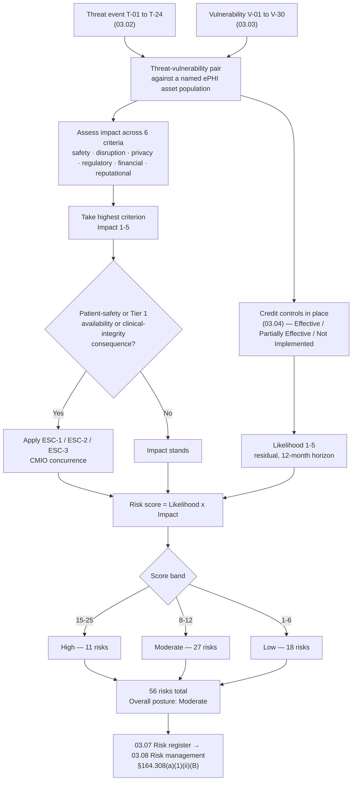

# 03.05 — Likelihood, Impact &amp; Risk Determination

| Field | Value |
|---|---|
| Document ID | MBH-RA-DET-2026-305 |
| Version | 1.0 |
| Date | 2026-07-15 |
| Classification | Confidential — Electronic Protected Health Information (ePHI) // Illustrative Portfolio Sample |
| Owner | Michelle Tran, VP Enterprise Risk |
| Author | Advisory Team (Healthcare GRC / HIPAA) |
| Status | Approved |

## Purpose

This document delivers **elements 5, 6 and 7** of the OCR nine-element risk analysis — determine the **likelihood** of threat occurrence, determine the **potential impact** of threat occurrence, and **determine the level of risk** — and reconciles them into the definitive result of the §164.308(a)(1)(ii)(A) analysis:

> **56 risks to ePHI — 11 High, 27 Moderate, 18 Low. Overall risk posture: Moderate.**

It defines the 5-point likelihood scale, the 5-point impact scale with **healthcare-specific impact criteria** (patient safety, care disruption, privacy harm, regulatory/OCR exposure, financial and reputational), the 5×5 determination matrix, the High/Moderate/Low thresholds, and the escalation rule under which a **patient-safety consequence can raise a risk beyond what pure data-confidentiality scoring would produce**. Every one of the 56 risks is listed with its score and rating.

Risk is expressed **residually** — after the controls assessed in 03.04. Ratings are jointly owned: the CISO owns the security judgement, the VP Enterprise Risk owns the method and the calibration, and the CMIO owns any patient-safety impact rating.

## 1. Risk Determination Formula

> **Risk = Likelihood (1–5) × Impact (1–5)**, assessed against controls in place, then adjusted by the patient-safety escalation rule.

Each risk is a **threat–vulnerability pair** from 03.02 and 03.03: an identified threat source acting on an identified weakness, against a named ePHI asset population, with the controls of 03.04 credited. Risks were scored in two passes — an initial pass by the assessment team and a moderation pass on 2026-04-09 with the CISO, CIO, CMIO, Chief Privacy Officer and VP Enterprise Risk, to remove scoring drift between categories.

## 2. Likelihood Scale (Element 5)

Likelihood is the probability that a threat source successfully triggers a vulnerability **within a 12-month horizon, given the controls currently in place**.

| Score | Level | Definition | Indicative frequency | Anchors used |
|---|---|---|---|---|
| 5 | Almost Certain | Occurring now, or reasonably expected multiple times a year; controls absent or routinely bypassed | More than once per year | Observed in MercyBridge's 24-month incident history at volume |
| 4 | Likely | Reasonably expected within the year; controls partial and known gaps are exploitable | Roughly annually | Observed internally, or observed repeatedly across peer health systems |
| 3 | Possible | Credible within the year; controls exist but coverage or operation is incomplete | Once in 1–3 years | Sector-reported and technically feasible in this environment |
| 2 | Unlikely | Requires an unusual combination of circumstances; controls effective but not exhaustive | Once in 3–10 years | Feasible but no supporting internal or close-peer evidence |
| 1 | Rare | Requires exceptional capability, access or coincidence; controls effective | Less than once in 10 years | Theoretical for this environment |

Likelihood is **not** rated on threat capability alone. A highly capable adversary acting against an effective control yields a lower likelihood than a modest adversary acting against a control that reaches only part of the estate — which is why the 67% "Partially Effective" finding in 03.04 pushes so many risks to a likelihood of 3 or 4.

## 3. Impact Scale (Element 6) — Healthcare-Specific Criteria

The Security Rule protects **confidentiality, integrity and availability**. In a hospital, the availability and integrity dimensions have a consequence no other sector shares: a patient can be harmed. MercyBridge therefore scores impact against six criteria and takes the **highest** applicable criterion as the impact score.

| Score | Level | Patient safety | Care disruption | Privacy harm | Regulatory / OCR | Financial | Reputational |
|---|---|---|---|---|---|---|---|
| 5 | Severe | Death or serious permanent harm plausible | Enterprise-wide clinical downtime > 72 h; ambulance diversion; service closure | Mass exposure of sensitive ePHI (> 500,000 individuals) or highly sensitive categories | OCR investigation with civil money penalty and multi-year corrective action plan; state AG action | > $25M | Sustained national coverage; loss of community confidence |
| 4 | Major | Temporary harm, treatment delay or medication error plausible | Multi-facility downtime 24–72 h; elective cancellations | Exposure affecting 50,000–500,000 individuals; media and HHS notice required | OCR investigation likely; formal corrective action plan | $5M–$25M | Regional coverage; measurable patient attrition |
| 3 | Moderate | Minor or readily reversible clinical impact | Single facility or service line down 4–24 h | Exposure affecting 500–50,000 individuals; media notice threshold crossed at 500 | Reportable breach; HHS notification within 60 days; OCR inquiry possible | $500K–$5M | Local coverage; complaints |
| 2 | Minor | No credible clinical impact | Localised degradation < 4 h; workaround available | Exposure affecting fewer than 500 individuals; annual HHS log | Documented internally; low-probability-of-compromise determination likely | $50K–$500K | Contained; individual complaints |
| 1 | Insignificant | None | Negligible; no clinical workflow affected | No ePHI exposed, or exposure to an authorised party | No notification duty | < $50K | None |

**Breach-notification calibration.** Impact scoring is deliberately aligned to the Breach Notification Rule (§164.400–414): the **500-individual threshold** that triggers media notice and prompt HHS notification separates impact 2 from impact 3, and the **60-day** notification deadline is assumed in every impact 3+ scenario. The four-factor risk-of-compromise assessment under §164.402 is the mechanism by which an incident is judged notifiable; it is applied in Phase 07, not here.

## 4. The Patient-Safety Escalation Rule

A risk scored purely on data confidentiality can understate the harm a hospital actually faces. MercyBridge therefore applies an explicit escalation rule, approved by the CMIO and the VP Enterprise Risk:

| Rule | Statement |
|---|---|
| **ESC-1** | Where a risk carries a credible **patient-safety consequence rated 4 or 5**, the impact score is set from the patient-safety criterion regardless of the privacy or financial criteria, and the risk **cannot be rated below Moderate**. |
| **ESC-2** | Where a risk would degrade the **availability of a Tier 1 clinical system** for more than 24 hours, impact is floored at 4. |
| **ESC-3** | Where a risk affects the **integrity** of clinical data used for treatment decisions (orders, allergies, results, medication administration), impact is floored at 4 even where volumes are small — a single corrupted allergy record can kill a patient, while a thousand exposed appointment reminders will not. |
| **ESC-4** | A downgrade below the escalated rating requires written CMIO concurrence recorded in the risk register. |

ESC-1 to ESC-3 were applied to **nine** risks. In four cases (R-10, R-11, R-23, R-28) they raised the rating from Moderate to High. This is the single most important methodological difference between a healthcare risk analysis and a generic information-security one.

## 5. The 5×5 Risk Determination Matrix (Element 7)

| Likelihood ↓ / Impact → | 1 Insignificant | 2 Minor | 3 Moderate | 4 Major | 5 Severe |
|---|---|---|---|---|---|
| **5 Almost Certain** | 5 — Low | 10 — Moderate | **15 — High** | **20 — High** | **25 — High** |
| **4 Likely** | 4 — Low | 8 — Moderate | 12 — Moderate | **16 — High** | **20 — High** |
| **3 Possible** | 3 — Low | 6 — Low | 9 — Moderate | 12 — Moderate | **15 — High** |
| **2 Unlikely** | 2 — Low | 4 — Low | 6 — Low | 8 — Moderate | 10 — Moderate |
| **1 Rare** | 1 — Low | 2 — Low | 3 — Low | 4 — Low | 5 — Low |

| Rating | Score band | Definition | Governance response |
|---|---|---|---|
| **High** | 15–25 | Unacceptable. Reasonably anticipated threat with major or severe consequences to ePHI or to patients | Treatment plan required; executive owner; remediation within 90 days or a board-visible, time-bounded exception |
| **Moderate** | 8–12 | Requires action on a managed schedule; tolerable only with an owner and a target date | Treatment plan required; remediation within 6–12 months; quarterly review |
| **Low** | 1–6 | Tolerable under existing controls | Monitor; re-evaluate at the annual analysis or on significant change |

Risk acceptance is permitted only for Low and, exceptionally, Moderate risks, and only with a documented, time-bounded acceptance signed by an executive with authority to accept it (template in Phase 01). **No High risk may be accepted without board Audit &amp; Compliance Committee visibility** — an undocumented acceptance is indistinguishable, on audit, from an unmanaged risk.

## 6. Determination Workflow

## 7. The Risk Determination — All 56 Risks

**L** = likelihood, **I** = impact, **S** = score. Basis cites the threat (T), vulnerability (V) or predisposing condition (PC) from 03.02 and 03.03.

### 7.1 Access Control &amp; Identity Management (8 risks)

| ID | Risk to ePHI | Basis | L | I | S | Rating |
|---|---|---|---|---|---|---|
| R-01 | Credential compromise yields unauthorised ePHI access because MFA is enforced on only 44 of 68 ePHI systems | T-03 / V-01 | 4 | 4 | 16 | **High** |
| R-02 | Shared and generic clinical logins defeat unique user identification and destroy audit attribution | T-10 / V-08 | 4 | 4 | 16 | **High** |
| R-03 | Standing excessive privilege (214 elevated EHR accounts) enables large-scale access or exfiltration | T-11 / V-09, V-22 | 3 | 4 | 12 | Moderate |
| R-04 | Departed or transferred workforce retain access beyond 24 hours outside the SSO domain | T-11 / V-23 | 3 | 4 | 12 | Moderate |
| R-05 | Break-glass emergency access is used without retrospective review, masking improper access | T-20 / V-26 | 3 | 3 | 9 | Moderate |
| R-06 | Vendor remote-support entitlements across 742 devices are under-reviewed | T-09 / V-18 | 2 | 4 | 8 | Moderate |
| R-07 | Inconsistent automatic logoff leaves ePHI sessions exposed | T-14 / V-17 | 2 | 3 | 6 | Low |
| R-08 | Patient-portal proxy relationships are not periodically recertified | T-10 / V-22 | 2 | 2 | 4 | Low |

### 7.2 Medical Device &amp; IoMT (8 risks)

| ID | Risk to ePHI | Basis | L | I | S | Rating |
|---|---|---|---|---|---|---|
| R-09 | Known exploited vulnerabilities on 1,300 unsupported-OS devices cannot be patched | T-06 / V-02, V-14 | 4 | 4 | 16 | **High** |
| R-10 | Malware propagation into device VLANs halts clinical device availability — patient-safety consequence (ESC-1) | T-01 / V-02, V-06 | 3 | 5 | 15 | **High** |
| R-11 | ePHI at rest on 3,170 ePHI-bearing devices cannot be encrypted; loss or disposal forfeits safe harbour (ESC-1) | T-13 / V-03 | 3 | 5 | 15 | **High** |
| R-12 | 1,836 devices without an MDS2 on file cannot be assessed to a consistent standard | T-06 / PC-3 | 3 | 3 | 9 | Moderate |
| R-13 | Default and shared device credentials (~1,850 devices) permit unattributed access | T-09 / V-08 | 2 | 4 | 8 | Moderate |
| R-14 | 118 telemetry devices transmit ePHI over legacy protocols that cannot negotiate TLS | T-05 / V-05 | 2 | 4 | 8 | Moderate |
| R-15 | 190 portable devices intermittently unprofiled by NAC may land on an incorrect VLAN | T-06 / V-18 | 2 | 3 | 6 | Low |
| R-16 | Vendor field-service media introduce malware during on-site maintenance | T-06 / V-02 | 1 | 4 | 4 | Low |

### 7.3 Network &amp; Infrastructure (6 risks)

| ID | Risk to ePHI | Basis | L | I | S | Rating |
|---|---|---|---|---|---|---|
| R-17 | Incomplete micro-segmentation (41 of 68 systems) permits lateral movement into Tier 1 clinical systems | T-07 / V-06 | 4 | 4 | 16 | **High** |
| R-18 | Three outpatient sites on a legacy flat VLAN allow device and workstation traffic to intermingle | T-07 / V-07 | 3 | 4 | 12 | Moderate |
| R-19 | 74 unowned firewall rules erode the default-deny posture | T-17 / V-15 | 3 | 3 | 9 | Moderate |
| R-20 | Split-tunnel exception for two legacy remote coding tools bypasses inspection | T-05 / V-15 | 2 | 4 | 8 | Moderate |
| R-21 | Wireless guest and clinical separation has drifted at three sites | T-14 / V-07 | 2 | 3 | 6 | Low |
| R-22 | Rogue access points or untracked network taps at outpatient sites | T-14 / PC-6 | 2 | 2 | 4 | Low |

### 7.4 Malware, Ransomware &amp; Endpoint (5 risks)

| ID | Risk to ePHI | Basis | L | I | S | Rating |
|---|---|---|---|---|---|---|
| R-23 | Enterprise ransomware encrypts Tier 1 clinical systems, causing multi-day care disruption and diversion (ESC-2) — **the highest-scored risk in the register** | T-01 / V-06, V-13, V-24 | 4 | 5 | 20 | **High** |
| R-24 | Double-extortion exfiltration of ePHI before encryption triggers presumptive breach and mass notification | T-02 / V-04, V-16 | 4 | 4 | 16 | **High** |
| R-25 | EDR coverage gaps on legacy servers and device-adjacent endpoints delay detection | T-05 / V-13, V-14 | 3 | 4 | 12 | Moderate |
| R-26 | Macro or script-based initial access from email attachments establishes a foothold | T-03 / V-19 | 3 | 3 | 9 | Moderate |
| R-27 | Removable-media malware on non-clinical endpoints | T-13 / V-12 | 2 | 3 | 6 | Low |

### 7.5 Business Associate &amp; Supply Chain (6 risks)

| ID | Risk to ePHI | Basis | L | I | S | Rating |
|---|---|---|---|---|---|---|
| R-28 | Compromise or extended outage of the vendor-hosted Halcyon EHR holding the entire 2.1M-record clinical archive (ESC-2) | T-08 / PC-1 | 3 | 5 | 15 | **High** |
| R-29 | ePHI disclosed to three business associates whose BAAs are still under remediation (MBH-SYS-029, -033, -058) | T-08 / V-21 | 3 | 4 | 12 | Moderate |
| R-30 | Subcontractor (BA-of-BA) chain is unvisible for nine hosted services | T-08 / V-21 | 3 | 3 | 9 | Moderate |
| R-31 | Business associate breach notification arrives too late to meet the 60-day duty to individuals | T-08 / V-21 | 2 | 4 | 8 | Moderate |
| R-32 | Offshore support access to ePHI at two services exceeds minimum necessary | T-08 / V-21 | 2 | 3 | 6 | Low |
| R-33 | Data return and certified deletion at contract exit is unevidenced | T-18 / V-21 | 2 | 2 | 4 | Low |

### 7.6 Workforce &amp; Human Factors (6 risks)

| ID | Risk to ePHI | Basis | L | I | S | Rating |
|---|---|---|---|---|---|---|
| R-34 | Phishing or business email compromise gives an adversary a workforce mailbox containing ePHI | T-03, T-04 / V-01, V-19 | 5 | 3 | 15 | **High** |
| R-35 | Misdirected fax, email, statement or records release discloses ePHI to the wrong recipient | T-16 / V-19 | 4 | 3 | 12 | Moderate |
| R-36 | Workforce member browses records without a treatment, payment or operations purpose | T-10, T-11 / V-11 | 3 | 4 | 12 | Moderate |
| R-37 | Training gaps (91% completion; thin role-based clinical content) leave the workforce unprepared | T-03 / V-19 | 3 | 3 | 9 | Moderate |
| R-38 | Unsanctioned messaging applications carry clinical information outside governed channels | T-16 / V-20 | 2 | 3 | 6 | Low |
| R-39 | Service desk is social-engineered into an improper credential reset | T-03 / V-19 | 2 | 2 | 4 | Low |

### 7.7 Data Protection, Encryption &amp; Disposal (7 risks)

| ID | Risk to ePHI | Basis | L | I | S | Rating |
|---|---|---|---|---|---|---|
| R-40 | ePHI at rest is unencrypted or partially encrypted on 17 of 68 systems and on parts of the endpoint estate, forfeiting the breach safe harbour | T-13, T-19 / V-04, V-12 | 4 | 4 | 16 | **High** |
| R-41 | Unstructured ePHI has sprawled across departmental file shares and mailboxes with no reliable volume estimate | T-02, T-17 / V-16 | 3 | 4 | 12 | Moderate |
| R-42 | Eight systems transmit ePHI over channels with partial or absent TLS | T-05 / V-05 | 3 | 3 | 9 | Moderate |
| R-43 | Clinical data integrity is degraded by wrong-patient documentation, duplicate records or interface corruption (ESC-3) | T-20, T-22 / PC-4 | 3 | 3 | 9 | Moderate |
| R-44 | Media and device sanitisation at disposal is not consistently certificated to NIST SP 800-88 | T-18 / V-29 | 2 | 4 | 8 | Moderate |
| R-45 | Over-retention beyond the approved schedule enlarges the exposure surface | T-02 / V-16 | 2 | 3 | 6 | Low |
| R-46 | Incidental ePHI persists in logs, SIEM data and non-production environments | T-17 / V-16 | 2 | 2 | 4 | Low |

### 7.8 Contingency Planning &amp; Availability (4 risks)

| ID | Risk to ePHI | Basis | L | I | S | Rating |
|---|---|---|---|---|---|---|
| R-47 | Tier 1 restoration time has never been validated at full scale; actual recovery may exceed clinical tolerance | T-01, T-21 / V-24 | 3 | 4 | 12 | Moderate |
| R-48 | Backup immutability and offline copies are incomplete for nine Tier 2–3 systems | T-01 / V-24 | 2 | 4 | 8 | Moderate |
| R-49 | Clinical downtime procedures have not been exercised at all ~30 outpatient sites | T-23 / V-24 | 3 | 3 | 9 | Moderate |
| R-50 | Single-path connectivity at four outpatient sites; regional utility or carrier outage isolates them | T-23, T-15 / PC-4 | 2 | 3 | 6 | Low |

### 7.9 Physical &amp; Environmental (3 risks)

| ID | Risk to ePHI | Basis | L | I | S | Rating |
|---|---|---|---|---|---|---|
| R-51 | Unattended logged-in workstations in clinical areas expose ePHI to patients, visitors and unauthorised staff | T-14 / V-27 | 3 | 3 | 9 | Moderate |
| R-52 | Tailgating and badge-sharing permit unauthorised entry to clinical space, IDFs and one data-centre mantrap | T-14 / V-28 | 2 | 3 | 6 | Low |
| R-53 | Flood, fire or extended power loss disables a data centre or clinic site | T-24 / V-30 | 2 | 2 | 4 | Low |

### 7.10 Governance, Documentation &amp; Oversight (3 risks)

| ID | Risk to ePHI | Basis | L | I | S | Rating |
|---|---|---|---|---|---|---|
| R-54 | The legacy policy suite predates the current estate and §164.316(b) retention is not uniformly evidenced | T-16 / V-20 | 3 | 3 | 9 | Moderate |
| R-55 | Information system activity review under §164.308(a)(1)(ii)(D) is not evidenced for 19 systems | T-10 / V-10, V-11 | 2 | 3 | 6 | Low |
| R-56 | Sanction policy application under §164.308(a)(1)(ii)(C) is not consistently documented | T-11 / V-25 | 2 | 2 | 4 | Low |

## 8. Reconciliation

| Risk category | Risks | High | Moderate | Low |
|---|---|---|---|---|
| Access control &amp; identity management | 8 | 2 | 4 | 2 |
| Medical device &amp; IoMT | 8 | 3 | 3 | 2 |
| Network &amp; infrastructure | 6 | 1 | 3 | 2 |
| Malware, ransomware &amp; endpoint | 5 | 2 | 2 | 1 |
| Business associate &amp; supply chain | 6 | 1 | 3 | 2 |
| Workforce &amp; human factors | 6 | 1 | 3 | 2 |
| Data protection, encryption &amp; disposal | 7 | 1 | 4 | 2 |
| Contingency planning &amp; availability | 4 | 0 | 3 | 1 |
| Physical &amp; environmental | 3 | 0 | 1 | 2 |
| Governance, documentation &amp; oversight | 3 | 0 | 1 | 2 |
| **Total** | **56** | **11** | **27** | **18** |

| Distribution check | Value |
|---|---|
| High risks | 11 (19.6%) |
| Moderate risks | 27 (48.2%) |
| Low risks | 18 (32.1%) |
| Highest single score | 20 — R-23, enterprise ransomware |
| Risks escalated by the patient-safety rule | 9 applied; 4 changed band (R-10, R-11, R-23, R-28) |
| Risks affecting Tier 1 clinical systems | 21 |
| Risks with a third-party or business associate component | 14 |

## 9. Overall Risk Posture — Moderate

**MercyBridge's overall risk posture is Moderate.** The determination is a judgement, not an arithmetic mean, and rests on four observations:

1. **Controls exist almost everywhere but are complete almost nowhere.** 03.04 found 24% of safeguards Effective, 67% Partially Effective and only 10% Not Implemented. An organisation with no controls would rate High; one with complete, evidenced controls would rate Low. Partial coverage is the definition of Moderate.
2. **No High risk is unmitigated.** Every one of the 11 has compensating controls credited (03.04 §9); each remains High because compensation is not elimination.
3. **The High risks cluster, and the cluster is coherent.** Eight of the 11 trace to three root conditions: incomplete identity assurance (R-01, R-02, R-34), an unpatchable device estate (R-09, R-10, R-11) and incomplete segmentation (R-17, R-23, R-24). That is a tractable remediation programme, not a systemic failure.
4. **Nothing in the analysis suggests a current or ongoing compromise.** Phase 07 records 3 incidents investigated with 4-factor assessments performed and **0 reportable breaches** in the review period.

Posture is reviewed quarterly and re-determined at each annual analysis. The Phase 09 outcome target is **residual risk Low-to-Moderate** following the Phase 04–05 safeguard programme.

## 10. Handover to Risk Management

Determining risk is **§164.308(a)(1)(ii)(A)**. Doing something about it is **§164.308(a)(1)(ii)(B)** — a separate, separately citable requirement. Every risk in this document is carried into 03.07 with an owner, and into 03.08 with a treatment decision (mitigate / transfer / avoid / accept), a target date and a residual re-score. The 11 High risks drive the Phase 04 and Phase 05 safeguard workplans directly.

## Cross-References

| Reference | Relevance |
|---|---|
| 03.01 — Risk Analysis Methodology | Elements 5, 6 and 7; scale definitions and cadence |
| 03.02 — Threat Identification | Threat events T-01 to T-24 cited in the basis column |
| 03.03 — Vulnerability Identification | Vulnerabilities V-01 to V-30 and conditions PC-1 to PC-6 |
| 03.04 — Existing Controls Assessment | Control effectiveness credited in every likelihood score |
| 03.06 — Ransomware &amp; Healthcare Threat Profile | Detailed treatment of R-23, R-24 and R-10 |
| 03.07 — Risk Register | The documented output; owners and evidence |
| 03.08 — Risk Treatment Plan | §164.308(a)(1)(ii)(B) response to these ratings |
| 02.02 — ePHI System Inventory | Tiering that drives impact scoring |
| 02.07 — Data Classification &amp; Handling | Sensitivity input to the privacy-harm criterion |
| Phase 07 — Incident Response &amp; Breach Notification | §164.402 four-factor assessment and the 60-day duty |
| Phase 09 — Executive Reporting | Where posture is reported to the Board |

---
[⬅ Previous](03.04-existing-controls-assessment.md) · [🏠 Phase README](03.00-README.md) · [Next ➡](03.06-ransomware-and-healthcare-threat-profile.md)
