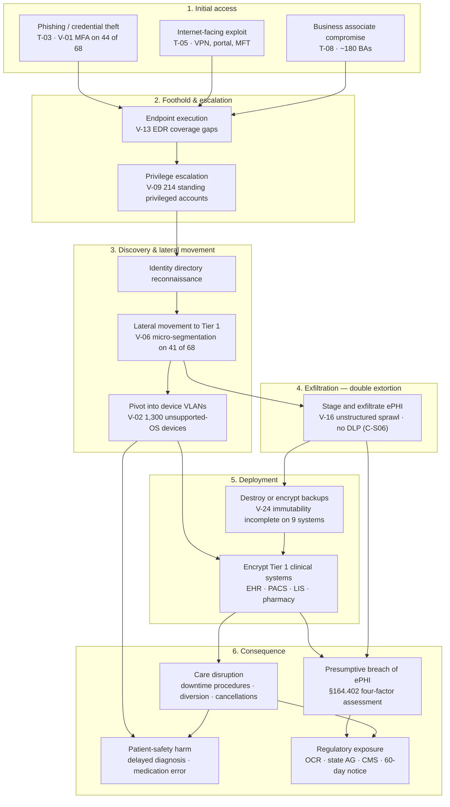

# 03.06 — Ransomware &amp; Healthcare Threat Profile

| Field | Value |
|---|---|
| Document ID | MBH-RA-RAN-2026-306 |
| Version | 1.0 |
| Date | 2026-07-15 |
| Classification | Confidential — Electronic Protected Health Information (ePHI) // Illustrative Portfolio Sample |
| Owner | Daniel Cho, Chief Information Security Officer &amp; HIPAA Security Official |
| Author | Advisory Team (Healthcare GRC / HIPAA) |
| Status | Approved |

## Purpose

Ransomware is the sector-defining threat to electronic protected health information. It is the one threat event that simultaneously attacks **all three** properties the HIPAA Security Rule protects — it destroys **availability**, corrupts or renders unusable **integrity**, and, in its modern double-extortion form, breaches **confidentiality** — and it is the only threat whose realisation can plausibly contribute to a patient's death.

This document is a deep profile of that threat, produced as part of the §164.308(a)(1)(ii)(A) risk analysis. It explains why hospitals are deliberately targeted, states the **OCR position that a ransomware attack involving ePHI is presumptively a reportable breach unless the covered entity demonstrates a low probability of compromise**, models the attack and impact chain against MercyBridge's actual estate, and maps the outcome onto the risks determined in 03.05 — principally **R-23 (score 20, the highest in the register)**, **R-24**, **R-10** and **R-47**.

Ransomware is not treated as a separate risk methodology. It is the scenario against which the rest of this phase is stress-tested.

## 1. Why Hospitals Are Targeted

Targeting of the health sector is not incidental. Every structural feature that makes a hospital good at delivering care makes it attractive to an extortion group.

| Driver | Mechanism | MercyBridge exposure |
|---|---|---|
| **Zero tolerance for downtime** | Care cannot pause; the victim's decision window is measured in hours, which maximises pressure to pay | 4 hospitals, ~1,200 licensed beds, 24×7 operations, no maintenance window |
| **Life-safety leverage** | Attackers know that diversion and delayed treatment create pressure no board can ignore | ED, ICU, OR, oncology and dialysis all depend on Tier 1 systems |
| **High-value, non-reissuable data** | A medical record cannot be cancelled and reissued like a payment card; it retains resale and fraud value indefinitely | ~2.1 million patient records |
| **Large, distributed attack surface** | Many sites, many users, many devices, many third parties | ~6,500 workforce, 34 locations, 68 ePHI systems, 6,120 devices, 38 cloud services, ~180 BAs |
| **Unpatchable clinical technology** | FDA-cleared device configurations under vendor change control cannot be patched on the entity's schedule | 1,300 devices on unsupported or vendor-frozen operating systems |
| **Regulatory amplification** | Extortion groups explicitly cite HIPAA and breach-notification exposure as leverage | OCR, state AG, CMS conditions of participation, 500+ media notice |
| **Constrained margins** | Non-profit health systems cannot outspend the problem; security competes with clinical capital | ~$1.8B net patient revenue; device replacement runs on a capital cycle |
| **Third-party concentration** | Compromising one vendor reaches many providers at once | Vendor-hosted EHR holds the whole clinical record (PC-1) |

## 2. The OCR Position — Ransomware Is Presumptively a Breach

This is the single most consequential regulatory point in the profile, and it is frequently misunderstood inside health systems: **"we paid, we restored, no data left the building"** is not, by itself, a defence.

| Element | Position |
|---|---|
| **Is ransomware a security incident?** | Yes. Under §164.304 a security incident includes attempted or successful unauthorised access to, use of, **disclosure, modification, or destruction of information**. Encryption of ePHI by an attacker is unauthorised modification and destruction. §164.308(a)(6) incident procedures are triggered immediately. |
| **Is it a breach?** | **Presumptively yes.** HHS guidance is that when ePHI is encrypted as the result of a ransomware attack, an unauthorised individual has taken possession or control of the information — an impermissible **disclosure** not permitted under the Privacy Rule. Under **§164.402**, an impermissible acquisition, access, use or disclosure of unsecured PHI **is presumed to be a breach** unless the covered entity demonstrates a **low probability that the PHI has been compromised**. |
| **How is the presumption rebutted?** | Only through a documented **§164.402(2) four-factor risk assessment**: (1) the nature and extent of the PHI involved, including identifiers and likelihood of re-identification; (2) the unauthorised person who used the PHI or to whom disclosure was made; (3) whether the PHI was actually acquired or viewed; (4) the extent to which the risk to the PHI has been mitigated. The burden of proof sits with the covered entity (§164.414(b)). |
| **Does exfiltration matter?** | It removes any realistic prospect of rebutting the presumption. But **absence of proven exfiltration does not create a defence** — the entity must still perform and document the four-factor assessment, and inability to prove data was *not* accessed weighs against a low-probability finding. |
| **Does encryption at rest help?** | Yes, decisively — if the ePHI was **encrypted to HHS-specified standards and the decryption key was not compromised**, the data is "secured" and the breach-notification safe harbour applies. This is why **R-40 (encryption at rest on only 51 of 68 systems)** is rated High: it is the difference between an incident and a mass-notification event. |
| **What if notification is required?** | §164.404 individual notice without unreasonable delay and no later than **60 days**; §164.406 media notice and §164.408 prompt HHS notice where **500 or more** individuals in a state or jurisdiction are affected. |
| **Does having a risk analysis matter?** | Materially. OCR ransomware investigations begin with a request for the §164.308(a)(1)(ii)(A) risk analysis. An entity that can produce a current, enterprise-wide analysis showing the ransomware risk was identified, rated and under treatment is in a fundamentally different position from one that cannot — which is why this phase exists. |

## 3. Attack and Impact Chain

## 4. Double and Multi-Point Extortion

Encryption-only ransomware is largely obsolete. The prevailing model layers pressure, and each layer maps to a distinct HIPAA consequence.

| Extortion layer | Attacker action | HIPAA consequence for MercyBridge | Related risk |
|---|---|---|---|
| 1 — Encryption | Clinical systems rendered unusable | Availability failure; §164.308(a)(7) contingency plan invoked; presumptive breach under §164.402 | R-23, R-47 |
| 2 — Exfiltration | ePHI copied out before encryption | Confidentiality breach; four-factor assessment cannot support a low-probability finding | R-24, R-41 |
| 3 — Publication threat | Leak-site countdown; sample records posted | Mass notification; media notice at 500+; reputational and patient-trust harm | R-24 |
| 4 — Patient-directed pressure | Individuals contacted directly with their own records | Acute privacy harm; sensitive categories (behavioural health, oncology) weaponised | R-24, R-36 |
| 5 — Third-party pressure | Regulators, partners or media notified by the attacker | Loss of control over disclosure timing while the 60-day clock runs | R-24, R-31 |
| 6 — Disruptive follow-on | DDoS or repeat intrusion during recovery | Extends downtime; degrades recovery capacity | R-50, R-47 |

## 5. Care-Disruption and Patient-Safety Consequences

This is the section that distinguishes a hospital's ransomware risk from any other organisation's. Under escalation rule **ESC-2**, loss of a Tier 1 clinical system for more than 24 hours floors impact at 4; under **ESC-1**, a credible patient-safety consequence of 4 or 5 sets the impact score outright.

| Clinical function | System dependency | Consequence of loss | Downtime tolerance |
|---|---|---|---|
| Emergency department | Halcyon ADT, ED tracking, LIS, PACS | Ambulance diversion; paper triage; unknown prior history at the point of care | Hours |
| Medication administration | CPOE, eMAR, pharmacy, automated dispensing | Manual ordering and transcription; verification loss; elevated medication-error rate | Hours |
| Diagnostic imaging | PACS, RIS, VNA, modalities | Studies cannot be read or compared to priors; stroke and trauma pathways slow | Hours |
| Laboratory | LIS, analysers, interfaces | Result turnaround collapses; critical-value reporting becomes manual | Hours |
| Surgery and periop | Perioperative system, anaesthesia, implant tracking | Elective cancellation; case-by-case safety review | 1 day |
| Critical care | Physiologic monitoring, ventilator data, ICU documentation | Loss of centralised alarm surveillance; bedside-only monitoring | Minutes to hours |
| Blood bank | Blood bank system | Manual crossmatch; transfusion delay | Minutes to hours |
| Oncology and dialysis | Oncology system, treatment scheduling | Regimen and schedule disruption with direct clinical consequence | 1–2 days |
| Health information exchange | HIE connector, EMPI | External records unavailable; duplicate-record risk on recovery | Days |
| Revenue cycle | Billing, coding, clearinghouse | Cash-flow interruption; no immediate clinical impact | Weeks |

Recovery is not the end of the event. Reconciling manually captured care back into the record creates an **integrity** risk in its own right (R-43) — retrospective documentation, duplicate patient records and lost interface messages — which is why the Phase 07 tabletop explicitly exercises re-entry and reconciliation, not just restoration.

## 6. MercyBridge Exposure — What Would Actually Help or Hurt

| Kill-chain stage | Controls in place (03.04) | Effectiveness | Residual gap |
|---|---|---|---|
| Initial access | C-S03 email security gateway; C-A09 anti-malware; C-A08 awareness training | Effective / Partially Effective | MFA on only 44 of 68 systems (V-01); training at 91% (V-19) |
| Execution | C-T10 EDR across the managed estate | Partially Effective | Legacy servers and vendor-excluded device-adjacent endpoints (V-13) |
| Privilege escalation | C-A11 password management; C-T01 unique user ID | Partially Effective | No privileged access management (C-S07 Not Implemented); 214 standing privileged accounts (V-09) |
| Lateral movement | C-T09 ten-zone model, 96 device VLANs, default-deny; C-S02 NAC | Partially Effective | Micro-segmentation on 41 of 68 systems (V-06); 3 flat-VLAN sites (V-07) |
| Device pivot | C-S10 IoMT platform; C-T09 device VLANs | Effective / Partially Effective | 1,300 unpatchable devices (V-02); 190 unprofiled portables (V-18) |
| Exfiltration | C-S01 SIEM; C-T10 EDR | Partially Effective | No DLP (C-S06); no data discovery (C-S08); unstructured sprawl (V-16) |
| Backup destruction | C-S04 backup with immutability for Tier 1 | Partially Effective | Nine Tier 2–3 systems lack immutable or offline copies (V-24) |
| Encryption impact | C-A13 contingency plan; clinical downtime procedures | Partially Effective | Tier 1 restoration time unvalidated at scale; downtime procedures untested at all ~30 clinics (V-24) |
| Breach determination | C-T04 encryption at rest on 51 of 68 | Partially Effective | 17 systems and most device-resident ePHI outside safe harbour (V-04, V-03) |
| Response | C-A12 incident procedures | Partially Effective | Formal IR plan and ransomware tabletop delivered in Phase 07 |

## 7. Scenario RW-01 — Modelled Ransomware Event

| Attribute | Modelled value |
|---|---|
| Scenario ID | MBH-SCN-RW-01 |
| Initial access | Phishing of a revenue-cycle account without MFA (T-03 / V-01) |
| Dwell time before deployment | 9 days |
| Lateral path | User zone → identity directory → data-centre zone via incompletely segmented Tier 2 system (V-06) |
| ePHI exfiltrated before encryption | Sample of HIM repository and departmental file shares; volume indeterminate (V-16) |
| Systems encrypted | 9 of 12 Tier 1 systems; 14 Tier 2 systems; 2 device management platforms |
| Clinical effect | Full EHR downtime 48–72 h; ED diversion at 2 of 4 hospitals; elective surgery cancelled for 5 days; paper documentation enterprise-wide |
| Breach position | Presumptive breach under §164.402; four-factor assessment cannot demonstrate low probability of compromise where exfiltration is evidenced and encryption-at-rest safe harbour is unavailable |
| Notification exposure | Individual notice within 60 days; media and prompt HHS notice (>500 individuals); state AG notification |
| Recovery | 10–21 days to full restoration; 4–8 weeks of documentation reconciliation |
| Mapped risks | R-23 (20 High), R-24 (16 High), R-10 (15 High), R-40 (16 High), R-47 (12 Moderate), R-48 (8 Moderate), R-43 (9 Moderate) |
| Score justification | Likelihood 4 (Likely — sector base rate plus identified exploitable path); Impact 5 (Severe — ESC-2 Tier 1 availability plus patient-safety consequence) |

## 8. Priority Countermeasures Arising

These feed directly into the 03.08 treatment plan and the Phase 04–05 safeguard workplans. Ordering reflects marginal ransomware-risk reduction per unit of effort, not cost.

| # | Countermeasure | Closes | Target | Owner |
|---|---|---|---|---|
| 1 | Enforce MFA across all 68 ePHI systems, prioritising remote access and privileged accounts | V-01 → R-01, R-34, R-23 | Q4 2026 | Marcus Reed |
| 2 | Complete host-based micro-segmentation for the remaining 27 systems; split the 3 flat-VLAN sites | V-06, V-07 → R-17, R-18, R-10 | Q4 2026 | Anthony Ruiz |
| 3 | Extend immutable and offline backup to the 9 remaining Tier 2–3 systems; validate Tier 1 restoration at full scale | V-24 → R-47, R-48, R-23 | Q3–Q4 2026 | Anthony Ruiz |
| 4 | Complete encryption at rest for the 17 systems still partial or absent, to secure the breach safe harbour | V-04 → R-40, R-24 | Q4 2026 | Marcus Reed |
| 5 | Close EDR coverage gaps and agree device-vendor exclusions with compensating monitoring | V-13 → R-25, R-23 | Q3 2026 | Marcus Reed |
| 6 | Implement DLP on email and endpoints; run automated ePHI data discovery across unstructured stores | C-S06, C-S08 → R-24, R-41 | 2027 capital cycle | Daniel Cho |
| 7 | Implement privileged access management with just-in-time elevation | C-S07 → R-03, R-23 | 2027 capital cycle | Marcus Reed |
| 8 | Exercise the ransomware tabletop, including four-factor breach determination and clinical downtime procedures at outpatient sites | V-24 → R-49, R-23 | 2026-08 (Phase 07) | Daniel Cho |
| 9 | Establish ransomware-specific detection use cases in the SIEM and extend ingestion to all 68 systems | C-S01 → R-55, R-23 | Q4 2026 | Marcus Reed |
| 10 | Formalise a pre-agreed ransom-payment decision framework with Legal, the Board and cyber insurers | Governance → R-23 | Q3 2026 | Lisa Coleman |

## 9. Detection and Early-Warning Posture

| Indicator | Source | Current coverage | Gap |
|---|---|---|---|
| Anomalous authentication and impossible travel | Identity directory → SIEM | Tier 1 and SSO estate | Local-credential systems (7) invisible |
| Mass file modification or encryption behaviour | EDR | Managed endpoints and servers | Legacy and vendor-excluded hosts |
| Backup deletion or immutability policy change | Backup platform → SIEM | Tier 1 | 9 Tier 2–3 systems |
| Unusual east-west traffic between zones | Firewall and flow telemetry | Inter-zone boundaries | Intra-zone movement where micro-segmentation is absent |
| Device VLAN anomaly | C-S10 IoMT platform | 5,930 of 6,120 devices | 190 unprofiled portables |
| Large outbound transfer | Egress proxy, firewall | Partial | No DLP content inspection |
| Sector threat intelligence on active campaigns | HHS HC3, Health-ISAC, CISA KEV | Enterprise | Translation into detection content is manual |

## Cross-References

| Reference | Relevance |
|---|---|
| 03.01 — Risk Analysis Methodology | The §164.308(a)(1)(ii)(A) analysis this profile supports |
| 03.02 — Threat Identification | Threat source TS-A1 and threat events T-01, T-02 |
| 03.03 — Vulnerability Identification | V-02, V-06, V-13, V-16, V-24 as ransomware enablers |
| 03.04 — Existing Controls Assessment | The kill-chain control mapping in §6 |
| 03.05 — Likelihood, Impact &amp; Risk Determination | R-23, R-24, R-10, R-40 and the ESC escalation rules |
| 03.07 — Risk Register | Registered entries for the ransomware risk family |
| 02.04 — Medical Devices &amp; IoMT | The 1,300 unpatchable devices in the pivot path |
| 02.05 — Network Architecture &amp; Segmentation | Zone model and micro-segmentation status |
| 02.06 — Cloud &amp; Hosted Services | Hosted-EHR concentration (PC-1) |
| Phase 04 — Administrative Safeguards | §164.308(a)(7) contingency planning and training |
| Phase 05 — Physical &amp; Technical Safeguards | Encryption, segmentation, EDR and audit controls |
| Phase 07 — Incident Response &amp; Breach Notification | Ransomware tabletop and the §164.402 four-factor assessment |
| Phase 08 — Independent Assessment | Ironwood Security Labs validation of the modelled attack path |

---
[⬅ Previous](03.05-likelihood-impact-and-risk-determination.md) · [🏠 Phase README](03.00-README.md) · [Next ➡](03.07-risk-register.md)
