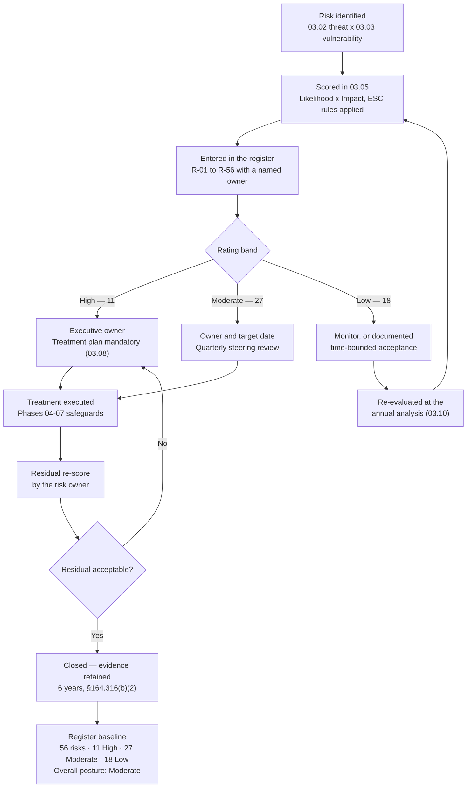

# 03.07 — Risk Register

| Field | Value |
|---|---|
| Document ID | MBH-RA-REG-2026-307 |
| Version | 1.0 |
| Date | 2026-07-15 |
| Classification | Confidential — Electronic Protected Health Information (ePHI) // Illustrative Portfolio Sample |
| Owner | Daniel Cho, Chief Information Security Officer &amp; HIPAA Security Official |
| Co-Owner | Michelle Tran, VP Enterprise Risk (register custodian) |
| Author | Advisory Team (Healthcare GRC / HIPAA) |
| Status | Approved |

## Purpose

This is **the register** — the documented output of the risk analysis required by **45 CFR §164.308(a)(1)(ii)(A)** and the artefact that satisfies **element 8** of OCR's nine-element expectation, *finalize documentation*. It records every one of the **56 risks to the confidentiality, integrity and availability of ePHI** identified across Phase 03, each with its threat–vulnerability basis, its likelihood and impact scores, its calculated score, its rating and — critically — **a named accountable owner**.

> **Register baseline: 56 risks — 11 High, 27 Moderate, 18 Low. Overall risk posture: Moderate.**

A register without owners is a list; a register with owners is a management instrument. OCR's most frequently cited failure is not the absence of a threat catalogue but the absence of a **current, complete, enterprise-wide, retained** record of risk to ePHI. This document is that record. It is retained for **six years from the later of creation or last effective date** under **§164.316(b)(2)(i)**, versioned under 03.10, and carried forward into treatment under **§164.308(a)(1)(ii)(B)** in 03.08.

Scores, ratings and titles in this register are **identical** to those determined in 03.05. Nothing is re-scored here; this document adds ownership, the threat/vulnerability basis in-line, and the reconciliation views the Security Steering Committee and the Board Audit &amp; Compliance Committee use.

## 1. How to Read the Register

| Column | Meaning |
|---|---|
| Risk ID | Permanent identifier R-01 to R-56. IDs are never reused; a retired risk is closed, not deleted |
| Category | One of ten risk categories used consistently across Phase 03 |
| Risk description | The risk to ePHI, stated as a consequence and not as a missing control |
| Threat | The threat event from 03.02 (T-01 to T-24) that drives the risk |
| Vulnerability | The weakness from 03.03 (V-01 to V-30) or predisposing condition (PC-1 to PC-6) exploited |
| L / I | Likelihood and impact, each 1–5, assessed **residually** — after the controls credited in 03.04 |
| Score | L × I, adjusted where the patient-safety escalation rules ESC-1 to ESC-3 apply |
| Rating | High 15–25 · Moderate 8–12 · Low 1–6 |
| Owner | The individual accountable for the treatment decision and its delivery |

**Ownership rule.** The owner is the executive or manager with the authority and the budget to change the risk — not the person who reported it and not the security team by default. Where a risk crosses functions, one owner is named and the others are contributors. Owner changes require the Security Official's approval and are recorded in the register change log.

## 2. The Risk Register — All 56 Risks

| Risk ID | Category | Risk description | Threat | Vulnerability | L | I | Score | Rating | Owner |
|---|---|---|---|---|---|---|---|---|---|
| R-01 | Access control &amp; identity | Credential compromise yields unauthorised ePHI access because MFA is enforced on only 44 of 68 ePHI systems | T-03 Phishing / credential harvesting | V-01 MFA incomplete (44 of 68) | 4 | 4 | 16 | **High** | Marcus Reed |
| R-02 | Access control &amp; identity | Shared and generic clinical logins defeat unique user identification and destroy audit attribution | T-10 Insider snooping | V-08 Shared / generic clinical logins | 4 | 4 | 16 | **High** | Marcus Reed |
| R-03 | Access control &amp; identity | Standing excessive privilege (214 elevated EHR accounts) enables large-scale access or exfiltration | T-11 Insider exfiltration | V-09 Standing privilege; V-22 No recertification cycle | 3 | 4 | 12 | Moderate | Marcus Reed |
| R-04 | Access control &amp; identity | Departed or transferred workforce retain access beyond 24 hours outside the SSO domain | T-11 Insider exfiltration | V-23 Termination revocation latency | 3 | 4 | 12 | Moderate | Marcus Reed |
| R-05 | Access control &amp; identity | Break-glass emergency access is used without retrospective review, masking improper access | T-20 Wrong-patient / erroneous entry | V-26 Break-glass review inconsistent | 3 | 3 | 9 | Moderate | Dr. Samuel Ortega |
| R-06 | Access control &amp; identity | Vendor remote-support entitlements across 742 devices are under-reviewed | T-09 Vendor remote-support abuse | V-18 NAC gaps; vendor connectivity | 2 | 4 | 8 | Moderate | Anthony Ruiz |
| R-07 | Access control &amp; identity | Inconsistent automatic logoff leaves ePHI sessions exposed | T-14 Unauthorised physical entry | V-17 Inconsistent automatic logoff | 2 | 3 | 6 | Low | Marcus Reed |
| R-08 | Access control &amp; identity | Patient-portal proxy relationships are not periodically recertified | T-10 Insider snooping | V-22 No recertification cycle | 2 | 2 | 4 | Low | Rebecca Stern |
| R-09 | Medical device &amp; IoMT | Known exploited vulnerabilities on 1,300 unsupported-OS devices cannot be patched | T-06 Exploitation of unsupported device OS | V-02 Unsupported device OS; V-14 No vendor patch cadence | 4 | 4 | 16 | **High** | Anthony Ruiz |
| R-10 | Medical device &amp; IoMT | Malware propagation into device VLANs halts clinical device availability — patient-safety consequence (ESC-1) | T-01 Enterprise ransomware | V-02 Unsupported device OS; V-06 Incomplete micro-segmentation | 3 | 5 | 15 | **High** | Anthony Ruiz |
| R-11 | Medical device &amp; IoMT | ePHI at rest on 3,170 ePHI-bearing devices cannot be encrypted; loss or disposal forfeits safe harbour (ESC-1) | T-13 Theft of device or media | V-03 Device platforms cannot encrypt at rest | 3 | 5 | 15 | **High** | Anthony Ruiz |
| R-12 | Medical device &amp; IoMT | 1,836 devices without an MDS2 on file cannot be assessed to a consistent standard | T-06 Exploitation of unsupported device OS | PC-3 FDA-cleared configs under vendor change control | 3 | 3 | 9 | Moderate | Anthony Ruiz |
| R-13 | Medical device &amp; IoMT | Default and shared device credentials (~1,850 devices) permit unattributed access | T-09 Vendor remote-support abuse | V-08 Shared / default credentials | 2 | 4 | 8 | Moderate | Anthony Ruiz |
| R-14 | Medical device &amp; IoMT | 118 telemetry devices transmit ePHI over legacy protocols that cannot negotiate TLS | T-05 Exploitation of internet-facing service | V-05 Encryption in transit incomplete | 2 | 4 | 8 | Moderate | Anthony Ruiz |
| R-15 | Medical device &amp; IoMT | 190 portable devices intermittently unprofiled by NAC may land on an incorrect VLAN | T-06 Exploitation of unsupported device OS | V-18 NAC profiling gaps | 2 | 3 | 6 | Low | Anthony Ruiz |
| R-16 | Medical device &amp; IoMT | Vendor field-service media introduce malware during on-site maintenance | T-06 Exploitation of unsupported device OS | V-02 Unsupported device OS | 1 | 4 | 4 | Low | Anthony Ruiz |
| R-17 | Network &amp; infrastructure | Incomplete micro-segmentation (41 of 68 systems) permits lateral movement into Tier 1 clinical systems | T-07 Lateral movement / privilege escalation | V-06 Incomplete micro-segmentation | 4 | 4 | 16 | **High** | Anthony Ruiz |
| R-18 | Network &amp; infrastructure | Three outpatient sites on a legacy flat VLAN allow device and workstation traffic to intermingle | T-07 Lateral movement / privilege escalation | V-07 Legacy flat VLAN at 3 sites | 3 | 4 | 12 | Moderate | Anthony Ruiz |
| R-19 | Network &amp; infrastructure | 74 unowned firewall rules erode the default-deny posture | T-17 Misconfiguration exposing ePHI | V-15 Firewall rule hygiene | 3 | 3 | 9 | Moderate | Marcus Reed |
| R-20 | Network &amp; infrastructure | Split-tunnel exception for two legacy remote coding tools bypasses inspection | T-05 Exploitation of internet-facing service | V-15 Split-tunnel exception | 2 | 4 | 8 | Moderate | Marcus Reed |
| R-21 | Network &amp; infrastructure | Wireless guest and clinical separation has drifted at three sites | T-14 Unauthorised physical entry | V-07 Legacy flat VLAN / drift | 2 | 3 | 6 | Low | Marcus Reed |
| R-22 | Network &amp; infrastructure | Rogue access points or untracked network taps at outpatient sites | T-14 Unauthorised physical entry | PC-6 Open clinical physical environments | 2 | 2 | 4 | Low | Marcus Reed |
| R-23 | Malware, ransomware &amp; endpoint | Enterprise ransomware encrypts Tier 1 clinical systems, causing multi-day care disruption and diversion (ESC-2) — **the highest-scored risk in the register** | T-01 Enterprise ransomware | V-06 Segmentation; V-13 EDR gaps; V-24 Under-tested contingency | 4 | 5 | 20 | **High** | Daniel Cho |
| R-24 | Malware, ransomware &amp; endpoint | Double-extortion exfiltration of ePHI before encryption triggers presumptive breach and mass notification | T-02 Pre-encryption exfiltration | V-04 Encryption at rest incomplete; V-16 Unstructured ePHI sprawl | 4 | 4 | 16 | **High** | Daniel Cho |
| R-25 | Malware, ransomware &amp; endpoint | EDR coverage gaps on legacy servers and device-adjacent endpoints delay detection | T-05 Exploitation of internet-facing service | V-13 EDR gaps; V-14 Patch SLA breaches | 3 | 4 | 12 | Moderate | Marcus Reed |
| R-26 | Malware, ransomware &amp; endpoint | Macro or script-based initial access from email attachments establishes a foothold | T-03 Phishing / credential harvesting | V-19 Training and simulation gaps | 3 | 3 | 9 | Moderate | Marcus Reed |
| R-27 | Malware, ransomware &amp; endpoint | Removable-media malware on non-clinical endpoints | T-13 Theft of device or media | V-12 Removable media not centrally controlled | 2 | 3 | 6 | Low | Marcus Reed |
| R-28 | Business associate &amp; supply chain | Compromise or extended outage of the vendor-hosted Halcyon EHR holding the entire 2.1M-record clinical archive (ESC-2) | T-08 Business associate compromise | PC-1 Single-vendor EHR concentration | 3 | 5 | 15 | **High** | Daniel Cho |
| R-29 | Business associate &amp; supply chain | ePHI disclosed to three business associates whose BAAs are still under remediation (MBH-SYS-029, -033, -058) | T-08 Business associate compromise | V-21 Incomplete BA assurance | 3 | 4 | 12 | Moderate | Lisa Coleman |
| R-30 | Business associate &amp; supply chain | Subcontractor (BA-of-BA) chain is unvisible for nine hosted services | T-08 Business associate compromise | V-21 No subcontractor visibility | 3 | 3 | 9 | Moderate | Lisa Coleman |
| R-31 | Business associate &amp; supply chain | Business associate breach notification arrives too late to meet the 60-day duty to individuals | T-08 Business associate compromise | V-21 Incomplete BA assurance | 2 | 4 | 8 | Moderate | Lisa Coleman |
| R-32 | Business associate &amp; supply chain | Offshore support access to ePHI at two services exceeds minimum necessary | T-08 Business associate compromise | V-21 Offshore support access | 2 | 3 | 6 | Low | Lisa Coleman |
| R-33 | Business associate &amp; supply chain | Data return and certified deletion at contract exit is unevidenced | T-18 Improper disposal | V-21 Incomplete BA assurance | 2 | 2 | 4 | Low | Lisa Coleman |
| R-34 | Workforce &amp; human factors | Phishing or business email compromise gives an adversary a workforce mailbox containing ePHI | T-03 Phishing; T-04 Business email compromise | V-01 MFA incomplete; V-19 Training gaps | 5 | 3 | 15 | **High** | Daniel Cho |
| R-35 | Workforce &amp; human factors | Misdirected fax, email, statement or records release discloses ePHI to the wrong recipient | T-16 Misdirected communication | V-19 Training gaps | 4 | 3 | 12 | Moderate | Rebecca Stern |
| R-36 | Workforce &amp; human factors | Workforce member browses records without a treatment, payment or operations purpose | T-10 Insider snooping; T-11 Insider exfiltration | V-11 Activity review not evidenced | 3 | 4 | 12 | Moderate | Rebecca Stern |
| R-37 | Workforce &amp; human factors | Training gaps (91% completion; thin role-based clinical content) leave the workforce unprepared | T-03 Phishing / credential harvesting | V-19 Training and simulation gaps | 3 | 3 | 9 | Moderate | Karen Boyd |
| R-38 | Workforce &amp; human factors | Unsanctioned messaging applications carry clinical information outside governed channels | T-16 Misdirected communication | V-20 Legacy policy suite | 2 | 3 | 6 | Low | Rebecca Stern |
| R-39 | Workforce &amp; human factors | Service desk is social-engineered into an improper credential reset | T-03 Phishing / credential harvesting | V-19 Training gaps | 2 | 2 | 4 | Low | Marcus Reed |
| R-40 | Data protection, encryption &amp; disposal | ePHI at rest is unencrypted or partially encrypted on 17 of 68 systems and on parts of the endpoint estate, forfeiting the breach safe harbour | T-13 Theft; T-19 Loss in transit | V-04 Encryption at rest incomplete; V-12 Endpoint encryption gaps | 4 | 4 | 16 | **High** | Daniel Cho |
| R-41 | Data protection, encryption &amp; disposal | Unstructured ePHI has sprawled across departmental file shares and mailboxes with no reliable volume estimate | T-02 Pre-encryption exfiltration; T-17 Misconfiguration | V-16 Unstructured ePHI sprawl | 3 | 4 | 12 | Moderate | Marcus Reed |
| R-42 | Data protection, encryption &amp; disposal | Eight systems transmit ePHI over channels with partial or absent TLS | T-05 Exploitation of internet-facing service | V-05 Encryption in transit incomplete | 3 | 3 | 9 | Moderate | Marcus Reed |
| R-43 | Data protection, encryption &amp; disposal | Clinical data integrity is degraded by wrong-patient documentation, duplicate records or interface corruption (ESC-3) | T-20 Wrong-patient entry; T-22 Interface failure | PC-4 24×7 operations, no maintenance window | 3 | 3 | 9 | Moderate | Dr. Samuel Ortega |
| R-44 | Data protection, encryption &amp; disposal | Media and device sanitisation at disposal is not consistently certificated to NIST SP 800-88 | T-18 Improper disposal | V-29 Portable equipment / disposal control | 2 | 4 | 8 | Moderate | Anthony Ruiz |
| R-45 | Data protection, encryption &amp; disposal | Over-retention beyond the approved schedule enlarges the exposure surface | T-02 Pre-encryption exfiltration | V-16 Unstructured ePHI sprawl | 2 | 3 | 6 | Low | Rebecca Stern |
| R-46 | Data protection, encryption &amp; disposal | Incidental ePHI persists in logs, SIEM data and non-production environments | T-17 Misconfiguration exposing ePHI | V-16 Production ePHI in non-production | 2 | 2 | 4 | Low | Marcus Reed |
| R-47 | Contingency planning &amp; availability | Tier 1 restoration time has never been validated at full scale; actual recovery may exceed clinical tolerance | T-01 Enterprise ransomware; T-21 Hardware failure | V-24 Under-tested contingency | 3 | 4 | 12 | Moderate | Anthony Ruiz |
| R-48 | Contingency planning &amp; availability | Backup immutability and offline copies are incomplete for nine Tier 2–3 systems | T-01 Enterprise ransomware | V-24 Under-tested contingency | 2 | 4 | 8 | Moderate | Anthony Ruiz |
| R-49 | Contingency planning &amp; availability | Clinical downtime procedures have not been exercised at all ~30 outpatient sites | T-23 Cloud / hosted-EHR outage | V-24 Under-tested contingency | 3 | 3 | 9 | Moderate | Dr. Samuel Ortega |
| R-50 | Contingency planning &amp; availability | Single-path connectivity at four outpatient sites; regional utility or carrier outage isolates them | T-23 Telecommunications outage; T-15 DDoS | PC-4 24×7 operations, no maintenance window | 2 | 3 | 6 | Low | Anthony Ruiz |
| R-51 | Physical &amp; environmental | Unattended logged-in workstations in clinical areas expose ePHI to patients, visitors and unauthorised staff | T-14 Unauthorised physical entry | V-27 Unattended logged-in workstations | 3 | 3 | 9 | Moderate | Marcus Reed |
| R-52 | Physical &amp; environmental | Tailgating and badge-sharing permit unauthorised entry to clinical space, IDFs and one data-centre mantrap | T-14 Unauthorised physical entry | V-28 Tailgating and badge-sharing | 2 | 3 | 6 | Low | Karen Boyd |
| R-53 | Physical &amp; environmental | Flood, fire or extended power loss disables a data centre or clinic site | T-24 Environmental event | V-30 IDF access drift; environmental monitoring | 2 | 2 | 4 | Low | Anthony Ruiz |
| R-54 | Governance, documentation &amp; oversight | The legacy policy suite predates the current estate and §164.316(b) retention is not uniformly evidenced | T-16 Misdirected communication | V-20 Legacy policy suite | 3 | 3 | 9 | Moderate | Karen Boyd |
| R-55 | Governance, documentation &amp; oversight | Information system activity review under §164.308(a)(1)(ii)(D) is not evidenced for 19 systems | T-10 Insider snooping | V-10 Audit logging incomplete; V-11 Activity review not evidenced | 2 | 3 | 6 | Low | Daniel Cho |
| R-56 | Governance, documentation &amp; oversight | Sanction policy application under §164.308(a)(1)(ii)(C) is not consistently documented | T-11 Insider exfiltration | V-25 Sanction documentation inconsistent | 2 | 2 | 4 | Low | Karen Boyd |

## 3. Reconciliation — Rating Distribution

| Rating | Score band | Count | Share | Governance response |
|---|---|---|---|---|
| **High** | 15–25 | **11** | 19.6% | Executive owner; treatment plan in 03.08; 90-day remediation or a board-visible, time-bounded exception |
| **Moderate** | 8–12 | **27** | 48.2% | Owner and target date; remediation within 6–12 months; quarterly review |
| **Low** | 1–6 | **18** | 32.1% | Monitor; documented acceptance permitted; re-evaluate at the annual analysis |
| **Total** | — | **56** | 100% | — |

## 4. Reconciliation — Distribution by Category

| Risk category | Risks | High | Moderate | Low | Principal owner(s) |
|---|---|---|---|---|---|
| Access control &amp; identity management | 8 | 2 | 4 | 2 | Marcus Reed |
| Medical device &amp; IoMT | 8 | 3 | 3 | 2 | Anthony Ruiz |
| Network &amp; infrastructure | 6 | 1 | 3 | 2 | Anthony Ruiz / Marcus Reed |
| Malware, ransomware &amp; endpoint | 5 | 2 | 2 | 1 | Daniel Cho / Marcus Reed |
| Business associate &amp; supply chain | 6 | 1 | 3 | 2 | Lisa Coleman |
| Workforce &amp; human factors | 6 | 1 | 3 | 2 | Rebecca Stern |
| Data protection, encryption &amp; disposal | 7 | 1 | 4 | 2 | Daniel Cho / Marcus Reed |
| Contingency planning &amp; availability | 4 | 0 | 3 | 1 | Anthony Ruiz |
| Physical &amp; environmental | 3 | 0 | 1 | 2 | Karen Boyd / Marcus Reed |
| Governance, documentation &amp; oversight | 3 | 0 | 1 | 2 | Karen Boyd |
| **Total** | **56** | **11** | **27** | **18** | — |

## 5. Reconciliation — Distribution by Owner

| Owner | Role | Risks owned | High | Moderate | Low |
|---|---|---|---|---|---|
| Marcus Reed | Information Security Manager | 17 | 2 | 9 | 6 |
| Anthony Ruiz | Chief Information Officer | 16 | 4 | 8 | 4 |
| Daniel Cho | CISO &amp; HIPAA Security Official | 6 | 5 | 0 | 1 |
| Rebecca Stern | Chief Privacy Officer | 5 | 0 | 2 | 3 |
| Lisa Coleman | General Counsel | 5 | 0 | 3 | 2 |
| Karen Boyd | Chief Compliance Officer | 4 | 0 | 2 | 2 |
| Dr. Samuel Ortega | Chief Medical Information Officer | 3 | 0 | 3 | 0 |
| **Total** | — | **56** | **11** | **27** | **18** |

## 6. The Eleven High Risks — Why Each Is High

Every High risk has compensating controls already credited in 03.04 §9. Each remains High because **compensation is not elimination**. The column below states the specific reason the rating survives the credit.

| Risk ID | Title | L | I | Score | Owner | Why it is rated High |
|---|---|---|---|---|---|---|
| R-23 | Enterprise ransomware encrypting Tier 1 clinical systems | 4 | 5 | 20 | Daniel Cho | Likelihood 4 is sector-evidenced against hospitals; impact floored at 5 by ESC-2 because multi-day Tier 1 downtime means diversion and cancelled care. Backup immutability is incomplete for nine systems and full-scale restoration time has never been validated |
| R-01 | MFA absent on 24 of 68 ePHI systems | 4 | 4 | 16 | Marcus Reed | Credential theft is the dominant initial-access vector and phishing likelihood is 5; SSO without a second factor does not stop credential replay. 17 systems are SSO-only and 7 accept local credentials |
| R-02 | Shared and generic clinical logins | 4 | 4 | 16 | Marcus Reed | Directly defeats the **required** specification at §164.312(a)(2)(i). Where a session is shared, no audit control can attribute access, so both prevention and detection fail together |
| R-09 | Unsupported-OS medical devices with known exploited vulnerabilities | 4 | 4 | 16 | Anthony Ruiz | 1,300 devices (21.2% of the fleet) cannot be patched; there is no contractually backed patch cadence with several vendors. The underlying flaw is structurally permanent under FDA-cleared change control (PC-3) |
| R-17 | Lateral movement through incomplete micro-segmentation | 4 | 4 | 16 | Anthony Ruiz | Host-based policy reaches only 41 of 68 systems, so the zone model does not contain an intrusion once inside. This is the enabling condition for R-23, R-10 and R-24 simultaneously |
| R-24 | Double-extortion exfiltration of ePHI before encryption | 4 | 4 | 16 | Daniel Cho | No DLP (C-S06) and no automated ePHI discovery (C-S08); egress monitoring is partial. Exfiltration of 2.1M records would be a presumptive breach requiring individual, HHS and media notification |
| R-40 | ePHI at rest unencrypted or partially encrypted | 4 | 4 | 16 | Daniel Cho | 17 of 68 systems plus endpoint gaps sit outside the encryption safe harbour, so a loss or theft becomes a **reportable breach** rather than a non-event. Likelihood 4 reflects observed device loss frequency across 6,500 workforce members |
| R-10 | Malware propagation into device VLANs halting clinical devices | 3 | 5 | 15 | Anthony Ruiz | Escalated under **ESC-1**: loss of infusion, telemetry and imaging device availability is a credible patient-safety consequence, not merely a data event. Micro-segmentation gaps plus three flat-VLAN sites provide the path |
| R-11 | Unencryptable ePHI at rest on 3,170 devices | 3 | 5 | 15 | Anthony Ruiz | Escalated under **ESC-1**: five device platforms cannot encrypt at all under vendor OS constraint (V-03), so there is no cryptographic safe harbour on loss or disposal, and the population is large enough to cross the 500-individual media threshold |
| R-28 | Compromise or extended outage of the vendor-hosted Halcyon EHR | 3 | 5 | 15 | Daniel Cho | Escalated under **ESC-2**: the entire 2.1M-record clinical archive sits with a single business associate (PC-1). Assurance is documentary (SOC 2 Type II, BAA) rather than tested, and MercyBridge retains full HIPAA liability regardless |
| R-34 | Phishing / BEC compromising mailboxes containing ePHI | 5 | 3 | 15 | Daniel Cho | The only risk scored **likelihood 5** — it is occurring now, at volume, against ~6,500 mailboxes. Training sits at 91% against a 100% target, MFA is incomplete, and there is no outbound DLP |

**Concentration.** Eight of the eleven trace to just three root conditions: **incomplete identity assurance** (R-01, R-02, R-34), an **unpatchable device estate** (R-09, R-10, R-11) and **incomplete segmentation** (R-17, R-23, R-24). That concentration is the single most useful finding in the register — it means the High tier is addressable by three coherent programmes rather than eleven unrelated projects, and it shapes the wave structure of 03.08.

## 7. Register Lifecycle

## 8. Register Governance and Retention

| Control | Statement |
|---|---|
| Custody | Michelle Tran, VP Enterprise Risk, maintains the register of record; Daniel Cho approves all rating and ownership changes |
| Change log | Every addition, re-score, owner change, acceptance and closure is logged with date, actor and rationale in `trackers/` |
| Cadence | Quarterly review at the Security Steering Committee; full rebaseline at the annual analysis (03.10) |
| New-risk intake | Any workforce member may raise a candidate risk; Marcus Reed triages within 10 business days and scores it against the 03.05 scales |
| Acceptance | Permitted for Low and, exceptionally, Moderate risks only — documented, time-bounded and signed by an executive with authority. **No High risk may be accepted without Board Audit &amp; Compliance Committee visibility** |
| Retention | Six years from the later of creation or last effective date, per **§164.316(b)(2)(i)**; superseded versions are retained, not overwritten |
| Availability | Produced to HHS OCR, internal audit, Beacon Assurance and Ironwood Security Labs on request |

## 9. Register Assumptions and Limitations

| # | Statement |
|---|---|
| 1 | Scores are residual — assessed after crediting the controls rated in 03.04 — and are judgement-based and calibrated, not actuarial |
| 2 | Business associate risks are assessed from SOC 2 Type II reports, HITRUST certificates and BAA terms, not direct testing; the assurance gap itself is registered as R-30 |
| 3 | Medical device internals were not scanned; ratings rely on passive profiling, MDS2 forms (on file for 4,284 of 6,120 devices) and vendor attestation |
| 4 | Unstructured ePHI volumes on file shares are unquantified; R-41 carries that uncertainty explicitly rather than assuming it away |
| 5 | The register is a point-in-time baseline as at 2026-04 and is superseded by any update made under 03.10 |
| 6 | Independent validation of these entries is performed in Phase 08 by Ironwood Security Labs and by Internal Audit |

## Cross-References

| Reference | Relevance |
|---|---|
| 03.01 — Risk Analysis Methodology | Element 8, "finalize documentation"; register cadence and triggers |
| 03.02 — Threat Identification | Threat events T-01 to T-24 in the Threat column |
| 03.03 — Vulnerability Identification | Vulnerabilities V-01 to V-30 and conditions PC-1 to PC-6 in the Vulnerability column |
| 03.04 — Existing Controls Assessment | Controls credited in every residual score; §9 lists what is already working against the 11 High risks |
| 03.05 — Likelihood, Impact &amp; Risk Determination | Source of every L, I, score and rating reproduced here |
| 03.06 — Ransomware &amp; Healthcare Threat Profile | Deep treatment of R-23, R-24 and R-10 |
| 03.08 — Risk Management Plan | §164.308(a)(1)(ii)(B) treatment decisions for every entry above |
| 03.09 — Risk Analysis Report | The formal report to the Security Official and the Board committee |
| 03.10 — Periodic Review &amp; Update | How this register stays current under §164.308(a)(8) |
| 02.02 — ePHI System Inventory | The 68 in-scope systems and their tiering |
| Phase 04 / Phase 05 — Safeguards | Where High and Moderate risks are remediated |
| Phase 06 — Business Associate Risk | Treatment of R-28 to R-33 |
| Phase 08 — Independent Assessment | Independent validation of register completeness and scoring |

---
[⬅ Previous](03.06-ransomware-and-healthcare-threat-profile.md) · [🏠 Phase README](03.00-README.md) · [Next ➡](03.08-risk-management-plan.md)
