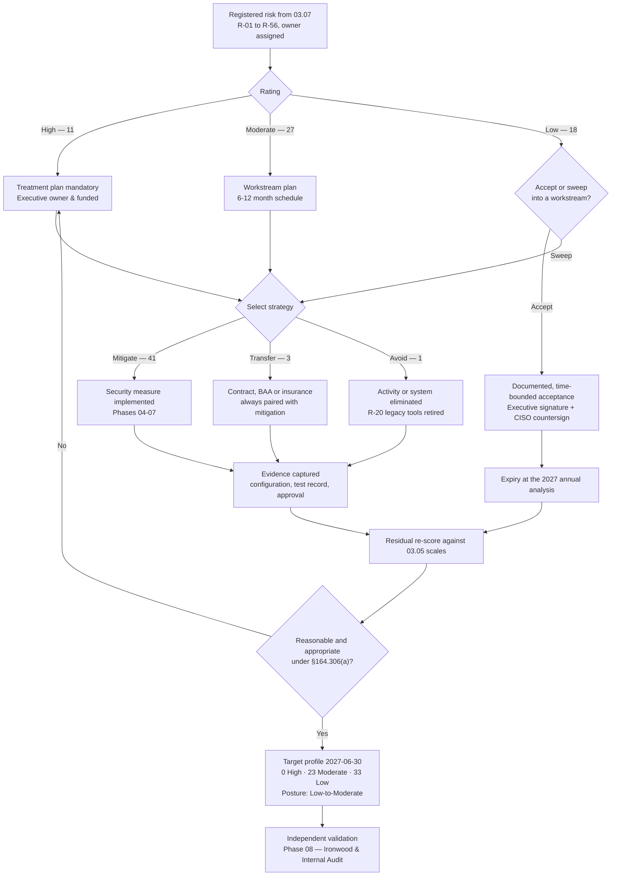

# 03.08 — Risk Management Plan

| Field | Value |
|---|---|
| Document ID | MBH-RA-RMP-2026-308 |
| Version | 1.0 |
| Date | 2026-07-15 |
| Classification | Confidential — Electronic Protected Health Information (ePHI) // Illustrative Portfolio Sample |
| Owner | Daniel Cho, Chief Information Security Officer &amp; HIPAA Security Official |
| Co-Owner | Michelle Tran, VP Enterprise Risk |
| Author | Advisory Team (Healthcare GRC / HIPAA) |
| Status | Approved |

## Purpose

This document satisfies **45 CFR §164.308(a)(1)(ii)(B) — Risk management**:

> *"Implement security measures sufficient to reduce risks and vulnerabilities to a reasonable and appropriate level to comply with §164.306(a)."*

It converts the 56 registered risks of 03.07 into **decisions with owners, dates, budgets and target residual ratings**, sequences the eleven High risks into three remediation waves, and maps each High risk forward to the specific safeguards delivered in Phases 04 through 07.

### Risk analysis and risk management are two separate requirements

This deserves to be stated plainly, because conflating them is a recurring OCR enforcement finding. §164.308(a)(1)(ii) contains four implementation specifications, of which the first two are distinct and **separately citable**:

| Specification | Citation | Question it answers | MercyBridge evidence |
|---|---|---|---|
| **Risk analysis** (Required) | §164.308(a)(1)(ii)(A) | *What are the risks to ePHI?* | 03.01 to 03.07 — methodology, threats, vulnerabilities, controls, determination, register |
| **Risk management** (Required) | §164.308(a)(1)(ii)(B) | *What did we do about them, and was it sufficient?* | **This document**, plus the safeguards implemented in Phases 04–07 and the evaluation in Phase 08 |
| Sanction policy (Required) | §164.308(a)(1)(ii)(C) | *What happens to workforce who violate?* | Phase 04; risk R-56 |
| Information system activity review (Required) | §164.308(a)(1)(ii)(D) | *Do we review logs and access?* | Phase 04; risk R-55 |

A covered entity that produces an excellent register and never treats it has satisfied (A) and violated (B). MercyBridge therefore maintains **separate evidence trails**: the analysis has its own approvals and dates, and this plan has its own — approved by the Security Official on 2026-07-15 and reported to the Board Audit &amp; Compliance Committee.

### What "reasonable and appropriate" means here

§164.308(a)(1)(ii)(B) does not require risk to be eliminated. It requires reduction to a *reasonable and appropriate* level, judged against the **§164.306(b)(2) flexibility factors** — size and complexity, technical infrastructure and capability, cost, and the probability and criticality of potential risks. Cost is a legitimate input to *how* and *when* a risk is treated. It is **never** an acceptable justification for leaving a High risk untreated, and no treatment decision in this plan cites cost as a reason for inaction.

## 1. Treatment Strategies

| Strategy | Definition | When MercyBridge uses it | Approval required |
|---|---|---|---|
| **Mitigate** | Implement or extend a security measure that reduces likelihood, impact, or both | Default for all High and Moderate risks | Risk owner; CISO for High |
| **Transfer** | Shift financial or operational consequence to another party — cyber insurance, contractual indemnity, BAA obligations | Only as a **supplement**, never as a substitute | CISO + General Counsel |
| **Avoid** | Eliminate the activity, system or data that creates the risk | Where a legacy capability has a supported replacement | CIO + CISO |
| **Accept** | Consciously tolerate the residual risk, time-bounded and documented | Low risks, and exceptionally Moderate risks | Executive with authority; CISO countersign |

**Transfer does not transfer compliance.** Cyber insurance pays claims; it does not discharge a HIPAA obligation. Under §164.308(b)(1) and §164.314(a), a covered entity remains accountable for ePHI held by its business associates. Where transfer appears below, it is always paired with a mitigation.

**Acceptance discipline.** An acceptance must name the risk, the accepting executive, the rationale, the compensating controls, an expiry date and a re-review trigger. An undocumented acceptance is indistinguishable, on audit, from an unmanaged risk. **No High risk may be accepted without Board Audit &amp; Compliance Committee visibility.**

## 2. Treatment Strategy Distribution — All 56 Risks

| Strategy | Risks | Count | Rationale |
|---|---|---|---|
| **Mitigate** | All 11 High risks; 25 of the 27 Moderate risks; 5 Low risks (R-07, R-32, R-45, R-52, R-55) swept into safeguard delivery | **41** | Security measures extended or newly implemented under Phases 04–07 |
| **Accept** (time-bounded, documented) | R-08, R-15, R-16, R-21, R-22, R-27, R-38, R-39, R-46, R-50, R-56 | **11** | Low residual under existing controls; each acceptance expires at the 2027 annual analysis |
| **Transfer** (paired with mitigation) | R-31 (Moderate), R-33 (Low), R-53 (Low) | **3** | Contractual notification and certified-deletion obligations; property and business-interruption cover |
| **Avoid** | R-20 (Moderate) | **1** | The two legacy remote coding tools driving the split-tunnel exception are decommissioned and their users migrated to VDI — the risk is eliminated, not reduced |
| **Total** | — | **56** | — |

Reconciliation by rating: **High 11** — all mitigated. **Moderate 27** — 25 mitigated, 1 transferred (R-31), 1 avoided (R-20). **Low 18** — 11 accepted, 5 mitigated, 2 transferred (R-33, R-53).

## 3. Prioritisation Logic

Priority is not the raw score alone. Four factors order the work:

| Factor | Weight in sequencing | Effect |
|---|---|---|
| Risk score | Primary | 15–25 before 8–12 before 1–6 |
| Patient-safety consequence (ESC-1/2/3 applied) | Elevating | R-10, R-11, R-23, R-28 pulled forward regardless of score ties |
| Root-condition leverage | Elevating | A fix that reduces several risks at once is sequenced before a single-risk fix |
| Delivery dependency | Sequencing | Identity work precedes privileged-access work; segmentation precedes device-zone hardening |

**Leverage is the reason the waves look as they do.** Eight of the eleven High risks trace to three root conditions. Closing identity assurance moves R-01, R-02 and R-34 together; completing micro-segmentation moves R-17, R-23 and R-10; completing encryption moves R-40, R-11 and part of R-24.

## 4. Remediation Waves for the Eleven High Risks

The governance standard set in 03.05 is remediation of a High risk **within 90 days, or a board-visible, time-bounded exception**. Wave 1 meets the 90-day standard. Waves 2 and 3 carry **formal, time-bounded exceptions approved by the Board Audit &amp; Compliance Committee on 2026-07-15**, each with named interim compensating controls, because the underlying work (network re-architecture, fleet-wide encryption, medical-device lifecycle) cannot be completed safely in a 24×7 clinical environment inside 90 days.

| Wave | Window | High risks | Theme | Exception status |
|---|---|---|---|---|
| **Wave 1** | 2026-08-01 → 2026-10-31 | R-01, R-02, R-34, R-23 | Identity assurance and ransomware survivability | Within the 90-day standard |
| **Wave 2** | 2026-11-01 → 2027-01-31 | R-17, R-40, R-24 | Segmentation, encryption and exfiltration control | Board-approved exception to 2027-01-31 |
| **Wave 3** | 2027-02-01 → 2027-06-30 | R-09, R-10, R-11, R-28 | Medical-device estate and vendor concentration | Board-approved exception to 2027-06-30 |

### 4.1 Wave 1 — Identity Assurance and Ransomware Survivability

| Risk | Current | Treatment | Key security measures | Owner | Target date | Target residual |
|---|---|---|---|---|---|---|
| R-01 MFA gap on 24 of 68 systems | 4×4 = 16 High | Mitigate | Extend MFA to all 68 ePHI systems; eliminate the 7 local-credential paths; phishing-resistant factors for privileged and remote access | Marcus Reed | 2026-10-31 | 2×4 = 8 Moderate |
| R-02 Shared / generic clinical logins | 4×4 = 16 High | Mitigate | Badge-tap proximity single sign-on at clinical workstations; retire generic accounts; departmental service accounts vaulted and attributed | Marcus Reed | 2026-10-31 | 2×4 = 8 Moderate |
| R-34 Phishing / BEC on mailboxes with ePHI | 5×3 = 15 High | Mitigate | Monthly phishing simulation with targeted remediation; training to 100%; conditional-access and impossible-travel policy; mailbox auto-forward block | Daniel Cho | 2026-10-31 | 3×3 = 9 Moderate |
| R-23 Enterprise ransomware on Tier 1 systems | 4×5 = 20 High | Mitigate | Immutable and offline backup copies extended to the 9 Tier 2–3 gaps; full-scale Tier 1 restoration test; EDR coverage closure; ransomware tabletop (Phase 07) | Daniel Cho | 2026-10-31 | 2×5 = 10 Moderate |

### 4.2 Wave 2 — Segmentation, Encryption and Exfiltration Control

| Risk | Current | Treatment | Key security measures | Owner | Target date | Target residual |
|---|---|---|---|---|---|---|
| R-17 Lateral movement, incomplete micro-segmentation | 4×4 = 16 High | Mitigate | Host-based micro-segmentation extended from 41 to all 68 ePHI systems; default-deny enforced east–west; firewall rule recertification | Anthony Ruiz | 2027-01-31 | 2×4 = 8 Moderate |
| R-40 ePHI at rest unencrypted / partially encrypted | 4×4 = 16 High | Mitigate | Encryption at rest completed on the 17 remaining systems; full-disk encryption enforced across the endpoint estate; key management standardised — restores the breach **safe harbour**, which reduces impact as well as likelihood | Daniel Cho | 2027-01-31 | 2×3 = 6 Low |
| R-24 Double-extortion exfiltration | 4×4 = 16 High | Mitigate | Deploy DLP (closes C-S06) and automated ePHI discovery (closes C-S08); egress monitoring and anomalous-volume alerting into the SIEM | Daniel Cho | 2027-01-31 | 2×4 = 8 Moderate |

### 4.3 Wave 3 — Medical-Device Estate and Vendor Concentration

| Risk | Current | Treatment | Key security measures | Owner | Target date | Target residual |
|---|---|---|---|---|---|---|
| R-09 Unsupported-OS devices, known exploited vulnerabilities | 4×4 = 16 High | Mitigate | Device lifecycle programme with funded replacement schedule; contractually backed patch cadence in all new device contracts; compensating VLAN isolation for the non-replaceable remainder | Anthony Ruiz | 2027-06-30 | 3×4 = 12 Moderate |
| R-10 Malware propagation into device VLANs | 3×5 = 15 High | Mitigate | Device-zone micro-segmentation completed; the 3 flat-VLAN outpatient sites re-architected; IoMT anomaly detection tuned to clinical baselines | Anthony Ruiz | 2027-06-30 | 2×5 = 10 Moderate |
| R-11 Unencryptable ePHI at rest on devices | 3×5 = 15 High | Mitigate + Transfer | Minimise ePHI retained on device local storage; enforced purge cycles; certificated NIST SP 800-88 sanitisation at disposal; encryption-capability clauses mandatory in new procurement | Anthony Ruiz | 2027-06-30 | 2×5 = 10 Moderate |
| R-28 Hosted-EHR compromise or extended outage | 3×5 = 15 High | Mitigate + Transfer | Tested EHR downtime and read-only continuity capability; independent restoration assurance from Halcyon; strengthened BAA notification and audit terms; concentration reported as an accepted structural exposure with board visibility | Daniel Cho | 2027-06-30 | 2×5 = 10 Moderate |

**Note on ESC floors.** R-10, R-11, R-23 and R-28 retain impact 5 after treatment because the patient-safety and Tier 1 availability consequences are intrinsic to the scenario, not to the control state. Under **ESC-1** these risks cannot be rated below Moderate however well they are mitigated. That is the correct outcome: MercyBridge manages them permanently rather than declaring them closed.

## 5. Target Residual Profile

| Rating | Baseline (2026-04) | Target (2027-06-30) | Movement |
|---|---|---|---|
| High | 11 | **0** | All 11 treated to Moderate or Low |
| Moderate | 27 | **23** | 10 arrive from High; 14 depart to Low |
| Low | 18 | **33** | 18 retained + 14 from Moderate + 1 from High (R-40) |
| **Total** | **56** | **56** | Register size unchanged; risks are re-rated, not removed |
| Overall posture | **Moderate** | **Low-to-Moderate** | Consistent with the Phase 09 programme outcome target |

## 6. Treatment Plan for the 27 Moderate Risks

Moderate risks are remediated on a 6–12 month schedule with quarterly progress review. They are grouped by delivery workstream rather than individually waved.

| Workstream | Moderate risks | Lead owner | Target |
|---|---|---|---|
| Identity, privilege and access recertification | R-03, R-04, R-05 | Marcus Reed | 2027-03-31 |
| Vendor and device access governance | R-06, R-12, R-13, R-14 | Anthony Ruiz | 2027-06-30 |
| Network hygiene and site re-architecture | R-18, R-19, R-20 | Anthony Ruiz | 2027-03-31 |
| Detection and endpoint coverage | R-25, R-26 | Marcus Reed | 2026-12-31 |
| Business associate assurance (Phase 06) | R-29, R-30, R-31 | Lisa Coleman | 2026-12-31 |
| Privacy, disclosure and workforce practice | R-35, R-36, R-37 | Rebecca Stern | 2027-03-31 |
| Data protection, transmission and disposal | R-41, R-42, R-43, R-44 | Marcus Reed | 2027-06-30 |
| Contingency testing and resilience | R-47, R-48, R-49 | Anthony Ruiz | 2027-03-31 |
| Physical safeguards in clinical areas | R-51 | Marcus Reed | 2026-12-31 |
| Policy, documentation and retention | R-54 | Karen Boyd | 2026-09-30 |

## 7. Mapping High Risks Forward to Phases 04–07

Every High risk terminates in a named safeguard in a later phase. This mapping is the audit trail that connects §164.308(a)(1)(ii)(A) to §164.308(a)(1)(ii)(B) to implemented controls.

| Risk | Phase 04 — Administrative §164.308 | Phase 05 — Physical / Technical §164.310, §164.312 | Phase 06 — Business Associate | Phase 07 — Incident Response |
|---|---|---|---|---|
| R-01 | Information access management §164.308(a)(4) | Person or entity authentication §164.312(d) — MFA on all 68 systems | — | Credential-compromise playbook |
| R-02 | Workforce security §164.308(a)(3) | Unique user identification §164.312(a)(2)(i); audit controls §164.312(b) | — | Attribution in investigations |
| R-09 | Risk management §164.308(a)(1)(ii)(B); device lifecycle policy | Access control §164.312(a)(1); segmentation | Device vendor patch obligations in BAAs and contracts | Device-compromise playbook |
| R-10 | Contingency plan §164.308(a)(7) | Segmentation; integrity §164.312(c)(1) | IoMT vendor obligations | Clinical-device downtime response |
| R-11 | Device and media policy | Device and media controls §164.310(d)(1); encryption §164.312(a)(2)(iv) | Procurement encryption clauses | Lost-device assessment under §164.402 |
| R-17 | Security management process §164.308(a)(1) | Access control §164.312(a)(1); transmission security §164.312(e) | — | Containment and isolation procedures |
| R-23 | Contingency plan §164.308(a)(7) — backup, DR, emergency mode | Integrity §164.312(c)(1); EDR and audit controls | BA recovery dependencies | **Ransomware IR plan and tabletop** |
| R-24 | Protection from malicious software §164.308(a)(5)(ii)(B) | Encryption §164.312(a)(2)(iv); DLP and egress monitoring | BA exfiltration notification terms | §164.402 four-factor assessment; 60-day notification |
| R-28 | Business associate contracts §164.308(b)(1); contingency plan | Emergency mode operation; downtime capability | §164.314(a) BAA terms; SOC 2 / HITRUST assurance | BA breach coordination and notification |
| R-34 | Security awareness and training §164.308(a)(5); log-in monitoring §164.308(a)(5)(ii)(C) | Authentication §164.312(d); conditional access | — | Mailbox-compromise playbook |
| R-40 | Risk management §164.308(a)(1)(ii)(B) | **Encryption and decryption §164.312(a)(2)(iv)**; workstation security §164.310(c) | BA encryption obligations | Safe-harbour determination at incident triage |

## 8. Treatment Workflow

## 9. Governance, Funding and Reporting

| Element | Arrangement |
|---|---|
| Plan approval | Daniel Cho as Security Official, 2026-07-15; endorsed by the Security Steering Committee |
| Board oversight | Robert Feldman, Board Audit &amp; Compliance Committee Chair — quarterly progress against waves; Wave 2 and Wave 3 exceptions reviewed at each meeting |
| Method and calibration | Michelle Tran, VP Enterprise Risk — owns residual re-scoring consistency |
| Delivery tracking | Marcus Reed maintains the remediation tracker in `trackers/`; RAG status per risk per month |
| Funding | Wave 1 and Wave 2 funded within the approved FY2026 security programme; Wave 3 device lifecycle funded through the FY2027 capital plan |
| Escalation | Any wave item forecast to slip its target date is escalated to the CISO within 10 business days and to the Board committee if the slip exceeds one quarter |
| Independent assurance | Ironwood Security Labs penetration test (2026-09) and Internal Audit review validate that implemented measures work, not merely that they exist |
| Evidence retention | All treatment decisions, approvals, acceptances and test records retained six years under §164.316(b)(2) |

## 10. Assumptions and Limitations

| # | Statement |
|---|---|
| 1 | Target residual ratings are forecasts based on planned control coverage; each is re-scored only on evidenced implementation, never on planned implementation |
| 2 | Wave 3 depends on FY2027 capital approval for device replacement; if that approval is not obtained, R-09 remains High and the exception must be re-presented to the Board committee |
| 3 | ESC-floored risks (R-10, R-11, R-23, R-28) cannot fall below Moderate and are managed permanently |
| 4 | Transfer arrangements reduce financial consequence only; HIPAA liability remains with MercyBridge in every case |
| 5 | Acceptances expire at the 2027 annual analysis and do not roll over automatically |
| 6 | This plan is superseded by any update issued under 03.10 following a significant change, incident or new threat |

## Cross-References

| Reference | Relevance |
|---|---|
| 03.01 — Risk Analysis Methodology | The (A) versus (B) distinction and the §164.306(b)(2) flexibility factors |
| 03.04 — Existing Controls Assessment | Controls already credited, so treatment extends rather than duplicates them |
| 03.05 — Likelihood, Impact &amp; Risk Determination | Scales used for every residual re-score; ESC escalation rules |
| 03.06 — Ransomware &amp; Healthcare Threat Profile | Control chain behind the R-23 and R-24 treatments |
| 03.07 — Risk Register | The 56 risks treated here, with owners |
| 03.09 — Risk Analysis Report | Where this plan is reported to the Board Audit &amp; Compliance Committee |
| 03.10 — Periodic Review &amp; Update | Re-scoring cadence and triggers that revise this plan |
| Phase 04 — Administrative Safeguards | §164.308 measures delivering Wave 1 and the Moderate workstreams |
| Phase 05 — Physical &amp; Technical Safeguards | MFA, encryption, segmentation, audit controls delivering Waves 1–3 |
| Phase 06 — Business Associate &amp; Third-Party Risk | Treatment of R-28 to R-33 and the §164.314(a) terms |
| Phase 07 — Incident Response &amp; Breach Notification | Ransomware tabletop and the §164.402 four-factor assessment |
| Phase 08 — Independent Assessment | Validates that implemented measures are effective |
| Phase 09 — Executive Reporting | Residual posture Low-to-Moderate reported to the Board |

---
[⬅ Previous](03.07-risk-register.md) · [🏠 Phase README](03.00-README.md) · [Next ➡](03.09-risk-analysis-report.md)
