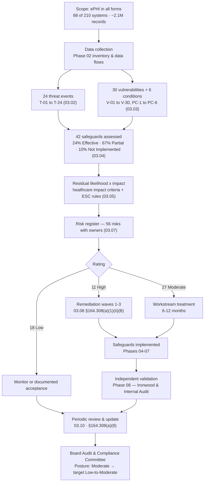

# 03.09 — Risk Analysis Report

| Field | Value |
|---|---|
| Document ID | MBH-RA-RPT-2026-309 |
| Version | 1.0 |
| Date | 2026-07-15 |
| Classification | Confidential — Electronic Protected Health Information (ePHI) // Illustrative Portfolio Sample |
| Owner | Daniel Cho, Chief Information Security Officer &amp; HIPAA Security Official |
| Author | Advisory Team (Healthcare GRC / HIPAA) |
| Status | Approved |

## Purpose

This is the **formal report of the risk analysis** conducted under **45 CFR §164.308(a)(1)(ii)(A)** for MercyBridge Health Network. It is the statutory deliverable of Phase 03 — the single document a HHS Office for Civil Rights investigator, an internal auditor or a HITRUST assessor would ask for first, and the document by which the Board Audit &amp; Compliance Committee discharges its oversight of information risk.

It states the scope, the methodology, the findings, the conclusions and the recommendations; it maps each of OCR's **nine risk-analysis elements** to the evidence that satisfies it; it records the limitations honestly; and it carries the signature of the designated Security Official.

The report summarises, and does not replace, the underlying working documents 03.01 through 03.08. Where this report and an underlying document differ in detail, the underlying document governs.

## 1. Executive Summary

**MercyBridge Health Network has completed an enterprise-wide, accurate and thorough risk analysis of the potential risks and vulnerabilities to the confidentiality, integrity and availability of the electronic protected health information it creates, receives, maintains and transmits.**

| Question | Answer |
|---|---|
| Was a compliant risk analysis performed? | **Yes** — enterprise-wide, documented, dated, all nine OCR elements evidenced |
| How much ePHI is in scope? | **~2.1 million patient records** across **68 of 210** information systems |
| How many risks were identified? | **56** |
| How are they rated? | **11 High · 27 Moderate · 18 Low** |
| What is the overall risk posture? | **Moderate** |
| Is any High risk unmitigated? | **No** — all 11 have compensating controls credited; none is eliminated |
| Is there evidence of a current compromise? | **No** — 3 incidents investigated, 4-factor assessments performed, **0 reportable breaches** in the review period |
| Is a risk management plan in place? | **Yes** — 03.08, satisfying the separate requirement at §164.308(a)(1)(ii)(B) |
| What is the target posture? | **Low-to-Moderate** by 2027-06-30, 0 High risks |

**The finding in one sentence.** MercyBridge is not an organisation without controls — almost every Security Rule standard has something behind it, and that is why the posture is Moderate rather than High; what it lacks is **completeness and evidence**, with **67% of assessed safeguards rated Partially Effective**, and that partial coverage is precisely what produces eleven High risks concentrated in three tractable root conditions.

**What the Board is being asked to note.** The eleven High risks are not eleven unrelated problems. Eight of them trace to incomplete identity assurance, an unpatchable medical-device estate, and incomplete network segmentation. Those three programmes, funded and sequenced in 03.08, remove the High tier entirely. Two of the eleven — hosted-EHR concentration and unencryptable device storage — are structural and will be managed permanently rather than closed.

## 2. Scope of the Analysis (Element 1)

| Dimension | Scope |
|---|---|
| Entity | MercyBridge Health Network — non-profit regional hospital system, HIPAA **covered entity** |
| Facilities | 4 hospitals, ~30 outpatient and clinic sites, 2 data centres, ~1,200 licensed beds |
| Workforce | ~6,500 employees plus affiliated providers |
| Data | **ePHI** — approximately **2.1 million patient records**, in all forms and locations |
| Systems | **210 information systems** enterprise-wide; **68** create, receive, maintain or transmit ePHI |
| Crown jewels | Halcyon EHR (vendor-hosted), PACS / imaging, LIS, pharmacy, HIE, revenue cycle, patient portal, secure clinical messaging, networked medical devices / IoMT |
| Devices | 6,120-device medical-device and IoMT fleet; 3,170 devices bear ePHI |
| Third parties | ~180 business associates; 38 hosted services |
| Regulatory frame | HIPAA Security Rule §164.302–318; Breach Notification Rule §164.400–414; HITECH; NIST SP 800-66 Rev. 2 as methodology spine |
| Assessment period | 2026-02-02 to 2026-04-30; analysis complete 2026-04; reported 2026-07-15 |
| Out of scope | Paper PHI (Privacy Rule; Rebecca Stern owns), the 142 non-ePHI systems, and clinical efficacy of medical devices (FDA domain) |

**Scope is where risk analyses fail.** OCR's most common criticism is a scope limited to one application or one data centre. This analysis covered ePHI **in all forms and locations** the Security Rule reaches — hosted, on-premises, endpoint, device-resident, in transit and in the hands of business associates.

## 3. Methodology (Elements 2–7)

| Step | Method | Deliverable |
|---|---|---|
| Prepare and scope | NIST SP 800-30 Step 1; §164.306(b)(2) flexibility factors | 03.01 |
| Data collection | Phase 02 inventory, data-flow mapping, device register, cloud register | 02.02 – 02.06 |
| Threat identification | 7 threat-source classes; **24 threat events** T-01 to T-24 | 03.02 |
| Vulnerability identification | **30 vulnerabilities** V-01 to V-30; **6 predisposing conditions** PC-1 to PC-6 | 03.03 |
| Control assessment | **42 representative safeguards** rated Effective / Partially Effective / Not Implemented | 03.04 |
| Likelihood | 5-point scale, residual, 12-month horizon | 03.05 §2 |
| Impact | 5-point scale across **six healthcare-specific criteria**; highest criterion governs | 03.05 §3 |
| Escalation | Patient-safety rules ESC-1 to ESC-3, CMIO-concurred | 03.05 §4 |
| Risk determination | 5×5 matrix; High 15–25, Moderate 8–12, Low 1–6 | 03.05 §5 |
| Documentation | Register of 56 risks with named owners | 03.07 |
| Management | Treatment decisions, waves, target residuals | 03.08 |

**Evidence base.** 41 interviews across clinical, technical, compliance and executive functions; configuration review of 24 systems including all 12 Tier 1; log sampling; walkthroughs at 4 hospitals and 6 clinic sites; badge-log sampling; training and test records; entitlement reviews; SOC 2 Type II reports and HITRUST certificates for business associates. Scoring was performed in two passes with a cross-category moderation session on **2026-04-09** attended by the CISO, CIO, CMIO, Chief Privacy Officer and VP Enterprise Risk.

**What makes this a healthcare risk analysis rather than a generic one.** The impact scale scores patient safety and care disruption alongside privacy, regulatory, financial and reputational harm; the 500-individual breach-notification threshold calibrates the boundary between impact 2 and impact 3; and the ESC rules allow a patient-safety consequence to override pure data-confidentiality scoring. ESC rules were applied to nine risks and changed the rating band of four (R-10, R-11, R-23, R-28).

## 4. Key Findings

| # | Finding | Evidence |
|---|---|---|
| F-1 | **56 risks to ePHI identified — 11 High, 27 Moderate, 18 Low. Overall posture Moderate.** | 03.05 §8; 03.07 §3 |
| F-2 | **67% of assessed safeguards are Partially Effective** (28 of 42); 24% Effective; 10% Not Implemented | 03.04 §7 |
| F-3 | **MFA is enforced on only 44 of 68 ePHI systems**; 17 rely on SSO without a second factor; 7 permit local credentials | 03.03 V-01; risk R-01 |
| F-4 | **Encryption at rest is incomplete** — 51 of 68 systems implemented, 12 partial, 5 none; endpoint gaps persist. The breach **safe harbour** is forfeited where it is absent | 03.03 V-04, V-12; risk R-40 |
| F-5 | **1,300 medical devices (21.2% of the 6,120 fleet) run unsupported or vendor-frozen operating systems** and cannot be patched | 03.03 V-02; risk R-09 |
| F-6 | **Micro-segmentation reaches only 41 of 68 systems**, so the ten-zone model does not contain an intrusion once inside | 03.03 V-06; risk R-17 |
| F-7 | **Ransomware is the highest-scored single risk (20)** — Tier 1 encryption would cause multi-day care disruption and diversion; restoration time has never been validated at full scale | 03.06; risk R-23 |
| F-8 | **Four capability gaps are genuinely absent**, not merely partial: DLP, privileged access management, automated ePHI discovery, and privacy behavioural monitoring | 03.04 §6 (C-S06–C-S09) |
| F-9 | **Business associate assurance is documentary, not tested** — 3 BAAs under remediation, subcontractor visibility absent for 9 hosted services, offshore access at 2 | 03.03 V-21; risks R-29 to R-33 |
| F-10 | **Contingency planning is under-tested** — downtime procedures unexercised at ~30 outpatient sites; backup immutability incomplete for 9 Tier 2–3 systems | 03.03 V-24; risks R-47 to R-49 |
| F-11 | **Documentation and activity-review evidence are incomplete** — activity review unevidenced for 19 systems; §164.316(b) retention not uniformly demonstrated | 03.03 V-11, V-20; risks R-54, R-55 |
| F-12 | **No evidence of current or ongoing compromise.** 3 incidents investigated with §164.402 four-factor assessments; **0 reportable breaches** in the review period | Phase 07 |

## 5. The Top Risks

| Rank | Risk | Score | Rating | Owner | Why it matters to the Board |
|---|---|---|---|---|---|
| 1 | R-23 Enterprise ransomware encrypting Tier 1 clinical systems | 20 | High | Daniel Cho | The realistic worst case: multi-day clinical downtime, ambulance diversion, cancelled procedures, and a patient-safety consequence that no cyber-insurance policy reverses |
| 2 | R-01 MFA absent on 24 of 68 ePHI systems | 16 | High | Marcus Reed | The single most cited technical gap in OCR settlements; the front door to every other risk |
| 3 | R-02 Shared and generic clinical logins | 16 | High | Marcus Reed | Defeats a **required** specification and makes both prevention and attribution fail together |
| 4 | R-09 Unsupported-OS medical devices | 16 | High | Anthony Ruiz | 1,300 devices that cannot be patched; a structurally permanent exposure requiring lifecycle investment |
| 5 | R-17 Lateral movement through incomplete segmentation | 16 | High | Anthony Ruiz | The enabling condition for the three worst scenarios simultaneously |
| 6 | R-24 Double-extortion exfiltration of ePHI | 16 | High | Daniel Cho | Turns an availability incident into a mass-notification breach affecting up to 2.1M individuals |
| 7 | R-40 ePHI at rest unencrypted or partially encrypted | 16 | High | Daniel Cho | Determines whether a stolen laptop is a non-event or a reportable breach |
| 8 | R-10 Malware propagation into device VLANs | 15 | High | Anthony Ruiz | Patient-safety escalation ESC-1 — loss of clinical device availability, not just data |
| 9 | R-11 Unencryptable ePHI at rest on 3,170 devices | 15 | High | Anthony Ruiz | No cryptographic safe harbour on loss or disposal; vendor OS constraint |
| 10 | R-28 Hosted-EHR compromise or extended outage | 15 | High | Daniel Cho | The entire clinical archive with one business associate; MercyBridge retains full HIPAA liability |
| 11 | R-34 Phishing / BEC compromising mailboxes with ePHI | 15 | High | Daniel Cho | The only risk scored likelihood 5 — it is happening now, at volume |

## 6. OCR Nine-Element Compliance Mapping

The table below is the compliance spine of this report: each element OCR expects in a risk analysis, and the specific place it is evidenced.

| # | OCR element | Requirement | Where evidenced | Status |
|---|---|---|---|---|
| 1 | **Scope of the analysis** | All ePHI created, received, maintained or transmitted, in all forms and locations | 03.01 §5; §2 of this report; Phase 02 inventory (68 of 210 systems) | ✅ Complete |
| 2 | **Data collection** | Document where ePHI is stored, received, maintained and transmitted | 02.02 inventory, 02.03 data flows, 02.04 device register, 02.06 cloud register | ✅ Complete |
| 3 | **Identify and document potential threats and vulnerabilities** | Reasonably anticipated threats; technical and non-technical vulnerabilities | 03.02 (24 threat events), 03.03 (30 vulnerabilities, 6 predisposing conditions) | ✅ Complete |
| 4 | **Assess current security measures** | Evaluate safeguards already in place and whether they are configured and used properly | 03.04 — 42 safeguards rated; 24 systems configuration-reviewed | ✅ Complete |
| 5 | **Determine the likelihood of threat occurrence** | Probability a threat triggers a vulnerability given current controls | 03.05 §2 — 5-point residual likelihood scale | ✅ Complete |
| 6 | **Determine the potential impact of threat occurrence** | Magnitude of harm to confidentiality, integrity and availability | 03.05 §3 — 5-point scale, six healthcare-specific criteria; ESC rules §4 | ✅ Complete |
| 7 | **Determine the level of risk** | Combine likelihood and impact; assign ratings | 03.05 §5–§8 — 5×5 matrix; **56 risks → 11 High, 27 Moderate, 18 Low** | ✅ Complete |
| 8 | **Finalize documentation** | Written record, retained and producible | **03.07 risk register**; this report; §164.316(b)(2) six-year retention | ✅ Complete |
| 9 | **Periodic review and updates** | Continuous, on a defined cadence and on significant change | 03.10 — annual re-analysis, quarterly review, nine defined triggers; §164.308(a)(8) | ✅ Complete |

| Related requirement | Citation | Evidence |
|---|---|---|
| Risk management — implement sufficient security measures | **§164.308(a)(1)(ii)(B)** | 03.08 risk management plan; Phases 04–07 |
| Assigned security responsibility | §164.308(a)(2) | Daniel Cho designated; ADR-0003 |
| Evaluation | §164.308(a)(8) | 03.10; Phase 08 independent assessment |
| Documentation and retention | §164.316(b)(1), (b)(2)(i) | Six-year retention of every Phase 03 artefact |
| General requirements and flexibility of approach | §164.306(a), §164.306(b)(2) | 03.01 §4; 03.08 §Purpose |

## 7. Analysis-to-Decision Flow

## 8. Conclusions

| # | Conclusion |
|---|---|
| C-1 | MercyBridge has satisfied **§164.308(a)(1)(ii)(A)**. The analysis is enterprise-wide, evidence-based, documented, dated and producible, and addresses all nine OCR elements. |
| C-2 | The **overall risk posture is Moderate**. This is a judgement, not an arithmetic mean, and rests on the control profile (controls exist almost everywhere, complete almost nowhere), the absence of any unmitigated High risk, the coherent clustering of the High tier, and the absence of evidence of compromise. |
| C-3 | The **eleven High risks are not tolerable** at their current ratings and require treatment under §164.308(a)(1)(ii)(B). None may be accepted without Board Audit &amp; Compliance Committee visibility. |
| C-4 | The High tier is **tractable**. Eight of eleven trace to three root conditions — identity assurance, the unpatchable device estate, and incomplete segmentation — so three funded programmes, not eleven projects, remove the tier. |
| C-5 | Two High risks are **structural**: hosted-EHR concentration (R-28) and unencryptable device storage (R-11). Under ESC-1 they cannot fall below Moderate and will be managed permanently rather than closed. |
| C-6 | The most material **compliance exposure** is not any single technical gap but the pattern of incomplete evidence — activity review unevidenced for 19 systems, retention not uniformly demonstrated. OCR tests documentation as rigorously as it tests configuration. |
| C-7 | A **risk management plan exists and is funded** (03.08), with a target residual profile of **0 High, 23 Moderate, 33 Low** by 2027-06-30 and an overall posture of **Low-to-Moderate**. |

## 9. Recommendations

| # | Recommendation | Addresses | Owner | Target |
|---|---|---|---|---|
| REC-1 | Extend MFA to all 68 ePHI systems and eliminate local-credential paths; adopt phishing-resistant factors for privileged and remote access | R-01, R-34 | Marcus Reed | 2026-10-31 |
| REC-2 | Eliminate shared and generic clinical logins via badge-tap proximity SSO; vault and attribute departmental service accounts | R-02, R-13 | Marcus Reed | 2026-10-31 |
| REC-3 | Extend immutable and offline backup to the 9 remaining systems and conduct a **full-scale Tier 1 restoration test** with a measured, evidenced recovery time | R-23, R-47, R-48 | Daniel Cho | 2026-10-31 |
| REC-4 | Complete host-based micro-segmentation across all 68 ePHI systems and re-architect the 3 flat-VLAN outpatient sites | R-17, R-10, R-18 | Anthony Ruiz | 2027-01-31 |
| REC-5 | Complete encryption of ePHI at rest on the 17 remaining systems and across the endpoint estate to restore the breach safe harbour | R-40, R-11 | Daniel Cho | 2027-01-31 |
| REC-6 | Close the four absent capabilities — DLP, privileged access management, automated ePHI discovery, privacy behavioural monitoring | R-24, R-03, R-41, R-36 | Daniel Cho | 2027-01-31 |
| REC-7 | Fund a medical-device lifecycle programme and require contractually backed patch cadence and encryption capability in all new device procurement | R-09, R-11, R-12 | Anthony Ruiz | 2027-06-30 |
| REC-8 | Complete BAA remediation for MBH-SYS-029, -033, -058; obtain subcontractor visibility for the 9 hosted services; test Halcyon restoration assurance | R-28 to R-33 | Lisa Coleman | 2026-12-31 |
| REC-9 | Evidence information system activity review across all 68 systems and demonstrate §164.316(b)(2) six-year retention uniformly | R-54, R-55, R-56 | Karen Boyd | 2026-12-31 |
| REC-10 | Exercise clinical downtime procedures at all ~30 outpatient sites and run the ransomware tabletop in Phase 07 | R-49, R-23 | Dr. Samuel Ortega | 2027-03-31 |
| REC-11 | Operate the periodic review cycle in 03.10 as a standing obligation — annual re-analysis, quarterly register review, and update on every defined trigger | Element 9 | Michelle Tran | Continuous |

## 10. Limitations and Qualifications

| # | Limitation | Effect on reliance |
|---|---|---|
| L-1 | This is a **risk analysis, not a penetration test**. Exploitability was reasoned, not proven | Independent technical validation performed in Phase 08 by Ironwood Security Labs (2026-09) |
| L-2 | Scoring is **judgement-based and calibrated, not actuarial** | Two-pass scoring with a cross-functional moderation session on 2026-04-09 |
| L-3 | Business associate control environments were assessed from **SOC 2 Type II reports, HITRUST certificates and BAA terms**, not by direct testing | The assurance gap is itself registered as R-30 |
| L-4 | **Medical device internals were not scanned**; ratings rely on passive profiling, MDS2 forms (4,284 of 6,120) and vendor attestation | Recorded as constraint C3 (01.08); device risks may be understated |
| L-5 | Ratings for 44 of 68 systems rest on **owner attestation plus documentary evidence**; only 24 systems (including all 12 Tier 1) were configuration-reviewed and operation-sampled | No control was upgraded to Effective on attestation alone |
| L-6 | **Unstructured ePHI volumes are unquantified** | Carried explicitly as R-41 rather than assumed away; automated discovery recommended (REC-6) |
| L-7 | The analysis is a **point-in-time baseline as at 2026-04** | Superseded by any update issued under 03.10; posture re-determined at the 2027 annual analysis |
| L-8 | Paper PHI, the 142 non-ePHI systems, and device clinical efficacy are **out of scope** | Paper PHI is addressed under the Privacy Rule by the Chief Privacy Officer; device efficacy is an FDA matter |

## 11. Sign-Off

This report is issued by the designated HIPAA Security Official and acknowledged by the Board Audit &amp; Compliance Committee. Signature records are retained with the working papers for six years under §164.316(b)(2)(i).

| Role | Name | Responsibility discharged | Date |
|---|---|---|---|
| **Chief Information Security Officer &amp; HIPAA Security Official** (§164.308(a)(2)) | **Daniel Cho** | **Issues and approves** this risk analysis as accurate and thorough; accountable for the §164.308(a)(1)(ii)(B) management response | 2026-07-15 |
| VP, Enterprise Risk | Michelle Tran | Confirms methodology, calibration and register integrity | 2026-07-15 |
| Chief Compliance Officer | Karen Boyd | Confirms the analysis addresses all nine OCR elements | 2026-07-15 |
| Chief Information Officer | Anthony Ruiz | Confirms technical findings and infrastructure control statements | 2026-07-15 |
| Chief Medical Information Officer | Dr. Samuel Ortega | Concurs with all patient-safety impact ratings and ESC escalations | 2026-07-15 |
| Chief Privacy Officer | Rebecca Stern | Confirms privacy-harm criteria and breach-exposure reasoning | 2026-07-15 |
| General Counsel | Lisa Coleman | Confirms business associate and regulatory-exposure statements | 2026-07-15 |
| President &amp; CEO | Dr. Helen Marsh | Notes the report and the funded management response | 2026-07-15 |
| **Board Audit &amp; Compliance Committee Chair** | **Robert Feldman** | **Acknowledges** receipt on behalf of the Committee; notes the Moderate posture, the 11 High risks, and the Wave 2 and Wave 3 time-bounded exceptions | 2026-07-15 |
| Director, Internal Audit | Priya Anand | Independent review of method and evidence scheduled in Phase 08 | 2026-07-15 |

## Cross-References

| Reference | Relevance |
|---|---|
| 03.01 — Risk Analysis Methodology | Methodology, the nine OCR elements, roles and cadence |
| 03.02 — Threat Identification | The 24 threat events underpinning §4 findings |
| 03.03 — Vulnerability Identification | The 30 vulnerabilities and 6 predisposing conditions |
| 03.04 — Existing Controls Assessment | The 42-safeguard effectiveness profile behind finding F-2 |
| 03.05 — Likelihood, Impact &amp; Risk Determination | Scales, ESC rules, the 5×5 matrix and the 56-risk determination |
| 03.06 — Ransomware &amp; Healthcare Threat Profile | Detail behind the top-ranked risk R-23 |
| 03.07 — Risk Register | Element 8 documentation; the full 56-risk record |
| 03.08 — Risk Management Plan | The §164.308(a)(1)(ii)(B) response and remediation waves |
| 03.10 — Periodic Review &amp; Update | Element 9; §164.308(a)(8) evaluation cadence |
| 03.11 — Phase Summary &amp; Transition | Confirmation that (A) and (B) are satisfied; handover to Phase 04 |
| Phase 07 — Incident Response &amp; Breach Notification | The 3 incidents and 0 reportable breaches cited in F-12 |
| Phase 08 — HITRUST &amp; Independent Assessment | Independent validation addressing limitations L-1 and L-5 |
| Phase 09 — Executive Reporting | Where posture and residual risk are reported to the Board |

---
[⬅ Previous](03.08-risk-management-plan.md) · [🏠 Phase README](03.00-README.md) · [Next ➡](03.10-periodic-review-and-update.md)
