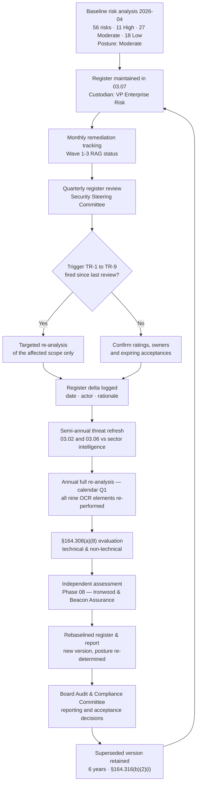

# 03.10 — Periodic Review &amp; Update

| Field | Value |
|---|---|
| Document ID | MBH-RA-REV-2026-310 |
| Version | 1.0 |
| Date | 2026-07-15 |
| Classification | Confidential — Electronic Protected Health Information (ePHI) // Illustrative Portfolio Sample |
| Owner | Michelle Tran, VP Enterprise Risk |
| Co-Owner | Daniel Cho, Chief Information Security Officer &amp; HIPAA Security Official |
| Author | Advisory Team (Healthcare GRC / HIPAA) |
| Status | Approved |

## Purpose

This document establishes how MercyBridge keeps its risk analysis **current**. It delivers **element 9** of OCR's nine-element expectation — *periodic review and updates* — and operationalises the **§164.308(a)(8) evaluation** standard together with **§164.306(e)**, which requires a covered entity to *"review and modify"* its security measures *"as needed to continue provision of reasonable and appropriate protection of electronic protected health information."*

### Risk analysis is ongoing, not one-time

The Security Rule nowhere describes the risk analysis as an event. It is a **continuous obligation**, and OCR has repeatedly cited entities whose analysis was technically performed but years out of date, or whose analysis had never been extended to a system acquired after it was written. A register that describes an estate the organisation no longer operates is not evidence of compliance; it is evidence of neglect.

| The failure mode | What it looks like | MercyBridge control |
|---|---|---|
| The one-and-done analysis | A dated PDF from three years ago, never revisited | Annual full re-analysis in calendar Q1, board-reported |
| The frozen scope | New systems, sites or business associates never added | Mandatory pre-go-live targeted analysis (Trigger TR-2) |
| The stale threat model | Threat catalogue predates the current ransomware landscape | Threat-landscape trigger (TR-6) and 03.06 refresh |
| The un-actioned register | Risks recorded, never re-scored after remediation | Residual re-score is a mandatory closure step (§4) |
| The lost history | Superseded versions overwritten, so change cannot be shown | Version control with six-year retention (§6) |

This document defines the **cadence**, the **triggers**, the **procedure**, the **versioning rules** and the **retention obligation** that together make the risk analysis a living instrument. The baseline it maintains is the Phase 03 result: **56 risks — 11 High, 27 Moderate, 18 Low; overall posture Moderate.**

## 1. Review Cadence

| Cadence | Activity | Scope | Forum / owner | Output |
|---|---|---|---|---|
| **Monthly** | Remediation tracking | Wave 1–3 High-risk items and Moderate workstreams | Marcus Reed → CISO | RAG status per risk in `trackers/` |
| **Quarterly** | Register review | All 56 entries: ratings, owners, treatment progress, new candidate risks, expiring acceptances | Security Steering Committee; chaired by Daniel Cho, method owned by Michelle Tran | Minuted register review; re-scores approved |
| **Semi-annual** | Threat-landscape refresh | 03.02 threat catalogue and 03.06 ransomware profile against current sector intelligence | Marcus Reed | Likelihood re-weighting recommendations |
| **Annual (calendar Q1)** | **Full re-analysis** | All nine OCR elements re-performed; scope re-confirmed; register rebaselined; posture re-determined | Daniel Cho, with the full Phase 03 role set | New versioned risk analysis report and register |
| **Annual** | **§164.308(a)(8) evaluation** | Technical and non-technical evaluation of the extent to which security measures meet the Rule | Karen Boyd with Priya Anand (Internal Audit) | Evaluation report to the Board committee |
| **Annual / continuous** | Independent assessment | Penetration test, vulnerability assessment, HITRUST validated assessment | Ironwood Security Labs; Beacon Assurance | Phase 08 findings folded into the register |
| **Event-driven** | Targeted analysis | Only the affected scope | Per the trigger table in §2 | Register delta and, where material, an interim version |

**Why quarterly and annual rather than one or the other.** The annual re-analysis re-earns the §164.308(a)(1)(ii)(A) evidence; the quarterly review keeps ownership and treatment honest between annual cycles. Neither substitutes for the other, and neither substitutes for the event-driven triggers below — most material change in a hospital arrives between scheduled reviews.

## 2. Update Triggers

Any of the following requires a targeted re-analysis of the affected scope, regardless of where it falls in the calendar. The trigger, the assessment performed and the resulting register change are logged in `logs/`.

| ID | Trigger | Examples at MercyBridge | Required action | Owner | Timeframe |
|---|---|---|---|---|---|
| **TR-1** | **Annual cycle** | Calendar Q1 | Full re-analysis; all nine elements; register rebaselined; posture re-determined | Daniel Cho | Q1 each year |
| **TR-2** | **New or materially changed ePHI system** | A new ePHI system joining the 68; a major EHR module; a new patient-facing application | Targeted analysis **before go-live**; register entries added; owner assigned | System owner + Marcus Reed | Before go-live |
| **TR-3** | **Significant infrastructure or architecture change** | Completion of micro-segmentation; MFA extension to all 68 systems; identity platform change; hosting migration | Re-score every affected risk; update residual ratings | Anthony Ruiz | Within 30 days of change |
| **TR-4** | **Security incident or breach** | Any incident investigated under Phase 07; any §164.402 four-factor assessment | Post-incident re-analysis of the exploited path; likelihood re-weighted; new risks registered | Daniel Cho | Within 30 days of closure |
| **TR-5** | **New or changed business associate, or a BA breach** | A new hosted service; BAA remediation completion; notification from Halcyon or any BA | Third-party risk re-assessment; R-28 to R-33 re-scored | Lisa Coleman | Within 30 days |
| **TR-6** | **Material threat-landscape shift** | A new ransomware TTP targeting hospitals; a KEV-listed vulnerability in a deployed clinical platform; an HHS HC3 sector alert | Re-weight likelihood; refresh 03.02 and 03.06 | Marcus Reed | Within 14 days for a KEV-relevant alert |
| **TR-7** | **Merger, acquisition, new site or new service line** | Acquisition of a physician group; opening a new outpatient site; launching a new service line | Scope extension; inventory update; targeted analysis of the acquired estate | Daniel Cho | Before ePHI integration |
| **TR-8** | **Regulatory or framework change** | Finalisation of the **2025 HIPAA Security Rule NPRM**; OCR guidance; HITRUST CSF version change | Method and scope refresh; control expectations updated; re-baseline where the standard changes | Karen Boyd | Within 90 days of effect |
| **TR-9** | **Independent assessment finding** | Ironwood penetration-test finding; Internal Audit observation; HITRUST corrective action | Register the finding as a risk or link it to an existing entry; re-score | Priya Anand + Daniel Cho | Within 30 days of report |

**Trigger TR-8 in particular.** The proposed 2025 Security Rule NPRM would make MFA, encryption at rest and in transit, network segmentation, asset inventory and annual penetration testing **mandatory** and remove the addressable/required distinction. MercyBridge already builds to that standard as forward-looking readiness, so finalisation would tighten expectations rather than reverse direction — but it would still require a documented method and scope refresh.

## 3. The Review Cycle

## 4. Update Procedure

| Step | Action | Responsible | Evidence produced |
|---|---|---|---|
| 1 | Trigger detected and logged with date, source and description | Any workforce member; triaged by Marcus Reed | Trigger log entry in `logs/` |
| 2 | Scope of the re-analysis defined — which assets, systems, threats and risks are affected | Marcus Reed | Scoping note |
| 3 | Data refreshed for the affected scope: inventory, data flows, control state | System owner | Updated Phase 02 records |
| 4 | Threats and vulnerabilities re-examined for the affected scope | Marcus Reed | 03.02 / 03.03 delta |
| 5 | Controls re-assessed — design, coverage, operation, evidence | Marcus Reed with the control owner | 03.04 delta |
| 6 | Likelihood and impact re-scored against the unchanged 03.05 scales | Risk owner | Proposed re-score |
| 7 | Re-score moderated for cross-category consistency | Michelle Tran | Moderation record |
| 8 | Patient-safety impacts and ESC escalations concurred | Dr. Samuel Ortega | CMIO concurrence note |
| 9 | Register updated; new risks assigned permanent IDs continuing from R-56 | Michelle Tran | Register change log |
| 10 | Treatment decision made or revised for any risk that has moved band | Risk owner; CISO for High | 03.08 update |
| 11 | Change approved and the document version incremented | Daniel Cho | Approval record |
| 12 | Superseded version archived, not overwritten; retention clock set | Michelle Tran | Version archive |
| 13 | Material change reported to the Security Steering Committee and, for any new High risk, to the Board committee | Daniel Cho | Minutes |

**Re-scoring discipline.** A risk is re-scored only on **evidenced** implementation — a configuration export, a test record, a coverage report — never on planned or in-flight implementation. Closing a risk on a project plan rather than on evidence is how registers drift away from reality.

**New risk IDs.** Identifiers continue sequentially from **R-56** and are never reused. A closed risk is marked closed with its closure date and rationale; it is not deleted, because the six-year record must show what was known and when.

## 5. Versioning Rules

| Change type | Version increment | Approval | Example |
|---|---|---|---|
| Editorial correction, no change to risk content | 1.0 → 1.0.1 | Michelle Tran | Typographical fix; clarified wording |
| Register delta from a targeted re-analysis — risks added, re-scored or closed | 1.0 → 1.1 | Daniel Cho | TR-3 completion of MFA extension re-scores R-01 |
| Change to methodology, scales or the ESC rules | 1.x → 2.0 | Daniel Cho + Karen Boyd | TR-8 regulatory change requiring a method refresh |
| Annual rebaseline | 1.x → 2.0 (new baseline year) | Daniel Cho; noted by the Board committee | Q1 2027 full re-analysis |
| Any change creating a new **High** risk | Immediate interim version | Daniel Cho; **Board committee notified** | TR-4 post-incident analysis identifies a new High risk |

Every version carries its own Document ID suffix, date, author and approver, and states what changed relative to the version it supersedes. The `CHANGELOG.md` for the phase records every increment.

## 6. Documentation and Retention — §164.316(b)

**§164.316(b)(1)** requires policies, procedures, and any action, activity or assessment required by the Security Rule to be **maintained in writing** (which may be electronic). **§164.316(b)(2)(i)** requires that documentation be retained for **six years from the date of its creation or the date when it last was in effect, whichever is later**. **§164.316(b)(2)(ii)** requires it to be available to those responsible for implementing the procedures, and **§164.316(b)(2)(iii)** requires periodic review and update in response to environmental or operational changes.

| Artefact | Retained | Retention start | Where held |
|---|---|---|---|
| Risk analysis report (03.09), each version | 6 years | Later of creation or last effective date | Phase 03 document set |
| Risk register (03.07), each version including superseded | 6 years | Date superseded | `trackers/` and document set |
| Risk management plan (03.08) and revisions | 6 years | Later of creation or last effective date | Phase 03 document set |
| Trigger logs and scoping notes | 6 years | Date of entry | `logs/` |
| Register change log — every add, re-score, owner change, closure | 6 years | Date of entry | `trackers/` |
| Risk acceptances with executive signature and expiry | 6 years | Date of expiry | `governance/` |
| Moderation records and CMIO concurrence notes | 6 years | Date of record | Working papers |
| Steering Committee and Board committee minutes covering risk | 6 years | Date of meeting | `governance/` |
| Evidence supporting a residual re-score (config exports, test records) | 6 years | Date of evidence | `logs/` |

**Retention is a compliance control, not records housekeeping.** In an OCR investigation, the question is rarely only *"what is your current risk analysis?"* — it is *"what did you know, when did you know it, and what did you do about it?"* Only a retained version history answers that. Superseded versions are therefore archived, never overwritten.

## 7. Review Calendar — 2026 to 2027

| Date | Activity | Trigger | Owner |
|---|---|---|---|
| 2026-07-15 | Phase 03 baseline approved — register, management plan and report issued | TR-1 baseline | Daniel Cho |
| 2026-09-30 | Q3 register review; Ironwood penetration-test findings folded in | Quarterly + TR-9 | Michelle Tran |
| 2026-10-31 | Wave 1 closure; R-01, R-02, R-23, R-34 residual re-score | TR-3 | Daniel Cho |
| 2026-11-30 | Semi-annual threat-landscape refresh; 03.02 and 03.06 updated | Semi-annual + TR-6 | Marcus Reed |
| 2026-12-31 | Q4 register review; BAA remediation re-score; Board report | Quarterly + TR-5 | Michelle Tran |
| 2027-01-31 | Wave 2 closure; R-17, R-24, R-40 residual re-score | TR-3 | Daniel Cho |
| **2027-Q1** | **Annual full re-analysis — all nine OCR elements; register rebaselined to version 2.0** | **TR-1** | **Daniel Cho** |
| 2027-Q1 | §164.308(a)(8) evaluation report to the Board Audit &amp; Compliance Committee | Annual | Karen Boyd |
| 2027-03-31 | Q1 register review; expiry and re-decision of all 11 risk acceptances | Quarterly | Michelle Tran |
| 2027-05-31 | Semi-annual threat-landscape refresh | Semi-annual | Marcus Reed |
| 2027-06-30 | Wave 3 closure; R-09, R-10, R-11, R-28 residual re-score; target posture Low-to-Moderate confirmed | TR-3 | Daniel Cho |

## 8. Assurance That the Cycle Actually Runs

| Assurance mechanism | What it tests | Owner |
|---|---|---|
| Internal Audit review | That reviews occurred on cadence, triggers were logged and acted on, and re-scores are evidence-backed | Priya Anand |
| HITRUST i1 validated assessment | Risk management maturity, including review cadence and documentation | Beacon Assurance |
| Board committee standing agenda item | Posture, High-risk movement, expiring acceptances, overdue waves | Robert Feldman |
| Overdue-review escalation rule | Any quarterly review missed, or any trigger unactioned beyond its timeframe, escalates to the CISO and appears in the next Board pack | Daniel Cho |
| OCR Audit Protocol readiness | Ability to produce the current analysis, the register, the management plan and the version history on demand | Karen Boyd |

## Cross-References

| Reference | Relevance |
|---|---|
| 03.01 — Risk Analysis Methodology | §10 cadence and triggers, restated and operationalised here |
| 03.04 — Existing Controls Assessment | Control state re-assessed at each cycle (procedure step 5) |
| 03.05 — Likelihood, Impact &amp; Risk Determination | The scales used for every re-score — unchanged unless a v2.0 method change is approved |
| 03.06 — Ransomware &amp; Healthcare Threat Profile | Refreshed at the semi-annual threat review and on TR-6 |
| 03.07 — Risk Register | The artefact maintained by this cycle; the change log lives with it |
| 03.08 — Risk Management Plan | Treatment decisions revised when a risk moves band |
| 03.09 — Risk Analysis Report | Element 9 mapping; the report reissued at each annual rebaseline |
| 03.11 — Phase Summary &amp; Transition | Confirms the ongoing obligation carries into Phase 04 |
| Phase 04 — Administrative Safeguards | §164.308(a)(8) evaluation standard implemented as policy |
| Phase 07 — Incident Response &amp; Breach Notification | Source of TR-4 post-incident re-analysis |
| Phase 08 — HITRUST &amp; Independent Assessment | Source of TR-9 findings; independent validation of the cycle |
| Phase 09 — Executive Reporting &amp; Program Maturity | Where continuous compliance and posture trending are reported |

---
[⬅ Previous](03.09-risk-analysis-report.md) · [🏠 Phase README](03.00-README.md) · [Next ➡](03.11-phase-summary-and-transition.md)
