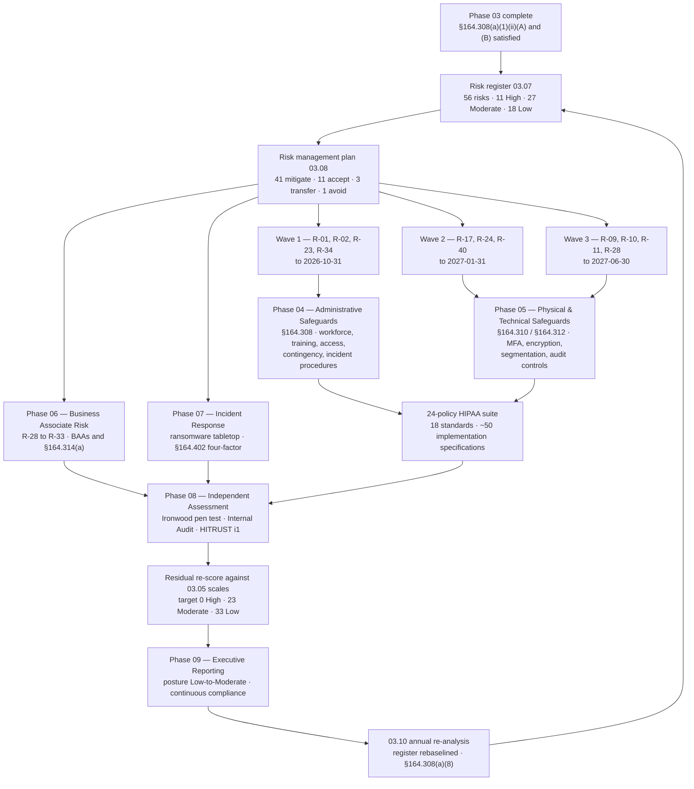

# 03.11 — Phase Summary &amp; Transition

| Field | Value |
|---|---|
| Document ID | MBH-RA-SUM-2026-311 |
| Version | 1.0 |
| Date | 2026-07-15 |
| Classification | Confidential — Electronic Protected Health Information (ePHI) // Illustrative Portfolio Sample |
| Owner | Daniel Cho, Chief Information Security Officer &amp; HIPAA Security Official |
| Co-Owner | Michelle Tran, VP Enterprise Risk |
| Author | Advisory Team (Healthcare GRC / HIPAA) |
| Status | Approved |

## Purpose

This document closes **Phase 03 — HIPAA Security Risk Analysis (§164.308(a)(1))**. It recaps what was produced, confirms that both **§164.308(a)(1)(ii)(A) risk analysis** and **§164.308(a)(1)(ii)(B) risk management** are satisfied, records the phase's residual obligations, and hands the eleven High risks and twenty-seven Moderate risks forward to **Phase 04 — Administrative Safeguards (§164.308)**.

The phase result, unchanged from 03.05 and carried through 03.07 to 03.09:

> **56 risks to ePHI — 11 High, 27 Moderate, 18 Low. Overall risk posture: Moderate. Target residual posture: Low-to-Moderate by 2027-06-30.**

## 1. What Phase 03 Delivered

| Document | Title | What it established |
|---|---|---|
| 03.00 | Phase README | Phase scope, structure and baseline |
| 03.01 | Risk Analysis Methodology | NIST SP 800-66 Rev. 2 / SP 800-30 spine; the nine OCR elements; roles; cadence (ADR-0002) |
| 03.02 | Threat Identification | 7 threat-source classes; **24 threat events** T-01 to T-24 |
| 03.03 | Vulnerability Identification | **30 vulnerabilities** V-01 to V-30; **6 predisposing conditions** PC-1 to PC-6 |
| 03.04 | Existing Controls Assessment | **42 safeguards** rated — 24% Effective, 67% Partially Effective, 10% Not Implemented |
| 03.05 | Likelihood, Impact &amp; Risk Determination | 5-point scales with healthcare impact criteria; ESC-1 to ESC-4; 5×5 matrix; **56 risks determined** |
| 03.06 | Ransomware &amp; Healthcare Threat Profile | Kill-chain and control mapping for R-23, R-24 and R-10 |
| 03.07 | **Risk Register** | The documented output — all 56 risks with owners; OCR element 8 |
| 03.08 | **Risk Management Plan** | §164.308(a)(1)(ii)(B) treatment: 41 mitigate, 11 accept, 3 transfer, 1 avoid; three remediation waves |
| 03.09 | **Risk Analysis Report** | The statutory deliverable; nine-element compliance mapping; Security Official sign-off; Board acknowledgement |
| 03.10 | Periodic Review &amp; Update | Element 9; §164.308(a)(8) cadence, nine triggers, versioning, six-year retention |
| 03.11 | Phase Summary &amp; Transition | This document |

| Phase metric | Value |
|---|---|
| Systems in scope | 68 of 210, holding ~2.1 million patient records |
| Threat events catalogued | 24 |
| Vulnerabilities and predisposing conditions | 30 + 6 |
| Safeguards assessed | 42 |
| Risks identified | **56** |
| High / Moderate / Low | **11 / 27 / 18** |
| Highest single score | 20 — R-23 enterprise ransomware |
| Risks escalated under the patient-safety rules | 9 applied; 4 changed band (R-10, R-11, R-23, R-28) |
| Risks with a named accountable owner | **56 of 56 (100%)** |
| Interviews conducted | 41 |
| Systems configuration-reviewed | 24, including all 12 Tier 1 |
| Overall risk posture | **Moderate** |

## 2. Confirmation Against §164.308(a)(1)

Both implementation specifications are separately and independently evidenced. This is the distinction OCR tests, and it is the reason Phase 03 produced two approval trails rather than one.

| Specification | Citation | Requirement | Evidence | Status |
|---|---|---|---|---|
| **Risk analysis** | **§164.308(a)(1)(ii)(A)** *(Required)* | "Conduct an accurate and thorough assessment of the potential risks and vulnerabilities to the confidentiality, integrity, and availability of electronic protected health information held by the covered entity" | 03.01–03.07 methodology, threats, vulnerabilities, controls, determination and register; **03.09 report signed by the Security Official 2026-07-15** and acknowledged by the Board Audit &amp; Compliance Committee | ✅ **Satisfied** |
| **Risk management** | **§164.308(a)(1)(ii)(B)** *(Required)* | "Implement security measures sufficient to reduce risks and vulnerabilities to a reasonable and appropriate level to comply with §164.306(a)" | **03.08 risk management plan** — treatment decision, owner, date and target residual for all 56 risks; three funded remediation waves; forward mapping to Phases 04–07 | ✅ **Satisfied — plan approved and funded; implementation delivered in Phases 04–07 and validated in Phase 08** |
| Sanction policy | §164.308(a)(1)(ii)(C) *(Required)* | Apply appropriate sanctions against workforce members who fail to comply | Gap registered as **R-56**; policy delivered in Phase 04 | ➡ Phase 04 |
| Information system activity review | §164.308(a)(1)(ii)(D) *(Required)* | Regularly review records of information system activity | Gap registered as **R-55**; procedure and coverage delivered in Phase 04 | ➡ Phase 04 |
| Assigned security responsibility | §164.308(a)(2) *(Required)* | Identify the security official | Daniel Cho designated; charter and board reporting line (ADR-0003) | ✅ Satisfied |
| Evaluation | §164.308(a)(8) | Periodic technical and non-technical evaluation | Cadence and triggers established in **03.10**; evaluation performed in Phase 08 | ✅ Established |
| Documentation | §164.316(b)(1), (b)(2) | Maintain in writing; retain six years; review and update | Every Phase 03 artefact versioned and retained per 03.10 §6 | ✅ Satisfied |

**On the word "satisfied" for (B).** The plan is approved, owned, dated and funded, which is what Phase 03 can evidence. The measures themselves are implemented in Phases 04 and 05, contracted in Phase 06, exercised in Phase 07, and independently validated in Phase 08. Phase 03 does not claim the safeguards are already in place; it claims the **management response exists and is sufficient in design** to reduce risk to a reasonable and appropriate level.

## 3. Phase Outcomes Carried Forward

| Outcome | Detail | Received by |
|---|---|---|
| **11 High risks**, waved and owned | Wave 1 R-01, R-02, R-23, R-34 · Wave 2 R-17, R-24, R-40 · Wave 3 R-09, R-10, R-11, R-28 | Phases 04, 05, 06, 07 |
| **27 Moderate risks**, grouped into 10 delivery workstreams | 6–12 month schedule with quarterly review | Phases 04, 05, 06 |
| **18 Low risks**, monitored or accepted | 11 time-bounded acceptances expiring at the 2027 annual analysis | 03.10 review cycle |
| **Four absent capabilities** | DLP, privileged access management, automated ePHI discovery, privacy behavioural monitoring | Phase 05 |
| **Control uplift targets** | Bring the 28 Partially Effective safeguards to Effective | Phases 04 and 05 |
| **Business associate gaps** | 3 BAAs under remediation; subcontractor visibility for 9 hosted services; offshore access at 2 | Phase 06 |
| **Contingency and IR gaps** | Untested Tier 1 restoration; unexercised outpatient downtime procedures; no ransomware tabletop | Phases 04 and 07 |
| **Ongoing analysis obligation** | Annual re-analysis, quarterly review, nine triggers, six-year retention | 03.10; Phases 08 and 09 |
| **Board-approved exceptions** | Wave 2 to 2027-01-31 and Wave 3 to 2027-06-30, with interim compensating controls | Board Audit &amp; Compliance Committee |

## 4. Phase 03 to Phase 04 Handover

## 5. What Phase 04 Inherits

Phase 04 implements the **Administrative Safeguards at §164.308** — the family that carries more of the Security Rule's weight than any other, and the family that most directly answers the risks registered here.

| Phase 04 focus | Standard | Risks it must resolve |
|---|---|---|
| Security management process — risk management operationalised | §164.308(a)(1) | R-23, R-40, R-09 (programme governance) |
| Sanction policy | §164.308(a)(1)(ii)(C) | **R-56** |
| Information system activity review | §164.308(a)(1)(ii)(D) | **R-55**, R-36 |
| Workforce security — authorisation, clearance, termination | §164.308(a)(3) | R-04, R-02 |
| Information access management — minimum necessary, recertification | §164.308(a)(4) | R-03, R-05, R-08, R-36 |
| Security awareness and training; log-in monitoring; password management | §164.308(a)(5) | **R-34**, R-26, R-35, R-37, R-39 |
| Security incident procedures | §164.308(a)(6) | R-24, R-31 (with Phase 07) |
| Contingency plan — backup, DR, emergency mode, testing | §164.308(a)(7) | **R-23**, R-47, R-48, R-49, R-50 |
| Evaluation | §164.308(a)(8) | The 03.10 cycle made policy |
| Business associate contracts | §164.308(b)(1) | R-29 to R-33 (with Phase 06) |
| **The 24-policy HIPAA suite** | §164.316(a), (b) | **R-54** — legacy policy suite and retention evidence |

**Non-negotiable handover conditions.** Phase 04 must (1) accept the register as its authoritative input rather than restating risk in its own terms, (2) trace each safeguard it implements to the risk IDs it treats, (3) capture evidence sufficient for a residual re-score under 03.10, and (4) route any newly discovered risk back into the register with an ID continuing from R-56.

## 6. Open Items Leaving Phase 03

| # | Open item | Owner | Due | Destination |
|---|---|---|---|---|
| O-1 | Wave 1 delivery and residual re-score of R-01, R-02, R-23, R-34 | Daniel Cho | 2026-10-31 | Phases 04, 05, 07 |
| O-2 | Wave 2 delivery under board-approved exception | Daniel Cho | 2027-01-31 | Phase 05 |
| O-3 | Wave 3 delivery, contingent on FY2027 capital approval for device replacement | Anthony Ruiz | 2027-06-30 | Phase 05 |
| O-4 | BAA remediation for MBH-SYS-029, -033, -058 and subcontractor visibility for 9 hosted services | Lisa Coleman | 2026-12-31 | Phase 06 |
| O-5 | Ransomware tabletop and IR plan formalisation | Daniel Cho | 2026-08 | Phase 07 |
| O-6 | Independent technical validation of register scoring (limitations L-1 and L-5 of 03.09) | Priya Anand | 2026-09 | Phase 08 |
| O-7 | Expiry and re-decision of the 11 documented risk acceptances | Michelle Tran | 2027 Q1 | 03.10 annual cycle |
| O-8 | Annual full re-analysis and register rebaseline to version 2.0 | Daniel Cho | 2027 Q1 | 03.10 |

## 7. Phase Closure Statement

Phase 03 is **complete and approved**. MercyBridge Health Network has conducted and documented an accurate and thorough, enterprise-wide analysis of the potential risks and vulnerabilities to the confidentiality, integrity and availability of the ePHI it creates, receives, maintains and transmits; has determined **56 risks — 11 High, 27 Moderate, 18 Low** — with an overall posture of **Moderate**; has assigned an accountable owner to every risk; and has established and funded a risk management plan sufficient in design to reduce those risks to a reasonable and appropriate level.

The analysis is not finished in the sense of being over. It is finished in the sense of being **current, evidenced and maintained** — and 03.10 is the mechanism that keeps it so.

**Phase 03 is closed. Phase 04 — Administrative Safeguards (§164.308) — is open.**

| Closure approval | Name | Date |
|---|---|---|
| Chief Information Security Officer &amp; HIPAA Security Official | Daniel Cho | 2026-07-15 |
| VP, Enterprise Risk | Michelle Tran | 2026-07-15 |
| Chief Compliance Officer | Karen Boyd | 2026-07-15 |
| Board Audit &amp; Compliance Committee Chair | Robert Feldman | 2026-07-15 |

## Cross-References

| Reference | Relevance |
|---|---|
| 03.01 — Risk Analysis Methodology | The methodology this phase executed |
| 03.04 — Existing Controls Assessment | The 28 Partially Effective safeguards Phase 04 and 05 must complete |
| 03.05 — Likelihood, Impact &amp; Risk Determination | The scales every future re-score must use |
| 03.07 — Risk Register | The authoritative input Phase 04 inherits |
| 03.08 — Risk Management Plan | Waves, owners, target residuals and forward mapping |
| 03.09 — Risk Analysis Report | Signed statutory deliverable; nine-element compliance mapping |
| 03.10 — Periodic Review &amp; Update | The ongoing obligation that outlives this phase |
| Phase 04 — Administrative Safeguards | Immediate destination; §164.308 standards and the 24-policy suite |
| Phase 05 — Physical &amp; Technical Safeguards | MFA, encryption, segmentation and audit controls for Waves 2 and 3 |
| Phase 06 — Business Associate &amp; Third-Party Risk | R-28 to R-33 and §164.314(a) |
| Phase 07 — Incident Response &amp; Breach Notification | R-23, R-24 exercises and the §164.402 four-factor assessment |
| Phase 08 — HITRUST &amp; Independent Assessment | Validation of the register and of implemented safeguards |
| Phase 09 — Executive Reporting &amp; Program Maturity | Residual posture Low-to-Moderate and continuous compliance |

---
[⬅ Previous](03.10-periodic-review-and-update.md) · [🏠 Phase README](03.00-README.md) · [Next ➡](../04-administrative-safeguards/04.00-README.md)
