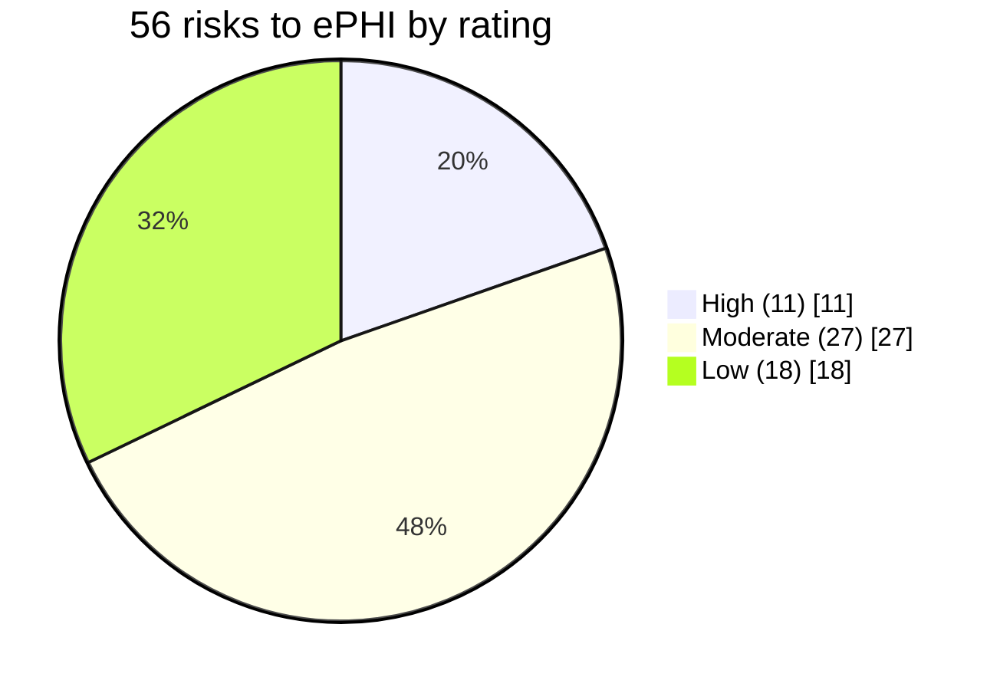

# Diagram — Risk Distribution

| Field | Value |
|---|---|
| Version | 1.0 |
| Date | 2026-07-15 |
| Classification | Confidential — Electronic Protected Health Information (ePHI) // Illustrative Portfolio Sample |
| Organization | MercyBridge Health Network (HIPAA covered entity) |
| Regulator | HHS Office for Civil Rights (OCR) |
| Phase | 03 — HIPAA Security Risk Analysis |
| Author | Advisory Team (Healthcare GRC / HIPAA) |
| Status | Approved |

Overall risk posture: **Moderate**. Target after the remediation waves: **0 High**.

## Cross-References
`03.07-risk-register.md`, `03.05-likelihood-impact-and-risk-determination.md`.
