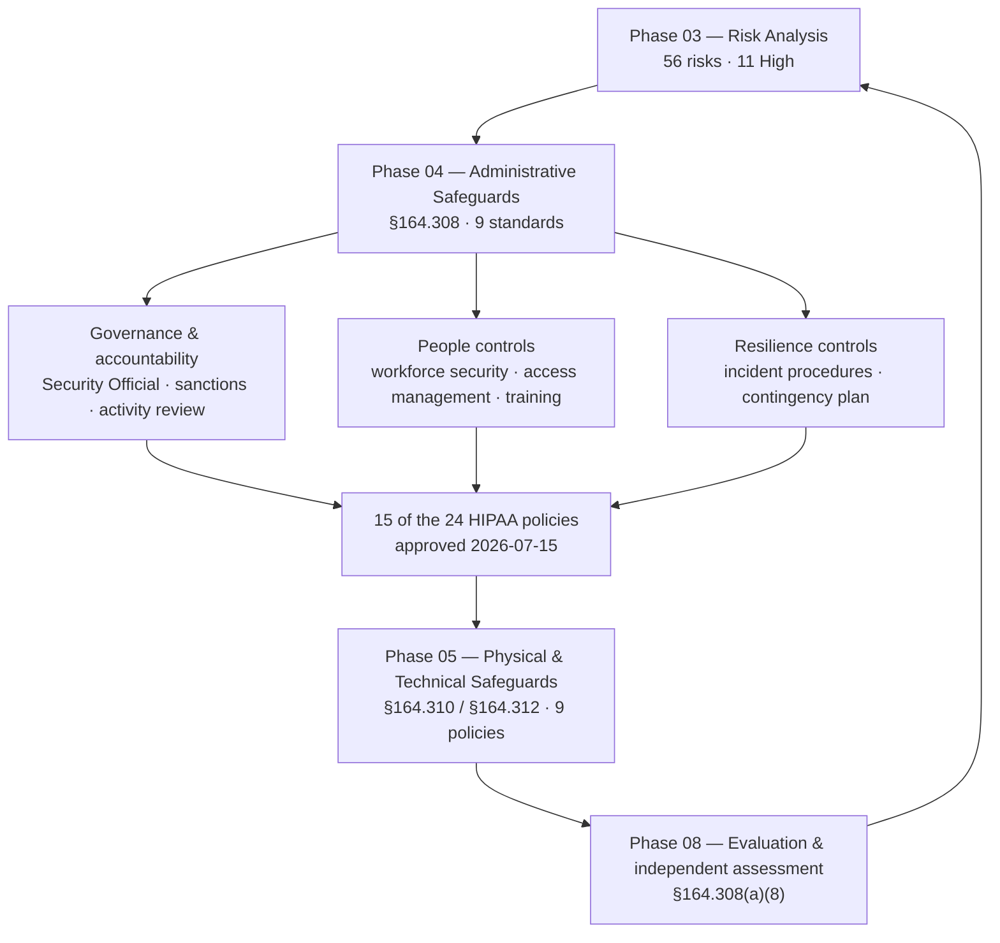

# 04.01 — Administrative Safeguards Overview

| Field | Value |
|---|---|
| Document ID | MBH-ADM-OVW-2026-401 |
| Version | 1.0 |
| Date | 2026-07-15 |
| Classification | Confidential — Electronic Protected Health Information (ePHI) // Illustrative Portfolio Sample |
| Owner | Daniel Cho, Chief Information Security Officer &amp; HIPAA Security Official |
| Co-Owner | Karen Boyd, Chief Compliance Officer |
| Author | Advisory Team (Healthcare GRC / HIPAA) |
| Status | Approved |

## Purpose

This document opens **Phase 04 — Administrative Safeguards** and establishes how MercyBridge Health Network implements **45 CFR §164.308**, the largest of the three safeguard families in the HIPAA Security Rule. It enumerates the **nine standards** of §164.308, lists every implementation specification with its **required** or **addressable** designation, names the document in this phase that delivers each, and explains two things that OCR investigations repeatedly show covered entities get wrong: that **"addressable" does not mean "optional"**, and that administrative safeguards are the *governing* family — the one that makes the physical and technical safeguards enforceable rather than merely installed.

The Security Rule is deliberately front-loaded toward administration. Of the **18 standards and ~50 implementation specifications** across the whole rule, §164.308 alone carries **nine standards and 21 implementation specifications**. That weighting is not an accident: encryption without an access-authorisation process, or audit logging without a review procedure, produces technology that satisfies nobody.

> **Phase 04 scope: 9 standards · 21 implementation specifications · 15 of the 24 HIPAA policies · treats 31 of the 56 registered risks, including 5 of the 11 High risks.**

## 1. Where Administrative Safeguards Sit

§164.308 is the connective tissue of the programme. Phase 03 determined *what* the risks to ePHI are; Phase 04 installs the management system that decides, assigns, trains, reviews and recovers. Phase 05 then delivers the physical and technical controls that this management system directs.

## 2. The Nine Standards of §164.308

| # | Standard | Citation | Implementation specifications | R / A | Delivered by |
|---|---|---|---|---|---|
| 1 | Security Management Process | §164.308(a)(1) | Risk analysis · Risk management · Sanction policy · Information system activity review | R · R · R · R | Phase 03 (A, B) and **04.02** (C, D) |
| 2 | Assigned Security Responsibility | §164.308(a)(2) | *(no separate specifications — the standard is itself required)* | R | 01.05 and **04.03** |
| 3 | Workforce Security | §164.308(a)(3) | Authorization and/or supervision · Workforce clearance procedure · Termination procedures | A · A · A | **04.04** |
| 4 | Information Access Management | §164.308(a)(4) | Isolating health care clearinghouse functions · Access authorization · Access establishment and modification | R (if applicable) · A · A | **04.05** |
| 5 | Security Awareness and Training | §164.308(a)(5) | Security reminders · Protection from malicious software · Log-in monitoring · Password management | A · A · A · A | **04.06** |
| 6 | Security Incident Procedures | §164.308(a)(6) | Response and reporting | R | **04.07**, extended in Phase 07 |
| 7 | Contingency Plan | §164.308(a)(7) | Data backup plan · Disaster recovery plan · Emergency mode operation plan · Testing and revision procedures · Applications and data criticality analysis | R · R · R · A · A | **04.08** |
| 8 | Evaluation | §164.308(a)(8) | *(no separate specifications — the standard is itself required)* | R | **04.09**, performed in Phase 08 |
| 9 | Business Associate Contracts and Other Arrangements | §164.308(b)(1) | Written contract or other arrangement — §164.308(b)(3), §164.314(a) | R | **04.10**, delivered in Phase 06 |

**Counting note.** Nine standards; 21 implementation specifications in total. **10 are required, 11 are addressable.** Two standards (Assigned Security Responsibility and Evaluation) have no sub-specifications and are satisfied by the standard itself.

## 3. "Addressable" Does Not Mean "Optional"

This is the single most misunderstood provision in the Security Rule and a recurring theme in OCR resolution agreements. **§164.306(d)(3)** sets a three-branch test for every addressable specification.

| Branch | What §164.306(d)(3) requires | What MercyBridge must produce |
|---|---|---|
| (i) | If the specification is **reasonable and appropriate**, implement it | The control, plus operating evidence |
| (ii)(A) | If it is **not** reasonable and appropriate, **document why** | A written, dated, Security Official-approved rationale referencing the §164.306(b)(2) factors |
| (ii)(B) | And implement an **equivalent alternative measure** if reasonable and appropriate | The alternative control, mapped to the same risk in the register |

There is no fourth branch that reads "or do nothing." A covered entity that leaves an addressable specification unimplemented **and** undocumented has failed the standard exactly as surely as if the specification had been required.

**MercyBridge's decision (ADR-0008).** All 11 addressable specifications in §164.308 were assessed as reasonable and appropriate for an organisation of MercyBridge's size and complexity — 4 hospitals, ~30 outpatient sites, ~6,500 workforce members, 68 ePHI systems, ~2.1 million patient records. **All 11 are implemented.** No §164.308 specification is carried as "addressable — not implemented," and therefore no §164.306(d)(3)(ii) rationale is on file for this family.

### 3.1 The 2025 NPRM Change

The **2025 HIPAA Security Rule NPRM** proposes to **remove the addressable/required distinction entirely**, making every implementation specification mandatory subject only to narrow, documented exceptions. It would additionally mandate MFA, encryption of ePHI at rest and in transit, network segmentation, a maintained asset inventory, and annual penetration testing and vulnerability scanning.

| Phase 04 area | Current status in force | If the NPRM is finalised | MercyBridge readiness |
|---|---|---|---|
| Workforce security specifications | 3 addressable | 3 mandatory | Already implemented — no change |
| Access authorization / establishment and modification | 2 addressable | 2 mandatory | Already implemented — recertification cycle live |
| Security awareness sub-specifications | 4 addressable | 4 mandatory | Already implemented — training, phishing, log-in monitoring, password management |
| Contingency testing and revision; criticality analysis | 2 addressable | 2 mandatory | Already implemented — test calendar and 4-tier criticality analysis |
| Written policy and documentation | §164.316 | Tightened; annual review explicit | 24-policy suite with annual review clause |

Building to the stricter of the two standards costs MercyBridge nothing in defensibility and removes a future remediation project. This is recorded as a deliberate programme decision in **ADR-0002**.

## 4. What Phase 04 Delivers

| Document | Standard(s) | Principal outputs |
|---|---|---|
| 04.00 | — | Phase README, scope, structure |
| **04.01** | All nine | This overview; standard-to-document map; addressable doctrine |
| **04.02** | §164.308(a)(1) | Sanction policy; information system activity review procedure and cadence |
| **04.03** | §164.308(a)(2) | Security Official role in operation; team structure; delegation; annual report |
| **04.04** | §164.308(a)(3) | Joiner-mover-leaver lifecycle; clearance; termination SLA and metrics |
| **04.05** | §164.308(a)(4) | Role-based access; minimum necessary; break-the-glass; recertification |
| **04.06** | §164.308(a)(5) | Annual and role-based training; phishing simulation; reminders; password management |
| **04.07** | §164.308(a)(6) | Incident definition, detection, triage, documentation; interface to Phase 07 |
| **04.08** | §164.308(a)(7) | Backup, DR, emergency mode operation, testing, criticality analysis |
| 04.09 | §164.308(a)(8) | Evaluation standard and cadence |
| 04.10 | §164.308(b)(1) | Business associate contracts; handoff to Phase 06 |
| 04.11 | §164.316 | The 24-policy suite, documentation and six-year retention |
| 04.12 | — | Control-to-risk traceability matrix; residual ratings |
| 04.13 | — | Phase summary and transition to Phase 05 |

## 5. The 24-Policy Suite — Phase 04 Share

The Security Rule requires policies and procedures **in writing** (§164.316(a)) and their retention for **six years** from creation or last effective date, whichever is later (§164.316(b)(2)(i)). MercyBridge consolidated a sprawling legacy set into **24 policies**, of which **15 are administrative and approved in this phase**; the remaining 9 accompany Phase 05.

| Policy | Title | Standard |
|---|---|---|
| POL-01 | HIPAA Security Program &amp; Governance | §164.308(a)(2), §164.316 |
| POL-02 | Risk Analysis &amp; Risk Management | §164.308(a)(1)(ii)(A)–(B) |
| POL-03 | Sanction Policy | §164.308(a)(1)(ii)(C) |
| POL-04 | Information System Activity Review &amp; Audit Log | §164.308(a)(1)(ii)(D) |
| POL-05 | Workforce Security (Authorization, Clearance, Termination) | §164.308(a)(3) |
| POL-06 | Information Access Management | §164.308(a)(4) |
| POL-07 | Minimum Necessary &amp; Role-Based Access | §164.308(a)(4), §164.502(b) |
| POL-08 | Emergency (Break-the-Glass) Access | §164.308(a)(4), §164.312(a)(2)(ii) |
| POL-09 | Security Awareness &amp; Training | §164.308(a)(5) |
| POL-10 | Malicious Software Protection | §164.308(a)(5)(ii)(B) |
| POL-11 | Password &amp; Authentication Management | §164.308(a)(5)(ii)(D) |
| POL-12 | Security Incident Procedures | §164.308(a)(6) |
| POL-13 | Contingency Planning | §164.308(a)(7) |
| POL-14 | Evaluation &amp; Continuous Compliance | §164.308(a)(8) |
| POL-15 | Business Associate &amp; Third-Party Security | §164.308(b)(1), §164.314(a) |

POL-16 through POL-24 (physical, technical, encryption, media, workstation, transmission) are approved in Phase 05.

## 6. Risk Coverage — Phase 03 Risks Treated Here

| Standard | Risks treated | Of which High |
|---|---|---|
| §164.308(a)(1) Security Management Process | R-36, R-54, R-55, R-56 | — |
| §164.308(a)(2) Assigned Security Responsibility | R-54, R-56 | — |
| §164.308(a)(3) Workforce Security | R-02, R-03, R-04, R-39, R-52 | R-02 |
| §164.308(a)(4) Information Access Management | R-03, R-05, R-06, R-08, R-32, R-36 | — |
| §164.308(a)(5) Awareness &amp; Training | R-26, R-34, R-35, R-37, R-38, R-39, R-51 | R-34 |
| §164.308(a)(6) Security Incident Procedures | R-23, R-24, R-31, R-46 | R-23, R-24 |
| §164.308(a)(7) Contingency Plan | R-10, R-23, R-28, R-43, R-47, R-48, R-49, R-50, R-53 | R-10, R-28 |
| **Total distinct risks touched** | **31 of 56** | **5 of 11** |

The six remaining High risks (R-01 MFA, R-09 unsupported device OS, R-11 device encryption, R-17 segmentation, R-40 encryption at rest, plus the technical half of R-24) are delivered by **Phase 05**. Administrative safeguards make those technical measures governable; they do not substitute for them.

## 7. Evidence Produced in Phase 04

| Evidence class | Artefact | Retention |
|---|---|---|
| Policy | 15 approved policies with signature pages and effective dates | 6 years — §164.316(b)(2)(i) |
| Procedure | Activity review runbook, JML runbook, recertification runbook, downtime procedures | 6 years |
| Records | Sanction register, training completion extracts, phishing campaign reports, access recertification attestations, break-glass review logs, incident register, contingency test reports | 6 years |
| Decision | ADR-0008 (addressable determination), ADR-0009 (activity review scope), steering committee minutes | 6 years |
| Metrics | Quarterly administrative safeguards scorecard to the Security Steering Committee and Board Audit &amp; Compliance Committee | 6 years |

## Cross-References

| Reference | Relevance |
|---|---|
| 01.04 — HIPAA Security Rule Overview | The 18 standards and ~50 specifications in full |
| 01.05 — Security Official Designation &amp; Governance | The §164.308(a)(2) designation this phase operationalises |
| 02.01 — Inventory Methodology | Criticality tiering and RTO/RPO targets used by 04.08 |
| 03.04 — Existing Controls Assessment | Baseline ratings C-A01 to C-A15 that Phase 04 improves |
| 03.07 — Risk Register | The 56 risks; the 31 treated here |
| 03.08 — Risk Management Plan | Wave 1–3 sequencing and owners |
| 04.02 → 04.08 | The standard-by-standard implementation documents |
| 04.11 — Policies, Procedures &amp; Documentation | The 24-policy suite and §164.316 retention |
| Phase 05 — Physical &amp; Technical Safeguards | §164.310 / §164.312 and the remaining 9 policies |
| Phase 07 — Incident Response &amp; Breach Notification | Full IR plan extending §164.308(a)(6) |
| Phase 08 — HITRUST &amp; Independent Assessment | Where these safeguards are independently validated |

---
[⬅ Previous](04.00-README.md) · [🏠 Phase README](04.00-README.md) · [Next ➡](04.02-security-management-process.md)
