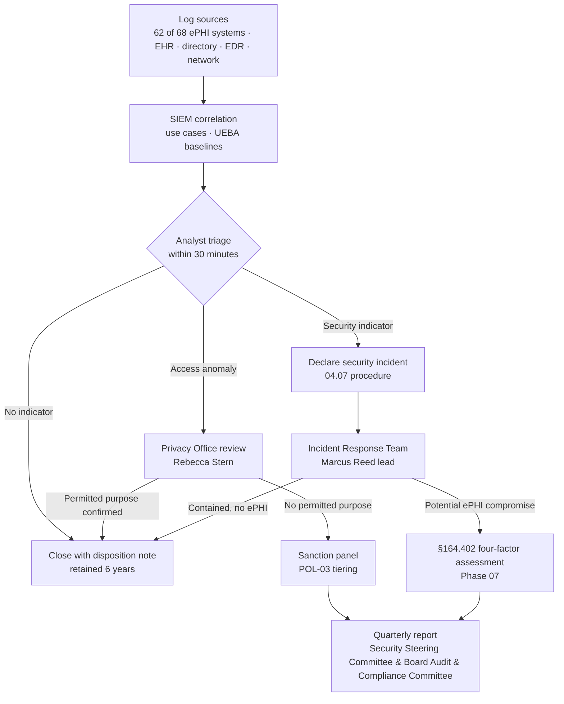

# 04.02 — Security Management Process (§164.308(a)(1))

| Field | Value |
|---|---|
| Document ID | MBH-ADM-SMP-2026-402 |
| Version | 1.0 |
| Date | 2026-07-15 |
| Classification | Confidential — Electronic Protected Health Information (ePHI) // Illustrative Portfolio Sample |
| Owner | Daniel Cho, Chief Information Security Officer &amp; HIPAA Security Official |
| Co-Owner | Karen Boyd, Chief Compliance Officer (sanction policy) |
| Author | Advisory Team (Healthcare GRC / HIPAA) |
| Status | Approved |

## Purpose

**45 CFR §164.308(a)(1)(i)** requires a covered entity to "implement policies and procedures to prevent, detect, contain, and correct security violations." It is the foundational standard of the Security Rule and the only one with **four required implementation specifications** — there is no addressable relief anywhere in it.

Two of the four — **risk analysis** and **risk management** — were delivered in **Phase 03** and are recapped here for completeness. This document therefore concentrates on the two that Phase 03 explicitly handed forward as open gaps: the **sanction policy** (registered as **R-56**) and **information system activity review** (registered as **R-55**, unevidenced for 19 of 68 ePHI systems).

> **Phase 04 closes both open specifications: POL-03 Sanction Policy approved 2026-07-15; POL-04 Information System Activity Review approved 2026-07-15 with SIEM coverage extended from 49 to 62 of 68 ePHI systems and a committed path to 68 of 68 by 2026-09-30.**

## 1. The Four Implementation Specifications

| Specification | Citation | R / A | Requirement in brief | MercyBridge status |
|---|---|---|---|---|
| Risk analysis | §164.308(a)(1)(ii)(A) | **Required** | Accurate and thorough assessment of potential risks and vulnerabilities to the confidentiality, integrity and availability of ePHI | ✅ Delivered — Phase 03; 56 risks; report signed 2026-07-15 |
| Risk management | §164.308(a)(1)(ii)(B) | **Required** | Implement security measures sufficient to reduce risks to a reasonable and appropriate level per §164.306(a) | ✅ Plan approved and funded — 03.08; measures delivered Phases 04–07 |
| Sanction policy | §164.308(a)(1)(ii)(C) | **Required** | Apply appropriate sanctions against workforce members who fail to comply with the security policies and procedures | ✅ **Delivered here** — POL-03 |
| Information system activity review | §164.308(a)(1)(ii)(D) | **Required** | Regularly review records of information system activity, such as audit logs, access reports and security incident tracking reports | ✅ **Delivered here** — POL-04 |

All four are **required**; the 2025 NPRM would not change their status, though it would tighten the expected evidence for (D) by mandating an asset inventory against which log coverage is measured — a control MercyBridge already holds from Phase 02.

## 2. Recap — Risk Analysis and Risk Management (Phase 03)

| Item | Result |
|---|---|
| Methodology | NIST SP 800-66 Rev. 2 spine, NIST SP 800-30 scoring, OCR nine-element structure (ADR-0006) |
| Scope | 68 ePHI systems of 210 enterprise-wide; ~2.1 million patient records |
| Threats / vulnerabilities | 24 threat events, 30 vulnerabilities, 6 predisposing conditions |
| Risks determined | **56 — 11 High, 27 Moderate, 18 Low**; overall posture Moderate |
| Treatment decisions | 41 mitigate, 11 accept, 3 transfer, 1 avoid |
| Waves | Wave 1 (2026-08 → 2026-10), Wave 2 (→ 2027-01), Wave 3 (→ 2027-06) |
| Review cadence | Annual, plus nine defined triggers — 03.10 |

Nothing in this document re-scores or re-opens the register. The Security Management Process standard is satisfied for (A) and (B) by the Phase 03 artefacts and their signature pages.

## 3. Sanction Policy — §164.308(a)(1)(ii)(C)

### 3.1 The Gap Phase 03 Found

**R-56:** an HR sanction framework existed, but privacy sanctions (owned by the Privacy Office) and security sanctions (owned by Information Security) were tracked in separate systems, applied inconsistently between clinical and non-clinical populations, and not reconciled. OCR does not accept "we have a disciplinary policy" as evidence; it looks for a **security-specific** sanction policy, applied, documented, and demonstrably consistent.

### 3.2 The Policy — POL-03

POL-03 establishes a single, tiered sanction framework covering **all ~6,500 workforce members**, including employed staff, credentialed medical staff, residents, students, contractors and volunteers. It is owned by **Karen Boyd** as Chief Compliance Officer, co-signed by **Daniel Cho** and **Rebecca Stern**, and administered jointly with Human Resources and Medical Staff Affairs.

| Tier | Conduct | Illustrative examples | Standard sanction range |
|---|---|---|---|
| **T1 — Inadvertent** | Non-wilful, low-impact policy deviation with no ePHI compromise | Unattended unlocked workstation; late annual training; badge left at home | Documented coaching; re-training within 14 days |
| **T2 — Negligent** | Careless act creating exposure, or repeated T1 | Misdirected fax or email containing ePHI; password sharing; unapproved messaging app | Written warning; mandatory re-training; manager attestation |
| **T3 — Knowing** | Deliberate breach of policy without malicious intent or personal gain | Accessing a record without a treatment, payment or operations purpose; unauthorised break-glass use; bypassing a control for convenience | Final written warning to suspension; access restriction; referral to Medical Staff Affairs for credentialed providers |
| **T4 — Wilful / for gain** | Malicious access, sale or exfiltration of ePHI, or obstruction of an investigation | Snooping on a public figure or family member; bulk export to personal storage; falsifying records | Termination; referral to law enforcement and to OCR/state AG as required; licensure board notification |

**Aggravating and mitigating factors** are applied consistently and recorded: volume of records involved, sensitivity (behavioural health, HIV, substance use), whether the individual self-reported, prior sanction history within 24 months, role and level of access, and whether the act was concealed. Patient-safety consequences escalate the tier by one.

### 3.3 Consistency Controls

| Control | Description |
|---|---|
| Single sanction register | One register (`trackers/sanction-register.xlsx`) holds every privacy and security sanction event; Privacy and Security file into the same record |
| Joint review panel | Karen Boyd (chair), Rebecca Stern, Daniel Cho, HR Business Partner; meets fortnightly and for any T3/T4 within 3 business days |
| Parity testing | Quarterly comparison of sanction outcomes across clinical vs non-clinical and employed vs credentialed populations, to detect differential enforcement |
| Medical staff pathway | Credentialed providers are sanctioned through Medical Staff Affairs and the Medical Executive Committee; the same tier definitions apply |
| Non-retaliation | Good-faith reporting, including self-reporting of one's own error, is a documented mitigating factor and is never itself sanctionable |
| Documentation | Every event records: date, tier, facts, decision, decision-maker, sanction applied, re-training completion, closure date — retained 6 years |

### 3.4 Baseline Metrics

| Metric | Trailing 12 months to 2026-06-30 |
|---|---|
| Sanction events recorded (post-consolidation) | 14 |
| By tier | T1: 6 · T2: 5 · T3: 2 · T4: 1 |
| Events involving ePHI access without a permitted purpose | 3 (all T3/T4) |
| Terminations for T4 conduct | 1 |
| Events reconciled between Privacy and Security registers before consolidation | 0 of 14 → **14 of 14 after** |
| Median time from substantiation to sanction decision | 9 calendar days (target ≤ 10) |

## 4. Information System Activity Review — §164.308(a)(1)(ii)(D)

### 4.1 The Gap Phase 03 Found

**R-55:** SIEM use-case review operated for Tier 1 systems, but review was **not evidenced for 19 of the 68 ePHI systems**. The specification requires *regular review of records of information system activity* — audit logs, access reports, security incident tracking reports. Logs that are generated but never reviewed satisfy §164.312(b) at best and (a)(1)(ii)(D) not at all.

### 4.2 Coverage Position

| Population | At Phase 03 assessment | At 2026-07-15 | Target |
|---|---|---|---|
| ePHI systems forwarding logs to the SIEM | 49 of 68 | **62 of 68** | 68 of 68 by 2026-09-30 |
| Tier 1 critical systems under daily use-case review | 12 of 12 | 12 of 12 | Sustained |
| Systems with a named log reviewer and documented cadence | 31 of 68 | **62 of 68** | 68 of 68 |
| Systems with evidenced review output for the prior quarter | 24 of 68 | **58 of 68** | 68 of 68 |

The six remaining systems are two legacy laboratory instruments' middleware, one radiation-oncology planning system, one durable-medical-equipment portal and two outpatient practice-management instances; each has a dated onboarding ticket and an interim manual monthly extract.

### 4.3 Review Cadence, Reviewer and Escalation

| Review type | Scope | Cadence | Reviewer | Evidence |
|---|---|---|---|---|
| SIEM use-case triage | All 62 forwarding systems | Continuous, 24×7 | Security Operations analyst (Marcus Reed's team) | Alert queue, disposition notes |
| Tier 1 clinical access anomaly review | 12 Tier 1 systems | Daily | Security Operations analyst | Daily review sheet, signed |
| Break-the-glass review | Halcyon EHR | Every 3 business days | Privacy Office analyst with clinical informatics support | Break-glass review log |
| Same-surname / same-address / VIP / employee-record access reports | Halcyon EHR, patient portal | Weekly | Privacy Office (Rebecca Stern) | Proactive monitoring report |
| Privileged-account activity review | 68 systems, all elevated accounts | Weekly | Information Security Manager (Marcus Reed) | Privileged activity attestation |
| Failed-logon and lockout trending | Directory + 68 systems | Weekly | Security Operations | Trend report |
| Log-source health and coverage reconciliation | 68 systems vs Phase 02 inventory | Monthly | Marcus Reed | Coverage reconciliation report |
| Application-owner activity attestation | Tier 2–4 systems | Quarterly | Named system owner (02.10) | Signed attestation |
| Programme-level activity review summary | Enterprise | Quarterly | Daniel Cho → Security Steering Committee | Quarterly scorecard |
| Independent sampling of review quality | Sampled across all cadences | Semi-annual | Priya Anand, Internal Audit | Audit workpaper |

**Log retention.** Security-relevant logs are retained **13 months online and 6 years in archive**, aligning the technical capability to the §164.316(b)(2)(i) documentation retention period and to the 60-day breach-notification investigation window.

### 4.4 Escalation Path

**Escalation thresholds.** Any single event touching **≥ 25 patient records** without an evident permitted purpose, any access to a **restricted-flag record** (employee, VIP, behavioural health), any **privileged-account creation outside change control**, and any **bulk export exceeding 500 records** escalate immediately to the Information Security Manager and, within 4 hours, to the Security Official and Privacy Officer.

## 5. Risks Treated and Evidence Produced

| Risk | Description | Treatment delivered here | Target residual |
|---|---|---|---|
| **R-55** | Activity review not evidenced for 19 systems | POL-04; coverage 49 → 62 of 68; named reviewers; ten-cadence schedule; internal audit sampling | Low (accepted at Low once 68 of 68) |
| **R-56** | Sanction application not consistently documented | POL-03; single register; joint panel; parity testing; 14 of 14 events reconciled | Low |
| **R-36** | Workforce browses records without a permitted purpose | Weekly proactive monitoring reports; UEBA baselines; sanction tiering | Moderate → Low by 2027-01 |
| **R-54** | Legacy policy suite and retention not uniformly evidenced | POL-03 and POL-04 issued into the 24-policy suite with 6-year retention | Moderate → Low |
| R-02 (High) | Shared and generic clinical logins destroy audit attribution | Activity review cannot attribute without unique IDs — dependency raised to Wave 1; shared-account elimination tracked in 04.05 | Treated jointly with Phase 05 |

| Evidence artefact | Location | Owner |
|---|---|---|
| POL-03 Sanction Policy (signed) | `governance/POL-03-sanction-policy.md` | Karen Boyd |
| POL-04 Information System Activity Review &amp; Audit Log Policy (signed) | `governance/POL-04-activity-review-policy.md` | Daniel Cho |
| Activity review runbook (ten cadences) | `templates/activity-review-runbook.md` | Marcus Reed |
| Sanction register | `trackers/sanction-register.xlsx` | Karen Boyd |
| Log-source coverage reconciliation | `trackers/log-coverage-reconciliation.xlsx` | Marcus Reed |
| ADR-0009 — activity review scope and cadence | `adr/ADR-0009-activity-review-scope.md` | Daniel Cho |
| Quarterly activity review summary to the Steering Committee | `logs/activity-review-quarterly.md` | Daniel Cho |

## Cross-References

| Reference | Relevance |
|---|---|
| 03.07 — Risk Register | R-36, R-54, R-55, R-56 as registered |
| 03.08 — Risk Management Plan | Treatment decisions and target residuals |
| 03.10 — Periodic Review &amp; Update | The §164.308(a)(8) cadence that re-tests (A) and (B) |
| 04.01 — Administrative Safeguards Overview | Standard-to-document map |
| 04.05 — Information Access Management | Unique identification and privileged access feeding the review |
| 04.07 — Security Incident Procedures | Where an escalated review finding becomes an incident |
| 04.11 — Policies, Procedures &amp; Documentation | POL-03 and POL-04 within the 24-policy suite |
| Phase 05 — §164.312(b) Audit Controls | The technical logging capability this review consumes |
| Phase 07 — Incident Response &amp; Breach Notification | The four-factor assessment escalation target |
| Phase 08 — Independent Assessment | Internal audit sampling of review quality |

---
[⬅ Previous](04.01-administrative-safeguards-overview.md) · [🏠 Phase README](04.00-README.md) · [Next ➡](04.03-assigned-security-responsibility.md)
