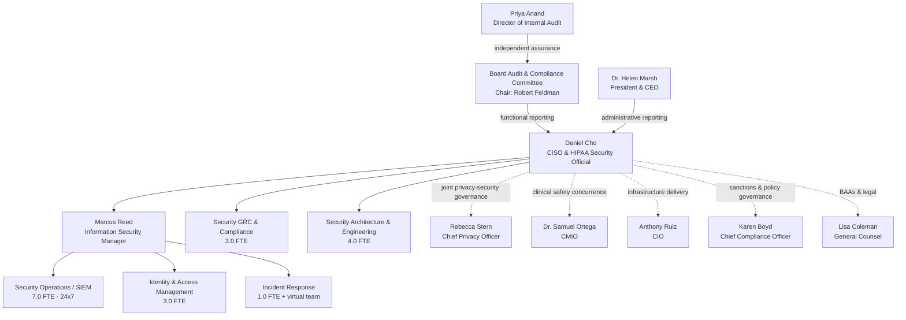

# 04.03 — Assigned Security Responsibility (§164.308(a)(2))

| Field | Value |
|---|---|
| Document ID | MBH-ADM-ASR-2026-403 |
| Version | 1.0 |
| Date | 2026-07-15 |
| Classification | Confidential — Electronic Protected Health Information (ePHI) // Illustrative Portfolio Sample |
| Owner | Daniel Cho, Chief Information Security Officer &amp; HIPAA Security Official |
| Co-Owner | Karen Boyd, Chief Compliance Officer |
| Author | Advisory Team (Healthcare GRC / HIPAA) |
| Status | Approved |

## Purpose

**45 CFR §164.308(a)(2)** requires a covered entity to "identify the security official who is responsible for the development and implementation of the policies and procedures required by this subpart." It is a **required** standard with **no implementation specifications** — a single, named, identifiable individual must own the Security Rule programme.

MercyBridge made the designation in **Phase 01 (01.05, ADR-0003)**: **Daniel Cho, Chief Information Security Officer and HIPAA Security Official**. Phase 01 established *who*. This document establishes *how the role actually operates* — the authority exercised, the resources committed, what is delegated and what is not, the structure of the security function, how the role coordinates with the Privacy Officer without merging into it, and the annual reporting through which the Board discharges its own oversight duty.

> **Designation is a one-line fact. Assigned security responsibility is an operating system. OCR tests the second.**

## 1. The Standard and How It Is Satisfied

| Element | Citation | Requirement | MercyBridge position |
|---|---|---|---|
| Standard | §164.308(a)(2) | Identify the security official responsible for development and implementation of Subpart C policies and procedures | Daniel Cho, CISO &amp; HIPAA Security Official |
| Type | — | **Required**; no addressable option; no sub-specifications | Satisfied — rated **Effective** at C-A05 in 03.04 |
| Single individual | Preamble guidance | One accountable person, not a committee | One named individual; a documented deputy acts only in absence |
| Written designation | §164.316(a) | Recorded in policy | POL-01 §2; ADR-0003; board minute 2026-02-16 |
| Distinct from Privacy Official | §164.530(a) | The Privacy Rule requires its own official; the roles may but need not be the same person | Separate: Rebecca Stern is Chief Privacy Officer |
| NPRM effect | 2025 NPRM | Retains the standard; adds explicit expectations for programme documentation, annual review and workforce accountability | No change to designation; reporting content already meets the proposal |

## 2. Authority in Operation

Designation without authority is a compliance fiction. The following authorities are granted in POL-01 and confirmed by the Board Audit &amp; Compliance Committee.

| Authority | Scope | Limit / check |
|---|---|---|
| Policy issuance | Approves all 24 HIPAA policies and their procedures across 4 hospitals, ~30 sites, 68 ePHI systems | Compliance and Legal co-sign; Steering Committee is consulted, not a veto |
| Risk acceptance | May accept **Low** risks; recommends acceptance of Moderate | **High risks may be accepted only by the Board Audit &amp; Compliance Committee** with a time-bounded exception |
| Control mandate | Directs administrative, physical and technical safeguards enterprise-wide | Clinical-impacting changes require CMIO (Dr. Samuel Ortega) concurrence |
| Emergency authority | May isolate a system, segment a network zone, or disable an account without prior approval where ePHI or patient safety is at imminent risk | Must notify CEO, CIO and CMIO within 1 hour and document within 24 hours |
| Access veto | May refuse or revoke access, including for executives and credentialed providers | Appeal to the CEO; the appeal does not stay the revocation |
| Incident command | Chairs security incident response; declares severity; authorises external forensics | Breach determination is joint with Privacy Officer and General Counsel |
| Vendor gate | May block onboarding of a business associate that will hold ePHI without an executed BAA | Legal (Lisa Coleman) owns the BAA instrument itself |
| Budget | Owns the information security budget line; sponsors capital requests | FY2027 device-lifecycle capital sits with the CIO |
| Board access | Direct, unfiltered access to the Audit &amp; Compliance Committee Chair (Robert Feldman), including in executive session without management present | Standing agenda right; exercised at least annually |

**Independence.** Daniel Cho reports administratively to **Dr. Helen Marsh (President &amp; CEO)** and functionally to the **Board Audit &amp; Compliance Committee**. He does **not** report to the CIO. This is deliberate: much of what the Security Official must challenge — patch deferral, segmentation cost, legacy system retention — originates in IT. ADR-0003 records the reasoning.

## 3. Resourcing

| Resource | Committed for FY2026 | Basis |
|---|---|---|
| Information security team FTE | **19.0** (see §4) | Benchmarked to a ~$1.8B, 1,200-bed, ~6,500-workforce system |
| Operating budget | Funds SIEM, EDR, identity governance, training platform, phishing simulation, GRC tooling | Approved with the programme charter (01.06) |
| Project funding | Wave 1 and Wave 2 remediation funded in FY2026 | 03.08 §7 |
| Capital | Wave 3 medical-device lifecycle in the FY2027 capital plan | 03.08 risk item 2 |
| External specialists | Beacon Assurance (HITRUST), Ironwood Security Labs (penetration testing), Advisory Team (GRC) | 01.09 stakeholder register |
| 24×7 monitoring | Security Operations coverage across all 4 hospitals and ~30 sites | POL-04 |

**Resourcing as a compliance control.** POL-01 requires the Security Official to state, in the annual report, whether resourcing is **sufficient** to meet §164.306(a). A statement of insufficiency is a formal escalation the Board must respond to in the minutes. The 2026 report records resourcing as **sufficient for Waves 1–2, contingent on FY2027 capital for Wave 3**.

## 4. Security Function Structure

| Sub-function | FTE | Principal §164.308 responsibilities |
|---|---|---|
| Security GRC &amp; Compliance | 3.0 | Policy suite, risk register maintenance, evidence library, HITRUST readiness, BA security reviews |
| Security Architecture &amp; Engineering | 4.0 | Control design, segmentation, encryption, medical-device security standards |
| Security Operations / SIEM | 7.0 | Information system activity review, detection, 24×7 triage |
| Identity &amp; Access Management | 3.0 | Joiner-mover-leaver execution, recertification, privileged access, break-glass reporting |
| Incident Response | 1.0 + virtual | Incident procedures, tabletops, forensics coordination |
| Office of the CISO | 1.0 | Board reporting, budget, programme management |
| **Total** | **19.0** | — |

## 5. Delegation — and What Cannot Be Delegated

| Activity | Delegated to | Accountability retained by |
|---|---|---|
| Daily SIEM triage and activity review execution | Security Operations, Marcus Reed | Daniel Cho |
| JML provisioning and de-provisioning execution | IAM team + HR + Medical Staff Affairs | Daniel Cho |
| Training content delivery and completion chasing | Karen Boyd's compliance education function | Daniel Cho (security content) |
| Sanction adjudication | Joint panel chaired by Karen Boyd | Karen Boyd; Daniel Cho for the security determination |
| Backup and restore operations | IT Infrastructure, Anthony Ruiz | Anthony Ruiz; Daniel Cho for adequacy against §164.308(a)(7) |
| BAA drafting and execution | Lisa Coleman | Lisa Coleman; Daniel Cho for the security schedule |

**Non-delegable.** Four responsibilities are reserved to the Security Official personally and are named as such in POL-01:

1. **Approval of the risk analysis and risk management plan** (§164.308(a)(1)(ii)(A)–(B)) — signature is personal.
2. **Approval of the 24-policy HIPAA suite** and any material amendment (§164.316(a)).
3. **The determination that an addressable specification is not reasonable and appropriate**, with its written rationale (§164.306(d)(3)(ii)).
4. **The annual attestation to the Board** that safeguards are, or are not, sufficient under §164.306(a).

**Absence.** Marcus Reed is the designated deputy and may act for up to 30 consecutive days. Deputy authority excludes the four non-delegable items; if any falls due during an extended absence, the CEO appoints an interim Security Official in writing and the Board is notified.

## 6. Coordination with the Privacy Officer

The Security Rule and the Privacy Rule overlap at exactly the point most incidents occur: an unauthorised look at a chart is both a security event and a privacy event. MercyBridge keeps the roles **separate but interlocked**.

| Domain | Security Official (Cho) | Privacy Official (Stern) | Joint |
|---|---|---|---|
| ePHI confidentiality, integrity, availability | ✅ Lead | Consulted | — |
| PHI in any form, including paper and oral | Consulted | ✅ Lead | — |
| Minimum necessary determination | Implements technically | ✅ Defines | Role design in 04.05 |
| Break-the-glass review | Provides the report | ✅ Adjudicates purpose | Weekly |
| Patient rights, accounting of disclosures, NPP | — | ✅ Lead | — |
| Security incident declaration and containment | ✅ Lead | Informed | — |
| **Breach determination (§164.402 four-factor)** | Co-decider | Co-decider | ✅ **Joint with General Counsel** |
| Individual / HHS / media notification | Supports | ✅ Lead | — |
| Sanctions | Security determination | Privacy determination | ✅ Single panel, POL-03 |
| Business associate assurance | Security schedule | Privacy terms | ✅ With Legal |

The two officials co-chair the **Privacy &amp; Security Council**, which meets monthly, maintains a single combined issues log, and reports jointly to the Compliance Committee. Disagreement on a breach determination is resolved by escalation to the CEO and, if unresolved, to the Board committee — it is never resolved by default to "no breach."

## 7. Governance Calendar and Annual Reporting

| Forum | Chair | Frequency | Security Official's obligation |
|---|---|---|---|
| Security Operations review | Marcus Reed | Weekly | Reviews escalations, open High risks |
| Privacy &amp; Security Council | Cho / Stern | Monthly | Combined issues log, sanction pipeline |
| Security Steering Committee | Daniel Cho | Monthly | Wave progress, metrics scorecard, policy approvals |
| Clinical Informatics &amp; Device Safety | Dr. Samuel Ortega | Quarterly | Device and downtime risk items |
| Executive Compliance Committee | Karen Boyd | Quarterly | Policy attestation, sanction parity, training completion |
| **Board Audit &amp; Compliance Committee** | Robert Feldman | Quarterly | Risk posture, incidents, waves and exceptions; **annual §164.306(a) attestation**; executive session annually |

### 7.1 The Annual Security Official Report

Delivered to the Board Audit &amp; Compliance Committee each December (first full cycle: **2026-12**), the report is a §164.316 record retained for six years. Mandatory contents:

| Section | Content |
|---|---|
| 1. Risk posture | Current register position — baseline **56 risks, 11 High, 27 Moderate, 18 Low**; movement since prior year; overall posture |
| 2. Safeguard implementation | Status of all 18 standards and ~50 implementation specifications across the three families |
| 3. Policy | The 24-policy suite: approvals, reviews, amendments, retention compliance |
| 4. Workforce | Training completion, phishing performance, sanctions applied by tier |
| 5. Access | Recertification coverage, privileged account population, break-glass volume and review rate |
| 6. Incidents | Security incidents, four-factor assessments performed, breaches reported — **3 incidents, 0 reportable breaches** in the review period |
| 7. Contingency | Backup success, restore tests, DR exercise and downtime drill results |
| 8. Business associates | ~180 BAs; 24 critical/high-risk; BAA and assurance status |
| 9. Independent assurance | Penetration test, internal audit opinion, HITRUST i1 status |
| 10. Resourcing | Explicit statement of sufficiency or insufficiency |
| 11. **Attestation** | Signed statement under §164.306(a) with any qualifications |

## 8. Risks Treated and Evidence Produced

| Risk | How this standard treats it |
|---|---|
| **R-54** (Moderate) — legacy policy suite, retention not evidenced | Non-delegable policy approval; annual review clause; six-year retention enforced through POL-01 |
| **R-56** (Low) — sanction application inconsistent | Security determination reserved to the Security Official within the single POL-03 panel |
| **R-23** (High) — enterprise ransomware | Personal incident-command authority and emergency isolation power; owner of record in the register |
| **R-24** (High) — double-extortion exfiltration | Same; joint breach determination with Privacy and Legal |
| **R-28** (High) — vendor-hosted EHR concentration | Vendor gate authority and BA security schedule ownership |

| Evidence artefact | Location |
|---|---|
| POL-01 HIPAA Security Program &amp; Governance (signed) | `governance/POL-01-security-program-governance.md` |
| ADR-0003 — Security Official designation | `../01-program-foundation-hipaa-scoping/adr/ADR-0003-security-official-designation.md` |
| Delegation schedule and deputy appointment | `governance/delegation-schedule.md` |
| Security function org chart and FTE plan | `diagrams/security-function-structure.md` |
| Steering Committee and Board minutes | `governance/` |
| Annual Security Official report template | `templates/annual-security-official-report.md` |

## Cross-References

| Reference | Relevance |
|---|---|
| 01.05 — Security Official Designation &amp; Governance | The Phase 01 designation this document operationalises |
| 01.07 — Roles, Responsibilities &amp; RACI | Enterprise RACI underpinning delegation |
| 01.12 — Communications &amp; Escalation Plan | Escalation routes referenced in emergency authority |
| 03.08 — Risk Management Plan | Risk-acceptance thresholds and board exceptions |
| 04.02 — Security Management Process | Non-delegable approval of risk analysis and sanctions |
| 04.07 — Security Incident Procedures | Incident command authority in operation |
| 04.09 — Evaluation | The annual attestation cycle |
| 04.11 — Policies, Procedures &amp; Documentation | POL-01 and the 24-policy suite |
| Phase 06 — Business Associate &amp; Third-Party Risk | Vendor gate authority |
| Phase 09 — Executive Reporting &amp; Program Maturity | Where the annual report lands |

---
[⬅ Previous](04.02-security-management-process.md) · [🏠 Phase README](04.00-README.md) · [Next ➡](04.04-workforce-security.md)
