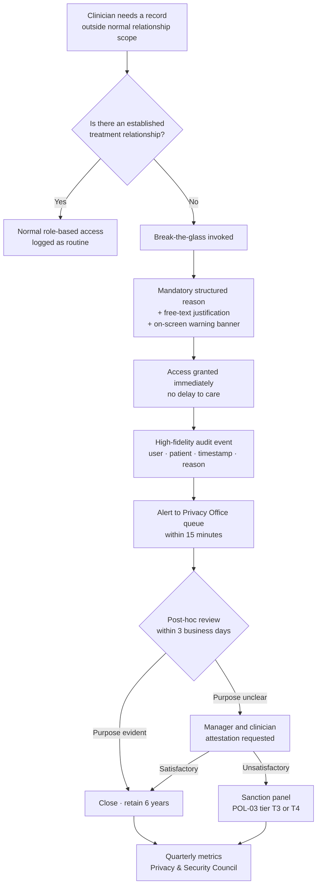

# 04.05 — Information Access Management (§164.308(a)(4))

| Field | Value |
|---|---|
| Document ID | MBH-ADM-IAM-2026-405 |
| Version | 1.0 |
| Date | 2026-07-15 |
| Classification | Confidential — Electronic Protected Health Information (ePHI) // Illustrative Portfolio Sample |
| Owner | Marcus Reed, Information Security Manager |
| Co-Owner | Daniel Cho, CISO &amp; HIPAA Security Official · Rebecca Stern, Chief Privacy Officer (minimum necessary) |
| Author | Advisory Team (Healthcare GRC / HIPAA) |
| Status | Approved |

## Purpose

**45 CFR §164.308(a)(4)(i)** requires policies and procedures for **authorising access to ePHI that are consistent with the applicable requirements of Subpart E** — that is, consistent with the Privacy Rule, and therefore with **minimum necessary** (§164.502(b), §164.514(d)). This is the only administrative safeguard that explicitly imports a Privacy Rule obligation, and it is the standard that decides who can see 2.1 million patient records.

Where §164.308(a)(3) governs *the person*, §164.308(a)(4) governs *the entitlement*. This document defines MercyBridge's role-based access model in the Halcyon EHR and across the 68 ePHI systems, the minimum-necessary design rules, **break-the-glass** emergency access with mandatory post-hoc review, and the periodic recertification cycle that closed the **214 standing elevated EHR accounts** identified in Phase 03 (**R-03**).

> **Headline result: 214 standing elevated EHR accounts reduced to 63 — 118 removed outright, 33 converted to just-in-time elevation — with a target of ≤ 40 by the close of Wave 1 (2026-10-31).**

## 1. The Three Implementation Specifications

| Specification | Citation | R / A | Requirement | MercyBridge determination |
|---|---|---|---|---|
| Isolating health care clearinghouse functions | §164.308(a)(4)(ii)(A) | **Required — if applicable** | If a clearinghouse is part of a larger organisation, protect its ePHI from the larger organisation | **Assessed and documented as not applicable.** MercyBridge is a provider covered entity; it operates no health care clearinghouse as defined at §160.103. Clearinghouse-like translation is performed *for* MercyBridge by two business associates, governed in Phase 06 |
| Access authorization | §164.308(a)(4)(ii)(B) | **Addressable** | Policies for granting access to ePHI (workstation, transaction, program, process) | **Reasonable and appropriate — implemented.** Role catalogue, manager authorisation, segregation of duties |
| Access establishment and modification | §164.308(a)(4)(ii)(C) | **Addressable** | Policies to establish, document, review and modify a user's right of access | **Reasonable and appropriate — implemented.** Provisioning standard, change control, recertification cycle |

The "if applicable" wording of (A) is the closest the Security Rule comes to a conditional requirement. MercyBridge records the applicability determination in writing rather than leaving it silent — an unanswered conditional reads to an auditor as an unassessed one. Under the **2025 NPRM**, (B) and (C) become mandatory; both are already implemented.

## 2. Minimum Necessary as a Design Rule

Minimum necessary is a Privacy Rule concept with a Security Rule implementation. It is not a slogan applied after the fact; it is the constraint used when roles are designed.

| Design rule | Application at MercyBridge |
|---|---|
| **Treatment exception** | §164.502(b)(2)(i) exempts disclosures to a provider for treatment from minimum necessary. MercyBridge therefore does **not** artificially narrow the treating clinician's clinical view — it controls *who is treating* and audits *who looked* |
| **Non-treatment roles are narrowed** | Billing, coding, scheduling, research, quality, analytics and IT roles receive filtered views: coding sees the encounter, not the psychotherapy note; scheduling sees demographics and appointment data, not results |
| **Relationship filters** | Non-clinician roles are scoped by department, location or payer segment rather than to the whole 2.1M-record corpus |
| **Sensitive-category gating** | Behavioural health, substance-use (42 CFR Part 2 where applicable), HIV, genetic and reproductive-health data carry additional segmentation; access requires an explicit role attribute |
| **Restricted records** | Employee records, VIP records and records with a patient-requested restriction carry a flag that forces break-the-glass and generates a monitoring alert |
| **Aggregate and export** | Bulk export, reporting and de-identification are separate entitlements from read access and are never bundled into a clinical role |
| **Data, not just screens** | Minimum necessary is enforced at the API, HL7/FHIR interface and database layer, not only in the front end |

Role definitions are jointly approved by **Rebecca Stern** (minimum necessary determination), **Dr. Samuel Ortega** (clinical adequacy) and **Marcus Reed** (technical enforcement). No role goes live without all three.

## 3. Role-Based Access in the EHR and Across 68 Systems

| Layer | Content | Count |
|---|---|---|
| Enterprise role catalogue | Named, documented, owner-attested access roles across all 68 ePHI systems | 214 roles |
| Halcyon EHR clinical roles | Physician, resident, advanced practice, RN inpatient, RN perioperative, ED, therapy, pharmacy, laboratory, imaging, HIM/coding, care management, social work | 61 roles |
| Halcyon EHR non-clinical roles | Registration, scheduling, revenue cycle, denials, analytics, quality, research | 28 roles |
| Elevated / administrative roles (all systems) | EHR security administration, database, domain, backup, break-glass approval | 19 roles |
| Business associate / vendor support roles | Purpose-limited, time-boxed, sponsor-linked | 22 roles |
| Systems with a documented, owner-attested role model | of 68 ePHI systems | **68 of 68** |

*(The 214 enterprise roles and the 214 baseline elevated accounts are unrelated figures that coincide; they are tracked in separate registers.)*

| Provisioning control | Rule |
|---|---|
| Unique identification | One human, one identity, always — §164.312(a)(2)(i). Shared and generic clinical logins are prohibited and blocked at the role catalogue |
| Role-first | Access is requested as a role; ad-hoc entitlements require justification, IAM review, Security Manager approval and expire at 90 days |
| Segregation of duties | Requester ≠ approver ≠ provisioner; conflicting role pairs (e.g. charge entry + charge adjustment; system administration + audit log administration) are blocked by policy rule |
| Privileged access | Elevated roles require T4 clearance, dual approval, MFA, session recording and just-in-time elevation with automatic expiry |
| Service and interface accounts | Owned by a named human, credentialed in the vault, rotated, never interactive |
| Vendor access | Time-boxed to a change window, sponsor-approved, brokered and recorded |

## 4. The 214 Elevated EHR Accounts — R-03

### 4.1 What Phase 03 Found

**R-03 (Moderate, score 12):** 214 accounts held standing elevated privilege in the Halcyon EHR — security administration, mass-update, report-writer with unrestricted scope, and unfiltered chart access. Standing privilege at that scale converts any single credential compromise into an enterprise-scale exposure and materially amplifies **R-24** (pre-encryption exfiltration).

### 4.2 The Remediation

| Step | Action | Outcome |
|---|---|---|
| 1. Enumerate | Full extract of elevated entitlements from Halcyon and the identity platform, reconciled to HR and Medical Staff Affairs | 214 accounts, 19 distinct elevated roles |
| 2. Justify | Each account's owner-manager required to justify standing need in writing within 15 business days | 61 justified; 153 unjustified or unanswered |
| 3. Remove | Unjustified and unanswered accounts revoked | **118 removed** |
| 4. Convert | Intermittent-need accounts moved to just-in-time elevation with 4-hour maximum sessions | **33 converted** |
| 5. Retain | Genuinely standing operational need (24×7 EHR administration, interface support, break-glass approvers) | **63 retained** |
| 6. Constrain | Retained accounts: T4 clearance, MFA, session recording, weekly activity review, quarterly recertification | Live from 2026-07-01 |
| 7. Target | Further reduction through automation of routine administrative tasks | **≤ 40 by 2026-10-31** |

| Elevated access metric | Baseline | 2026-07-15 | Target |
|---|---|---|---|
| Standing elevated EHR accounts | 214 | **63** | ≤ 40 |
| Just-in-time elevation sessions per month | 0 | 411 | — |
| Elevated accounts with MFA | 96 of 214 | **63 of 63 (100%)** | 100% |
| Elevated accounts with session recording | 0 | **63 of 63** | 100% |
| Elevated accounts recertified in the last quarter | 0 | **63 of 63** | 100% |
| Shared or generic elevated accounts | 11 | **0** | 0 |

## 5. Break-the-Glass Emergency Access

Emergency access is **required** under §164.312(a)(2)(ii) as a technical safeguard, but the *authorisation policy* around it lives here. In a hospital the tension is real and unavoidable: a clinician treating an unconscious patient at 0300 must not be stopped by an access-control decision, and equally must not be able to browse 2.1 million records unnoticed.

MercyBridge resolves this with **permissive entry, mandatory attribution, guaranteed review**.

| Break-the-glass control | Specification |
|---|---|
| Scope | Halcyon EHR, PACS, LIS, pharmacy and the HIE |
| Entry | Never blocked, never delayed, never requires a call to a help desk |
| Attribution | Individual identity only — break-glass on a shared account is impossible because shared accounts do not exist |
| Reason capture | Structured picklist (emergency treatment, coverage, consult, transfer, code response, other) plus mandatory free text |
| Duration | Elevated view auto-expires after 12 hours or on encounter close, whichever is first |
| Review SLA | **100% reviewed within 3 business days** |
| Escalation | Restricted-flag records (employee, VIP, patient-restriction) escalate to the Privacy Officer within 4 hours |
| Retention | Invocation record and review disposition retained 6 years |

| Break-the-glass metric | Baseline (trailing 12 months) | 2026-07-15 (rolling quarter) |
|---|---|---|
| Invocations | 2,340 | 611 |
| Invocations reviewed | 61% | **100%** |
| Reviewed within 3 business days | not measured | 97.4% |
| Invocations with unclear purpose requiring attestation | not measured | 38 |
| Referred to the sanction panel | 2 | 4 |
| Substantiated inappropriate access | 2 | 3 (all T3; 1 termination) |

**R-05** — break-glass used without retrospective review — is treated by the review SLA and the 15-minute alerting. The clinical trade-off was explicitly accepted by **Dr. Samuel Ortega** and recorded in the Clinical Informatics &amp; Device Safety minutes: *no emergency access will ever be gated on a security approval*.

## 6. Access Establishment, Modification and Recertification

| Cycle | Population | Frequency | Reviewer | Position at 2026-07-15 |
|---|---|---|---|---|
| Privileged / elevated access | 63 elevated EHR accounts + 178 other privileged accounts | **Quarterly** | Marcus Reed + system owner | 241 of 241 recertified |
| Tier 1 clinical system access | 12 Tier 1 systems | **Semi-annual** | System owner + department manager | 12 of 12 complete |
| Tier 2–4 ePHI system access | 56 systems | **Annual** | System owner (02.10) | 51 of 56 complete; 5 due 2026-09 |
| Business associate / vendor access | 22 vendor roles across 47 BA-involved systems | **Quarterly** | Sponsor + Marcus Reed | 22 of 22 |
| Break-glass approver population | 19 approvers | **Quarterly** | Daniel Cho | Complete |
| Patient-portal proxy relationships | Guardian, caregiver and adolescent-transition proxies | **Annual** | Rebecca Stern / Health Information Management | Cycle established; first pass 2026-09 (**R-08**) |
| Sensitive-category role attributes | Behavioural health, Part 2, HIV, genetics | **Semi-annual** | Rebecca Stern | Complete |

| Recertification metric | Baseline | 2026-07-15 | Target |
|---|---|---|---|
| ePHI systems with a defined recertification cycle | 41 of 68 | **68 of 68** | 68 of 68 |
| Systems whose most recent cycle completed on time | not measured | 63 of 68 | 68 of 68 by 2026-09-30 |
| Entitlements revoked at the most recent cycle | — | 1,974 | — |
| Reviewer rubber-stamp rate (approve-all with zero revocations) | not measured | 11% — challenged and re-run | ≤ 5% |

**Rubber-stamping is the standing risk in any recertification programme.** MercyBridge counters it by measuring the approve-all rate per reviewer, re-running any campaign with a zero-revocation outcome on a population over 50 users, and sampling completed attestations in the internal audit programme.

## 7. Risks Treated and Evidence Produced

| Risk | Rating | Treatment delivered here | Target residual |
|---|---|---|---|
| **R-03** | Moderate | 214 → 63 elevated accounts; JIT elevation; quarterly recertification; session recording | Low by 2026-10-31 |
| **R-05** | Moderate | 100% break-glass review within 3 business days; 15-minute alerting; defined criteria per application | Low |
| **R-02** | **High** | Shared/generic clinical logins eliminated at the role catalogue; unique ID enforced at provisioning | Moderate at Wave 1 close, Low with Phase 05 MFA |
| **R-06** | Moderate | Vendor entitlements time-boxed, sponsor-linked, brokered and recertified quarterly | Low by 2027-01 |
| **R-08** | Low | Annual patient-portal proxy recertification cycle established | Low |
| **R-32** | Low | Offshore support access reduced to minimum necessary and purpose-limited | Low |
| **R-36** | Moderate | Minimum-necessary role design plus proactive monitoring in 04.02 | Low by 2027-01 |

| Evidence artefact | Location | Owner |
|---|---|---|
| POL-06 Information Access Management (signed) | `governance/POL-06-information-access-management.md` | Daniel Cho |
| POL-07 Minimum Necessary &amp; Role-Based Access (signed) | `governance/POL-07-minimum-necessary.md` | Rebecca Stern |
| POL-08 Emergency (Break-the-Glass) Access (signed) | `governance/POL-08-break-the-glass.md` | Daniel Cho |
| Enterprise role catalogue (214 roles, owner-attested) | `trackers/role-catalogue.xlsx` | Marcus Reed |
| Elevated access remediation record (214 → 63) | `trackers/elevated-access-remediation.xlsx` | Marcus Reed |
| Break-glass review log | `logs/break-glass-review-log.md` | Rebecca Stern |
| Recertification campaign results and attestations | `trackers/access-recertification.xlsx` | Marcus Reed |
| Clearinghouse applicability determination | `governance/clearinghouse-applicability.md` | Daniel Cho |

## Cross-References

| Reference | Relevance |
|---|---|
| 02.02 — ePHI System Inventory | The 68 systems and their owners |
| 02.08 — Designated Record Set &amp; PHI Scope | The Privacy Rule boundary that minimum necessary is measured against |
| 03.07 — Risk Register | R-02, R-03, R-05, R-06, R-08, R-32, R-36 |
| 04.02 — Security Management Process | Activity review and proactive monitoring of access |
| 04.04 — Workforce Security | Who may be authorised at all; the JML lifecycle that feeds provisioning |
| 04.06 — Security Awareness &amp; Training | Break-glass and minimum-necessary training content |
| 04.11 — Policies, Procedures &amp; Documentation | POL-06, POL-07, POL-08 |
| Phase 05 — §164.312(a) Access Control | Unique ID, emergency access, automatic logoff, encryption |
| Phase 06 — Business Associate &amp; Third-Party Risk | Vendor and offshore support access |
| Phase 08 — Independent Assessment | Recertification sampling and rubber-stamp testing |

---
[⬅ Previous](04.04-workforce-security.md) · [🏠 Phase README](04.00-README.md) · [Next ➡](04.06-security-awareness-and-training.md)
