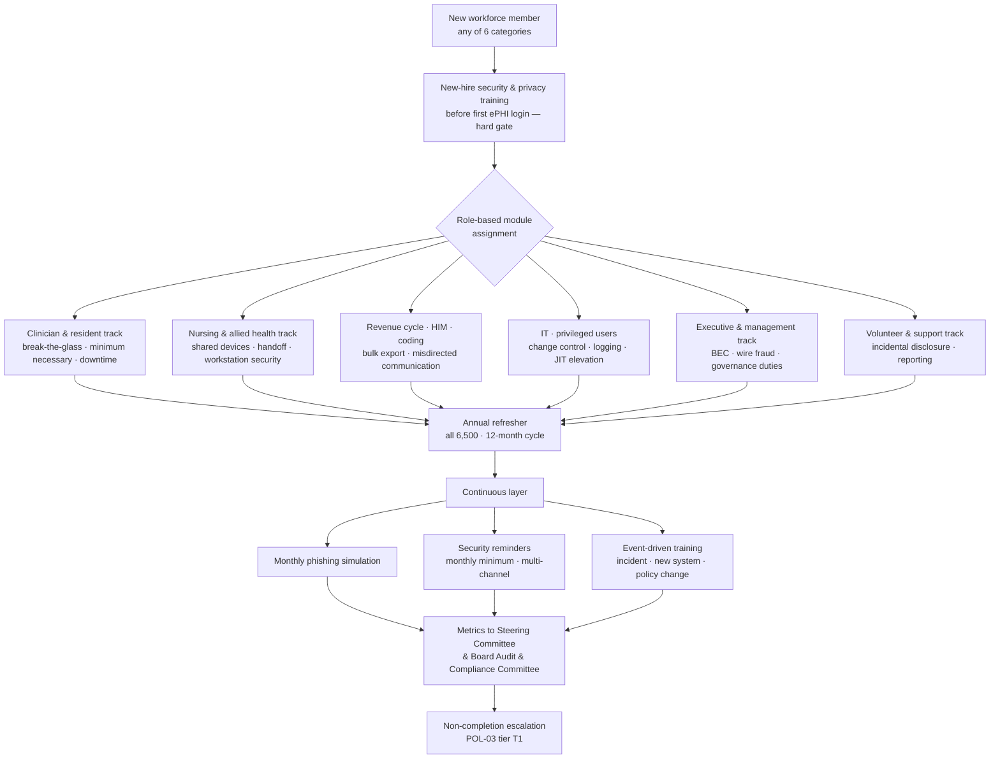

# 04.06 — Security Awareness and Training (§164.308(a)(5))

| Field | Value |
|---|---|
| Document ID | MBH-ADM-SAT-2026-406 |
| Version | 1.0 |
| Date | 2026-07-15 |
| Classification | Confidential — Electronic Protected Health Information (ePHI) // Illustrative Portfolio Sample |
| Owner | Marcus Reed, Information Security Manager |
| Co-Owner | Karen Boyd, Chief Compliance Officer (completion &amp; sanctions) · Daniel Cho, CISO &amp; HIPAA Security Official |
| Author | Advisory Team (Healthcare GRC / HIPAA) |
| Status | Approved |

## Purpose

**45 CFR §164.308(a)(5)(i)** requires a covered entity to "implement a security awareness and training program for all members of its workforce (including management)." The parenthetical is deliberate and frequently ignored: executives and physicians are workforce members, and they are the population most often targeted and least often completing.

This document delivers the standard and its four addressable implementation specifications for **~6,500 workforce members** across 4 hospitals and ~30 outpatient sites, covering employed staff, credentialed medical staff, residents, students, contractors and volunteers. It addresses the Phase 03 finding registered as **R-37** — 91% completion with thin role-based clinical content — and the highest-likelihood risk in the entire register, **R-34** (likelihood 5): phishing and business email compromise reaching a mailbox containing ePHI.

> **Training is the only administrative safeguard that operates on the attack surface directly. R-34 scored likelihood 5 of 5; no technical control at MercyBridge changes that number as cheaply as a workforce that reports rather than clicks.**

## 1. The Four Implementation Specifications

| Specification | Citation | R / A | Requirement | MercyBridge determination |
|---|---|---|---|---|
| Security reminders | §164.308(a)(5)(ii)(A) | **Addressable** | Periodic security updates | **Implemented** — multi-channel reminder programme, monthly minimum |
| Protection from malicious software | §164.308(a)(5)(ii)(B) | **Addressable** | Procedures for guarding against, detecting and reporting malicious software | **Implemented** — POL-10; workforce-facing procedures paired with the technical controls in Phase 05 |
| Log-in monitoring | §164.308(a)(5)(ii)(C) | **Addressable** | Procedures for monitoring log-in attempts and reporting discrepancies | **Implemented** — enterprise failed-logon monitoring plus a self-service "was this you?" reporting channel |
| Password management | §164.308(a)(5)(ii)(D) | **Addressable** | Procedures for creating, changing and safeguarding passwords | **Implemented** — POL-11; NIST-aligned standard, breach-corpus screening, self-service reset |

All four are addressable; all four are implemented; no §164.306(d)(3)(ii) rationale is on file. The **2025 NPRM** would make all four mandatory and add explicit expectations for **training within a defined period of hire and annually thereafter**, plus **workforce-specific training on new or modified technology** — both already standard at MercyBridge.

The standard as a whole was rated **Partially Effective (C-A08)** in Phase 03; the sub-specifications for malicious software (C-A09) and password management (C-A11) were already **Effective**, and log-in monitoring (C-A10) **Partially Effective**. This document completes the set.

## 2. The Training Architecture

## 3. Curriculum

| Track | Audience | Length | Cadence | Core content |
|---|---|---|---|---|
| **New-hire security &amp; privacy** | All new workforce, all 6 categories | 55 min | Before first ePHI login | ePHI definition; minimum necessary; unique ID; passwords and MFA; phishing; device and media handling; incident reporting; sanctions |
| **Annual HIPAA security refresher** | All 6,500 | 40 min | Every 12 months | Current threat picture; policy changes; ransomware; reporting duties; case studies drawn from real MercyBridge events (de-identified) |
| **Clinician &amp; resident** | 610 medical staff + 185 residents | 25 min | Annual | Break-the-glass criteria and the review that follows; treatment-relationship boundaries; curiosity browsing and its consequences; EHR downtime and paper charting; secure clinical messaging; personal-device rules on rounds |
| **Nursing &amp; allied health** | ~2,600 | 25 min | Annual | Shared clinical workstations and fast-user-switching; automatic logoff; whiteboard and handoff exposure; visitor and family presence; IoMT alarm devices |
| **Revenue cycle, HIM &amp; coding** | ~740 | 30 min | Annual | Bulk export controls; misdirected fax, email and statements (**R-35**); correspondence verification; minimum necessary in payer communications |
| **IT and privileged users** | 241 privileged accounts | 45 min | Annual + on grant | Just-in-time elevation; change control; audit-log integrity; secure administration; vendor session brokering |
| **Executive &amp; management** | 180 | 30 min | Annual | Business email compromise and wire fraud; approval-authority abuse; governance and reporting duties; tabletop participation |
| **Volunteer &amp; support services** | 70 volunteers + support staff | 20 min | Annual | Incidental disclosure; wayfinding boundaries; no-record-access rule; how to report |
| **Contractor and vendor personnel** | 275 | 30 min | On grant + annual | Sponsor rules; time-boxed access; remote-support conduct; data return |
| **Event-driven micro-modules** | Targeted | 5–10 min | On trigger | New system go-live; policy amendment; post-incident lesson; phishing-simulation failure |

**Clinician-specific content is the change Phase 03 demanded.** The prior curriculum taught clinicians the same generic module as everyone else, which is why R-37 was raised. The clinician track is now co-authored with **Dr. Samuel Ortega** and delivered inside existing medical-staff education time and residency didactics, with CME credit — a delivery decision that lifted physician completion more than any reminder campaign did.

## 4. Completion Metrics

| Metric | Phase 03 baseline | 2026-07-15 | Target |
|---|---|---|---|
| Annual HIPAA security training completion, all workforce | **91.0%** | **96.4%** | ≥ 98% by 2026-10-31 |
| Employed staff | 94.1% | 98.7% | ≥ 99% |
| Credentialed medical staff | 76.3% | 92.1% | ≥ 98% |
| Residents and fellows | 88.6% | 99.5% | 100% |
| Students and rotating trainees | 81.2% | 97.9% | ≥ 98% |
| Contractors and vendor personnel | 79.4% | 94.5% | ≥ 98% |
| Volunteers | 85.7% | 98.6% | ≥ 98% |
| New-hire training completed before first ePHI login | not gated | **100% (hard gate)** | 100% |
| Role-based module completion (assigned population) | not offered | 93.8% | ≥ 98% |
| Median days from hire to new-hire training | 9 | 0 (pre-access) | 0 |

**Escalation for non-completion.** Day 0 assignment; reminder at day 14 and day 25; manager notified at day 30; **access suspension at day 45** for non-clinical roles; referral to Medical Staff Affairs at day 45 for credentialed providers, with reappointment consequences; POL-03 tier T1 sanction recorded at day 60. Suspension is never applied in a way that would impede active patient care — clinical suspensions require CMIO concurrence and a documented coverage plan.

## 5. Security Reminders — §164.308(a)(5)(ii)(A)

| Channel | Frequency | Audience | Owner |
|---|---|---|---|
| Intranet security bulletin | Monthly | All | Marcus Reed |
| Email micro-reminder (≤ 150 words, one behaviour) | Monthly | All | Marcus Reed |
| Login banner rotation on clinical workstations | Quarterly | Clinical | Marcus Reed |
| Break-room and unit posters | Quarterly | Site-based | Karen Boyd |
| Huddle talking points for nurse managers | Monthly | Clinical units | Dr. Samuel Ortega's office |
| Medical staff newsletter column | Quarterly | 610 medical staff | Dr. Samuel Ortega |
| Targeted alert on active campaign | As needed, ≤ 4 hours from detection | Affected population | Security Operations |
| Cybersecurity Awareness Month programme | Annual (October) | All | Daniel Cho |
| Post-incident lesson bulletin | After each declared incident | All or affected | Marcus Reed |

Reminders are logged with date, channel, audience and content, and retained six years as evidence that the addressable specification is not merely policy but practice.

## 6. Phishing Simulation

| Parameter | Specification |
|---|---|
| Frequency | Monthly, all 6,500 workforce members with a mailbox |
| Design | Healthcare-contextual lures — credentialing renewal, payroll change, shift-swap, EHR password expiry, vendor invoice, patient-complaint notice |
| Difficulty | Rotating tiers 1–3; executives and privileged users receive tier 3 and targeted BEC scenarios |
| Failure handling | Immediate just-in-time micro-module; second failure in 90 days adds a 15-minute module; third triggers manager conversation and POL-03 tier T1 |
| Reporting | One-click report button in the mail client; reporting is celebrated, never penalised — including reporting a real message that turns out to be legitimate |
| Exclusions | None. Physicians and executives are included; no opt-outs are granted |

| Phishing metric | Baseline (2026-Q1) | 2026-Q2 | Target |
|---|---|---|---|
| Click rate, all workforce | 11.4% | **4.2%** | ≤ 3% by 2026-12 |
| Click rate, credentialed medical staff | 14.8% | 6.1% | ≤ 4% |
| Credential-entry rate (clicked *and* submitted) | 3.9% | **0.8%** | ≤ 0.5% |
| Report rate | 18.0% | **46.3%** | ≥ 55% |
| Median time to first report | 41 min | **7 min** | ≤ 10 min |
| Repeat clickers (3+ in 12 months) | 214 | 58 | ≤ 25 |

Median time to first report is the metric that matters operationally: it is the interval between a real campaign landing and Security Operations being able to purge it from 6,500 mailboxes.

## 7. Malicious Software, Log-in Monitoring and Password Management

| Specification | Workforce-facing procedure | Supporting technical control (Phase 05) |
|---|---|---|
| **Protection from malicious software** §164.308(a)(5)(ii)(B) | Do not disable endpoint protection; do not install unapproved software; report unexpected encryption, ransom notes, mass file changes, or a "slow" clinical workstation immediately; removable media only from approved, scanned sources; USB from vendor field engineers must be scanned at the Clinical Engineering kiosk | Enterprise EDR, email filtering, web filtering, application control, macro blocking, removable-media control |
| **Log-in monitoring** §164.308(a)(5)(ii)(C) | Review the "last login" banner shown at EHR sign-on; use the self-service "was this you?" report for an unrecognised login or MFA prompt; report lockouts you did not cause | Failed-logon alerting extended from Tier 1 to **68 of 68** ePHI systems; impossible-travel and unusual-hours detection; MFA-fatigue detection |
| **Password management** §164.308(a)(5)(ii)(D) | Long passphrases; never share, never reuse across MercyBridge and personal accounts; never write on badge cards or unit whiteboards; use the enterprise password manager for shared service credentials; self-service reset with identity proofing | NIST SP 800-63-aligned standard: 14-character minimum, no forced periodic expiry absent indication of compromise, breach-corpus screening at set and at each authentication, lockout thresholds, MFA on 68 of 68 systems at Wave 1 close |

| Log-in monitoring metric | Baseline | 2026-07-15 |
|---|---|---|
| ePHI systems with failed-logon alerting | Tier 1 only (12 of 68) | **62 of 68**, 68 of 68 by 2026-09-30 |
| Self-service "was this you?" reports received | channel did not exist | 87 in Q2 |
| Reports that led to a confirmed credential compromise | — | 3 |
| Accounts screened against breach corpora | Directory-joined estate | 6,500 of 6,500 |
| Credentials force-reset on breach-corpus match | 412 (annual) | 96 in Q2 |

## 8. Risks Treated and Evidence Produced

| Risk | Rating | Treatment delivered here | Target residual |
|---|---|---|---|
| **R-34** | **High** (L5×I3) | Monthly simulation; click 11.4% → 4.2%; credential entry 3.9% → 0.8%; report rate 18% → 46%; BEC track for executives | Moderate at Wave 1 close, with MFA (Phase 05) completing the reduction |
| **R-37** | Moderate | Completion 91% → 96.4%; clinician-specific track with CME; role-based modules for 6 populations | Low by 2026-12 |
| **R-26** | Moderate | Macro and attachment awareness; malicious-software reporting procedure; just-in-time remediation | Low |
| **R-35** | Moderate | Revenue cycle / HIM track on misdirected fax, email and statements; verification procedure | Low by 2027-01 |
| **R-39** | Low | Service-desk identity-proofing training and call-back procedure | Low |
| **R-38** | Low | Sanctioned-channel training; secure clinical messaging promoted; unsanctioned apps addressed in POL-09 | Low |
| **R-51** | Moderate | Workstation-security behaviours in the nursing and allied-health track; reinforced by reminders | Low with Phase 05 automatic logoff |

| Evidence artefact | Location | Owner |
|---|---|---|
| POL-09 Security Awareness &amp; Training (signed) | `governance/POL-09-security-awareness-training.md` | Daniel Cho |
| POL-10 Malicious Software Protection (signed) | `governance/POL-10-malicious-software.md` | Marcus Reed |
| POL-11 Password &amp; Authentication Management (signed) | `governance/POL-11-password-management.md` | Marcus Reed |
| Curriculum and module inventory | `governance/training-curriculum.md` | Karen Boyd |
| Completion extracts by population | `trackers/training-completion.xlsx` | Karen Boyd |
| Phishing campaign reports (monthly) | `logs/phishing-campaign-log.md` | Marcus Reed |
| Security reminder log (channel, date, audience) | `logs/security-reminder-log.md` | Marcus Reed |
| Non-completion escalation register | `trackers/training-escalation-register.xlsx` | Karen Boyd |

## Cross-References

| Reference | Relevance |
|---|---|
| 03.04 — Existing Controls Assessment | C-A08 to C-A11 baseline ratings |
| 03.06 — Ransomware &amp; Healthcare Threat Profile | The kill chain that training interrupts at initial access |
| 03.07 — Risk Register | R-26, R-34, R-35, R-37, R-38, R-39, R-51 |
| 04.02 — Security Management Process | POL-03 sanctions for persistent non-completion |
| 04.04 — Workforce Security | New-hire training as a provisioning gate |
| 04.05 — Information Access Management | Break-the-glass and minimum-necessary content |
| 04.07 — Security Incident Procedures | The reporting channels training teaches |
| 04.11 — Policies, Procedures &amp; Documentation | POL-09, POL-10, POL-11 |
| Phase 05 — §164.312 Technical Safeguards | MFA, EDR, automatic logoff, audit controls |
| Phase 07 — Incident Response | Tabletop participation by trained executives |

---
[⬅ Previous](04.05-information-access-management.md) · [🏠 Phase README](04.00-README.md) · [Next ➡](04.07-security-incident-procedures.md)
