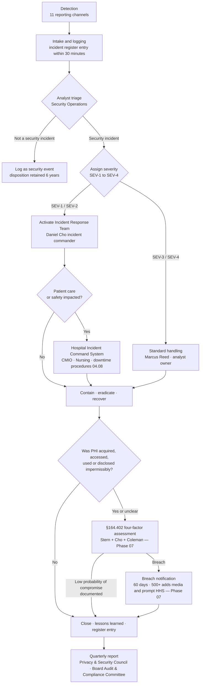

# 04.07 — Security Incident Procedures (§164.308(a)(6))

| Field | Value |
|---|---|
| Document ID | MBH-ADM-SIP-2026-407 |
| Version | 1.0 |
| Date | 2026-07-15 |
| Classification | Confidential — Electronic Protected Health Information (ePHI) // Illustrative Portfolio Sample |
| Owner | Daniel Cho, Chief Information Security Officer &amp; HIPAA Security Official |
| Co-Owner | Marcus Reed, Information Security Manager (operations) |
| Author | Advisory Team (Healthcare GRC / HIPAA) |
| Status | Approved |

## Purpose

**45 CFR §164.308(a)(6)(i)** requires a covered entity to "implement policies and procedures to address security incidents." Its single implementation specification, **§164.308(a)(6)(ii) — Response and Reporting**, is **required**, and its wording sets four distinct duties: **identify and respond** to suspected or known security incidents; **mitigate, to the extent practicable, harmful effects** that are known; **document** the incidents and their outcomes.

This document establishes the administrative frame: what counts as a security incident under §164.304, how that differs from a **breach** under §164.402, the detection and reporting channels open to all ~6,500 workforce members, the triage and severity model, documentation requirements, and the precise handoff to **Phase 07**, which carries the full Incident Response Plan, tabletop exercises and the Breach Notification Rule machinery.

> **Phase 04 defines the standing procedure. Phase 07 exercises it and adds the §164.400–414 notification apparatus. The two must not contradict each other; this document is the parent.**

## 1. The Standard and Its Specification

| Element | Citation | R / A | Requirement | MercyBridge status |
|---|---|---|---|---|
| Security Incident Procedures | §164.308(a)(6)(i) | **Standard** | Implement policies and procedures to address security incidents | ✅ POL-12 approved 2026-07-15 |
| Response and Reporting | §164.308(a)(6)(ii) | **Required** | Identify and respond to suspected or known incidents; mitigate known harmful effects to the extent practicable; document incidents and outcomes | ✅ Procedure, channels, triage, register in place; extended by the Phase 07 IR Plan |

Rated **Partially Effective (C-A12)** in Phase 03 — incident handling operated in practice but was not fully documented. That gap closes here and in Phase 07. The **2025 NPRM** would add explicit requirements for **written incident response procedures, 24-hour restoration procedures for critical systems, and testing at defined intervals** — MercyBridge already commits to all three (see §7 and 04.08).

## 2. Security Incident vs Breach — the Distinction That Governs Everything

Conflating these two terms is the most consequential error in healthcare incident handling. They have different definitions, different thresholds, different owners and different clocks.

| Dimension | **Security Incident** | **Breach** |
|---|---|---|
| Definition | §164.304: "the attempted or successful unauthorized access, use, disclosure, modification, or destruction of information or interference with system operations in an information system" | §164.402: acquisition, access, use or disclosure of PHI **in a manner not permitted by the Privacy Rule** which compromises the security or privacy of the PHI |
| Includes attempts? | **Yes** — attempted access counts | **No** — an unsuccessful attempt is not a breach |
| Requires PHI? | **No** — any information system interference qualifies | **Yes** — protected health information must be involved |
| Presumption | None | **Presumed a breach** unless a risk assessment demonstrates low probability of compromise |
| Test | Did it happen? | **Four-factor assessment** — §164.402(2) |
| Exceptions | — | Three: unintentional good-faith workforce access; inadvertent disclosure between authorised persons; disclosure where the recipient could not reasonably have retained the information |
| Safe harbour | — | PHI **encrypted** to HHS-specified standards, or properly destroyed, is not unsecured PHI and its exposure is not a reportable breach |
| Clock | Respond, mitigate, document | **60 calendar days** from discovery to notify individuals; 500+ individuals adds media and prompt HHS notice |
| Owner | Daniel Cho (Security Official) | Joint: Rebecca Stern, Daniel Cho, Lisa Coleman |
| Documented in | Incident register — Phase 04 | Four-factor assessment record and breach log — Phase 07 |

**Every breach begins as a security incident. Very few security incidents become breaches.** In the review period MercyBridge recorded **3 security incidents investigated, 4-factor assessments performed, and 0 reportable breaches** — a ratio that is only defensible because the four-factor assessments are documented, not assumed.

**Why the encryption safe harbour matters here.** Risks **R-40** (ePHI at rest unencrypted or partially encrypted on 17 of 68 systems) and **R-11** (3,170 ePHI-bearing devices that cannot encrypt at rest) mean MercyBridge cannot currently rely on safe harbour across the whole estate. Until Phase 05 closes those, an incident involving those assets goes straight to a full four-factor assessment. This is the clearest illustration in the programme of a technical gap creating an administrative burden.

## 3. Detection and Reporting Channels

Under-reporting is the failure mode. MercyBridge therefore offers many doors, all leading to one queue, all available to all ~6,500 workforce members, and none of which require the reporter to decide whether something is "really" an incident.

| Channel | Availability | Typical source | Routing |
|---|---|---|---|
| Security Operations 24×7 hotline | 24×7 | Anyone; clinical staff at night | Direct to analyst queue |
| One-click "Report Phishing" button | Always | Workforce mailboxes | Automated triage + analyst |
| Service desk ticket (`Security Incident` category) | 24×7 | Workforce, clinical units | Analyst queue within 15 min |
| Intranet incident report form | Always | Workforce; supports anonymity | Analyst queue |
| Compliance hotline (anonymous) | 24×7, third-party operated | Workforce, students, volunteers, contractors | Karen Boyd → joint triage |
| SIEM / EDR / DLP automated alert | Continuous | 62 of 68 ePHI systems | Analyst queue |
| Privacy Office proactive monitoring | Weekly reports | Same-surname, VIP, employee-record, break-glass reviews | Rebecca Stern → joint triage |
| Clinical Engineering | 24×7 | Medical device anomaly, IoMT behaviour | Analyst queue + device safety |
| Business associate notification | Contractual | ~180 BAs; BAA requires notice **without unreasonable delay and no later than 5 calendar days** | Legal + Security Official |
| Patient or external report | Business hours | Patient relations, website contact, external researcher | Privacy Office → joint triage |
| Law enforcement / HHS / ISAC advisory | As received | FBI, HHS HC3, Health-ISAC | Security Official |

**Non-retaliation is a control, not a courtesy.** POL-12 states that no workforce member is sanctioned for reporting in good faith, including reporting their own error. Concealment or delayed reporting, by contrast, is an aggravating factor under POL-03 and escalates the sanction tier.

## 4. Triage, Severity and Response

| Severity | Definition | Examples | Commander | Acknowledge | Initial containment target | Notification |
|---|---|---|---|---|---|---|
| **SEV-1** | Enterprise ePHI compromise, ransomware affecting Tier 1 clinical systems, or any incident with patient-safety consequence | Ransomware in the EHR estate (**R-23**); mass exfiltration (**R-24**); PACS unavailable network-wide | Daniel Cho | 15 min | 1 hour | CEO, CIO, CMIO, Privacy, Legal immediately; Board Chair within 4 hours |
| **SEV-2** | Confirmed unauthorised ePHI access or a material system compromise without immediate patient-safety impact | Compromised clinician mailbox containing ePHI (**R-34**); business associate breach notice (**R-31**); departmental ransomware contained | Daniel Cho or Marcus Reed | 30 min | 4 hours | Executive team within 4 hours; Board at next meeting or sooner if 500+ individuals plausible |
| **SEV-3** | Localised or suspected incident; limited scope; no confirmed ePHI compromise | Single-user credential compromise; malware on one endpoint; misdirected email to a known recipient | Marcus Reed | 4 hours | 24 hours | Security Official daily summary |
| **SEV-4** | Minor policy violation or near-miss with no ePHI exposure | Unattended workstation observed; failed phishing simulation follow-up; unapproved app installation | Analyst | 1 business day | 5 business days | Weekly summary |

**Clinical integration.** Any SEV-1, and any SEV-2 that degrades a Tier 1 system, activates the **Hospital Incident Command System** alongside the security response. Security does not command a clinical event; it advises the Incident Commander. Decisions to divert ambulances, cancel elective procedures or invoke EHR downtime are clinical decisions made by the CMIO and hospital leadership, informed by security's assessment — a boundary made explicit after the Phase 03 ransomware profiling of **R-23**.

## 5. Mitigation of Known Harmful Effects

§164.308(a)(6)(ii) requires mitigation "to the extent practicable." MercyBridge's standing mitigation menu:

| Harm | Standard mitigation |
|---|---|
| Credential compromise | Immediate disable, forced reset, session and token revocation, MFA re-enrolment, review of all activity in the exposure window |
| Malware / ransomware | Host isolation, VLAN containment, backup integrity verification before any restore, clean-build recovery, threat-hunt across the estate |
| Impermissible internal access | Access revoked, POL-03 sanction pathway, notification to the individual where the four-factor assessment requires it, attestation of destruction where copies were made |
| Misdirected communication | Recall or retrieval attempt, written confirmation of destruction from the recipient, correction of the underlying address or fax record |
| Lost or stolen device | Remote wipe, encryption-status determination (safe harbour analysis), police report, asset register update |
| Business associate incident | Contractual notice invoked, evidence demanded, joint four-factor assessment, remediation plan tracked in Phase 06 |
| Data integrity compromise | Clinical review of affected records with CMIO, correction with audit trail, notification to treating clinicians |
| Ongoing exposure | Interim compensating control approved by the Security Official and tracked to closure |

## 6. Documentation

Documentation is not the tail of the process; it is an explicit requirement of the specification and the artefact OCR requests first.

| Record | Content | Retention |
|---|---|---|
| Incident register entry | ID, discovery date and time, discoverer, channel, severity, systems and data involved, patient-record count, owner, status | 6 years |
| Timeline | Every action, decision, and notification with timestamp and actor | 6 years |
| Evidence log | Chain of custody for images, logs, devices; hash values | 6 years |
| Scope determination | Systems, accounts, records and individuals affected, with method | 6 years |
| **Four-factor assessment** | §164.402(2) factors: (1) nature and extent of PHI including identifiers and likelihood of re-identification; (2) the unauthorised person who used the PHI or to whom disclosure was made; (3) whether PHI was actually acquired or viewed; (4) the extent to which risk to the PHI has been mitigated | 6 years |
| Determination memo | Breach or no-breach, with reasoning, signed by Stern, Cho and Coleman | 6 years |
| Notification record | Where applicable — individuals, HHS, media, state | 6 years |
| Post-incident review | Root cause, contributing factors, actions, owners, dates | 6 years |
| Register-linked risk update | Whether the incident changes a Phase 03 risk score — a §164.308(a)(8) trigger | 6 years |

| Incident metric | Review period |
|---|---|
| Security **events** triaged by Security Operations | 4,118 |
| Escalated for analyst investigation | 138 |
| Declared **security incidents** | **3** |
| SEV-1 | 0 |
| SEV-2 | 1 |
| SEV-3 | 2 |
| Four-factor assessments performed | **3** |
| **Reportable breaches** | **0** |
| Business associate notifications received | 2 (both assessed; neither reportable by MercyBridge) |
| Median time from detection to containment (SEV-2/3) | 2.6 hours |
| Post-incident reviews completed within 15 business days | 3 of 3 |

## 7. Interface to Phase 07

| Delivered in Phase 04 (this document) | Delivered in Phase 07 |
|---|---|
| POL-12 Security Incident Procedures — the standing policy | The full **Incident Response Plan** with playbooks (ransomware, ePHI exposure, BEC, medical device, business associate) |
| Definitions: incident vs breach | The **§164.402 four-factor assessment** procedure and template in operational detail |
| 11 reporting channels and the intake standard | Communications tree, on-call rota, external counsel and forensics retainers |
| Severity model SEV-1 to SEV-4 and escalation | **Tabletop exercise** — ransomware / ePHI exposure scenario, with after-action report |
| Triage flow and mitigation menu | Notification apparatus: individual, HHS, media, state; 60-day clock management; substitute notice |
| Documentation and retention requirements | The completed incident and breach logs; the 3 incidents and their assessments |
| Register linkage to §164.308(a)(8) | Annual HHS small-breach submission process; law-enforcement delay provisions |

Phase 07 does not replace this document; it operationalises and tests it. Any change made in Phase 07 is reflected back into POL-12 under the policy change-control process in 04.11.

## 8. Risks Treated and Evidence Produced

| Risk | Rating | Treatment delivered here | Target residual |
|---|---|---|---|
| **R-23** | **High** (20) | SEV-1 definition, HICS integration, ransomware escalation path, containment targets; exercised in Phase 07 | Moderate at Wave 1 close |
| **R-24** | **High** (16) | Exfiltration detection routing, mandatory four-factor assessment where safe harbour is unavailable, evidence preservation | Moderate at Wave 2 close |
| **R-34** | **High** (15) | One-click reporting channel with a 7-minute median first report; mailbox compromise playbook trigger | Moderate |
| **R-31** | Moderate | BAA 5-day notification term enforced; BA notices routed to joint triage; 60-day clock managed from MercyBridge discovery | Low by 2026-10 |
| **R-46** | Low | Incidental ePHI in logs and SIEM handled under the evidence log and retention rules | Low |
| **R-55** | Low | Activity review escalation feeds the incident queue directly (04.02) | Low |

| Evidence artefact | Location | Owner |
|---|---|---|
| POL-12 Security Incident Procedures (signed) | `governance/POL-12-security-incident-procedures.md` | Daniel Cho |
| Incident register | `trackers/incident-register.xlsx` | Marcus Reed |
| Incident intake and triage runbook | `templates/incident-triage-runbook.md` | Marcus Reed |
| Severity matrix and escalation card (laminated, all units) | `templates/incident-severity-card.md` | Marcus Reed |
| Four-factor assessment template | `templates/four-factor-assessment.md` | Rebecca Stern |
| Post-incident review template | `templates/post-incident-review.md` | Daniel Cho |
| Quarterly incident summary to the Board committee | `logs/incident-quarterly-summary.md` | Daniel Cho |

## Cross-References

| Reference | Relevance |
|---|---|
| 01.12 — Communications &amp; Escalation Plan | Enterprise escalation routes used by SEV-1 and SEV-2 |
| 03.06 — Ransomware &amp; Healthcare Threat Profile | The R-23 / R-24 kill chain the SEV-1 path is designed for |
| 03.07 — Risk Register | R-23, R-24, R-31, R-34, R-46, R-55 |
| 04.02 — Security Management Process | Activity review as a detection source; sanctions as an outcome |
| 04.06 — Security Awareness &amp; Training | The reporting behaviour this procedure depends on |
| 04.08 — Contingency Plan | Emergency mode operation invoked during a SEV-1 |
| 04.11 — Policies, Procedures &amp; Documentation | POL-12 and six-year retention |
| Phase 05 — §164.312(b) Audit Controls | Log fidelity that makes scope determination possible |
| Phase 06 — Business Associate &amp; Third-Party Risk | BA notification terms and subcontractor chain |
| **Phase 07 — Incident Response &amp; Breach Notification** | The full IR plan, tabletop, and §164.400–414 apparatus |

---
[⬅ Previous](04.06-security-awareness-and-training.md) · [🏠 Phase README](04.00-README.md) · [Next ➡](04.08-contingency-plan.md)
