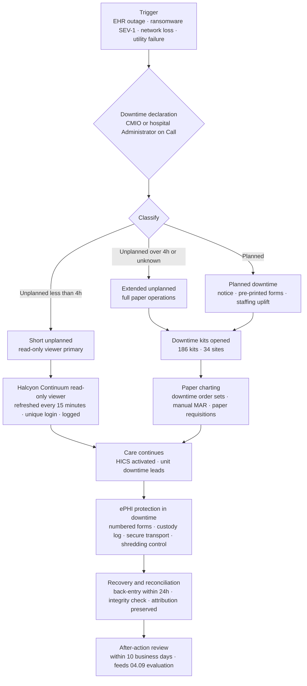

# 04.08 — Contingency Plan (§164.308(a)(7))

| Field | Value |
|---|---|
| Document ID | MBH-ADM-CON-2026-408 |
| Version | 1.0 |
| Date | 2026-07-15 |
| Classification | Confidential — Electronic Protected Health Information (ePHI) // Illustrative Portfolio Sample |
| Owner | Daniel Cho, Chief Information Security Officer &amp; HIPAA Security Official |
| Co-Owner | Anthony Ruiz, Chief Information Officer (backup, DR execution) · Dr. Samuel Ortega, CMIO (clinical downtime) |
| Author | Advisory Team (Healthcare GRC / HIPAA) |
| Status | Approved |

## Purpose

**45 CFR §164.308(a)(7)(i)** requires a covered entity to "establish (and implement as needed) policies and procedures for responding to an emergency or other occurrence (for example, fire, vandalism, system failure, and natural disaster) that damages systems that contain electronic protected health information."

The Contingency Plan standard carries **five implementation specifications — three required, two addressable — more than any other standard in the Security Rule**. That weighting reflects the *availability* leg of the CIA triad, which in a hospital is not an IT service-level concern but a **patient-safety** concern. A billing system that is down is an inconvenience. An unavailable eMAR, blood bank system or physiologic monitoring feed is a clinical emergency.

This document delivers the standard for MercyBridge's **68 ePHI systems** across 4 hospitals and ~30 outpatient sites, and treats the Phase 03 contingency risks **R-47, R-48, R-49 and R-50**, together with the availability halves of **R-10**, **R-23** and **R-28**.

> **Emergency mode operation is the specification most often written and least often practised. At MercyBridge it is the one that keeps 1,200 licensed beds functioning when the EHR is gone.**

## 1. The Five Implementation Specifications

| Specification | Citation | R / A | Requirement | MercyBridge status |
|---|---|---|---|---|
| Data backup plan | §164.308(a)(7)(ii)(A) | **Required** | Establish and implement procedures to create and maintain retrievable exact copies of ePHI | ✅ Implemented — 3-2-1-1-0 strategy, immutable copies |
| Disaster recovery plan | §164.308(a)(7)(ii)(B) | **Required** | Establish (and implement as needed) procedures to restore any loss of data | ✅ Implemented — tiered DR plan with named RTO/RPO |
| Emergency mode operation plan | §164.308(a)(7)(ii)(C) | **Required** | Establish (and implement as needed) procedures to enable continuation of critical business processes for protection of the security of ePHI while operating in emergency mode | ✅ Implemented — clinical downtime procedures, downtime kits, read-only viewer |
| Testing and revision procedures | §164.308(a)(7)(ii)(D) | **Addressable** | Implement procedures for periodic testing and revision of contingency plans | **Reasonable and appropriate — implemented.** Test calendar with five exercise types |
| Applications and data criticality analysis | §164.308(a)(7)(ii)(E) | **Addressable** | Assess the relative criticality of specific applications and data in support of other contingency plan components | **Reasonable and appropriate — implemented.** 4-tier analysis over all 68 ePHI systems |

Both addressable specifications are implemented; no §164.306(d)(3)(ii) rationale is on file. The **2025 NPRM** would make (D) and (E) mandatory and add an explicit **72-hour restoration requirement for critical systems** plus **annual testing** — MercyBridge's Tier 1 RTO of ≤ 4 hours is materially tighter, and its testing calendar exceeds annual.

Rated **Partially Effective (C-A13)** in Phase 03: backups, downtime procedures and a DR plan existed, but testing was incomplete and restoration time had never been validated at scale.

## 2. Applications and Data Criticality Analysis — §164.308(a)(7)(ii)(E)

The criticality analysis is logically first: everything else in the standard is sized by it. MercyBridge uses the four-tier model established in **02.01**, assigned on **clinical impact first**; financial impact can never outrank patient-safety impact.

| Tier | Definition | Target RTO | Target RPO | Systems | Representative systems |
|---|---|---|---|---|---|
| **Tier 1 — Critical** | Loss directly impairs patient care or safety within minutes to hours | **≤ 4 hours** | **≤ 15 minutes** | **12** | Halcyon EHR core, CPOE, eMAR, ADT, PACS, LIS, blood bank, pharmacy, interface engine, physiologic monitoring, backup vault, identity directory |
| **Tier 2 — High** | Loss materially degrades clinical or revenue operations within one shift | ≤ 24 hours | ≤ 1 hour | 21 | Secure clinical messaging, HIE gateway, radiology dictation, anaesthesia record, patient portal, revenue cycle |
| **Tier 3 — Moderate** | Loss is disruptive but workaround-able for several days | ≤ 72 hours | ≤ 24 hours | 24 | Quality registries, care management, credentialing, outpatient practice management |
| **Tier 4 — Low** | Loss is administratively inconvenient only | ≤ 5 business days | ≤ 24 hours | 11 | Reporting marts, archived research extracts, training environments |
| — | **Total ePHI systems** | — | — | **68** | — |

**Interdependency is the trap.** A Tier 3 system that feeds a Tier 1 workflow is functionally Tier 1. The analysis therefore records upstream and downstream dependencies from the Phase 02 data-flow mapping: the **interface engine** is Tier 1 not because clinicians touch it but because ADT, orders, results and pharmacy all traverse it. Restoration sequencing follows the dependency graph, not the tier label alone.

| Criticality analysis control | Detail |
|---|---|
| Review cadence | Annual, and on any material system change (a §164.308(a)(8) trigger) |
| Owner | System owner from 02.10 proposes; CMIO validates clinical criticality; Security Official approves |
| Inputs | Clinical workflow analysis, downtime impact interviews across 41 stakeholders, ADT volumes, interface dependency map |
| Output | Restoration sequence, backup frequency, DR tier, downtime procedure requirement |

## 3. Data Backup Plan — §164.308(a)(7)(ii)(A)

The specification requires **retrievable exact copies**. "Retrievable" is the operative word: an untested backup is an assertion, not a control.

| Element | Standard |
|---|---|
| Strategy | **3-2-1-1-0** — 3 copies, 2 media types, 1 off-site, **1 immutable/air-gapped**, **0 errors on verification** |
| Tier 1 frequency | Continuous replication plus 15-minute transaction-log shipping (meets RPO ≤ 15 min) |
| Tier 2 frequency | Hourly incremental, daily full |
| Tier 3–4 frequency | Daily incremental, weekly full |
| Immutability | Object-lock / WORM retention on the immutable copy; deletion requires dual authorisation and is alarmed |
| Encryption | Backups encrypted at rest and in transit — closes the safe-harbour gap for the backup copy even where the source system is affected by **R-40** |
| Off-site | Second data centre plus vendor-held copy for the hosted Halcyon EHR (contractually specified in the BAA) |
| Vendor-hosted ePHI | Halcyon Health Systems performs primary backup; **MercyBridge retains an independent export** — concentration risk **R-28** is not mitigated by trusting the vendor's own copy |
| Verification | Automated integrity check on every job; monthly random-sample restore; quarterly full restore test per tier |
| Retention | Operational 90 days; monthly archive 7 years; legal holds override |
| Media handling | NIST SP 800-88 sanitisation at end of life; chain of custody for physical media |

| Backup metric | Baseline | 2026-07-15 | Target |
|---|---|---|---|
| Backup job success rate (all ePHI systems) | 97.8% | **99.3%** | ≥ 99.5% |
| ePHI systems with an immutable/air-gapped copy | 50 of 68 | **59 of 68** | 68 of 68 by 2027-01-31 (**R-48**) |
| Tier 1 systems meeting RPO ≤ 15 minutes | 9 of 12 | **12 of 12** | Sustained |
| Sample restores performed per quarter | ad hoc | 34 | ≥ 30 |
| Sample restore success rate | not measured | 100% | 100% |
| Backup copies encrypted | 62 of 68 | **68 of 68** | 100% |
| Independent export held for vendor-hosted ePHI | No | **Yes — weekly** | Weekly |

The nine Tier 2–3 systems still lacking immutability are the substance of **R-48**; each has a dated remediation ticket inside Wave 2.

## 4. Disaster Recovery Plan — §164.308(a)(7)(ii)(B)

| Element | Standard |
|---|---|
| Scope | All 68 ePHI systems, both data centres, 4 hospitals, ~30 outpatient sites |
| Declaration authority | CIO (Anthony Ruiz) or Security Official (Daniel Cho); either may declare, jointly notified |
| Recovery sequencing | Identity directory → network and interface engine → ADT → EHR core → CPOE/eMAR → ancillaries (LIS, PACS, pharmacy, blood bank) → Tier 2 → Tier 3–4 |
| Ransomware variant | Recovery to a **clean-build** environment with backup integrity verification and threat-hunt clearance before any data restore; no restore into a suspect estate |
| Alternate site | Second regional data centre with capacity for all Tier 1 and Tier 2 workloads |
| Vendor DR | Halcyon Health Systems DR obligations, RTO/RPO commitments and test participation are contractual BAA terms |
| Personnel | Named recovery teams with deputies; call tree tested quarterly; out-of-band communications for a scenario where email and telephony are unavailable |
| Documentation | Plan held electronically **and** in printed copy at all 4 hospital command centres and both data centres |
| Validation | **R-47** — Tier 1 restoration time had never been validated at full scale; a full-scale Tier 1 restoration exercise is scheduled for 2026-11 |

| DR metric | Baseline | 2026-07-15 | Target |
|---|---|---|---|
| Tier 1 systems with a documented, owner-signed recovery runbook | 8 of 12 | **12 of 12** | 12 of 12 |
| Tier 1 measured restore time (largest system, lab-scale test) | not measured | 3 h 41 m | ≤ 4 h at full scale |
| Full-scale Tier 1 restoration validated | **No** | Scheduled 2026-11 | Annual thereafter |
| Sites with single-path connectivity | 4 | 4 (diverse-path funded in Wave 2) | 0 by 2027-01 (**R-50**) |
| Call-tree test success | not measured | 96% reachable in 30 min | ≥ 98% |

## 5. Emergency Mode Operation Plan — §164.308(a)(7)(ii)(C)

### 5.1 Why This Is Life-Safety Critical

Emergency mode operation is often read as an IT continuity clause. In a hospital it is not. When the EHR is unavailable, care does not pause: patients continue to arrive at the emergency department, operations continue in theatre, infusions continue to run, and medication continues to be administered. The clinical questions become immediate and unforgiving — *what is this patient allergic to; what dose was last given and when; what is the current blood type and crossmatch; which results are back*.

The specification's own wording is precise: continuation of critical business processes **"for protection of the security of electronic protected health information"** while operating in emergency mode. Two duties therefore run in parallel:

1. **Care must continue** — paper charting, downtime order sets, manual medication administration records.
2. **ePHI must remain protected while it is being handled outside the normal controls** — paper records are still PHI; the read-only downtime viewer still requires unique identification and logging; reconciliation back into the chart must preserve integrity and attribution.

An emergency mode plan that keeps the hospital running but loses control of 900 pages of printed patient summaries has failed the specification.

### 5.2 The MercyBridge Downtime Model

### 5.3 Downtime Capability

| Capability | Specification |
|---|---|
| **Read-only downtime viewer** | *Halcyon Continuum* — an independent read-only copy of the clinical record refreshed every 15 minutes, hosted separately from the production EHR and on separate infrastructure and credentials so that an EHR compromise does not take it with it. Holds problem list, allergies, medications, recent results, last 3 notes, code status |
| **Downtime kits** | **186 kits across 34 sites** (4 hospitals, ~30 clinics). Sealed, quarterly-inspected. Contents: downtime order sets, paper MAR, progress and nursing notes, requisition forms, allergy/code-status labels, patient identification labels, unit-specific quick cards, numbered form register, tamper-evident transport bags |
| **Automatic downtime reports** | Census, MAR, active orders, allergy list and code status auto-print to unit printers every 4 hours **during normal operations**, so that an unplanned outage never starts from nothing |
| **Downtime leads** | A trained downtime lead and deputy on every inpatient unit and in every clinic; refreshed annually |
| **Pharmacy** | Manual verification workflow, paper dispensing log, override protocol for automated dispensing cabinets with pharmacist double-check |
| **Laboratory and blood bank** | Paper requisitions; **blood bank downtime protocol with manual crossmatch and dual-signature verification** — the single highest-risk downtime workflow in the hospital |
| **Imaging** | PACS downtime: local modality storage, paper requisition, radiologist read from modality console, deferred reconciliation |
| **Registration and ADT** | Downtime medical record number block issued in advance; strict reconciliation to prevent duplicate records (**R-43**) |
| **Communications** | Overhead paging, two-way radios and a maintained printed call roster for a scenario where email, secure messaging and VoIP are unavailable |
| **ePHI protection during downtime** | All downtime forms are pre-numbered and logged in and out; printed summaries are tracked and either filed or shredded under a witnessed control; transport uses tamper-evident bags; no personal devices are used to photograph records |
| **Recovery** | Back-entry of downtime documentation within 24 hours of restoration, with the original paper retained as source; integrity reconciliation report per unit; discrepancy list to the CMIO |

## 6. Testing and Revision — §164.308(a)(7)(ii)(D)

Phase 03 raised **R-49**: clinical downtime procedures had not been exercised at all ~30 outpatient sites. The exercise calendar below is the response.

| Exercise type | Scope | Frequency | Owner | Position at 2026-07-15 |
|---|---|---|---|---|
| Backup restore sampling | Random systems across all tiers | Monthly | Anthony Ruiz | Running; 34 restores in Q2 |
| Tier-by-tier restore test | Each tier in rotation | Quarterly | Anthony Ruiz | Tier 1 and Tier 2 complete |
| **Full-scale Tier 1 restoration** | 12 Tier 1 systems, dependency-sequenced | **Annual** | Anthony Ruiz + Daniel Cho | **Scheduled 2026-11** (**R-47**) |
| EHR downtime drill — hospitals | 4 hospitals, all inpatient units | **Semi-annual** | Dr. Samuel Ortega | 4 of 4 complete (2026-06) |
| EHR downtime drill — outpatient | ~30 clinic sites | **Annual** | Dr. Samuel Ortega | **11 of 30 complete**; remainder by 2026-12-31 (**R-49**) |
| Data-centre failover | Alternate site | Annual | Anthony Ruiz | Complete 2026-05 |
| Ransomware tabletop | Executive + clinical + IT | Annual | Daniel Cho | **Phase 07, 2026-08** |
| Call-tree and out-of-band comms test | Recovery teams | Quarterly | Marcus Reed | Complete |
| Downtime kit inspection | 186 kits | Quarterly | Unit downtime leads | 186 of 186 |
| Business associate DR test participation | Halcyon EHR and 5 other critical BAs | Annual | Lisa Coleman + Daniel Cho | Halcyon complete; 3 of 5 others |

**Revision.** Every exercise produces an after-action report within 10 business days with findings, owners and dates. Findings feed the contingency plan, the criticality analysis and — where they alter a risk score — the Phase 03 register. The plan is reviewed at least annually and on any of the nine §164.308(a)(8) triggers in 03.10.

| Testing metric | Baseline | 2026-07-15 |
|---|---|---|
| Sites having exercised clinical downtime in the last 12 months | 4 of 34 | **15 of 34** |
| Exercises with a completed after-action report | not tracked | 12 of 12 |
| After-action findings closed within 90 days | not tracked | 27 of 31 |
| Contingency plan revisions issued in the period | 0 | 3 |

## 7. Risks Treated and Evidence Produced

| Risk | Rating | Treatment delivered here | Target residual |
|---|---|---|---|
| **R-47** | Moderate | Tier 1 runbooks 8 → 12 of 12; lab-scale restore measured at 3 h 41 m; full-scale validation 2026-11 | Low by 2026-12 |
| **R-48** | Moderate | Immutable copies 50 → 59 of 68; 9 remaining ticketed inside Wave 2 | Low by 2027-01-31 |
| **R-49** | Moderate | Semi-annual hospital drills complete; outpatient drills 11 of 30 with a dated completion plan | Low by 2026-12-31 |
| **R-50** | Low | Diverse-path connectivity funded for the 4 single-path sites; interim cellular failover deployed | Low |
| **R-10** | **High** | Device-VLAN availability addressed through downtime procedures and segmentation (Phase 05, Wave 3) | Moderate by 2027-06 |
| **R-23** | **High** | Clean-build ransomware recovery, immutable backups, emergency mode operation; tabletop in Phase 07 | Moderate at Wave 1 close |
| **R-28** | **High** | Independent weekly export of vendor-hosted ePHI; contractual DR obligations; read-only viewer independent of the vendor platform | Moderate by 2027-06 |
| **R-43** | Moderate | Downtime MRN block and reconciliation controls prevent duplicate-record integrity loss | Low |
| **R-53** | Low | Environmental scenarios in the DR plan; alternate site; site-level emergency mode procedures | Low |

| Evidence artefact | Location | Owner |
|---|---|---|
| POL-13 Contingency Planning (signed) | `governance/POL-13-contingency-planning.md` | Daniel Cho |
| Applications and data criticality analysis (68 systems) | `trackers/criticality-analysis.xlsx` | Marcus Reed |
| Backup standard and job success reporting | `trackers/backup-assurance.xlsx` | Anthony Ruiz |
| Disaster recovery plan and Tier 1 runbooks | `governance/disaster-recovery-plan.md` | Anthony Ruiz |
| Emergency mode operation / clinical downtime procedures | `governance/clinical-downtime-procedures.md` | Dr. Samuel Ortega |
| Downtime kit inventory and inspection log | `trackers/downtime-kit-register.xlsx` | Dr. Samuel Ortega |
| Contingency test calendar and after-action reports | `logs/contingency-test-log.md` | Anthony Ruiz |
| Restoration and reconciliation reports | `logs/downtime-reconciliation-log.md` | Dr. Samuel Ortega |

## Cross-References

| Reference | Relevance |
|---|---|
| 02.01 — Inventory Methodology | The four-tier criticality model, RTO and RPO targets |
| 02.03 — ePHI Data-Flow Mapping | Interdependencies driving the restoration sequence |
| 02.06 — Cloud &amp; Hosted Services | Shared-responsibility position for backup and RTO/RPO validation |
| 03.06 — Ransomware &amp; Healthcare Threat Profile | The R-23 scenario the clean-build recovery is designed for |
| 03.07 — Risk Register | R-10, R-23, R-28, R-43, R-47, R-48, R-49, R-50, R-53 |
| 04.03 — Assigned Security Responsibility | Emergency authority and declaration rights |
| 04.07 — Security Incident Procedures | SEV-1 activation that invokes emergency mode operation |
| 04.09 — Evaluation | After-action findings feeding the §164.308(a)(8) cycle |
| 04.11 — Policies, Procedures &amp; Documentation | POL-13 and six-year retention |
| Phase 05 — §164.310(a)(2)(i) Contingency Operations | Facility access during an emergency |
| Phase 06 — Business Associate &amp; Third-Party Risk | Halcyon DR obligations and BA test participation |
| Phase 07 — Incident Response &amp; Breach Notification | Ransomware tabletop exercising this plan |

---
[⬅ Previous](04.07-security-incident-procedures.md) · [🏠 Phase README](04.00-README.md) · [Next ➡](04.09-evaluation.md)
