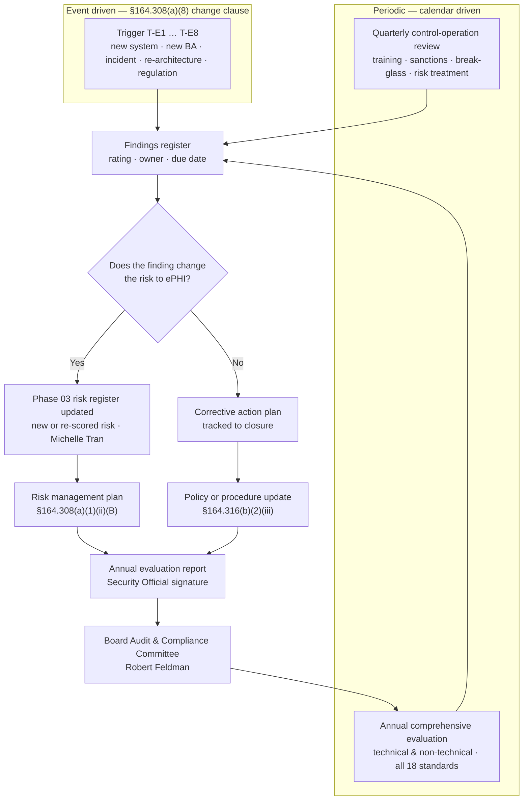

# 04.09 — Evaluation

| Field | Value |
|---|---|
| Document ID | MBH-ADM-EVL-2026-409 |
| Version | 1.0 |
| Date | 2026-07-15 |
| Classification | Confidential — Electronic Protected Health Information (ePHI) // Illustrative Portfolio Sample |
| Owner | Daniel Cho, Chief Information Security Officer &amp; HIPAA Security Official |
| Co-Owner | Karen Boyd, Chief Compliance Officer |
| Author | Advisory Team (Healthcare GRC / HIPAA) |
| Status | Approved |

## Purpose

This document establishes MercyBridge Health Network's **evaluation programme** under **45 CFR §164.308(a)(8)**, the eighth standard of the administrative safeguards. The standard is short and unqualified:

> *"Perform a periodic technical and nontechnical evaluation, based initially upon the standards implemented under this rule and, subsequently, in response to environmental or operational changes affecting the security of electronic protected health information, that establishes the extent to which a covered entity's or business associate's security policies and procedures meet the requirements of this subpart."*

Three obligations sit inside that sentence, and covered entities routinely satisfy only the first. The evaluation must be **periodic**. It must be **technical *and* non-technical** — configurations *and* policies, procedures, training records, contracts and governance. And it must be **triggered by change**, not only by the calendar: a merger, a new hosted service, a re-architected network or a serious incident each create an evaluation duty on their own timetable.

Evaluation was the weakest administrative standard at MercyBridge's Phase 03 baseline. Control **C-A14** was rated **Partially Effective** — periodic technical review was being performed *ad hoc* by the infrastructure team — but the **formal evaluation programme itself was rated Not Implemented**: there was no charter, no defined scope, no schedule, no non-technical component, no trigger list and no retained evaluation report. This document closes that gap. **POL-14 — Evaluation &amp; Continuous Compliance** is approved on 2026-07-15 and the first full evaluation cycle runs in Phase 08.

## 1. What §164.308(a)(8) Actually Requires

| Element of the standard | Plain reading | MercyBridge instrument |
|---|---|---|
| **Periodic** | On a defined, documented recurring cycle — not "when we get to it" | Annual comprehensive evaluation, Q3 each year; quarterly control-operation reviews |
| **Technical** | Testing the configured state of systems and controls against the documented standard | Configuration baselines, MFA and encryption coverage, log completeness, access recertification data across the 68 ePHI systems |
| **Non-technical** | Reviewing policies, procedures, training, sanctions, contracts, governance and physical practice | Policy currency, training completion, sanction register, BAA population, committee minutes, walkthroughs |
| **Based initially upon the standards implemented** | The first evaluation baselines against the Security Rule itself, standard by standard | The 18 standards / ~50 specifications checklist, seeded from the OCR Audit Protocol |
| **In response to environmental or operational changes** | Event-driven evaluation independent of the calendar | The eight trigger classes in §4 |
| **Establishes the extent to which policies and procedures meet the requirements** | A written conclusion with a rating and findings — not an activity log | Dated evaluation report with per-standard ratings, findings and owners |

**Standard, not specification.** §164.308(a)(8) carries **no implementation specifications**; the standard is itself **required**. It is one of two standards in §164.308 (with Assigned Security Responsibility) satisfied by the standard alone. There is therefore no addressable analysis to perform and no §164.306(d)(3)(ii) rationale available — the duty is absolute.

## 2. Scope of Evaluation

The evaluation covers the whole Security Rule estate, not the security team's own work.

| Domain | What is evaluated | Evidence drawn from | Frequency |
|---|---|---|---|
| Policies &amp; procedures | Currency, approval, accuracy against practice, six-year retention | The 24-policy suite; `governance/` | Annual |
| Administrative safeguards | All nine §164.308 standards and 21 implementation specifications | 04.02–04.10 evidence registers | Annual |
| Physical safeguards | §164.310 — facility access, workstation use and security, device and media controls | Phase 05 evidence; site walkthroughs at 4 hospitals and a rotating sample of ~30 clinic sites | Annual, sites on a 3-year rotation |
| Technical safeguards | §164.312 — access control, audit controls, integrity, authentication, transmission security | Configuration extracts across the 68 ePHI systems | Annual + quarterly control checks |
| Organisational requirements | §164.314 — BAA population, required clauses, subcontractor flow-down | Contract register (~180 business associates, 24 critical) | Annual |
| Documentation | §164.316 — written form, availability, review and update, retention | Document register and retention attestations | Annual |
| Workforce practice | Training completion, phishing results, sanction application, break-glass review | LMS, simulation platform, sanction register | Quarterly |
| Risk treatment | Progress against the Wave 1–3 risk management plan | Risk register and treatment tracker | Quarterly |

## 3. Who Performs the Evaluation

Evaluation is performed *by* the organisation and *reviewed* independently. Neither half is optional.

| Role | Person | Responsibility in the evaluation |
|---|---|---|
| Evaluation owner | Daniel Cho, CISO &amp; Security Official | Owns POL-14, approves scope, signs the evaluation report, presents to the Board committee |
| Evaluation lead | Marcus Reed, Information Security Manager | Runs the technical evaluation; assembles evidence; drafts findings |
| Non-technical lead | Karen Boyd, Chief Compliance Officer | Policy, training, sanction and documentation review |
| Clinical review | Dr. Samuel Ortega, CMIO | Break-glass, downtime practice and clinical workflow realism |
| IT operations | Anthony Ruiz, CIO | Configuration, backup, infrastructure and hosted-service evidence |
| Contract review | Lisa Coleman, General Counsel | BAA population and §164.314(a) clause conformance |
| Risk custody | Michelle Tran, VP Enterprise Risk | Feeds findings into the risk register as new or revised risks |
| Independent review | Priya Anand, Director of Internal Audit | Reviews the evaluation for completeness and challenge; reports to the Audit &amp; Compliance Committee |
| Board oversight | Robert Feldman, Committee Chair | Receives the annual evaluation report and the management response |

**Separation rule.** The person who *operates* a control does not *rate* that control in the evaluation. Where the security team's own controls are in scope (activity review, incident handling, training design), Internal Audit performs the rating.

## 4. Trigger-Based Evaluation

A change-triggered evaluation is scoped to the change, completed within a defined window, and documented in the same evaluation log as the annual cycle.

| # | Trigger class | Illustrative event at MercyBridge | Window | Scope of the triggered evaluation |
|---|---|---|---|---|
| T-E1 | New or materially changed ePHI system | A 69th ePHI system enters the inventory; a major Halcyon EHR version upgrade | 30 days of go-live | System-level technical evaluation + inventory and data-flow update |
| T-E2 | New or changed business associate | A Tier 1 hosted service is onboarded or a critical BA is replaced | Before ePHI is disclosed | BAA clauses, due diligence, subcontractor chain |
| T-E3 | Significant security incident | Any SEV-1, or a SEV-2 involving ePHI exposure | 30 days of closure | Controls implicated by the incident; post-incident review findings |
| T-E4 | Environmental / infrastructure change | Micro-segmentation rollout, data-centre migration, cloud adoption, network re-architecture | 60 days of completion | Affected technical safeguards and contingency assumptions |
| T-E5 | Organisational change | Acquisition of a practice or clinic site; new service line; change of Security Official | 90 days | Full scoping re-run for the acquired entity; governance continuity |
| T-E6 | Regulatory change | Finalisation of the 2025 HIPAA Security Rule NPRM; new OCR guidance | 90 days of effective date | Gap assessment against the changed requirement set |
| T-E7 | Assessment or audit finding | Ironwood penetration-test finding; Beacon HITRUST observation; internal audit finding | 30 days of report | The control family in which the finding sits |
| T-E8 | Threat-landscape shift | A sector-wide ransomware campaign against hospital systems or a critical vendor advisory | 30 days | Detection, segmentation and contingency assumptions |

## 5. Evaluation, Risk Analysis and Independent Testing Are Different Things

Conflating these three is the most common structural error in a HIPAA programme, and it produces a document set that looks complete but leaves §164.308(a)(8) unsatisfied.

| Dimension | Risk analysis §164.308(a)(1)(ii)(A) | **Evaluation §164.308(a)(8)** | Independent testing (Phase 08) |
|---|---|---|---|
| Question answered | *What could go wrong, how likely, how bad?* | *Do our policies and safeguards meet the Security Rule, as operated?* | *Can an adversary or an outside assessor break or disprove them?* |
| Unit of analysis | Threat–vulnerability pairs against ePHI assets | Standards and implementation specifications | Attack paths and control assertions |
| Output | 56 risks, scored and owned | Per-standard conformance rating with findings | 16 penetration-test findings; HITRUST i1 result; audit opinion |
| Performed by | Security + risk, with business input | The organisation itself, independently reviewed | Ironwood Security Labs; Beacon Assurance; Internal Audit |
| Cadence | Continuous; formally refreshed annually and on change | Annual + trigger-based | Annual penetration test; i1 on the HITRUST cycle |
| Failure mode if skipped | Controls chosen without reference to actual risk | Drift: controls decay quietly between assessments | Self-assessment bias goes unchallenged |
| MercyBridge document | 03.01–03.09 | **This document; POL-14** | Phase 08 |

Evaluation *consumes* the risk analysis and *feeds* it. It does not replace it, and an external penetration test does not discharge it — a pen test says nothing about whether the sanction policy is applied consistently or whether ~180 BAAs contain the §164.314(a) clauses.

## 6. The Evaluation Calendar

| Period | Activity | Lead | Output |
|---|---|---|---|
| Each quarter (Q-end + 15 days) | Control-operation review: training completion, phishing, sanctions, break-glass, access recertification, backup success, risk-treatment progress | Marcus Reed | Quarterly administrative safeguards scorecard |
| 2026 Q3 (Aug–Sep) | Baseline evaluation of the newly implemented §164.308 estate against the standards | Marcus Reed / Karen Boyd | Phase 04 baseline evaluation memorandum |
| 2026 Q3 (Sep) | Independent penetration test and vulnerability assessment | Ironwood Security Labs | 16 findings, remediated (Phase 08) |
| 2026 Q4 (Oct–Nov) | HITRUST i1 validated assessment | Beacon Assurance, LLC | i1 certification |
| 2026 Q4 (Nov) | Internal audit of the HIPAA security programme | Priya Anand | Audit opinion: Satisfactory |
| 2026 Q4 (Dec) | Annual evaluation report consolidated and signed; Board committee report | Daniel Cho | Signed §164.308(a)(8) evaluation report |
| Annually thereafter (Q3) | Full technical and non-technical evaluation of all 18 standards | Daniel Cho | Evaluation report + corrective action plan |
| On event | Trigger-based evaluation per T-E1 … T-E8 | Marcus Reed | Scoped evaluation memorandum |

**Retention.** Every evaluation report, scoped memorandum, scorecard and corrective action plan is retained for **six years** from creation or last effective date under **§164.316(b)(2)(i)**.

## 7. Baseline Status and Improvement

| Item | Phase 03 baseline (C-A14) | Phase 04 position |
|---|---|---|
| Evaluation programme | **Not Implemented** — no charter, schedule, scope or report | Established: POL-14 approved, charter and calendar in force |
| Technical evaluation | Ad hoc infrastructure review, unevidenced | Scheduled annual + quarterly control checks across 68 ePHI systems |
| Non-technical evaluation | Absent | Policy, training, sanction, contract and documentation review defined |
| Change triggers | Absent | Eight trigger classes with defined windows |
| Independent challenge | Absent | Internal Audit review; Phase 08 external assessment |
| Retained output | None | Signed annual report; six-year retention |
| Risks treated | — | R-36, R-54, R-55 (evaluation evidences activity review, policy currency and monitoring) |

**2025 NPRM readiness.** The proposed rule would remove the addressable/required distinction and mandate **annual penetration testing and vulnerability scanning** alongside a maintained asset inventory. MercyBridge's calendar already schedules both, so finalisation of the NPRM requires no new evaluation activity — only a change of citation.

## 8. Evidence Produced

| Evidence artefact | Location | Owner |
|---|---|---|
| POL-14 Evaluation &amp; Continuous Compliance (signed) | `governance/POL-14-evaluation.md` | Daniel Cho |
| Evaluation charter and scope statement | `governance/evaluation-charter.md` | Daniel Cho |
| Evaluation calendar | `trackers/evaluation-calendar.xlsx` | Marcus Reed |
| Standard-by-standard evaluation workbook (18 standards) | `trackers/evaluation-workbook.xlsx` | Marcus Reed |
| Trigger-based evaluation log | `logs/triggered-evaluation-log.md` | Marcus Reed |
| Quarterly administrative safeguards scorecard | `logs/quarterly-scorecard.md` | Marcus Reed |
| Annual evaluation report and management response | `governance/annual-evaluation-report.md` | Daniel Cho |

## Cross-References

| Reference | Relevance |
|---|---|
| 01.04 — HIPAA Security Rule Overview | The 18 standards the evaluation baselines against |
| 02.02 — ePHI System Inventory | The 68 systems in evaluation scope; T-E1 trigger source |
| 03.04 — Existing Controls Assessment | Baseline rating C-A14 that this document remediates |
| 03.07 — Risk Register | R-36, R-54, R-55 treated here; findings feed new risks |
| 03.10 — Periodic Review &amp; Update | The risk-analysis refresh cycle this evaluation informs |
| 04.02 — Security Management Process | Information system activity review as a continuous input |
| 04.08 — Contingency Plan | Test after-action findings feeding the evaluation cycle |
| 04.11 — Policies, Procedures &amp; Documentation | POL-14, §164.316(b)(2)(iii) review-and-update duty |
| 04.12 — Control-to-Risk Traceability | Where evaluation coverage is proved against the register |
| Phase 05 — Physical &amp; Technical Safeguards | §164.310 / §164.312 controls entering evaluation scope |
| Phase 08 — HITRUST &amp; Independent Assessment | Independent testing that complements, but does not replace, evaluation |
| Phase 09 — Executive Reporting &amp; Programme Maturity | Continuous compliance operating model built on this cycle |

---
[⬅ Previous](04.08-contingency-plan.md) · [🏠 Phase README](04.00-README.md) · [Next ➡](04.10-business-associate-contracts.md)
