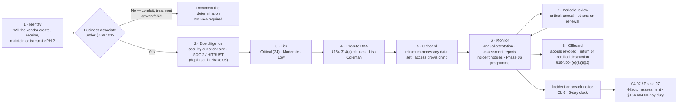

# 04.10 — Business Associate Contracts and Other Arrangements

| Field | Value |
|---|---|
| Document ID | MBH-ADM-BAC-2026-410 |
| Version | 1.0 |
| Date | 2026-07-15 |
| Classification | Confidential — Electronic Protected Health Information (ePHI) // Illustrative Portfolio Sample |
| Owner | Lisa Coleman, General Counsel (owner of Business Associate Agreements) |
| Co-Owner | Daniel Cho, Chief Information Security Officer &amp; HIPAA Security Official |
| Author | Advisory Team (Healthcare GRC / HIPAA) |
| Status | Approved |

## Purpose

This document implements **45 CFR §164.308(b)(1)** — *Business Associate Contracts and Other Arrangements* — the ninth and final standard of the administrative safeguards, together with its organisational counterpart at **§164.314(a)**. The standard states that a covered entity may permit a business associate to create, receive, maintain or transmit ePHI on its behalf **only if it obtains satisfactory assurances, documented through a written contract or other arrangement**, that the business associate will appropriately safeguard that information.

MercyBridge discloses ePHI to approximately **180 business associates**, of which **24 are classified critical or high-risk**. The single largest concentration is the vendor-hosted **Halcyon Health EHR**, which holds the entire ~2.1 million-record clinical archive. **Of the 47 ePHI systems with business associate involvement, 44 have a conforming BAA on file; 3 are under active remediation.**

This document delivers the **administrative-safeguard half** of that obligation: who counts as a business associate, what the contract must say, how the population is governed, and what evidence exists on 2026-07-15. The **full third-party risk programme** — due-diligence questionnaires, tiering methodology, SOC 2 / HITRUST reliance, continuous monitoring, subcontractor chain mapping and offboarding assurance — is **Phase 06**. §164.308(b)(1) requires a contract; a defensible programme requires far more than a contract, and this document is explicit about where the line falls.

## 1. Who Is a Business Associate

A business associate is a person or entity that **creates, receives, maintains or transmits PHI on behalf of** a covered entity to perform a function or activity regulated by HIPAA, or that provides specified services involving disclosure of PHI (§160.103).

| Category | In or out | MercyBridge examples | Basis |
|---|---|---|---|
| Hosted clinical / business applications | **In** | Halcyon Health EHR, PACS archive vendor, LIS interface vendor, revenue-cycle outsourcer, patient-portal host | Maintains ePHI on the Network's behalf |
| Cloud service providers (IaaS / PaaS / SaaS) | **In** | Cloud hosting for the HIE gateway, secure clinical messaging, backup vaulting | OCR 2016 cloud guidance: a CSP is a BA **even if it only stores encrypted ePHI and holds no decryption key** |
| Managed IT and security services | **In** | Managed detection provider, service-desk overflow vendor, medical-device remote-support vendors | Persistent access to systems containing ePHI |
| Professional services with PHI access | **In** | Coding and transcription vendors, external legal counsel handling PHI, actuarial and accounting firms | §160.103 enumerated services |
| Health information exchange / e-prescribing gateways | **In** | Regional HIE operator, e-prescribing network | Transmits and maintains PHI on behalf of participants |
| Data destruction and records storage | **In** | Certificated media destruction vendor, off-site paper storage | Handles PHI as a service |
| **Subcontractors of business associates** | **In** | Halcyon's hosting provider; the coding vendor's offshore staffing partner | §164.308(b)(2), §164.314(a)(2)(iii) — the BA must obtain the same assurances downstream |
| Mere conduits | **Out** | Postal service, courier, internet service provider carrying encrypted traffic without access | Conduit exception — transient transmission only |
| Disclosures to another provider for treatment | **Out** | Referral to a specialist; transfer to a skilled nursing facility | §164.502(a)(1)(ii) treatment disclosure, not a BA relationship |
| Members of the workforce | **Out** | Employed and contracted clinicians under MercyBridge direction | Workforce, governed by §164.308(a)(3) instead |
| Entities receiving PHI as a covered entity in their own right | **Out** | Health plans receiving claims; public health reporting to the state department | Permitted disclosure, not a service on the Network's behalf |

**The conduit exception is narrow.** It applies to transmission-only services with, at most, transient access. A vendor that *stores* ePHI is a business associate regardless of whether it ever looks at the data. MercyBridge applies this test conservatively: where storage or persistent access is plausible, a BAA is executed.

## 2. What the Contract Must Contain

§164.308(b)(1) points to §164.314(a); §164.314(a) points back to the Privacy Rule's §164.504(e). A conforming BAA satisfies **both**.

| # | Required element | Citation | MercyBridge template clause |
|---|---|---|---|
| 1 | Comply with the applicable requirements of Subpart C (the Security Rule) in respect of ePHI | §164.314(a)(2)(i)(A) | Cl. 4 — Security Rule compliance, with express reference to §164.308, §164.310, §164.312, §164.316 |
| 2 | Ensure that **subcontractors** creating, receiving, maintaining or transmitting ePHI agree to the same restrictions and conditions | §164.314(a)(2)(i)(B), §164.308(b)(2) | Cl. 5 — flow-down obligation and disclosure of the subcontractor list |
| 3 | **Report security incidents**, including breaches of unsecured PHI under §164.410, to MercyBridge | §164.314(a)(2)(i)(C) | Cl. 6 — notice **without unreasonable delay and no later than 5 calendar days** of discovery |
| 4 | Use and disclose PHI only as permitted by the contract or required by law | §164.504(e)(2)(ii)(A) | Cl. 2 — permitted uses and disclosures, minimum necessary |
| 5 | Use appropriate safeguards to prevent impermissible use or disclosure | §164.504(e)(2)(ii)(B) | Cl. 3 — administrative, physical and technical safeguards |
| 6 | Make PHI available for access, amendment and accounting of disclosures | §164.504(e)(2)(ii)(E)–(G) | Cl. 8 — individual rights support, with response SLAs |
| 7 | Make internal practices, books and records available to **HHS** | §164.504(e)(2)(ii)(H) | Cl. 9 — regulator access |
| 8 | **Return or destroy** PHI at termination where feasible; extend protections if not | §164.504(e)(2)(ii)(J) | Cl. 11 — certified return or NIST SP 800-88 destruction with certificate |
| 9 | Authorise **termination** for material breach of the contract | §164.504(e)(2)(iii) | Cl. 12 — cure period and termination right |
| 10 | Where applicable, comply with Subpart E for any obligations carried out on the covered entity's behalf | §164.504(e)(2)(ii)(I) | Cl. 10 — Privacy Rule obligations |

**MercyBridge additions beyond the regulatory minimum** (not required by rule, required by policy POL-15): encryption of ePHI at rest and in transit to a named standard; annual evidence of an independent assessment (SOC 2 Type II or HITRUST); notification of any change of subcontractor holding ePHI; cyber-liability insurance minimums; cooperation in breach investigation and, where MercyBridge determines it appropriate, in notification cost allocation; and the right to audit or to accept an equivalent third-party report.

**"Other arrangements."** Where the business associate is a government agency, §164.308(b)(3) and §164.314(a)(2)(ii) permit a memorandum of understanding or reliance on statutory obligations in place of a contract. MercyBridge has **two** such arrangements (a state public-health data service and a county EMS data exchange), documented as MOUs and reviewed on the same cycle as BAAs.

## 3. The MercyBridge Business Associate Population

| Segment | Count | Definition | Assurance standard applied |
|---|---|---|---|
| Total business associates | **~180** | Any entity with a BAA or MOU in force | Conforming BAA; annual attestation |
| **Critical / high-risk** | **24** | Holds Tier 1 ePHI, holds >50,000 records, has privileged access to a Tier 1 system, or is single-sourced | BAA + independent assessment report + annual review + named relationship owner |
| Moderate | ~62 | Holds ePHI below the critical threshold, or has scoped access | BAA + biennial attestation |
| Low / limited | ~94 | Incidental or narrowly scoped PHI access | BAA + on-renewal review |
| Government "other arrangements" | 2 | State public health; county EMS | MOU under §164.314(a)(2)(ii) |
| Subcontractor chain (BA-of-BA) | 9 hosted services with unmapped chains at baseline | Downstream entities handling ePHI | Flow-down clause; chain mapped in Phase 06 |

### 3.1 BAA Coverage Against ePHI Systems

| Measure | Position at 2026-07-15 |
|---|---|
| ePHI systems in scope | 68 |
| ePHI systems with business associate involvement | 47 |
| Systems with a conforming, executed BAA | **44** |
| **Systems with a BAA under remediation** | **3** — MBH-SYS-029, MBH-SYS-033, MBH-SYS-058 |
| Systems with a legacy BAA missing one or more §164.314(a) clauses | 3 (the same three) |
| Critical BAs with a current independent assessment report on file | 21 of 24 |
| BAAs on the current MercyBridge template | 131 of 180; remainder converted at renewal |

### 3.2 The Three BAAs Under Remediation (risk R-29)

| System | Service | Deficiency | Remediation | Interim control | Target |
|---|---|---|---|---|---|
| MBH-SYS-029 | Patient experience survey platform | BAA executed with a predecessor entity; novation never completed after the vendor was acquired | Novation plus fresh execution with the acquiring entity | Read-only access; enhanced logging on the interface | 2026-07-31 |
| MBH-SYS-033 | Medical transcription service | Pre-HITECH template: no subcontractor flow-down, no defined incident-notification window; offshore subcontracting undisclosed | Re-papered onto the 2026 template with flow-down and disclosure | Offshore access suspended pending execution; volumes throttled | 2026-07-31 |
| MBH-SYS-058 | Enterprise digital fax gateway (release of information) | Incident-notification clause silent; no return-or-destroy obligation | Amendment adding Cl. 6 and Cl. 11 | ePHI field set reduced to minimum necessary | 2026-07-31 |

All three carry a dated remediation ticket, a named accountable owner (Lisa Coleman), an interim compensating control approved by the Security Official, and Board committee visibility. **BAA remediation completes in 2026-07** per the programme timeline; the three residual relationships are re-tested in the Phase 08 evaluation.

## 4. The Business Associate Lifecycle (High Level)

| Stage | Owner | Phase 04 position | Deepened in Phase 06 |
|---|---|---|---|
| 1 Identify | Contracting / requesting department | BA determination test in POL-15 | Intake workflow and register integration |
| 2 Due diligence | Daniel Cho / Marcus Reed | Assessment report required for critical BAs | Full questionnaire set, tiered depth, evidence review |
| 3 Tier | Michelle Tran | 24 critical identified | Documented tiering methodology and scoring |
| 4 Execute | **Lisa Coleman** | 2026 template with all §164.314(a) clauses | Clause-deviation governance and exception log |
| 5 Onboard | System owner | Minimum-necessary data set defined | Data-flow registration in the inventory |
| 6 Monitor | Daniel Cho | Annual attestation for critical BAs | Continuous monitoring, subcontractor chain, KRI reporting |
| 7 Review | Lisa Coleman | Annual review of the 24 critical | Full population review calendar |
| 8 Offboard | System owner | Return-or-destroy clause in contract | Evidenced certificates of destruction (risk R-33) |

## 5. What a BAA Does Not Do

Three propositions govern MercyBridge's interpretation, and each is a recurring theme in OCR enforcement.

| Proposition | Consequence for MercyBridge |
|---|---|
| A BAA is **satisfactory assurance in documentary form**, not proof of security | Contract alone leaves R-28 (single-vendor EHR concentration, High) untreated; assurance must be tested, which is the Phase 06 and Phase 08 work |
| A BAA does **not transfer HIPAA liability** for the covered entity's own compliance | MercyBridge remains accountable for the risk analysis, safeguards and breach notification covering ePHI held by Halcyon |
| Knowledge of a **pattern of activity or practice** constituting a material breach by the BA obliges the covered entity to act | §164.314(a)(1)(ii): cure, terminate, or — if neither is feasible — report the problem to HHS. Documented in POL-15 |

Since HITECH, business associates are **directly liable** to OCR for the Security Rule and for breach notification. That does not dilute the covered entity's duty; it adds a second accountable party.

## 6. Risks Treated and Handoff to Phase 06

| Risk | Rating | Treated here (administrative) | Completed in |
|---|---|---|---|
| R-28 — Halcyon EHR compromise or extended outage (2.1M records) | **High** | BAA security, DR and notification obligations; contingency interlock in 04.08 | Phase 06 (tested assurance) + Wave 3 |
| R-29 — ePHI disclosed under three non-conforming BAAs | Moderate | Re-papering programme; interim compensating controls | 2026-07-31 |
| R-30 — Subcontractor chain unvisible for nine hosted services | Moderate | Flow-down clause and disclosure obligation in the 2026 template | **Phase 06** |
| R-31 — BA breach notice arrives too late for the 60-day duty | Moderate | 5-day contractual notification clock; interface to 04.07 | Phase 06 / Phase 07 |
| R-32 — Offshore support access exceeds minimum necessary | Low | Minimum-necessary clause; data-set reduction | **Phase 06** |
| R-33 — Data return and certified deletion unevidenced at exit | Low | Return-or-destroy clause with certificate requirement | **Phase 06** |

**Counting note.** R-28, R-31 and R-32 are counted within the 31 risks treated in Phase 04 because the administrative instrument (the contract and its clauses) is delivered here. **R-29, R-30 and R-33 are attributed to Phase 06**, where the due-diligence, subcontractor-mapping and offboarding-evidence programmes that actually close them are built. Phase 04 does not claim credit for work it has not performed.

## 7. Evidence Produced

| Evidence artefact | Location | Owner |
|---|---|---|
| POL-15 Business Associate &amp; Third-Party Security (signed) | `governance/POL-15-business-associate-security.md` | Lisa Coleman |
| 2026 BAA template with §164.314(a) clause map | `templates/business-associate-agreement.md` | Lisa Coleman |
| Business associate register (~180 entities, 24 critical) | `trackers/business-associate-register.xlsx` | Lisa Coleman |
| BAA remediation tracker (MBH-SYS-029, -033, -058) | `trackers/baa-remediation.xlsx` | Lisa Coleman |
| BA determination decision log (BA / not a BA) | `logs/ba-determination-log.md` | Karen Boyd |
| Government "other arrangement" MOUs | `governance/other-arrangements-mou.md` | Lisa Coleman |
| Critical BA independent assessment reports (21 of 24) | `trackers/ba-assurance-evidence.xlsx` | Daniel Cho |

## Cross-References

| Reference | Relevance |
|---|---|
| 01.03 — Covered Entity &amp; Business Associate Determination | Where MercyBridge's own status and BA boundary were fixed |
| 02.06 — Cloud &amp; Hosted Services | Shared-responsibility model for the hosted ePHI estate |
| 03.04 — Existing Controls Assessment | Baseline rating C-A15 (44 of 47 systems) |
| 03.07 — Risk Register | R-28, R-29, R-30, R-31, R-32, R-33 |
| 04.05 — Information Access Management | Minimum necessary applied to vendor and offshore access |
| 04.07 — Security Incident Procedures | Handling of a business associate incident notice |
| 04.08 — Contingency Plan | Halcyon DR obligations and BA participation in testing |
| 04.11 — Policies, Procedures &amp; Documentation | POL-15 and six-year retention of executed agreements |
| 04.12 — Control-to-Risk Traceability | BA risks mapped to the standards that treat them |
| **Phase 06 — Business Associate &amp; Third-Party Risk** | The full programme: due diligence, tiering, monitoring, subcontractor chain, offboarding |
| Phase 07 — Incident Response &amp; Breach Notification | §164.410 BA notification and the 60-day individual duty |
| Phase 08 — HITRUST &amp; Independent Assessment | Where BA assurance is independently validated |

---
[⬅ Previous](04.09-evaluation.md) · [🏠 Phase README](04.00-README.md) · [Next ➡](04.11-policy-suite-and-documentation.md)
