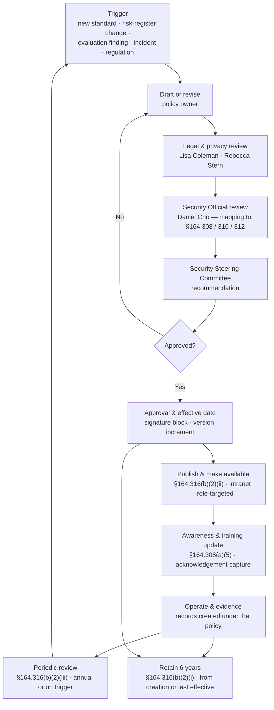

# 04.11 — Policy Suite, Procedures &amp; Documentation

| Field | Value |
|---|---|
| Document ID | MBH-ADM-DOC-2026-411 |
| Version | 1.0 |
| Date | 2026-07-15 |
| Classification | Confidential — Electronic Protected Health Information (ePHI) // Illustrative Portfolio Sample |
| Owner | Karen Boyd, Chief Compliance Officer |
| Co-Owner | Daniel Cho, Chief Information Security Officer &amp; HIPAA Security Official |
| Author | Advisory Team (Healthcare GRC / HIPAA) |
| Status | Approved |

## Purpose

This document implements **45 CFR §164.316 — Policies and Procedures and Documentation**, the provision that turns everything else in the Security Rule into something a regulator can inspect. It presents the complete **24-policy HIPAA security policy suite**, the documentation controls that govern it, and the **six-year retention** duty that applies to every artefact the programme produces.

§164.316 is not a safeguard family; it is the evidentiary backbone. **§164.316(a)** requires reasonable and appropriate **policies and procedures** to comply with the standards, implementation specifications and other requirements of Subpart C. **§164.316(b)** requires that those policies and procedures — and any **action, activity or assessment** the rule requires to be documented — be **maintained in writing**, **retained for six years**, **made available to those responsible for implementing them**, and **reviewed and updated periodically** in response to environmental or operational changes.

MercyBridge's Phase 03 baseline found the legacy policy set predated the current estate and that retention was not uniformly evidenced (**risk R-54, Moderate**). This document records the replacement: a consolidated, cross-referenced **24-policy suite** of which **15 are approved in Phase 04** and **9 accompany Phase 05**.

> **Documentation baseline: 24 policies · 15 approved 2026-07-15 · 9 in Phase 05 · six-year retention · annual review.**

## 1. What §164.316 Requires

| Provision | Requirement | R / A | MercyBridge implementation |
|---|---|---|---|
| §164.316(a) | Implement reasonable and appropriate policies and procedures to comply with Subpart C, taking account of the §164.306(b)(2) factors | Standard | 24-policy suite, each policy citation-mapped to the standard it satisfies |
| §164.316(a) (flexibility clause) | Policies may be changed at any time provided changes are documented and implemented | Standard | Versioned change history on every policy; change log in the document register |
| §164.316(b)(1)(i) | Maintain the policies and procedures **in writing** (which may be electronic) | Required | Markdown source of record under version control in `governance/` |
| §164.316(b)(1)(ii) | Where an action, activity or assessment must be documented, **maintain a written record** of it | Required | Evidence register: sanction records, training extracts, recertification attestations, test reports, evaluation reports |
| §164.316(b)(2)(i) | **Retain for six years** from the date of creation or the date last in effect, **whichever is later** | Required | Six-year retention rule applied to policies, procedures and records; legal hold overrides |
| §164.316(b)(2)(ii) | **Make available** to the persons responsible for implementing the procedures | Required | Published to the workforce intranet; role-targeted distribution; acknowledgement capture |
| §164.316(b)(2)(iii) | **Review periodically and update as needed** in response to environmental or operational changes affecting ePHI security | Required | Annual review cycle plus the eight evaluation triggers in 04.09 |

**All four §164.316(b) specifications are *required*.** There is no addressable analysis available here — a covered entity that cannot produce the written policy, or cannot show it was retained and reviewed, has failed the standard outright. This is the single most commonly cited deficiency in OCR corrective action plans, because it is the easiest thing for an investigator to test.

**The six-year clock is frequently misread.** It runs from creation **or the date the document was last in effect, whichever is later** — so a policy superseded in 2026 after nine years in force must be retained until **2032**, not 2026. MercyBridge retains superseded versions, not merely current ones.

## 2. The 24-Policy HIPAA Security Policy Suite

Every policy carries the same structure: purpose, scope, regulatory citation, policy statements, procedures or procedure references, roles, exceptions, review cycle, version history and an approval signature block with an effective date.

| # | Policy | Security Rule citation | Owner | Review cycle | Delivered |
|---|---|---|---|---|---|
| POL-01 | HIPAA Security Program &amp; Governance | §164.308(a)(2); §164.316 | Daniel Cho | Annual | **Phase 04** |
| POL-02 | Risk Analysis &amp; Risk Management | §164.308(a)(1)(ii)(A)–(B) | Daniel Cho | Annual + event-triggered | **Phase 04** |
| POL-03 | Sanction Policy | §164.308(a)(1)(ii)(C) | Karen Boyd | Annual | **Phase 04** |
| POL-04 | Information System Activity Review &amp; Audit Log | §164.308(a)(1)(ii)(D) | Daniel Cho | Annual | **Phase 04** |
| POL-05 | Workforce Security (Authorization, Clearance, Termination) | §164.308(a)(3) | Karen Boyd | Annual | **Phase 04** |
| POL-06 | Information Access Management | §164.308(a)(4) | Marcus Reed | Annual | **Phase 04** |
| POL-07 | Minimum Necessary &amp; Role-Based Access | §164.308(a)(4); §164.502(b) | Rebecca Stern | Annual | **Phase 04** |
| POL-08 | Emergency (Break-the-Glass) Access | §164.308(a)(4); §164.312(a)(2)(ii) | Dr. Samuel Ortega | Annual | **Phase 04** |
| POL-09 | Security Awareness &amp; Training | §164.308(a)(5) | Karen Boyd | Annual | **Phase 04** |
| POL-10 | Malicious Software Protection | §164.308(a)(5)(ii)(B) | Marcus Reed | Annual | **Phase 04** |
| POL-11 | Password &amp; Authentication Management | §164.308(a)(5)(ii)(D) | Marcus Reed | Annual | **Phase 04** |
| POL-12 | Security Incident Procedures | §164.308(a)(6) | Daniel Cho | Annual + event-triggered | **Phase 04** |
| POL-13 | Contingency Planning | §164.308(a)(7) | Anthony Ruiz | Annual + after each test | **Phase 04** |
| POL-14 | Evaluation &amp; Continuous Compliance | §164.308(a)(8) | Daniel Cho | Annual | **Phase 04** |
| POL-15 | Business Associate &amp; Third-Party Security | §164.308(b)(1); §164.314(a) | Lisa Coleman | Annual | **Phase 04** |
| POL-16 | Facility Access Controls &amp; Physical Security | §164.310(a)(1)–(a)(2) | Anthony Ruiz | Annual | Phase 05 |
| POL-17 | Workstation Use &amp; Workstation Security | §164.310(b); §164.310(c) | Marcus Reed | Annual | Phase 05 |
| POL-18 | Device &amp; Media Controls, Disposal &amp; Re-use | §164.310(d)(1); NIST SP 800-88 | Anthony Ruiz | Annual | Phase 05 |
| POL-19 | Technical Access Control &amp; Unique User Identification | §164.312(a)(1)–(a)(2) | Marcus Reed | Annual | Phase 05 |
| POL-20 | Audit Controls &amp; Log Management | §164.312(b) | Marcus Reed | Annual | Phase 05 |
| POL-21 | Data Integrity &amp; Person or Entity Authentication | §164.312(c)(1); §164.312(d) | Dr. Samuel Ortega | Annual | Phase 05 |
| POL-22 | Transmission Security | §164.312(e)(1)–(e)(2) | Marcus Reed | Annual | Phase 05 |
| POL-23 | Encryption &amp; Key Management | §164.312(a)(2)(iv); §164.312(e)(2)(ii) | Daniel Cho | Annual | Phase 05 |
| POL-24 | Medical Device &amp; IoMT Security | §164.310(d); §164.312 | Anthony Ruiz | Annual + on fleet change | Phase 05 |

**Coverage check.** The 15 Phase 04 policies cover all **nine §164.308 standards** and all **21 implementation specifications**. The 9 Phase 05 policies cover the **four §164.310 standards**, the **five §164.312 standards** and their specifications. POL-01 and POL-14 jointly carry **§164.316**; POL-15 carries **§164.314(a)**.

### 2.1 Consolidation from the Legacy Set

| Measure | Legacy estate (Phase 03 baseline) | 2026 suite |
|---|---|---|
| Distinct security policy documents | 41, authored 2011–2021 across three functions | **24**, single register |
| Documents with a stated Security Rule citation | 12 of 41 | 24 of 24 |
| Documents with an owner and a review date | 17 of 41 | 24 of 24 |
| Documents with evidenced six-year retention | Not uniformly evidenced (**R-54**) | Retention rule applied to all, superseded versions preserved |
| Contradictory or duplicated provisions | 9 identified conflicts | 0 — resolved during consolidation |
| Workforce access | Scattered across three intranet locations | Single published register with acknowledgement capture |

## 3. Policy Lifecycle

| Lifecycle stage | Control | Evidence produced |
|---|---|---|
| Draft / revise | Named owner; standard template; citation map | Draft with tracked change history |
| Review | Legal, privacy and Security Official sign-off | Review record with reviewer and date |
| Approve | Security Steering Committee recommendation; Security Official approval | Signature page with effective date |
| Publish | Intranet publication within 5 business days of approval | Publication record; access log |
| Communicate | Role-targeted notification; incorporation into training | Acknowledgement register |
| Operate | The policy generates records (sanctions, attestations, tests) | The evidence register in §5 |
| Review | Annual, or on any of the eight 04.09 triggers | Review attestation, even where "no change" |
| Supersede | Version increment; prior version archived, not deleted | Superseded version with its own retention clock |

**A "no change" review is still a review.** Where the annual review concludes that a policy requires no amendment, the reviewer records that conclusion with a date and signature. An unchanged effective date with no review record is indistinguishable, to an investigator, from a policy nobody looked at.

## 4. Documentation Hierarchy

MercyBridge separates four document classes so that a change to an operating detail does not require a governance approval cycle, and a change to an obligation does.

| Tier | Class | Answers | Approval | Example | Count |
|---|---|---|---|---|---|
| 1 | **Policy** | *What must be true, and under what authority?* | Security Official + Steering Committee | POL-06 Information Access Management | 24 |
| 2 | **Procedure / standard** | *How is it done, by whom, to what threshold?* | Policy owner | Joiner–mover–leaver runbook; activity review runbook | 31 |
| 3 | **Work instruction / runbook** | *Step by step, in this system* | Function manager | Halcyon access provisioning steps; clinical downtime kit checklist | 46 |
| 4 | **Record / evidence** | *What actually happened, when, and who did it* | Generated by operation | Sanction register entry; training extract; restoration test report | Continuous |

All four tiers are subject to §164.316(b)(2)(i). The six-year duty attaches to the **record** as firmly as to the policy — and it is the records that OCR asks for first.

## 5. Retention and Availability

| Evidence class | Examples | Retention rule | Custodian |
|---|---|---|---|
| Policies | POL-01 … POL-24, including superseded versions | 6 years from creation or last effective date, whichever is later | Karen Boyd |
| Procedures &amp; runbooks | JML, recertification, activity review, downtime, IR | 6 years | Policy owner |
| Risk documentation | Risk analysis, 56-risk register, treatment plan, acceptances | 6 years | Michelle Tran |
| Workforce records | Training completion, phishing results, acknowledgements, sanction records | 6 years | Karen Boyd |
| Access records | Recertification attestations, break-glass reviews, termination revocations | 6 years | Marcus Reed |
| Operational records | Activity review outputs, incident register, contingency test reports, backup assurance | 6 years | Marcus Reed / Anthony Ruiz |
| Contracts | BAAs, MOUs and amendments (~180 relationships) | 6 years from termination of the agreement | Lisa Coleman |
| Assessment records | Evaluation reports, penetration tests, HITRUST, internal audit | 6 years | Daniel Cho |
| Governance records | Steering Committee and Board committee minutes; ADRs | 6 years | Karen Boyd |

**Availability (§164.316(b)(2)(ii)).** Policies are published to the whole workforce (~6,500 members). Procedures are role-targeted: a ward clerk sees the downtime procedure, not the firewall standard. Availability is evidenced by the intranet access log and the acknowledgement register — publication without evidence of reach does not satisfy the specification.

**Interaction with other retention duties.** The six-year HIPAA rule is a **floor**, not a ceiling. State medical-record retention, litigation hold, CMS conditions of participation and the Network's own records schedule may each require longer. Where they conflict, the longest applicable period governs, and legal hold suspends destruction entirely.

## 6. 2025 NPRM Impact on Documentation

| Area | In force today | If the NPRM is finalised | MercyBridge position |
|---|---|---|---|
| Addressable vs required | 11 of the 21 §164.308 specifications are addressable | Distinction **removed**; all specifications mandatory subject to narrow documented exceptions | All 11 already implemented; no rationale documents to retire |
| Policy review cadence | "Periodically" | Explicit periodic (annual) review and update obligation | Annual cycle already in POL-01 and POL-14 |
| Asset inventory &amp; network map | Not expressly required | Required and maintained | Delivered in Phase 02, maintained under POL-01 |
| Written verification from business associates | Not required | Annual written verification of safeguards | POL-15 attestation cycle already in place for the 24 critical BAs |
| Documentation of technical controls | Implicit | Explicit for MFA, encryption, segmentation, testing | POL-19, POL-22, POL-23 drafted to that standard in Phase 05 |

## 7. Evidence Produced

| Evidence artefact | Location | Owner |
|---|---|---|
| The 24-policy suite (15 signed; 9 drafted for Phase 05) | `governance/POL-01 … POL-24` | Karen Boyd |
| Master document register with citation map | `trackers/policy-register.xlsx` | Karen Boyd |
| Policy approval and signature pages | `governance/policy-approvals.md` | Daniel Cho |
| Annual policy review attestations | `logs/policy-review-log.md` | Karen Boyd |
| Workforce acknowledgement register | `trackers/policy-acknowledgements.xlsx` | Karen Boyd |
| Retention schedule and legal-hold register | `governance/retention-schedule.md` | Lisa Coleman |
| Superseded policy archive (legacy 41 documents) | `governance/archive/` | Karen Boyd |
| Policy template | `templates/hipaa-security-policy.md` | Karen Boyd |

## Cross-References

| Reference | Relevance |
|---|---|
| 01.05 — Security Official Designation &amp; Governance | Approval authority for the policy suite |
| 03.04 — Existing Controls Assessment | Baseline finding on the legacy 41-document set |
| 03.07 — Risk Register | R-54 (policy currency and retention), R-38 (governed channels) |
| 04.01 — Administrative Safeguards Overview | The nine standards and 21 specifications the 15 policies cover |
| 04.02 → 04.10 | The standard-level documents each policy formalises |
| 04.09 — Evaluation | §164.316(b)(2)(iii) review triggers and the annual evaluation |
| 04.12 — Control-to-Risk Traceability | Policy-to-risk mapping across the register |
| 04.13 — Phase Summary &amp; Transition | Confirmation that 15 of 24 policies are approved |
| Phase 05 — Physical &amp; Technical Safeguards | POL-16 … POL-24 and their standards |
| Phase 06 — Business Associate &amp; Third-Party Risk | Contract retention and BA attestation records |
| Phase 08 — HITRUST &amp; Independent Assessment | Documentation tested against the OCR Audit Protocol |

---
[⬅ Previous](04.10-business-associate-contracts.md) · [🏠 Phase README](04.00-README.md) · [Next ➡](04.12-control-to-risk-traceability.md)
