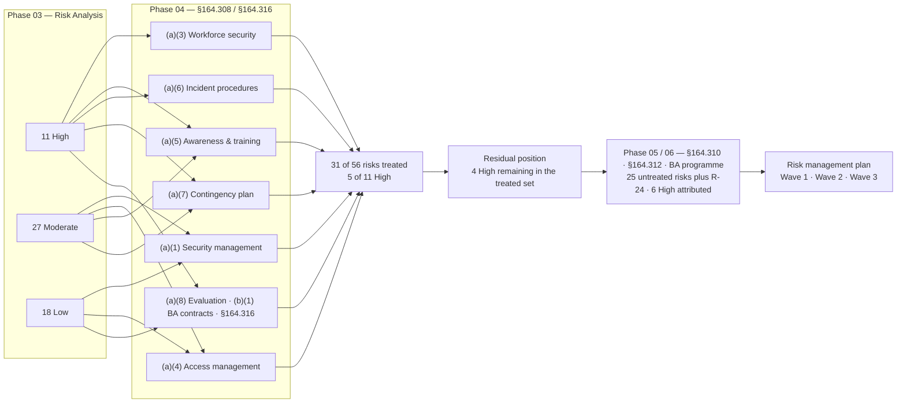

# 04.12 — Control-to-Risk Traceability

| Field | Value |
|---|---|
| Document ID | MBH-ADM-TRC-2026-412 |
| Version | 1.0 |
| Date | 2026-07-15 |
| Classification | Confidential — Electronic Protected Health Information (ePHI) // Illustrative Portfolio Sample |
| Owner | Daniel Cho, Chief Information Security Officer &amp; HIPAA Security Official |
| Co-Owner | Michelle Tran, VP Enterprise Risk (risk register custodian) |
| Author | Advisory Team (Healthcare GRC / HIPAA) |
| Status | Approved |

## Purpose

This document is the **proof of work** for Phase 04. It traces every administrative safeguard implemented under **45 CFR §164.308** and **§164.316** back to the specific risks it treats in the **56-risk register** produced by the Phase 03 risk analysis, and forward to the residual rating that risk carries at the close of this phase.

Traceability is not an administrative nicety. **§164.308(a)(1)(ii)(B)** requires a covered entity to *"implement security measures sufficient to reduce risks and vulnerabilities to a reasonable and appropriate level."* That is a **sufficiency** test, and sufficiency can only be argued where the link between the identified risk and the implemented measure is explicit, documented and reviewable. A control set that cannot be mapped to risk is a control set chosen for some other reason — habit, vendor availability, or a checklist — and OCR reads it that way.

> **Phase 04 traceability: 9 standards · 21 implementation specifications · 15 policies · 31 of 56 risks treated · 5 of 11 High risks treated.**

## 1. How to Read the Matrix

| Column | Meaning |
|---|---|
| Risk ID / rating | The permanent identifier and Phase 03 rating from the 03.07 register. Score = L × I, with patient-safety escalations ESC-1 to ESC-3 applied |
| Treating standard | The §164.308 or §164.316 standard and specification whose implementation reduces the risk |
| Phase 04 instrument | The document in this phase that delivers the measure, and the governing policy |
| Residual | The rating carried at the close of Phase 04, after administrative treatment only |
| Onward | Where the remaining exposure is closed — Phase 05 technical controls, the Wave 1–3 risk management plan, or a later phase |

**Rating bands** (unchanged from 03.05): **High** 15–25 · **Moderate** 8–12 · **Low** 1–6.

**Honesty rule.** A risk is recorded as *treated* where an administrative measure materially changes its likelihood, its impact, or the organisation's ability to detect and respond. Treatment is **not** the same as closure. Several High risks retain a High residual at the close of Phase 04 because their determinative controls — MFA, encryption, segmentation, device lifecycle — are technical and are delivered in Phase 05 under Waves 1 to 3. This matrix states that plainly rather than claiming reductions the administrative family cannot deliver.

## 2. Standard-to-Risk Coverage Summary

| # | §164.308 standard | Specs (R / A) | Phase 04 doc | Risks treated | Of which High |
|---|---|---|---|---|---|
| 1 | Security Management Process — §164.308(a)(1) | 4 (4 R) | 04.02 | R-36, R-54, R-55, R-56 | — |
| 2 | Assigned Security Responsibility — §164.308(a)(2) | 0 (standard R) | 04.03 | R-54, R-56 | — |
| 3 | Workforce Security — §164.308(a)(3) | 3 (3 A) | 04.04 | R-02, R-03, R-04, R-39, R-52 | R-02 |
| 4 | Information Access Management — §164.308(a)(4) | 3 (1 R, 2 A) | 04.05 | R-03, R-05, R-06, R-08, R-32, R-36 | — |
| 5 | Security Awareness &amp; Training — §164.308(a)(5) | 4 (4 A) | 04.06 | R-26, R-34, R-35, R-37, R-38, R-39, R-51 | R-34 |
| 6 | Security Incident Procedures — §164.308(a)(6) | 1 (1 R) | 04.07 | R-23, R-24, R-31, R-46 | R-23, (R-24) |
| 7 | Contingency Plan — §164.308(a)(7) | 5 (3 R, 2 A) | 04.08 | R-10, R-23, R-28, R-43, R-47, R-48, R-49, R-50, R-53 | R-10, R-23, R-28 |
| 8 | Evaluation — §164.308(a)(8) | 0 (standard R) | 04.09 | R-36, R-54, R-55 | — |
| 9 | Business Associate Contracts — §164.308(b)(1) | 1 (1 R) | 04.10 | R-28, R-31, R-32 | R-28 |
| — | Policies &amp; Documentation — §164.316 | 5 (5 R) | 04.11 | R-38, R-54 | — |
| | **Distinct risks touched** | **21 specs** | | **31 of 56** | **5 of 11** |

**Counting notes.**
1. **31 distinct risks**, not the sum of the rows — several risks are treated by more than one standard (R-36 by three, R-54 by four, R-23 by two).
2. **5 of 11 High risks are counted as treated in Phase 04**: **R-02, R-10, R-23, R-28, R-34**. **R-24** (double-extortion exfiltration) appears in the matrix because §164.308(a)(6) improves detection and response, but its determinative controls are encryption at rest and data-loss prevention; it is therefore **attributed to Phase 05** along with R-01, R-09, R-11, R-17 and R-40.
3. The remaining **25 of 56 risks** are network, device, encryption, transmission and physical risks whose treating standards sit in §164.310 and §164.312 — Phase 05.

## 3. The Traceability Matrix — 31 Risks Treated in Phase 04

| Risk | Phase 03 rating | Risk in brief | Treating standard(s) | Phase 04 instrument | Policy | Residual at phase close | Onward |
|---|---|---|---|---|---|---|---|
| **R-02** | **High (16)** | Shared / generic clinical logins destroy audit attribution | §164.308(a)(3)(ii)(A)–(B); (a)(1)(ii)(C)–(D) | 04.04 authorisation and clearance; named-account remediation; sanction exposure | POL-05, POL-03, POL-04 | **Moderate (12)** | Technical unique user ID §164.312(a)(2)(i) — Phase 05, Wave 1 |
| **R-10** | **High (15)** | Malware into device VLANs halts clinical devices (ESC-1) | §164.308(a)(7)(i)–(ii)(A)–(E) | 04.08 criticality analysis, emergency mode operation, device downtime procedures | POL-13 | **High (15)** — consequence managed, likelihood unchanged | Micro-segmentation and device lifecycle — Phase 05, Wave 3 |
| **R-23** | **High (20)** | Enterprise ransomware encrypts Tier 1 clinical systems (ESC-2) | §164.308(a)(6)(ii); (a)(7)(ii)(A)–(D) | 04.07 SEV-1 path; 04.08 immutable backup, clean-build recovery, full-scale restoration test | POL-12, POL-13 | **High (15)** | EDR, segmentation — Phase 05, Wave 1 |
| **R-24** | **High (16)** | Double-extortion exfiltration before encryption | §164.308(a)(6)(ii) | 04.07 detection, scoping and 4-factor interface | POL-12 | **High (16)** | Encryption at rest and DLP — **Phase 05, Wave 2** (attributed there) |
| **R-28** | **High (15)** | Halcyon EHR compromise or extended outage — 2.1M records (ESC-2) | §164.308(b)(1); (a)(7)(ii)(C) | 04.10 BAA security, DR and notification clauses; 04.08 hosted-EHR downtime procedures | POL-15, POL-13 | **High (15)** | Tested BA assurance — **Phase 06**; Wave 3 |
| **R-34** | **High (15)** | Phishing / BEC compromises mailboxes containing ePHI | §164.308(a)(5)(i)–(ii)(A)–(D) | 04.06 training to 100%, phishing simulation, reporting culture, reminders | POL-09, POL-11 | **Moderate (9)** | MFA (R-01) — Phase 05, Wave 1 |
| R-03 | Moderate (12) | 214 standing elevated EHR accounts | §164.308(a)(4)(ii)(B)–(C); (a)(3)(ii)(A) | 04.05 least privilege, quarterly recertification; 04.04 authorisation | POL-06, POL-07 | Moderate (8) | Privileged access tooling — Phase 05 |
| R-04 | Moderate (12) | Access retained >24h after departure or transfer | §164.308(a)(3)(ii)(C) | 04.04 joiner–mover–leaver SLA, automated deprovisioning, exception log | POL-05 | **Low (6)** | Closed in Phase 04; monitored quarterly |
| R-05 | Moderate (9) | Break-glass used without retrospective review | §164.308(a)(4)(ii)(B); (a)(1)(ii)(D) | 04.05 break-the-glass workflow; 100% retrospective review within 72h | POL-08, POL-04 | **Low (6)** | Emergency access procedure §164.312(a)(2)(ii) — Phase 05 |
| R-06 | Moderate (8) | 742 devices with under-reviewed vendor remote support | §164.308(a)(4)(ii)(B)–(C); (b)(1) | 04.05 vendor entitlement review; 04.10 contractual access limits | POL-06, POL-15 | Moderate (8) | NAC and session brokering — Phase 05; monitoring — Phase 06 |
| R-08 | Low (4) | Patient-portal proxy relationships not recertified | §164.308(a)(4)(ii)(C) | 04.05 proxy recertification cycle | POL-06 | **Low (2)** | Closed in Phase 04 |
| R-26 | Moderate (9) | Macro / script initial access from email attachments | §164.308(a)(5)(ii)(B); (a)(6)(ii) | 04.06 malicious-software protection and simulation; 04.07 reporting | POL-10, POL-09 | **Low (6)** | EDR coverage (R-25) — Phase 05 |
| R-31 | Moderate (8) | BA breach notice too late for the 60-day duty | §164.308(b)(1); (a)(6)(ii) | 04.10 five-day contractual notice clock; 04.07 intake path | POL-15, POL-12 | Moderate (8) | BA monitoring — **Phase 06**; notification — Phase 07 |
| R-32 | Low (6) | Offshore support access exceeds minimum necessary | §164.308(a)(4); (b)(1) | 04.05 minimum necessary; 04.10 data-set reduction clause | POL-07, POL-15 | Low (6) | Offshore access review — **Phase 06** |
| R-35 | Moderate (12) | Misdirected fax, email, statement or records release | §164.308(a)(5)(i)–(ii)(A) | 04.06 targeted training, recipient verification, reminders | POL-09, POL-07 | Moderate (9) | Outbound DLP — Phase 05 |
| R-36 | Moderate (12) | Workforce browses records without a TPO purpose | §164.308(a)(1)(ii)(C)–(D); (a)(4); (a)(8) | 04.02 activity review across all 68 systems and sanction linkage; 04.09 evaluation | POL-04, POL-03, POL-07 | Moderate (8) | Audit controls §164.312(b) — Phase 05 |
| R-37 | Moderate (9) | 91% training completion; thin role-based clinical content | §164.308(a)(5)(i) | 04.06 role-based tracks, clinician curriculum, 100% completion standard | POL-09 | **Low (4)** | Closed in Phase 04; measured quarterly |
| R-38 | Low (6) | Unsanctioned messaging apps carry clinical information | §164.308(a)(5)(ii)(A); §164.316(a) | 04.06 reminders and sanctioned-channel guidance; 04.11 policy currency | POL-09, POL-01 | **Low (4)** | Transmission security §164.312(e) — Phase 05 |
| R-39 | Low (4) | Service desk social-engineered into a credential reset | §164.308(a)(3)(ii)(A); (a)(5)(ii)(D) | 04.04 identity verification protocol; 04.06 service-desk training | POL-05, POL-11 | **Low (2)** | Closed in Phase 04 |
| R-43 | Moderate (9) | Clinical data integrity degraded — wrong-patient, duplicates, interface corruption (ESC-3) | §164.308(a)(7)(ii)(E); (a)(1)(ii)(D) | 04.08 applications and data criticality analysis; downtime reconciliation | POL-13, POL-04 | Moderate (9) | Integrity controls §164.312(c)(1) — Phase 05 |
| R-46 | Low (4) | Incidental ePHI in logs, SIEM and non-production | §164.308(a)(6)(ii); (a)(1)(ii)(D) | 04.07 handling rules for evidence containing ePHI | POL-12, POL-04 | Low (4) | Non-production data handling — Phase 05 |
| R-47 | Moderate (12) | Tier 1 restoration time never validated at full scale | §164.308(a)(7)(ii)(A)–(D) | 04.08 full-scale restoration test, RTO/RPO validation, after-action report | POL-13 | Moderate (8) | Retested annually under 04.09 |
| R-48 | Moderate (8) | Backup immutability incomplete for nine Tier 2–3 systems | §164.308(a)(7)(ii)(A) | 04.08 backup standard, immutability requirement, dated remediation tickets | POL-13 | Moderate (8) | Wave 2 — 2027-01-31 |
| R-49 | Moderate (9) | Downtime procedures unexercised at ~30 outpatient sites | §164.308(a)(7)(ii)(C)–(D) | 04.08 site downtime exercises, downtime kits, kit inspection log | POL-13 | **Low (6)** | Rolling three-year site exercise cycle |
| R-50 | Low (6) | Single-path connectivity at four outpatient sites | §164.308(a)(7)(ii)(C) | 04.08 emergency mode operation for isolated sites | POL-13 | Low (6) | Carrier diversity — FY2027 capital |
| R-51 | Moderate (9) | Unattended logged-in workstations in clinical areas | §164.308(a)(5)(ii)(A) | 04.06 security reminders, clinical area campaign, observation rounds | POL-09 | Moderate (9) | Automatic logoff §164.312(a)(2)(iii); workstation security §164.310(b)–(c) — Phase 05 |
| R-52 | Low (6) | Tailgating and badge-sharing into clinical space and IDFs | §164.308(a)(3)(ii)(A)–(B); (a)(5)(ii)(A) | 04.04 clearance and supervision; 04.06 awareness | POL-05, POL-09 | Low (6) | Facility access controls §164.310(a)(1) — Phase 05 |
| R-53 | Low (4) | Flood, fire or extended power loss disables a site | §164.308(a)(7)(i)–(ii)(B) | 04.08 disaster recovery plan and site failover | POL-13 | Low (4) | Facility and environmental controls §164.310(a)(2) — Phase 05 |
| R-54 | Moderate (9) | Legacy policy suite; §164.316(b) retention unevidenced | §164.316(a)–(b); (a)(1); (a)(2); (a)(8) | 04.11 24-policy suite, retention schedule, review cycle; 04.03 governance | POL-01, POL-14 | **Low (6)** | Closes when POL-16 … POL-24 are approved in Phase 05 |
| R-55 | Low (6) | Activity review not evidenced for 19 systems | §164.308(a)(1)(ii)(D); (a)(8) | 04.02 activity review runbook extended to all 68 systems; 04.09 evaluation | POL-04, POL-14 | **Low (4)** | Audit controls §164.312(b) log fidelity — Phase 05 |
| R-56 | Low (4) | Sanction application not consistently documented | §164.308(a)(1)(ii)(C); (a)(2) | 04.02 sanction register, tiered matrix, HR reconciliation; 04.03 ownership | POL-03 | **Low (2)** | Closed in Phase 04 |

## 4. Movement Summary

| Band at Phase 03 | Risks in the treated set | Reduced a band | Reduced within band | Rating unchanged — treatment recorded, closure dependent on a later phase |
|---|---|---|---|---|
| High | **6** — R-02, R-10, R-23, R-24, R-28, R-34 | **2** → Moderate: R-02, R-34 | 1: R-23 (20 → 15) | 3: R-10, R-24, R-28 |
| Moderate | **15** | **6** → Low: R-04, R-05, R-26, R-37, R-49, R-54 | 4: R-03, R-35, R-36, R-47 | 5: R-06, R-31, R-43, R-48, R-51 |
| Low | **10** | — | 5: R-08, R-38, R-39, R-55, R-56 | 5: R-32, R-46, R-50, R-52, R-53 |
| **Total** | **31** | **8 band reductions** | **10 within-band reductions** | **13 held** |

**Administratively complete.** Five risks require no further work in any later phase because their treating measures are wholly administrative and now operating: **R-04** (termination SLA), **R-08** (proxy recertification), **R-37** (training completion and role-based tracks), **R-39** (service-desk verification) and **R-56** (sanction documentation). Each remains under quarterly measurement rather than being retired from the register.

**Overall posture at the close of Phase 04 remains Moderate.** That is the correct answer, not a disappointing one: the six risks that dominate the aggregate score — R-01 MFA, R-09 unsupported device OS, R-11 device encryption, R-17 segmentation, R-24 exfiltration, R-40 encryption at rest — are technical and are addressed in Phase 05 under Waves 1 to 3. Posture moves to **Low-to-Moderate** on completion of Wave 2, as forecast in 03.08.

## 5. Risks Not Treated in Phase 04

| Category | Risks | Reason | Treating phase |
|---|---|---|---|
| Access control (technical) | R-01, R-07 | MFA and automatic logoff are §164.312(a) controls | Phase 05 — Wave 1 |
| Medical device &amp; IoMT | R-09, R-11, R-12, R-13, R-14, R-15, R-16 | Device lifecycle, encryption and credential management | Phase 05 — Wave 3 |
| Network &amp; infrastructure | R-17, R-18, R-19, R-20, R-21, R-22 | Segmentation, firewall hygiene, wireless separation | Phase 05 — Wave 2 |
| Malware &amp; endpoint | R-25, R-27 | EDR coverage and removable-media control | Phase 05 |
| Business associate | R-29, R-30, R-33 | Due diligence, subcontractor chain, offboarding evidence | **Phase 06** |
| Data protection | R-40, R-41, R-42, R-44, R-45 | Encryption at rest and in transit, discovery, sanitisation, retention | Phase 05 — Wave 2 |
| **Total** | **25 of 56** | | |

Five of the eleven High risks sit entirely outside Phase 04 — **R-01, R-09, R-11, R-17, R-40** — and **R-24** is attributed to Phase 05 as explained in §2. Together with the 31 treated here, the register reconciles: **31 + 25 = 56**, and **5 + 6 = 11 High**.

## 6. Assurance Over the Matrix

| Assurance layer | Activity | Owner | Timing |
|---|---|---|---|
| First line | Control owners attest that the mapped measure is operating | Named owners in §3 | Quarterly |
| Second line | Risk register reconciliation — every treated risk has an evidenced measure | Michelle Tran | Quarterly |
| Second line | Evaluation of the mapping against the standards | Daniel Cho / Marcus Reed | Annual — 04.09 |
| Third line | Internal audit tests a sample of mappings to source evidence | Priya Anand | 2026 Q4 |
| Independent | HITRUST i1 and OCR Audit Protocol walkthrough | Beacon Assurance | 2026 Q4 |
| Board | Residual position and Wave progress reported | Robert Feldman | Quarterly |

## Cross-References

| Reference | Relevance |
|---|---|
| 03.05 — Likelihood, Impact &amp; Risk Determination | The scoring model and ESC-1 to ESC-3 escalations used for residual ratings |
| 03.07 — Risk Register | The authoritative 56-risk source for every row above |
| 03.08 — Risk Management Plan | Wave 1–3 sequencing, owners and board-approved exceptions |
| 04.01 — Administrative Safeguards Overview | The nine standards and 21 specifications traced here |
| 04.02 → 04.11 | The instruments named in the matrix |
| 04.13 — Phase Summary &amp; Transition | Phase closure built on this traceability |
| Phase 05 — Physical &amp; Technical Safeguards | The 25 untreated risks and 6 remaining High risks |
| Phase 06 — Business Associate &amp; Third-Party Risk | R-29, R-30, R-33 |
| Phase 08 — HITRUST &amp; Independent Assessment | Independent testing of the mappings |
| Phase 09 — Executive Reporting &amp; Programme Maturity | Residual risk trajectory to Low-to-Moderate |

---
[⬅ Previous](04.11-policy-suite-and-documentation.md) · [🏠 Phase README](04.00-README.md) · [Next ➡](04.13-phase-summary-and-transition.md)
