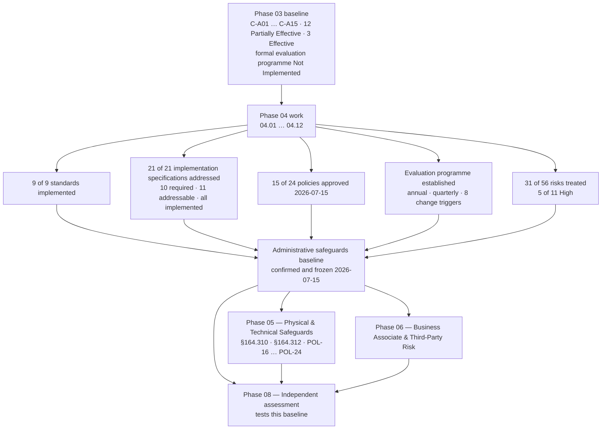

# 04.13 — Phase Summary &amp; Transition

| Field | Value |
|---|---|
| Document ID | MBH-ADM-SUM-2026-413 |
| Version | 1.0 |
| Date | 2026-07-15 |
| Classification | Confidential — Electronic Protected Health Information (ePHI) // Illustrative Portfolio Sample |
| Owner | Daniel Cho, Chief Information Security Officer &amp; HIPAA Security Official |
| Co-Owner | Karen Boyd, Chief Compliance Officer |
| Author | Advisory Team (Healthcare GRC / HIPAA) |
| Status | Approved |

## Purpose

This document closes **Phase 04 — Administrative Safeguards (§164.308)**. It records what was delivered, confirms conformance standard by standard, states the risk position carried out of the phase, lists the items leaving the phase open, and hands the programme to **Phase 05 — Physical &amp; Technical Safeguards (§164.310 / §164.312)**.

A phase closure statement is not a status update. It is the point at which the Security Official asserts, on the record and in writing, that a family of the HIPAA Security Rule is implemented at MercyBridge Health Network — and identifies precisely where it is not yet sufficient. That assertion is retained for six years under §164.316(b)(2)(i) and is the document an OCR investigator or a HITRUST assessor reads first.

> **Phase 04 outcome: 9 of 9 §164.308 standards implemented · 21 of 21 implementation specifications addressed · 15 of 24 policies approved · evaluation programme established · 31 of 56 risks treated, including 5 of 11 High.**

## 1. What Phase 04 Delivered

| Document | Standard | Principal deliverables |
|---|---|---|
| 04.01 | All nine | Standard-to-document map; the addressable doctrine and ADR-0008 determination |
| 04.02 | §164.308(a)(1) | Sanction policy and register; information system activity review extended to all 68 ePHI systems |
| 04.03 | §164.308(a)(2) | Security Official role in operation; team structure, delegation, emergency authority, board reporting |
| 04.04 | §164.308(a)(3) | Joiner–mover–leaver lifecycle; clearance procedure; 24-hour termination SLA with exception log |
| 04.05 | §164.308(a)(4) | Role-based access model; minimum necessary; break-the-glass with 72-hour review; quarterly recertification |
| 04.06 | §164.308(a)(5) | Annual and role-based training to a 100% standard; phishing simulation; reminders; password management |
| 04.07 | §164.308(a)(6) | Incident definition, detection, triage, severity model and documentation; interface to Phase 07 |
| 04.08 | §164.308(a)(7) | Backup standard, disaster recovery plan, emergency mode operation, test calendar, criticality analysis over 68 systems |
| 04.09 | §164.308(a)(8) | Evaluation programme: annual technical and non-technical cycle, eight change triggers, evaluation calendar |
| 04.10 | §164.308(b)(1) | BAA template with all §164.314(a) clauses; ~180-entity register; 24 critical; 3 BAAs remediated |
| 04.11 | §164.316 | The 24-policy suite (15 approved); documentation hierarchy; six-year retention schedule |
| 04.12 | — | Traceability matrix: 31 risks mapped to treating standards with residual ratings |
| **04.13** | — | This closure statement and the Phase 05 handover |

## 2. Conformance Confirmation — All Nine Standards

| # | Standard | Citation | Specs (R / A) | Baseline rating | Phase 04 rating | Basis |
|---|---|---|---|---|---|---|
| 1 | Security Management Process | §164.308(a)(1) | 4 (4 R) | C-A01 – C-A04 Partially Effective | **Effective** | Risk analysis current (Phase 03); register owned; sanctions documented; activity review across 68 systems |
| 2 | Assigned Security Responsibility | §164.308(a)(2) | standard R | C-A05 **Effective** | **Effective** | Daniel Cho designated; charter, delegation and board line operating (ADR-0003) |
| 3 | Workforce Security | §164.308(a)(3) | 3 (3 A) | C-A06 Partially Effective | **Effective** | All three addressable specifications implemented; termination SLA evidenced |
| 4 | Information Access Management | §164.308(a)(4) | 3 (1 R, 2 A) | C-A07 Partially Effective | **Effective** | Clearinghouse isolation N/A and documented; authorisation and modification procedures live; recertification cycle running |
| 5 | Security Awareness &amp; Training | §164.308(a)(5) | 4 (4 A) | C-A08, C-A10 Partially Effective; C-A09, C-A11 Effective | **Effective** | Four addressable specifications implemented; completion standard raised from 91% to 100% |
| 6 | Security Incident Procedures | §164.308(a)(6) | 1 (1 R) | C-A12 Partially Effective | **Effective** | Documented response and reporting procedure; incident register; Phase 07 extends to full IR plan |
| 7 | Contingency Plan | §164.308(a)(7) | 5 (3 R, 2 A) | C-A13 Partially Effective | **Effective** | Backup, DR, emergency mode, testing and criticality analysis all in force; restoration validated at scale |
| 8 | Evaluation | §164.308(a)(8) | standard R | C-A14 Partially Effective; formal programme **Not Implemented** | **Effective** | POL-14, charter, calendar and eight change triggers established; first full cycle in Phase 08 |
| 9 | Business Associate Contracts | §164.308(b)(1) | 1 (1 R) | C-A15 Partially Effective | **Effective (contractual)** | 47 of 47 BA-involved systems covered following remediation of MBH-SYS-029, -033, -058; assurance programme in Phase 06 |
| — | Policies &amp; Documentation | §164.316 | 5 (5 R) | Legacy suite; retention unevidenced (R-54) | **Effective for §164.308** | 15 of 24 policies approved; retention schedule and review cycle in force |

**Addressable determination.** All **11 addressable** implementation specifications in §164.308 were assessed as reasonable and appropriate for an organisation of MercyBridge's size, complexity and risk profile — 4 hospitals, ~30 outpatient sites, ~6,500 workforce members, 68 ePHI systems, ~2.1 million patient records — and **all 11 are implemented**. No §164.306(d)(3)(ii) alternative-measure rationale is carried for this family. Recorded in **ADR-0008**.

**2025 NPRM position.** Because every addressable specification is implemented, the proposed removal of the addressable/required distinction creates **no remediation obligation** for §164.308 at MercyBridge. The programme is built to the stricter of the in-force and proposed standards by deliberate decision (**ADR-0002**).

## 3. Baseline Confirmed

| Baseline element | Confirmed position at 2026-07-15 | Evidence |
|---|---|---|
| Standards | 9 of 9 §164.308 standards implemented | 04.02 – 04.10 evidence registers |
| Implementation specifications | 21 of 21 addressed — 10 required, 11 addressable, all implemented | ADR-0008; 04.01 §2 |
| Policies | 15 of 24 approved and effective; 9 drafted for Phase 05 | `trackers/policy-register.xlsx` |
| Procedures and runbooks | 31 procedures, 46 runbooks published and role-targeted | Document register |
| Evaluation | Programme established; first full cycle Q3–Q4 2026 | POL-14; evaluation calendar |
| Business associates | ~180 in register; 24 critical; 3 BAAs remediated in 2026-07 | BA register; remediation tracker |
| Risk treatment | 31 of 56 risks treated; 8 band reductions; overall posture **Moderate** | 04.12 traceability matrix |
| Retention | Six-year rule applied to all policies, procedures and records | Retention schedule |

## 4. Risk Position Leaving Phase 04

| Measure | Phase 03 | Phase 04 close | Movement |
|---|---|---|---|
| Total registered risks | 56 | 56 | No new risks identified during implementation |
| High | 11 | **9** | R-02 and R-34 reduced to Moderate |
| Moderate | 27 | **27** | 2 in from High; 6 out to Low; net unchanged |
| Low | 18 | **20** | R-04, R-05, R-26, R-37, R-49, R-54 reduced from Moderate |
| Overall posture | Moderate | **Moderate** | Moves to Low-to-Moderate on Wave 2 completion (2027-01-31) |
| Risks with an operating treating control | 0 formally traced | **31** | 04.12 matrix |

The nine remaining High risks are **R-01** (MFA), **R-09** (unsupported device OS), **R-10** (device VLAN propagation), **R-11** (device encryption), **R-17** (segmentation), **R-23** (enterprise ransomware), **R-24** (exfiltration), **R-28** (EHR concentration) and **R-40** (encryption at rest). Every one of them is now governed by an administrative measure — a policy, an owner, a contingency plan, an incident path — but **none of them is closed by administration alone**. That is the honest summary of what an administrative safeguards phase can and cannot achieve.

## 5. Open Items Leaving Phase 04

| # | Open item | Owner | Target | Governance |
|---|---|---|---|---|
| 1 | Nine policies POL-16 … POL-24 remain in draft | Karen Boyd | Phase 05 | Steering Committee approval |
| 2 | First full §164.308(a)(8) evaluation cycle not yet executed | Daniel Cho | 2026 Q3–Q4 | Evaluation calendar |
| 3 | Backup immutability incomplete for nine Tier 2–3 systems (R-48) | Anthony Ruiz | 2027-01-31 | Wave 2, board-approved exception |
| 4 | Subcontractor chain unmapped for nine hosted services (R-30) | Lisa Coleman | Phase 06 | BA programme |
| 5 | 3 of 24 critical BAs without a current independent assessment report | Daniel Cho | Phase 06 | BA assurance tracker |
| 6 | Outpatient downtime exercises on a three-year rotation; 11 sites still to exercise | Dr. Samuel Ortega | 2027-06-30 | Contingency test calendar |
| 7 | Waves 2 and 3 carry board-approved exceptions to the 90-day High-risk standard | Daniel Cho | 2027-01-31 / 2027-06-30 | Quarterly Board committee review |
| 8 | Activity review tuning — false-positive rate on two Tier 1 use cases | Marcus Reed | 2026 Q4 | ADR-0009 scope review |

None of these open items prevents the phase from closing. Each has a named owner, a dated target and a governance forum, which is the standard the Security Steering Committee applies to phase closure.

## 6. Handover to Phase 05

| Phase 05 needs | Supplied by Phase 04 | Where |
|---|---|---|
| A governing management system for technical controls | Nine implemented §164.308 standards | 04.01 – 04.10 |
| Policy architecture and numbering | POL-16 … POL-24 slots defined with citations, owners and review cycles | 04.11 §2 |
| The remaining risk set | 25 untreated risks plus R-24, including 6 High | 04.12 §5 |
| Access-control intent to enforce technically | Role-based model, minimum necessary, break-glass, recertification | 04.05 |
| Audit-control requirements to configure | Activity review scope, cadence and use cases across 68 systems | 04.02 |
| Availability targets to engineer to | Four-tier criticality analysis with RTO and RPO per system | 04.08 |
| Incident detection requirements | Severity model and detection sources | 04.07 |
| Evaluation scope to enter | §164.310 and §164.312 added to the evaluation workbook | 04.09 |
| Retention and evidence discipline | Six-year rule, documentation hierarchy, evidence register | 04.11 |

| Phase 05 scope | Content |
|---|---|
| §164.310 Physical Safeguards | Facility access controls; workstation use; workstation security; device and media controls |
| §164.312 Technical Safeguards | Access control; audit controls; integrity; person or entity authentication; transmission security |
| Policies | POL-16 … POL-24 — the remaining **9 of 24** |
| Signature controls | MFA across all 68 ePHI systems; encryption at rest and in transit; unique user identification; automatic logoff; audit log coverage; NIST SP 800-88 sanitisation |
| Risk treatment | The 25 untreated risks and the High risks R-01, R-09, R-11, R-17, R-24, R-40 |
| Wave alignment | Wave 1 to 2026-10-31; Wave 2 to 2027-01-31; Wave 3 to 2027-06-30 |

## 7. Phase Closure Statement

On **15 July 2026**, MercyBridge Health Network's designated HIPAA Security Official confirms that the administrative safeguards required by **45 CFR §164.308** are **implemented across the Network** — 4 hospitals, ~30 outpatient and clinic sites, ~6,500 workforce members and the 68 information systems that create, receive, maintain or transmit ePHI.

All **nine standards** are implemented. All **21 implementation specifications** — 10 required and 11 addressable — are implemented, with no addressable specification carried unimplemented and no §164.306(d)(3)(ii) rationale required. **Fifteen of the 24 HIPAA security policies** are approved and effective, with the remaining nine scheduled for Phase 05. The **evaluation programme required by §164.308(a)(8)** is established, with an annual technical and non-technical cycle and eight change triggers. **Thirty-one of the 56 registered risks** are traceably treated, including **five of the eleven High risks**.

The overall risk posture remains **Moderate**, and will remain so until the technical safeguards of Phase 05 and Wave 2 of the risk management plan are complete. This phase is **closed and baselined**; its documentation is retained for six years under §164.316(b)(2)(i) and enters the evaluation scope defined in 04.09.

| Approval | Name | Role | Date |
|---|---|---|---|
| Approved | Daniel Cho | CISO &amp; HIPAA Security Official | 2026-07-15 |
| Concurred | Karen Boyd | Chief Compliance Officer | 2026-07-15 |
| Concurred | Anthony Ruiz | Chief Information Officer | 2026-07-15 |
| Noted | Robert Feldman | Board Audit &amp; Compliance Committee Chair | 2026-07-15 |

## Cross-References

| Reference | Relevance |
|---|---|
| 01.05 — Security Official Designation &amp; Governance | The authority under which this closure is asserted |
| 03.04 — Existing Controls Assessment | Baseline ratings C-A01 – C-A15 improved by this phase |
| 03.07 — Risk Register | The 56 risks; the 31 treated |
| 03.08 — Risk Management Plan | Wave 1–3 sequencing and the board-approved exceptions |
| 04.01 — Administrative Safeguards Overview | The nine standards and 21 specifications confirmed here |
| 04.09 — Evaluation | The cycle that will retest this baseline |
| 04.11 — Policy Suite &amp; Documentation | 15 of 24 policies approved; retention |
| 04.12 — Control-to-Risk Traceability | The evidence behind the 31-of-56 claim |
| **Phase 05 — Physical &amp; Technical Safeguards** | The receiving phase: §164.310, §164.312, POL-16 … POL-24 |
| Phase 06 — Business Associate &amp; Third-Party Risk | R-29, R-30, R-33 and the assurance programme |
| Phase 07 — Incident Response &amp; Breach Notification | Full IR plan extending §164.308(a)(6) |
| Phase 08 — HITRUST &amp; Independent Assessment | Where this baseline is independently tested |

---
[⬅ Previous](04.12-control-to-risk-traceability.md) · [🏠 Phase README](04.00-README.md) · [Next ➡](../05-physical-technical-safeguards/05.00-README.md)
