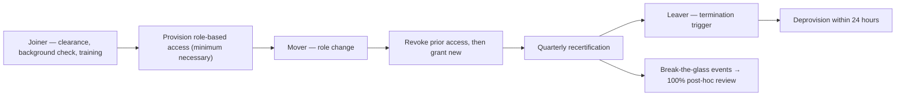

# Diagram — Joiner / Mover / Leaver Lifecycle

| Field | Value |
|---|---|
| Version | 1.0 |
| Date | 2026-07-15 |
| Classification | Confidential — Electronic Protected Health Information (ePHI) // Illustrative Portfolio Sample |
| Organization | MercyBridge Health Network (HIPAA covered entity) |
| Regulator | HHS Office for Civil Rights (OCR) |
| Phase | 04 — Administrative Safeguards (§164.308) |
| Author | Advisory Team (Healthcare GRC / HIPAA) |
| Status | Approved |

Workforce of ~6,500 including clinicians, residents, students, contractors, and volunteers.

## Cross-References
`04.04-workforce-security.md`, `04.05-information-access-management.md`.
